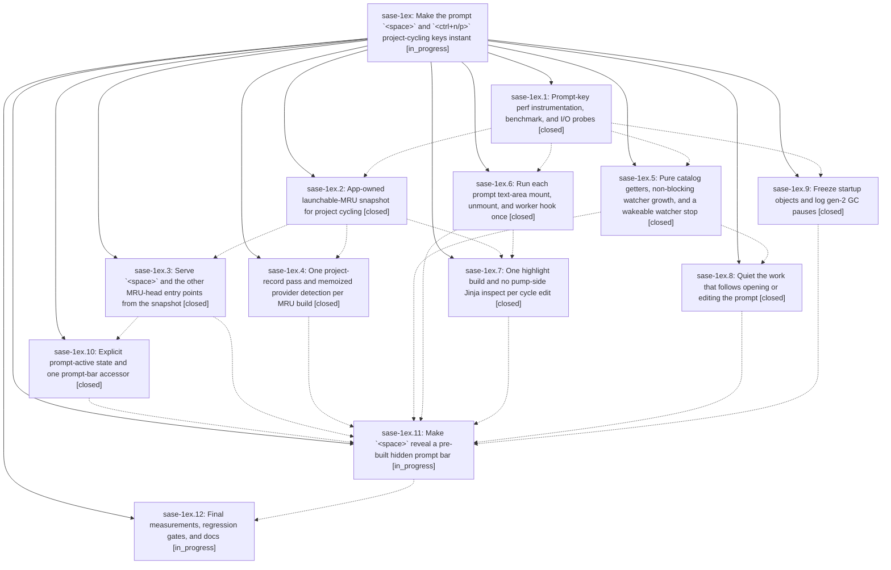

# Bead: sase-1ex — Make the prompt \`\<space\>\` and \`\<ctrl+n/p\>\` project-cycling keys instant

[Bead Pages](../README.md) / sase-1ex

**Status:** ◐ in_progress · **Type:** ▸ plan · **Tier:** epic
**Owner:** `bryanbugyi34@gmail.com` · **Created by:** [bbugyi200.athena.0vk](https://github.com/sase-org/sase--agents/blob/main/sessions/bbugyi200.athena.0vk.md) · **Assignee:** `sase-1ex.land`
**Created:** 2026-10-02 14:53:42 EDT
**Plan:** [202610/prompt\_space\_and\_project\_cycle\_latency.md](https://github.com/sase-org/sase--plans/blob/main/202610/prompt_space_and_project_cycle_latency.md)

## Description

Opening the prompt bar with `<space>` and cycling the current-project stack with `<ctrl+n>` / `<ctrl+p>` become in-memory operations. Neither key path reads or writes the VCS MRU, lists project records, spawns a subprocess, or stops, starts, or joins a watcher on the event loop. Warm `<ctrl+n/p>` key-to-paint p95 is at most 16 ms. `<space>` reveals a pre-built bar with key-to-paint p95 at most 60 ms. There are no multi-hundred-millisecond first-press or first-visit spikes. Launch, prefill, history, and cycling semantics stay unchanged.

## Notes

[2026-10-03T03:45:50Z · sase-1es.land] DISCOVERED ISSUE: just symvision is red at master 702c8c3167 (ToolRun 39e4b0b10d56d0d1c10bda3c245b0ee2). It reports 'Unused public functions/classes: PublicationPayloadFile and plan_publication_payload_batches in src/sase/core/publication_payload_facade.py'. Both were added only by 5c7e7514ae (sase-1ex.7, 'repair cycle-edit-coalesce verification gates'), and their only consumer is tests/test_core_publication_payload.py. Test references do not count for Symvision. sase-1es.7 note #2 and sase-1ev.6/sase-1ev.11 notes saw the same failure on clean HEAD. Fix per symvision.md: wire up a real non-test consumer, privatize, or delete along with the tests. Reported by sase-1es.land.

[2026-10-03T04:34:39Z · sase-1es.land] DISCOVERED ISSUE: full check ToolRun cfa773a1036ba0fb5cd5208a5908b405 (sase-1es.land, base master 702c8c3167) fails tests that trace to this epic's phases. All of them reproduce deterministically in isolation. (1) tests/ace/tui/test_prompt_bar_editor_stack.py: 13 of 15 fail with AttributeError: '_EditorHarness' object has no attribute '_mounted_prompt_bar' at src/sase/ace/tui/actions/agent_workflow/_prompt_bar_requests.py:82/115. The accessor came from ae16afe548 (sase-1ex.10, 'track active prompt bar explicitly'), and the test harness was never updated. Triage labeled 3 of them NEW and the rest KNOWN. (2) tests/ace/tui/widgets/test_prompt_mount_dedup.py::test_unmount_hook_inventory and ::test_unmount_bodies_run_once: the unmount-hook inventory now has an extra 'JinjaDiagnosticsMixin' entry, from the _jinja_diagnostics.py change in 5c7e7514ae (sase-1ex.7), against the list that 24cff91cd3 (sase-1ex.6) pinned. (3) Possibly related: tests/ace/tui/test_prompt_key_perf_smoke.py::test_prompt_key_io_probe_counts_main_thread_calls fails with FileNotFoundError for <tmp>/.sase/vcs_xprompt_mru.json. Reported by sase-1es.land; none of these touch the pager.

[2026-10-03T09:01:29Z · sase-1eq.3.1.land] DISCOVERED ISSUE: Landing sase-1eq.3.1 independently confirms proposals from sase-1eq.3.1.3 notes 1 and 4 and sase-1eq.3.1.4 note 1 on clean master 0676975ef3 after just install: tests/test_check_sase_core_rs_bindings_tool.py::test_dev_extension_exposes_every_collected_name fails with missing plan_publication_payload_batches. Current linked sase-core 02a062c3d459 wheel (0.36.3) and its Rust sources have no such binding. The Python facade PublicationPayloadFile/plan_publication_payload_batches was introduced exclusively by 5c7e7514ae (sase-1ex.7) and has only tests/test_core_publication_payload.py as a consumer; existing note 1 already owns its Symvision residue. Resolve this facade and its dead helpers/tests per symvision.md, or complete its real core implementation and consumer, in sase-1ex. No rename-caused issue and no duplicate task created.

## Phases

| Bead | Title | Status | Size | Created | Agents | Commits |
|---|---|---|---|---|---:|---:|
| [sase-1ex.1](sase-1ex.1.md) | Prompt-key perf instrumentation, benchmark, and I/O probes | ✓ closed | small | 2026-10-02 | 1 | 1 |
| [sase-1ex.10](sase-1ex.10.md) | Explicit prompt-active state and one prompt-bar accessor | ✓ closed | medium | 2026-10-02 | 1 | 1 |
| [sase-1ex.11](sase-1ex.11.md) | Make \`\<space\>\` reveal a pre-built hidden prompt bar | ◐ in_progress | large | 2026-10-02 | 1 | 0 |
| [sase-1ex.12](sase-1ex.12.md) | Final measurements, regression gates, and docs | ◐ in_progress | small | 2026-10-02 | 1 | 0 |
| [sase-1ex.2](sase-1ex.2.md) | App-owned launchable-MRU snapshot for project cycling | ✓ closed | medium | 2026-10-02 | 1 | 1 |
| [sase-1ex.3](sase-1ex.3.md) | Serve \`\<space\>\` and the other MRU-head entry points from the snapshot | ✓ closed | medium | 2026-10-02 | 1 | 1 |
| [sase-1ex.4](sase-1ex.4.md) | One project-record pass and memoized provider detection per MRU build | ✓ closed | small | 2026-10-02 | 1 | 1 |
| [sase-1ex.5](sase-1ex.5.md) | Pure catalog getters, non-blocking watcher growth, and a wakeable watcher stop | ✓ closed | medium | 2026-10-02 | 1 | 1 |
| [sase-1ex.6](sase-1ex.6.md) | Run each prompt text-area mount, unmount, and worker hook once | ✓ closed | medium | 2026-10-02 | 1 | 1 |
| [sase-1ex.7](sase-1ex.7.md) | One highlight build and no pump-side Jinja inspect per cycle edit | ✓ closed | medium | 2026-10-02 | 1 | 1 |
| [sase-1ex.8](sase-1ex.8.md) | Quiet the work that follows opening or editing the prompt | ✓ closed | small | 2026-10-02 | 1 | 1 |
| [sase-1ex.9](sase-1ex.9.md) | Freeze startup objects and log gen-2 GC pauses | ✓ closed | small | 2026-10-02 | 1 | 0 |

## Lineage

## Agents

| Agent | Bead | Commits |
|---|---|---:|
| [bbugyi200.athena.sase-1ex.1](https://github.com/sase-org/sase--agents/blob/main/agents/bbugyi200.athena.sase-1ex.1/README.md) | [sase-1ex.1](sase-1ex.1.md) | 1 |
| [bbugyi200.athena.sase-1ex.10](https://github.com/sase-org/sase--agents/blob/main/sessions/bbugyi200.athena.sase-1ex.10.md) | [sase-1ex.10](sase-1ex.10.md) | 1 |
| [bbugyi200.athena.sase-1ex.11](https://github.com/sase-org/sase--agents/blob/main/agents/bbugyi200.athena.sase-1ex.11/README.md) | [sase-1ex.11](sase-1ex.11.md) | 0 |
| [bbugyi200.athena.sase-1ex.12](https://github.com/sase-org/sase--agents/blob/main/agents/bbugyi200.athena.sase-1ex.12/README.md) | [sase-1ex.12](sase-1ex.12.md) | 0 |
| [bbugyi200.athena.sase-1ex.2](https://github.com/sase-org/sase--agents/blob/main/sessions/bbugyi200.athena.sase-1ex.2.md) | [sase-1ex.2](sase-1ex.2.md) | 1 |
| [bbugyi200.athena.sase-1ex.3](https://github.com/sase-org/sase--agents/blob/main/agents/bbugyi200.athena.sase-1ex.3/README.md) | [sase-1ex.3](sase-1ex.3.md) | 1 |
| [bbugyi200.athena.sase-1ex.4](https://github.com/sase-org/sase--agents/blob/main/sessions/bbugyi200.athena.sase-1ex.4.md) | [sase-1ex.4](sase-1ex.4.md) | 1 |
| [bbugyi200.athena.sase-1ex.5](https://github.com/sase-org/sase--agents/blob/main/sessions/bbugyi200.athena.sase-1ex.5.md) | [sase-1ex.5](sase-1ex.5.md) | 1 |
| [bbugyi200.athena.sase-1ex.6](https://github.com/sase-org/sase--agents/blob/main/sessions/bbugyi200.athena.sase-1ex.6.md) | [sase-1ex.6](sase-1ex.6.md) | 1 |
| [bbugyi200.athena.sase-1ex.7](https://github.com/sase-org/sase--agents/blob/main/sessions/bbugyi200.athena.sase-1ex.7.md) | [sase-1ex.7](sase-1ex.7.md) | 1 |
| [bbugyi200.athena.sase-1ex.8](https://github.com/sase-org/sase--agents/blob/main/sessions/bbugyi200.athena.sase-1ex.8.md) | [sase-1ex.8](sase-1ex.8.md) | 1 |
| [bbugyi200.athena.sase-1ex.9](https://github.com/sase-org/sase--agents/blob/main/sessions/bbugyi200.athena.sase-1ex.9.md) | [sase-1ex.9](sase-1ex.9.md) | 0 |
| [bbugyi200.athena.sase-1ex.land](https://github.com/sase-org/sase--agents/blob/main/agents/bbugyi200.athena.sase-1ex.land/README.md) | [sase-1ex](README.md) | 0 |

## Commits

| Repo | Commit | Subject | Bead | Committed |
|---|---|---|---|---|
| sase | [`e0d3645`](https://github.com/sase-org/sase/commit/e0d36453f7a0a4a3493f3ad9a08427ae58ce2e69) | fix: Preserve panel mode when navigating between agents in Agents tab (sase-1ex) | [sase-1ex](README.md) | 2026-02-20 11:56:45 EST |
| sase | [`db40a72`](https://github.com/sase-org/sase/commit/db40a7219ac0e14d14e9965fa968ee58bc88884b) | feat(tui-perf): add prompt-key perf harness with recorded baseline | [sase-1ex.1](sase-1ex.1.md) | 2026-10-02 16:52:09 EDT |
| sase | [`8138678`](https://github.com/sase-org/sase/commit/813867849ce4ff10ae8d1ee9d146367f2e95d475) | feat(ace-tui): app-owned launchable-MRU snapshot for project cycling | [sase-1ex.2](sase-1ex.2.md) | 2026-10-02 19:38:59 EDT |
| sase | [`24cff91`](https://github.com/sase-org/sase/commit/24cff91cd3e5a737d417a5b32cd38835a4125fae) | feat(tui): dispatch prompt mount/unmount/worker hooks once (sase-1ex.6) | [sase-1ex.6](sase-1ex.6.md) | 2026-10-02 19:39:47 EDT |
| sase | [`f896b59`](https://github.com/sase-org/sase/commit/f896b59c4c0fec3d6957aebe46d4a55b8c54d5aa) | feat(ace-tui): serve space and MRU-head entry points from the launchable-MRU snapshot (sase-1ex.3) | [sase-1ex.3](sase-1ex.3.md) | 2026-10-02 20:41:58 EDT |
| sase | [`5c7e751`](https://github.com/sase-org/sase/commit/5c7e7514ae47c29879e9dc122e43948b2984c631) | fix(ace-tui): repair cycle-edit-coalesce verification gates (sase-1ex.7) | [sase-1ex.7](sase-1ex.7.md) | 2026-10-02 21:28:05 EDT |
| sase | [`9dcf826`](https://github.com/sase-org/sase/commit/9dcf826f8bc93ccbe818f7c9df79ba9f48c799ac) | perf(mru): one project-record pass and memoized provider detection per MRU build | [sase-1ex.4](sase-1ex.4.md) | 2026-10-02 21:28:38 EDT |
| sase | [`ae16afe`](https://github.com/sase-org/sase/commit/ae16afe54850ff1eb04f8aa1a74be985f8023b5a) | feat(prompt): track active prompt bar explicitly with one accessor | [sase-1ex.10](sase-1ex.10.md) | 2026-10-02 21:46:17 EDT |
| sase | [`8f910d5`](https://github.com/sase-org/sase/commit/8f910d559b68099aa09e812779a7ef6616cb4786) | feat(prompt-catalog): pure catalog getters, off-pump watcher growth, wakeable watcher stop (sase-1ex.5) | [sase-1ex.5](sase-1ex.5.md) | 2026-10-03 07:13:46 EDT |
| sase | [`3289046`](https://github.com/sase-org/sase/commit/32890465315ebed5bb9be3799951e43aaf59ea29) | feat(prompt-quiet): stagger non-essential bar warm-ups one paint past first paint (sase-1ex.8) | [sase-1ex.8](sase-1ex.8.md) | 2026-10-03 08:24:21 EDT |

<!-- sase:referenced-by:start -->

## Referenced By

| Relation | Artifact | Why | Uses |
| --- | --- | --- | ---: |
| read-by | [agent:sase-1es.land][1] | Check whether symvision publication_payload_facade failure is already tracked on its causing epic | 1 |
| read-by | [agent:sase-1ev.land][2] | Check whether the publication_payload_facade symvision/binding failures are already recorded on the owning epic | 1 |

[1]: https://github.com/sase-org/sase--agents/blob/main/agents/bbugyi200.athena.sase-1es.land/README.md
[2]: https://github.com/sase-org/sase--agents/blob/main/agents/bbugyi200.athena.sase-1ev.land/README.md

<!-- sase:referenced-by:end -->
