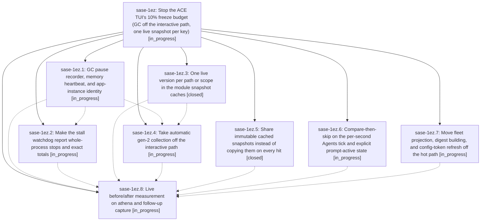

# Bead: sase-1ez — Stop the ACE TUI's 10% freeze budget (GC off the interactive path, one live snapshot per key)

[Bead Pages](../README.md) / sase-1ez

**Status:** ◐ in_progress · **Type:** ▸ plan · **Tier:** epic
**Owner:** `bryanbugyi34@gmail.com` · **Created by:** [bbugyi200.athena.0vm](https://github.com/sase-org/sase--agents/blob/main/sessions/bbugyi200.athena.0vm.md) · **Assignee:** `sase-1ez.land`
**Created:** 2026-10-02 16:44:54 EDT
**Plan:** [202610/tui\_freeze\_gc\_heap.md](https://github.com/sase-org/sase--plans/blob/main/202610/tui_freeze_gc_heap.md)

## Description

The long-lived ACE TUI stops spending 10-17% of wall time frozen. Full (gen-2) garbage collections no longer start while the user is interacting. The heap stops growing about 100 MB/min from superseded snapshot copies. The per-second UI-thread residue is gone. Telemetry measures GC pauses, RSS/swap, and the true frozen share directly, so the acceptance check is data, not inference.

## Phases

| Bead | Title | Status | Size | Created | Agents | Commits |
|---|---|---|---|---|---:|---:|
| [sase-1ez.1](sase-1ez.1.md) | GC pause recorder, memory heartbeat, and app-instance identity | ◐ in_progress | medium | 2026-10-02 | 1 | 0 |
| [sase-1ez.2](sase-1ez.2.md) | Make the stall watchdog report whole-process stops and exact totals | ◐ in_progress | medium | 2026-10-02 | 1 | 0 |
| [sase-1ez.3](sase-1ez.3.md) | One live version per path or scope in the module snapshot caches | ✓ closed | medium | 2026-10-02 | 1 | 1 |
| [sase-1ez.4](sase-1ez.4.md) | Take automatic gen-2 collection off the interactive path | ◐ in_progress | medium | 2026-10-02 | 1 | 0 |
| [sase-1ez.5](sase-1ez.5.md) | Share immutable cached snapshots instead of copying them on every hit | ✓ closed | medium | 2026-10-02 | 1 | 1 |
| [sase-1ez.6](sase-1ez.6.md) | Compare-then-skip on the per-second Agents tick and explicit prompt-active state | ◐ in_progress | medium | 2026-10-02 | 1 | 0 |
| [sase-1ez.7](sase-1ez.7.md) | Move fleet projection, digest building, and config-token refresh off the hot path | ◐ in_progress | medium | 2026-10-02 | 1 | 0 |
| [sase-1ez.8](sase-1ez.8.md) | Live before/after measurement on athena and follow-up capture | ◐ in_progress | small | 2026-10-02 | 1 | 0 |

## Lineage

## Agents

| Agent | Bead | Commits |
|---|---|---:|
| [bbugyi200.athena.sase-1ez.1](https://github.com/sase-org/sase--agents/blob/main/agents/bbugyi200.athena.sase-1ez.1/README.md) | [sase-1ez.1](sase-1ez.1.md) | 0 |
| [bbugyi200.athena.sase-1ez.2](https://github.com/sase-org/sase--agents/blob/main/agents/bbugyi200.athena.sase-1ez.2/README.md) | [sase-1ez.2](sase-1ez.2.md) | 0 |
| [bbugyi200.athena.sase-1ez.3](https://github.com/sase-org/sase--agents/blob/main/agents/bbugyi200.athena.sase-1ez.3/README.md) | [sase-1ez.3](sase-1ez.3.md) | 1 |
| [bbugyi200.athena.sase-1ez.4](https://github.com/sase-org/sase--agents/blob/main/agents/bbugyi200.athena.sase-1ez.4/README.md) | [sase-1ez.4](sase-1ez.4.md) | 0 |
| [bbugyi200.athena.sase-1ez.5](https://github.com/sase-org/sase--agents/blob/main/agents/bbugyi200.athena.sase-1ez.5/README.md) | [sase-1ez.5](sase-1ez.5.md) | 1 |
| [bbugyi200.athena.sase-1ez.6](https://github.com/sase-org/sase--agents/blob/main/agents/bbugyi200.athena.sase-1ez.6/README.md) | [sase-1ez.6](sase-1ez.6.md) | 0 |
| [bbugyi200.athena.sase-1ez.7](https://github.com/sase-org/sase--agents/blob/main/sessions/bbugyi200.athena.sase-1ez.7.md) | [sase-1ez.7](sase-1ez.7.md) | 0 |
| [bbugyi200.athena.sase-1ez.8](https://github.com/sase-org/sase--agents/blob/main/agents/bbugyi200.athena.sase-1ez.8/README.md) | [sase-1ez.8](sase-1ez.8.md) | 0 |
| [bbugyi200.athena.sase-1ez.land](https://github.com/sase-org/sase--agents/blob/main/agents/bbugyi200.athena.sase-1ez.land/README.md) | [sase-1ez](README.md) | 0 |

## Commits

| Repo | Commit | Subject | Bead | Committed |
|---|---|---|---|---|
| sase | [`a6e90ea`](https://github.com/sase-org/sase/commit/a6e90ea76046f73458d52406194ce8029542372e) | fix(tui): re-key module snapshot caches to one live version per path or scope | [sase-1ez.3](sase-1ez.3.md) | 2026-10-02 17:01:20 EDT |
| sase | [`2eed4bd`](https://github.com/sase-org/sase/commit/2eed4bdcb5947a2cd96c30031ff22e5b53b57a77) | feat(tui): share immutable cached snapshots instead of copying on every hit | [sase-1ez.5](sase-1ez.5.md) | 2026-10-02 17:38:18 EDT |
