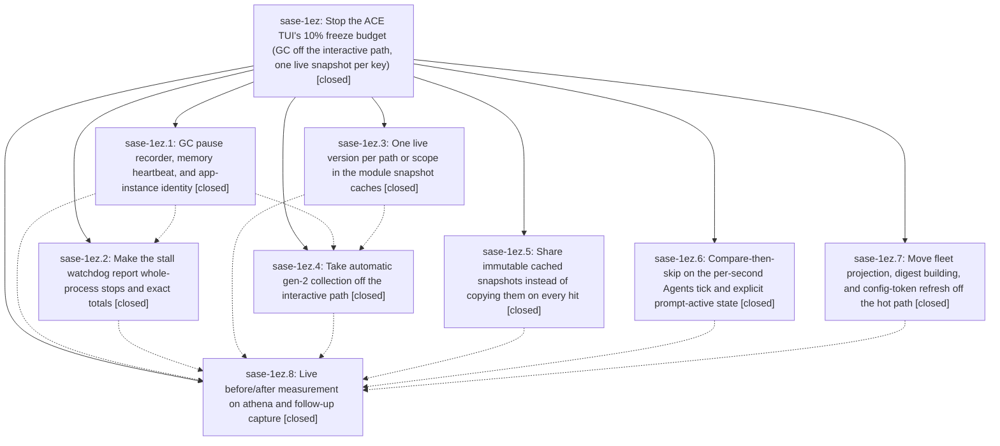

# Bead: sase-1ez — Stop the ACE TUI's 10% freeze budget (GC off the interactive path, one live snapshot per key)

[Bead Pages](../README.md) / sase-1ez

**Status:** ✓ closed · **Resolution:** done · **Type:** ▸ plan · **Tier:** epic
**Owner:** `bryanbugyi34@gmail.com` · **Created by:** [bbugyi200.athena.0vm](https://github.com/sase-org/sase--agents/blob/main/sessions/bbugyi200.athena.0vm.md) · **Assignee:** `sase-1ez.land`
**Created:** 2026-10-02 16:44:54 EDT · **Closed:** 2026-10-02 23:55:51 EDT
**Plan:** [202610/tui\_freeze\_gc\_heap.md](https://github.com/sase-org/sase--plans/blob/main/202610/tui_freeze_gc_heap.md)

## Description

The long-lived ACE TUI stops spending 10-17% of wall time frozen. Full (gen-2) garbage collections no longer start while the user is interacting. The heap stops growing about 100 MB/min from superseded snapshot copies. The per-second UI-thread residue is gone. Telemetry measures GC pauses, RSS/swap, and the true frozen share directly, so the acceptance check is data, not inference.

## Notes

[2026-10-03T02:37:51Z · sase-1ez.land] LAND FOLLOW-UP TRIAGE (sase-1ez.land): (1) sase-1ez.1 #1 source_revision -> new task sase-1f4 (feature, small, no-subprocess .git/HEAD read). (2) sase-1ez.2 #3 test_demand_runs peak_tree_rss_kib==0 -> new flake task sase-1f0 (1/10 serial runs failed at 54427ed47c). (3) sase-1ez.2 #4 + sase-1ez.4 #1 test_prompt_key_io_probe_counts_main_thread_calls -> DISCOVERED ISSUE note on active epic sase-1eq (sase-1eq.2 72dbae6a09 made the MRU writer macro-first; the sase-1ex.1 test still asserts vcs_xprompt_mru.json); no task. (4) sase-1ez.4 #1 test_busy_cluster_compacts_narrow_and_restores_wide -> +1 on existing flake sase-1ak. (5) sase-1ez.5 #2 pager test_scan_links_stays_fast_on_link_dense_input -> DISCOVERED ISSUE note on active epic sase-1es, whose sase-1es.2 added that 1.5 s wall-clock budget; passes 3/3 isolated. Axe test_repeat_stop_exits_before_workspace_claim_and_run_loop -> new flake task sase-1f1. (6) sase-1ez.7 #2 under-load failures: DECLINED as a separate task because they are CAUSED BY THIS EPIC. Tool run 81b29f84 shows all 8 TUI/keymap ERRORs are 'cannot join thread before it is started' in the conftest config-token drain, plus 5 config-cache test failures. Root cause is sase-1ez.7's revalidator: _ensure_config_token_revalidator_locked registers the thread under the lock but starts it outside, and is_alive() is False before start. So concurrent getters start duplicate revalidators that are orphaned forever: 74/100 trials of 8 concurrent first reads started >1 thread, leaking 131 live threads. This is folded into the closeout tale. (7) sase-1ez.8 #1 + #3 live after-measurement and 24h soak -> new task sase-1f3 (needs a user TUI restart onto code that includes the tale's commit). (8) sase-1ez.8 #2 tui_perf.md three rules -> memory task sase-1f2. (9) sase-1ez.3 audit candidate agent_tribe_evidence (unbounded stat-token-keyed module cache, the bug class this epic's snapshot-caches phase was told to fix) -> folded into the closeout tale as epic work.

[2026-10-03T03:55:51Z · sase-1ez.land--1] Closeout tale landing (plan:202610/sase_1ez_closeout.md). All 8 phases verified against source: sase-1ez.1 GC-telemetry/watchdog/app identity, .2 stall-watchdog truth, .3 snapshot caches, .4 idle GC policy, .5 cached-snapshot sharing, .6 tick-compare-skip plus prompt-active state, .7 off-loop refresh, .8 acceptance (live capture deferred to sase-1f3). Integration since epic start reviewed: sase-1ex.10 mounted_prompt_bar accessor builds on the epic _active_prompt_bar; no new module snapshot cache, gc.* tuning, or prompt-bar DOM query added. Follow-up triage: tasks sase-1f0 (test_demand_runs flake), sase-1f1 (axe repeat-stop flake), sase-1f2 (tui_perf.md memory), sase-1f3 (live after-measurement plus 24h soak), sase-1f4 (source_revision no-subprocess feature); +1 on sase-1ak (busy-cluster flake); DISCOVERED ISSUE notes on sase-1eq (prompt-key MRU macro-first) and sase-1es (scan-links wall-clock budget). Three tale fixes: (1) config/core.py single-flight ident check plus wake-blocked idle revalidator loop, POLL deleted; conftest_runtime.py drain waits bounded for ident before join; race regression test in test_config_cache_token.py. (2) gc_telemetry.py window_s since previous heartbeat plus heartbeat test plus perf_runbook docs line. (3) agent_tribe_evidence.py path-identity OrderedDict LRU-8 cache plus tribe cache test. Evidence: focused suites pass (config-cache 60 nodes incl. tribe/relation bounds and freeze-report; gc-telemetry/watchdog/policy 66 nodes); full just check triage: all 22 NEW failures reproduce byte-identically on the clean base tree (23 failed/69 passed with and without tale changes), 5 KNOWN incl. 2 symvision publication_payload_facade items untouched by this tale.

## Phases

| Bead | Title | Status | Size | Created | Agents | Commits |
|---|---|---|---|---|---:|---:|
| [sase-1ez.1](sase-1ez.1.md) | GC pause recorder, memory heartbeat, and app-instance identity | ✓ closed | medium | 2026-10-02 | 1 | 1 |
| [sase-1ez.2](sase-1ez.2.md) | Make the stall watchdog report whole-process stops and exact totals | ✓ closed | medium | 2026-10-02 | 1 | 1 |
| [sase-1ez.3](sase-1ez.3.md) | One live version per path or scope in the module snapshot caches | ✓ closed | medium | 2026-10-02 | 1 | 1 |
| [sase-1ez.4](sase-1ez.4.md) | Take automatic gen-2 collection off the interactive path | ✓ closed | medium | 2026-10-02 | 1 | 1 |
| [sase-1ez.5](sase-1ez.5.md) | Share immutable cached snapshots instead of copying them on every hit | ✓ closed | medium | 2026-10-02 | 1 | 1 |
| [sase-1ez.6](sase-1ez.6.md) | Compare-then-skip on the per-second Agents tick and explicit prompt-active state | ✓ closed | medium | 2026-10-02 | 1 | 1 |
| [sase-1ez.7](sase-1ez.7.md) | Move fleet projection, digest building, and config-token refresh off the hot path | ✓ closed | medium | 2026-10-02 | 1 | 1 |
| [sase-1ez.8](sase-1ez.8.md) | Live before/after measurement on athena and follow-up capture | ✓ closed | small | 2026-10-02 | 1 | 0 |

## Lineage

## Agents

| Agent | Bead | Commits |
|---|---|---:|
| [bbugyi200.athena.sase-1ez.1](https://github.com/sase-org/sase--agents/blob/main/sessions/bbugyi200.athena.sase-1ez.1.md) | [sase-1ez.1](sase-1ez.1.md) | 1 |
| [bbugyi200.athena.sase-1ez.2](https://github.com/sase-org/sase--agents/blob/main/sessions/bbugyi200.athena.sase-1ez.2.md) | [sase-1ez.2](sase-1ez.2.md) | 1 |
| [bbugyi200.athena.sase-1ez.3](https://github.com/sase-org/sase--agents/blob/main/agents/bbugyi200.athena.sase-1ez.3/README.md) | [sase-1ez.3](sase-1ez.3.md) | 1 |
| [bbugyi200.athena.sase-1ez.4](https://github.com/sase-org/sase--agents/blob/main/sessions/bbugyi200.athena.sase-1ez.4.md) | [sase-1ez.4](sase-1ez.4.md) | 1 |
| [bbugyi200.athena.sase-1ez.5](https://github.com/sase-org/sase--agents/blob/main/sessions/bbugyi200.athena.sase-1ez.5.md) | [sase-1ez.5](sase-1ez.5.md) | 1 |
| [bbugyi200.athena.sase-1ez.6](https://github.com/sase-org/sase--agents/blob/main/agents/bbugyi200.athena.sase-1ez.6/README.md) | [sase-1ez.6](sase-1ez.6.md) | 1 |
| [bbugyi200.athena.sase-1ez.7](https://github.com/sase-org/sase--agents/blob/main/sessions/bbugyi200.athena.sase-1ez.7.md) | [sase-1ez.7](sase-1ez.7.md) | 1 |
| [bbugyi200.athena.sase-1ez.8](https://github.com/sase-org/sase--agents/blob/main/agents/bbugyi200.athena.sase-1ez.8/README.md) | [sase-1ez.8](sase-1ez.8.md) | 0 |
| [bbugyi200.athena.sase-1ez.land](https://github.com/sase-org/sase--agents/blob/main/sessions/bbugyi200.athena.sase-1ez.land.md) | [sase-1ez](README.md) | 2 |

## Commits

| Repo | Commit | Subject | Bead | Committed |
|---|---|---|---|---|
| sase | [`a6e90ea`](https://github.com/sase-org/sase/commit/a6e90ea76046f73458d52406194ce8029542372e) | fix(tui): re-key module snapshot caches to one live version per path or scope | [sase-1ez.3](sase-1ez.3.md) | 2026-10-02 17:01:20 EDT |
| sase | [`2eed4bd`](https://github.com/sase-org/sase/commit/2eed4bdcb5947a2cd96c30031ff22e5b53b57a77) | feat(tui): share immutable cached snapshots instead of copying on every hit | [sase-1ez.5](sase-1ez.5.md) | 2026-10-02 17:38:18 EDT |
| sase | [`efb18ee`](https://github.com/sase-org/sase/commit/efb18ee86ccf8a1cfbf99a30fbdf277a630bdeb5) | perf(tui): cache runtime tick aggregation, info metrics, prompt-active state | [sase-1ez.6](sase-1ez.6.md) | 2026-10-02 19:18:30 EDT |
| sase | [`55eec1b`](https://github.com/sase-org/sase/commit/55eec1b986425e4e5f79eb105d7ec10170f17ec1) | feat(ace): add startup clock, GC telemetry and lifecycle instrumentation | [sase-1ez.1](sase-1ez.1.md) | 2026-10-02 19:36:40 EDT |
| sase | [`f76efbe`](https://github.com/sase-org/sase/commit/f76efbe6b90882196c3d186d39968a8a0d676749) | feat(tui): move fleet projection, digest building, and config-token refresh off the hot path | [sase-1ez.7](sase-1ez.7.md) | 2026-10-02 21:02:49 EDT |
| sase | [`a8cddd7`](https://github.com/sase-org/sase/commit/a8cddd77c3f292fa34e05c60f760814d93342e46) | feat(tui): watchdog reports whole-process stops and exact totals (sase-1ez.2) | [sase-1ez.2](sase-1ez.2.md) | 2026-10-02 21:41:28 EDT |
| sase | [`f7d2c2c`](https://github.com/sase-org/sase/commit/f7d2c2c09e51c43002d1827d2950290dc7ca9916) | feat(tui): take automatic gen-2 collection off the interactive path (sase-1ez.4) | [sase-1ez.4](sase-1ez.4.md) | 2026-10-02 21:53:51 EDT |
| sase | [`0499411`](https://github.com/sase-org/sase/commit/0499411408dc791249f2348a0833cd6a5bab6777) | fix(ace-tui): finish sase-1ez closeout tale - config-token single-flight, heartbeat window, tribe LRU (sase-1ez) | [sase-1ez](README.md) | 2026-10-03 03:26:57 EDT |
| sase--plans | [`sase--plans@6d2078a`](https://github.com/sase-org/sase--plans/commit/6d2078a09d41bab46574a6bf0e9b96e69d43aed8) | docs(plans): mark sase-1ez closeout and parent plan done (sase-1ez) | [sase-1ez](README.md) | 2026-10-03 03:31:33 EDT |

<!-- sase:referenced-by:start -->

## Referenced By

| Relation | Artifact | Why | Uses |
| --- | --- | --- | ---: |
| read-by | [agent:sase-1ez.land--6][1] | Need epic status before closing sase-1ez closeout | 1 |

[1]: https://github.com/sase-org/sase--agents/blob/main/sessions/bbugyi200.athena.sase-1ez.land.md

<!-- sase:referenced-by:end -->
