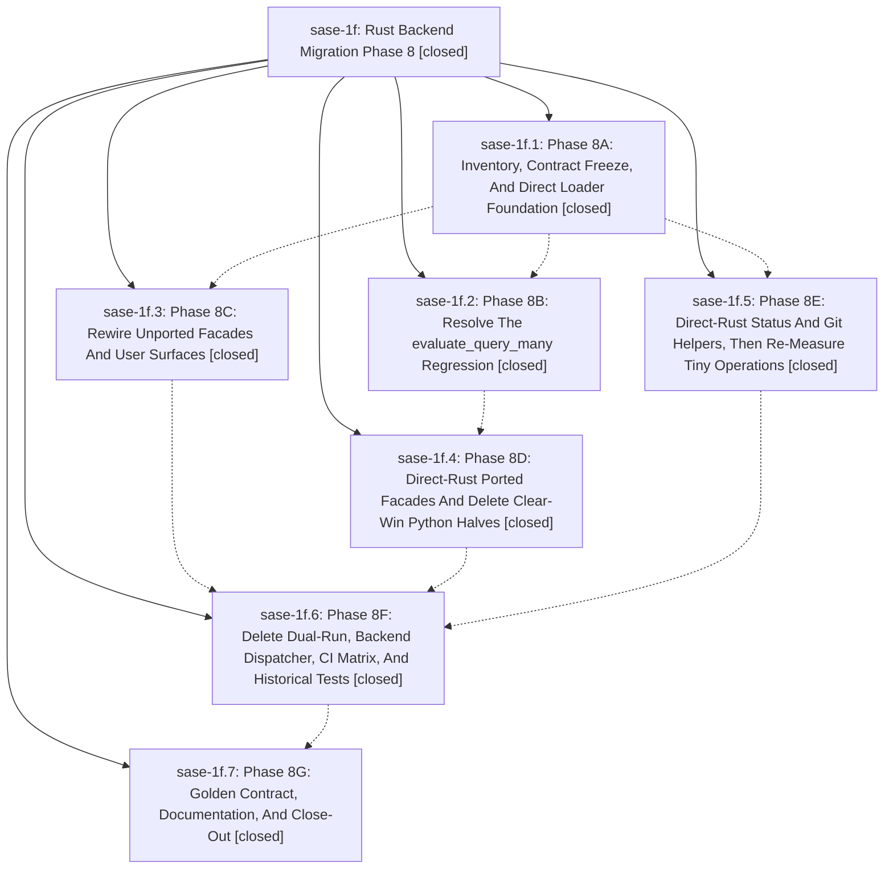

# Bead: sase-1f — Rust Backend Migration Phase 8

[Bead Pages](../README.md) / sase-1f

**Status:** ✓ closed · **Resolution:** (unrecorded) · **Type:** plan · **Tier:** epic
**Owner:** `bryanbugyi34@gmail.com`
**Created:** 2026-04-29 23:15:16 UTC · **Closed:** 2026-04-30 00:51:20 UTC
**Plan:** [202604/rust\_backend\_phase8.md](https://github.com/sase-org/sase--plans/blob/main/202604/rust_backend_phase8.md)

## Description

Track Phase 8 work to remove backend selection and Python fallback plumbing from the Rust-backed core migration.

## Phases

| Bead | Title | Status | Size | Agents | Commits |
|---|---|---|---|---:|---:|
| [sase-1f.1](sase-1f.1.md) | Phase 8A: Inventory, Contract Freeze, And Direct Loader Foundation | ✓ closed | small | 0 | 1 |
| [sase-1f.2](sase-1f.2.md) | Phase 8B: Resolve The evaluate\_query\_many Regression | ✓ closed | small | 0 | 1 |
| [sase-1f.3](sase-1f.3.md) | Phase 8C: Rewire Unported Facades And User Surfaces | ✓ closed | small | 0 | 1 |
| [sase-1f.4](sase-1f.4.md) | Phase 8D: Direct-Rust Ported Facades And Delete Clear-Win Python Halves | ✓ closed | small | 0 | 1 |
| [sase-1f.5](sase-1f.5.md) | Phase 8E: Direct-Rust Status And Git Helpers, Then Re-Measure Tiny Operations | ✓ closed | small | 0 | 1 |
| [sase-1f.6](sase-1f.6.md) | Phase 8F: Delete Dual-Run, Backend Dispatcher, CI Matrix, And Historical Tests | ✓ closed | small | 0 | 1 |
| [sase-1f.7](sase-1f.7.md) | Phase 8G: Golden Contract, Documentation, And Close-Out | ✓ closed | small | 0 | 1 |

## Lineage

## Commits

| Commit | Subject | Bead | Committed (UTC) |
|---|---|---|---|
| [`47070d9`](https://github.com/sase-org/sase/commit/47070d9f25253b304cc7a96a669d4dc3b34a6e46) | feat(rust-backend): land Phase 8A — strict Rust loader and inventory (sase-1f.1) | [sase-1f.1](sase-1f.1.md) | 2026-04-29 23:25:54 |
| [`a6c51d4`](https://github.com/sase-org/sase/commit/a6c51d4bf2a9d5c1cad20b0fa32f1d6343e517d0) | feat(rust-backend): defer evaluate\_query\_many port (sase-1f.2) | [sase-1f.2](sase-1f.2.md) | 2026-04-29 23:39:21 |
| [`7958c06`](https://github.com/sase-org/sase/commit/7958c06c54dcd6b11b00ece1d33e61d4382f971e) | feat(rust-backend): land Phase 8C — rewire unported facades and clean user surfaces (sase-1f.3) | [sase-1f.3](sase-1f.3.md) | 2026-04-29 23:49:39 |
| [`a6ed9b7`](https://github.com/sase-org/sase/commit/a6ed9b768c1eb95d2acef5fa25c4ba5ec5586359) | chore: Phase 8E — direct-Rust status and Git helpers (sase-1f.5) | [sase-1f.5](sase-1f.5.md) | 2026-04-29 23:56:31 |
| [`b3d309c`](https://github.com/sase-org/sase/commit/b3d309c09ef217afd648cbd73db62692e5528cb2) | feat(rust-backend): land Phase 8D — direct-Rust ported facades (sase-1f.4) | [sase-1f.4](sase-1f.4.md) | 2026-04-30 00:08:33 |
| [`21d1698`](https://github.com/sase-org/sase/commit/21d1698044c4aa190a63e87f53c4a9ed35af01a5) | feat(rust-backend): land Phase 8F — delete dual-run, dispatcher, and CI matrix (sase-1f.6) | [sase-1f.6](sase-1f.6.md) | 2026-04-30 00:33:31 |
| [`732c546`](https://github.com/sase-org/sase/commit/732c546b7a4620994ce0bc5df1ab9ed9006adb9f) | chore(rust-backend): land Phase 8G — golden contract, documentation, and close-out (sase-1f.7) | [sase-1f.7](sase-1f.7.md) | 2026-04-30 00:49:42 |
