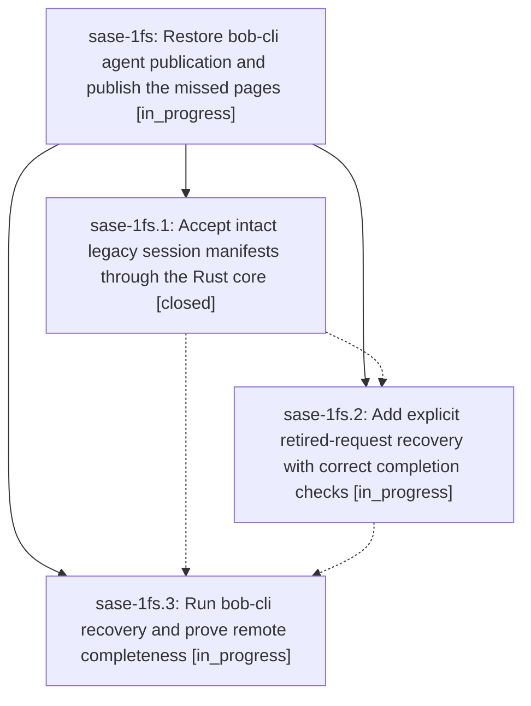

# Bead: sase-1fs — Restore bob-cli agent publication and publish the missed pages

[Bead Pages](../README.md) / sase-1fs

**Status:** ◐ in_progress · **Type:** ▸ plan · **Tier:** epic
**Owner:** `bryanbugyi34@gmail.com` · **Created by:** [bbugyi200.apollo.4s.f1](https://github.com/sase-org/sase--agents/blob/main/sessions/bbugyi200.apollo.4s.f1.md) · **Assignee:** `sase-1fs.land`
**Created:** 2026-10-03 12:42:00 EDT
**Plan:** [202610/bob\_cli\_agents\_publication\_recovery.md](https://github.com/sase-org/sase--plans/blob/main/202610/bob_cli_agents_publication_recovery.md)

<!-- sase:links:start -->

## Links

| Relation | Artifact | Why |
| --- | --- | --- |
| implemented-by | [plan:202610/bob_cli_agents_publication_recovery.md][1] | derived from the plan's `bead_id:` frontmatter field |

_Plus 1 automatic references — see [Referenced By](#referenced-by)._

[1]: https://github.com/sase-org/sase--plans/blob/main/202610/bob_cli_agents_publication_recovery.md

<!-- sase:links:end -->

## Description

Restore compatible agent publication and verify that every publication-eligible bob-cli agent and session available from its publishing machines is present on GitHub, with recovered requests and deferred prompts accounted for.

## Phases

| Bead | Title | Status | Size | Created | Agents | Commits |
|---|---|---|---|---|---:|---:|
| [sase-1fs.1](sase-1fs.1.md) | Accept intact legacy session manifests through the Rust core | ✓ closed | medium | 2026-10-03 | 1 | 2 |
| [sase-1fs.2](sase-1fs.2.md) | Add explicit retired-request recovery with correct completion checks | ◐ in_progress | medium | 2026-10-03 | 1 | 0 |
| [sase-1fs.3](sase-1fs.3.md) | Run bob-cli recovery and prove remote completeness | ◐ in_progress | medium | 2026-10-03 | 1 | 0 |

## Lineage

## Agents

| Agent | Bead | Commits |
|---|---|---:|
| [bbugyi200.apollo.sase-1fs.1](https://github.com/sase-org/sase--agents/blob/main/agents/bbugyi200.apollo.sase-1fs.1/README.md) | [sase-1fs.1](sase-1fs.1.md) | 2 |
| [bbugyi200.apollo.sase-1fs.2](https://github.com/sase-org/sase--agents/blob/main/agents/bbugyi200.apollo.sase-1fs.2/README.md) | [sase-1fs.2](sase-1fs.2.md) | 0 |
| [bbugyi200.apollo.sase-1fs.3](https://github.com/sase-org/sase--agents/blob/main/agents/bbugyi200.apollo.sase-1fs.3/README.md) | [sase-1fs.3](sase-1fs.3.md) | 0 |
| [bbugyi200.apollo.sase-1fs.land](https://github.com/sase-org/sase--agents/blob/main/agents/bbugyi200.apollo.sase-1fs.land/README.md) | [sase-1fs](README.md) | 0 |

## Commits

| Repo | Commit | Subject | Bead | Committed |
|---|---|---|---|---|
| sase-core | [`sase-core@d7f2dbf`](https://github.com/sase-org/sase-core/commit/d7f2dbf0e51440910035aa9ecd3fdca1b96fe983) | feat(agent-session-manifest): canonical file-set derivation and classification | [sase-1fs.1](sase-1fs.1.md) | 2026-10-03 15:05:40 EDT |
| sase | [`1466f1a`](https://github.com/sase-org/sase/commit/1466f1a67b26ef34bd172ec03ab2476e3c0f9691) | feat(agents-sync): accept legacy family-only session manifests via Rust core | [sase-1fs.1](sase-1fs.1.md) | 2026-10-03 15:09:07 EDT |

<!-- sase:referenced-by:start -->

## Referenced By

| Relation | Artifact | Why | Uses |
| --- | --- | --- | ---: |
| read-by | [agent:sase-1fs.1][1] | Need epic context for phase work | 1 |

[1]: https://github.com/sase-org/sase--agents/blob/main/agents/bbugyi200.apollo.sase-1fs.1/README.md

<!-- sase:referenced-by:end -->
