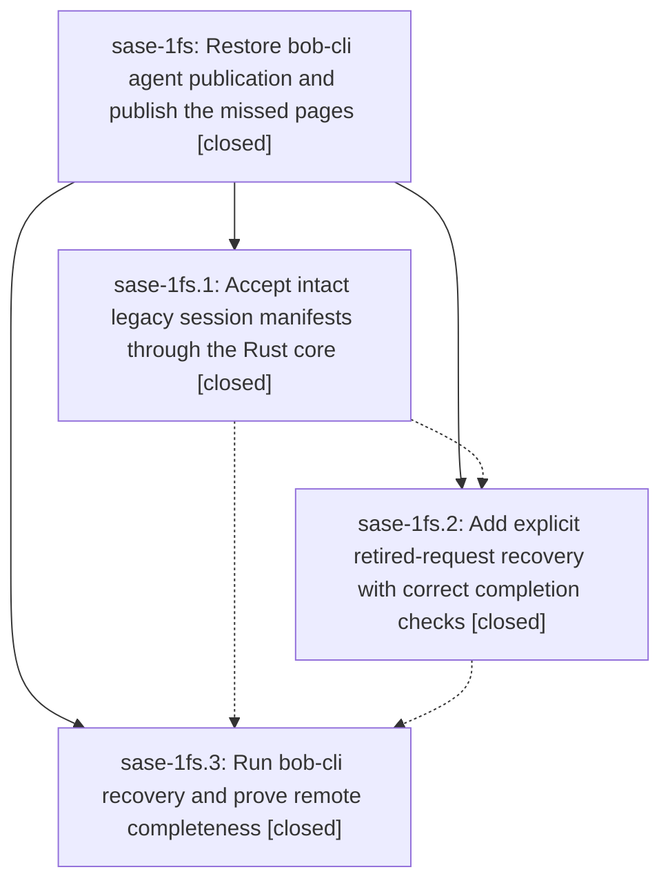

# Bead: sase-1fs — Restore bob-cli agent publication and publish the missed pages

[Bead Pages](../README.md) / sase-1fs

**Status:** ✓ closed · **Resolution:** done · **Type:** ▸ plan · **Tier:** epic
**Owner:** `bryanbugyi34@gmail.com` · **Created by:** [bbugyi200.apollo.4s.f1](https://github.com/sase-org/sase--agents/blob/main/sessions/bbugyi200.apollo.4s.f1.md) · **Assignee:** `sase-1fs.land`
**Created:** 2026-10-03 12:42:00 EDT · **Closed:** 2026-10-05 10:24:13 EDT
**Plan:** [202610/bob\_cli\_agents\_publication\_recovery.md](https://github.com/sase-org/sase--plans/blob/main/202610/bob_cli_agents_publication_recovery.md)

<!-- sase:links:start -->

## Links

| Relation | Artifact | Why |
| --- | --- | --- |
| implemented-by | [plan:202610/bob_cli_agents_publication_recovery.md][1] | derived from the plan's `bead_id:` frontmatter field |

_Plus 2 automatic references — see [Referenced By](#referenced-by)._

[1]: https://github.com/sase-org/sase--plans/blob/main/202610/bob_cli_agents_publication_recovery.md

<!-- sase:links:end -->

## Description

Restore compatible agent publication and verify that every publication-eligible bob-cli agent and session available from its publishing machines is present on GitHub, with recovered requests and deferred prompts accounted for.

## Notes

[2026-10-04T11:16:30Z · 0w9] DISCOVERED ISSUE: During unrelated TUI finalizing-overlay verification at HEAD 727b64af7b4090f1277b0bb35307de7e91bb4332, just check failed at tests/test_agent_session_terminology.py::test_current_docs_skills_and_memory_avoid_stale_family_phrases. An isolated rerun fails deterministically because docs/configuration.md:5094 contains the stale `families/` path phrase; that generated sentence comes from the agents_session_manifest_compat flag description, while this epic owns legacy session-manifest compatibility work. The TUI diff does not touch docs/configuration.md or the feature-flag registry. Please reconcile the generated wording or narrowly account for the intentional historical path in the terminology guard during compatibility cleanup. The approved finalizing-overlay tests all pass (69 passed); check also reported five already-known Symvision symbols in src/sase/axe/runner_kill_provenance.py.

[2026-10-04T14:32:52Z · 0vz.f0--3] DISCOVERED ISSUE corroboration: tests/test_agent_session_terminology.py::test_current_docs_skills_and_memory_avoid_stale_family_phrases still fails on HEAD 763cc9fca3 because docs/configuration.md:5094 contains the historical families/ redirect-stub phrase. Isolated file scan is deterministic (same phrase as the already-allowlisted docs/agents_sidecar.md mention). This workspace's restart-callback wait does not edit configuration.md or the flag registry; the terminology allowlist now includes (docs/configuration.md, families/) so the guard matches its own historical-path exception. Tool run 222b0445511e7056335f5fb7ff70aa46 triaged this as NEW with no owner.

[2026-10-05T14:24:13Z · sase-1fs.land] Verified the three closed phases against source, commits, and the live bob-cli archive, then integrated post-start drift. No remaining epic code.

sase-1fs.1 (1466f1a67b): hood_file_set and explicit-list checks delegate to Rust classify_session_manifest_files through src/sase/core/agent_session_manifest.py. Pinned core fe2ef0e6 still exports that binding. Sunset flag agents_session_manifest_compat stays on by default; removal bead sase-1ft stays open (remove_when still wants a deliberate flag removal, not this landing).

sase-1fs.2 (b51df19d88): sase agent sync --retry-retired/-t, session-aware completion, and deferred-prompt accounting are in tree. The later test split 808974f415 kept that coverage in tests/agents_sync/test_git_sync_outbox.py and tests/agents_sync/test_publication_outbox/test_revive.py. No later commit forked a second file-set comparator.

sase-1fs.3: the Oct 4 report left prompt and retry obligations open; the owner closed the phase on 2026-10-05. Re-checked the archive instead of trusting that hedge. sase agent sync -p bob-cli --check --refresh is ready, ahead 0, behind 2, with no quarantine diagnostics. Apollo's publication outbox is empty. agents origin/main 68c0b39 validates with load_validated_publication: 3 manifests, 660 snapshots, slim 551, current 54, supported_legacy 55, invalid 0. apollo.d is now slim, so the old explicit-list mismatch is gone. Of 463 baseline request identities, 462 have an agent README or session page. The only miss is bbugyi200.athena.0f6, which the Athena retry classified as a hood with no publishable runs and which has no snapshot, page, or prompt in the archive. Session pages are 392 and family pages are 392 (baseline had 0 session pages). research.3f.cdx, apollo.4w (session page plus 4w--plan/prompt.md), athena 0vp/0vq, and the research.05 linker pages are present.

Terminology discovered issue is fixed: docs/configuration.md no longer contains families/, and tests/test_agent_session_terminology.py::test_current_docs_skills_and_memory_avoid_stale_family_phrases passed.

Follow-ups: mypy EntryPoints.get declined (checks_config_retired.py now calls entry_points(group=)). Symvision KillProvenance helpers declined (closed sase-1g0 privatized them; discover_macro_plugin_entry_points is private too). shift-tab flake declined as already sase-1e4, no new reproduction. agents-row timeout declined as already sase-1g2, no new reproduction. 0f6 prompt declined: no publishable runs and no source, so a task would have to fabricate a transcript. research.3f.cdx and the Apollo linker timeout declined as published. The 193 Athena mismatch retries declined as resolved by the archive check above. Mac prompt SHA corroborated on existing sase-19h (+1); object 8adbb12d… is still absent at 68c0b39 and was filed 2026-09-25, before this epic. Artifact-link operation_id de29d2e25c1cfb4381f223c44d576f8c declined as a new task: already sase-1c4 and a DISCOVERED ISSUE on sase-yy.8.6. Noted on sase-1c4 that agent-page sync is flowing and that artifact_link_backfill was not re-run. sase bead read sase-1fs without --no-links hit the bead-id segment validator; +1 on ready task sase-1gs. That failure is not caused by this epic.

Closed defect sase-1fm in the same landing. epic-symbols listed nothing. No parent bead.

## Phases

| Bead | Title | Status | Size | Created | Agents | Commits |
|---|---|---|---|---|---:|---:|
| [sase-1fs.1](sase-1fs.1.md) | Accept intact legacy session manifests through the Rust core | ✓ closed | medium | 2026-10-03 | 1 | 2 |
| [sase-1fs.2](sase-1fs.2.md) | Add explicit retired-request recovery with correct completion checks | ✓ closed | medium | 2026-10-03 | 1 | 2 |
| [sase-1fs.3](sase-1fs.3.md) | Run bob-cli recovery and prove remote completeness | ✓ closed | medium | 2026-10-03 | 1 | 0 |

## Lineage

## Agents

| Agent | Bead | Commits |
|---|---|---:|
| [bbugyi200.apollo.sase-1fs.1](https://github.com/sase-org/sase--agents/blob/main/agents/bbugyi200.apollo.sase-1fs.1/README.md) | [sase-1fs.1](sase-1fs.1.md) | 2 |
| [bbugyi200.apollo.sase-1fs.2](https://github.com/sase-org/sase--agents/blob/main/agents/bbugyi200.apollo.sase-1fs.2/README.md) | [sase-1fs.2](sase-1fs.2.md) | 2 |
| [bbugyi200.apollo.sase-1fs.3](https://github.com/sase-org/sase--agents/blob/main/sessions/bbugyi200.apollo.sase-1fs.3.md) | [sase-1fs.3](sase-1fs.3.md) | 0 |
| [bbugyi200.apollo.sase-1fs.land](https://github.com/sase-org/sase--agents/blob/main/agents/bbugyi200.apollo.sase-1fs.land/README.md) | [sase-1fs](README.md) | 1 |

## Commits

| Repo | Commit | Subject | Bead | Committed |
|---|---|---|---|---|
| sase-core | [`sase-core@d7f2dbf`](https://github.com/sase-org/sase-core/commit/d7f2dbf0e51440910035aa9ecd3fdca1b96fe983) | feat(agent-session-manifest): canonical file-set derivation and classification | [sase-1fs.1](sase-1fs.1.md) | 2026-10-03 15:05:40 EDT |
| sase | [`1466f1a`](https://github.com/sase-org/sase/commit/1466f1a67b26ef34bd172ec03ab2476e3c0f9691) | feat(agents-sync): accept legacy family-only session manifests via Rust core | [sase-1fs.1](sase-1fs.1.md) | 2026-10-03 15:09:07 EDT |
| sase-core | [`sase-core@3d406d4`](https://github.com/sase-org/sase-core/commit/3d406d4cef2078a2f9513dc7b4fa098c12a23c1e) | feat(agent-publication-recovery): retry selection, page+SHA completion, and prompt status | [sase-1fs.2](sase-1fs.2.md) | 2026-10-03 17:05:12 EDT |
| sase | [`b51df19`](https://github.com/sase-org/sase/commit/b51df19d88d26d43377530c7176cdf8e3c83802f) | feat(agents-sync): revive retired publication requests with session-aware completion | [sase-1fs.2](sase-1fs.2.md) | 2026-10-03 17:07:39 EDT |
| sase--plans | [`sase--plans@1511c17`](https://github.com/sase-org/sase--plans/commit/1511c172e0cda7575205d4e36199c4bf2bf86f49) | docs(plan): mark bob-cli agents publication recovery done | [sase-1fs](README.md) | 2026-10-05 10:48:55 EDT |

<!-- sase:referenced-by:start -->

## Referenced By

| Relation | Artifact | Why | Uses |
| --- | --- | --- | ---: |
| read-by | [agent:sase-1fs.1][1] | Need epic context for phase work | 1 |
| read-by | [agent:sase-1fs.2][2] | Need parent epic scope, notes, and phase-1 outcomes before implementing publication recovery | 1 |

[1]: https://github.com/sase-org/sase--agents/blob/main/agents/bbugyi200.apollo.sase-1fs.1/README.md
[2]: https://github.com/sase-org/sase--agents/blob/main/agents/bbugyi200.apollo.sase-1fs.2/README.md

<!-- sase:referenced-by:end -->
