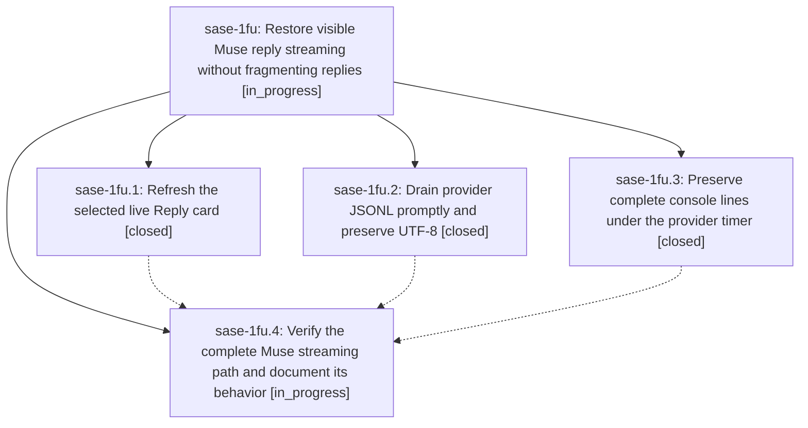

# Bead: sase-1fu — Restore visible Muse reply streaming without fragmenting replies

[Bead Pages](../README.md) / sase-1fu

**Status:** ◐ in_progress · **Type:** ▸ plan · **Tier:** epic
**Owner:** `bryanbugyi34@gmail.com` · **Created by:** [bbugyi200.athena.0vt](https://github.com/sase-org/sase--agents/blob/main/sessions/bbugyi200.athena.0vt.md) · **Assignee:** `sase-1fu.land`
**Created:** 2026-10-03 15:03:50 EDT
**Plan:** [202610/muse\_reply\_streaming.md](https://github.com/sase-org/sase--plans/blob/main/202610/muse_reply_streaming.md)

## Description

Muse reply deltas reach the selected agent's visible Reply card during generation, before terminal completion, with intact text, responsive navigation, and correctly framed interactive console output.

## Phases

| Bead | Title | Status | Size | Created | Agents | Commits |
|---|---|---|---|---|---:|---:|
| [sase-1fu.1](sase-1fu.1.md) | Refresh the selected live Reply card | ✓ closed | medium | 2026-10-03 | 1 | 1 |
| [sase-1fu.2](sase-1fu.2.md) | Drain provider JSONL promptly and preserve UTF-8 | ✓ closed | medium | 2026-10-03 | 1 | 1 |
| [sase-1fu.3](sase-1fu.3.md) | Preserve complete console lines under the provider timer | ✓ closed | small | 2026-10-03 | 1 | 1 |
| [sase-1fu.4](sase-1fu.4.md) | Verify the complete Muse streaming path and document its behavior | ◐ in_progress | medium | 2026-10-03 | 1 | 0 |

## Lineage

## Agents

| Agent | Bead | Commits |
|---|---|---:|
| [bbugyi200.athena.sase-1fu.1](https://github.com/sase-org/sase--agents/blob/main/agents/bbugyi200.athena.sase-1fu.1/README.md) | [sase-1fu.1](sase-1fu.1.md) | 1 |
| [bbugyi200.athena.sase-1fu.2](https://github.com/sase-org/sase--agents/blob/main/agents/bbugyi200.athena.sase-1fu.2/README.md) | [sase-1fu.2](sase-1fu.2.md) | 1 |
| [bbugyi200.athena.sase-1fu.3](https://github.com/sase-org/sase--agents/blob/main/sessions/bbugyi200.athena.sase-1fu.3.md) | [sase-1fu.3](sase-1fu.3.md) | 1 |
| [bbugyi200.athena.sase-1fu.4](https://github.com/sase-org/sase--agents/blob/main/agents/bbugyi200.athena.sase-1fu.4/README.md) | [sase-1fu.4](sase-1fu.4.md) | 0 |
| [bbugyi200.athena.sase-1fu.land](https://github.com/sase-org/sase--agents/blob/main/agents/bbugyi200.athena.sase-1fu.land/README.md) | [sase-1fu](README.md) | 0 |

## Commits

| Repo | Commit | Subject | Bead | Committed |
|---|---|---|---|---|
| sase | [`ca1ffac`](https://github.com/sase-org/sase/commit/ca1ffac8e3f3debe5a44045bb9ceccb16c5bc839) | fix(muse): preserve streamed reply framing | [sase-1fu.3](sase-1fu.3.md) | 2026-10-03 15:45:04 EDT |
| sase | [`3929830`](https://github.com/sase-org/sase/commit/392983091d82799747bc1222ac7c0f9151167c5a) | fix(llm-provider): drain JSONL streams incrementally | [sase-1fu.2](sase-1fu.2.md) | 2026-10-03 16:21:13 EDT |
| sase | [`2307212`](https://github.com/sase-org/sase/commit/2307212bcd88bcf2b5773cf93d73d9be3f84eb0d) | feat(ace): follow selected live agent replies | [sase-1fu.1](sase-1fu.1.md) | 2026-10-03 18:05:12 EDT |
