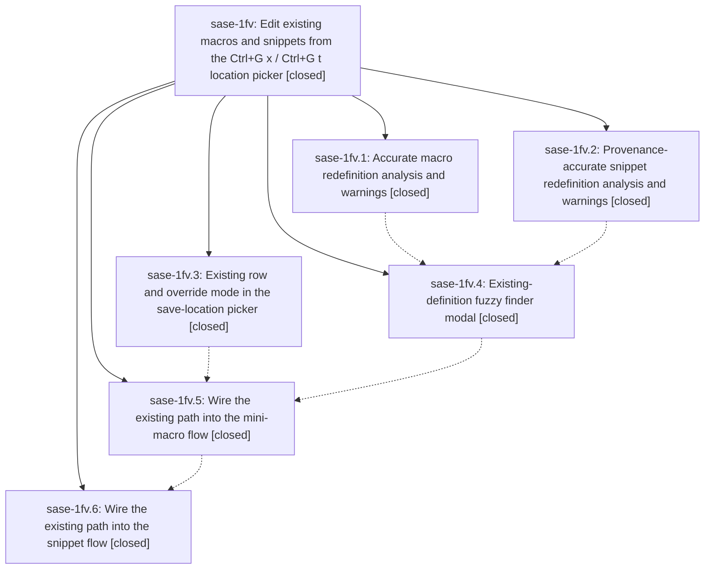

# Bead: sase-1fv — Edit existing macros and snippets from the Ctrl+G x / Ctrl+G t location picker

[Bead Pages](../README.md) / sase-1fv

**Status:** ✓ closed · **Resolution:** done · **Type:** ▸ plan · **Tier:** epic
**Owner:** `bryanbugyi34@gmail.com` · **Created by:** [bbugyi200.athena.0w7](https://github.com/sase-org/sase--agents/blob/main/sessions/bbugyi200.athena.0w7.md) · **Assignee:** `sase-1fv.land`
**Created:** 2026-10-04 06:32:58 EDT · **Closed:** 2026-10-04 16:14:47 EDT
**Plan:** [202610/existing\_macro\_snippet\_editing.md](https://github.com/sase-org/sase--plans/blob/main/202610/existing_macro_snippet_editing.md)

<!-- sase:links:start -->

## Links

| Relation | Artifact | Why |
| --- | --- | --- |
| implemented-by | [plan:202610/existing_macro_snippet_editing.md][1] | derived from the plan's `bead_id:` frontmatter field |

_Plus 1 automatic references — see [Referenced By](#referenced-by)._

[1]: https://github.com/sase-org/sase--plans/blob/main/202610/existing_macro_snippet_editing.md

<!-- sase:links:end -->

## Description

From the prompt input, `Ctrl+G x` / `Ctrl+G t` (and `gx` / `gt`) offer an `e` (existing) row in the location picker that opens a beautiful fuzzy finder over every macro or snippet definition in every supported file. Picking one opens it in the existing mini-macro / snippet pane for in-place editing, or starts a guided override when the definition is read-only. Every path that would redefine an existing macro or snippet, whatever destination the user chose, shows an accurate warning that names where the name already lives and whether the new copy will take effect.

## Notes

[2026-10-04T16:05:09Z · toobig-6y.test_detach_scope.0] DISCOVERED ISSUE: just _lint-symvision / sase tool run check fail because Justfile _lint-symvision still passes five --epic-symbol entries for closed phase sase-1fv.5 (ExistingRowSpec, ExistingDefinitionFinderModal, ExistingDefinitionPick, ExistingFinderBack, macro_existing_entries). Phase close at 2026-10-04T15:51:59Z claimed those rows were re-keyed onto sase-1fv.6(snippet_existing_entries); this workspace Justfile still has the five .5 rows plus the live .6 row. Tool run 055f2c51d9c3445003d9aea8b8f2fad7. Same close-time leftover tracked by sase-o7. Unrelated to the current toobig_split of tests/test_detach_scope.py.

[2026-10-04T19:48:34Z · sase-1fv.land] LAND FOLLOW-UP TRIAGE (sase-1fv.land, 2026-10-04): (1) runner_kill_provenance unused-public symbols (sase-1fv.1 #2, .2 #1, .3 #1, .5 #1, .6 #2) - declined, already resolved: sase-1g0 is closed and the five symbols are privatized on HEAD 807e0fa107. (2) docs/configuration.md families/ terminology failure (sase-1fv.1 #1, .2 #3, .4 #1) - declined, already resolved by aa8b98ffd5 allowlist; test_current_docs_skills_and_memory_avoid_stale_family_phrases passes on HEAD. (3) test_watchdog_reports_ended_join_monitor database-locked flake (sase-1fv.3 #2) - duplicate of sase-18t, already corroborated by sase-1fv.3's own +1; no new bead. (4) test_every_tick_rebroadcasts_to_mounted_views flake (sase-1fv.3 #3) - duplicate of sase-1fn, already corroborated by sase-1fv.3's +1; no new bead. (5) Epic note #1 stale sase-1fv.5 --epic-symbol rows - resolved on HEAD (sase bead epic-symbols sase-1fv lists none); pattern already corroborated on sase-o7 by toobig-6y. No new task beads created.

[2026-10-04T20:14:47Z · sase-1fv.land] Verified all six phases against their commits (a963c0d3da, 763cc9fca3, 2608a2439e, 4d38e39702, d6e856f4d9, 807e0fa107): picker Existing row + override mode, finder modal with chips/preview, macro and snippet in-place edit, override detour, replace_draft + dirty guard, hint labels, docs/ace.md + docs/prompt.md. Live workspace TUI showed user-config #bd/review_tasks as one active real-path row, opened its body, and discarded; a follow-up screenshot export timed out. Landing fixed loader source IDs (config, default_config, plugin:…) being compared as paths, which duplicated config/plugin macros as read-only rows and inverted the active-definition oracle; catalog now normalizes accepted xprompts: config keys and finder snippet origin uses is_macro_derived_kind. Regression suites: 37 passed. ToolRun 52cf1a357b71da7d3668a238ab5bd403 (sase tool run check) succeeded. Targeted visuals: 19 passed; existing snippet-finder fixture timed out on TODO sentinel after three retries and its golden was left untouched. Three updated macro snapshots were reviewed: finder removes duplicate default_config rows and resolves config entries; picker reflects the corrected catalog; completion hint reflects the current rendered state. Follow-up triage: see LAND FOLLOW-UP TRIAGE; no new beads.

## Phases

| Bead | Title | Status | Size | Created | Agents | Commits |
|---|---|---|---|---|---:|---:|
| [sase-1fv.1](sase-1fv.1.md) | Accurate macro redefinition analysis and warnings | ✓ closed | medium | 2026-10-04 | 1 | 1 |
| [sase-1fv.2](sase-1fv.2.md) | Provenance-accurate snippet redefinition analysis and warnings | ✓ closed | medium | 2026-10-04 | 1 | 1 |
| [sase-1fv.3](sase-1fv.3.md) | Existing row and override mode in the save-location picker | ✓ closed | medium | 2026-10-04 | 1 | 1 |
| [sase-1fv.4](sase-1fv.4.md) | Existing-definition fuzzy finder modal | ✓ closed | medium | 2026-10-04 | 1 | 1 |
| [sase-1fv.5](sase-1fv.5.md) | Wire the existing path into the mini-macro flow | ✓ closed | medium | 2026-10-04 | 1 | 1 |
| [sase-1fv.6](sase-1fv.6.md) | Wire the existing path into the snippet flow | ✓ closed | medium | 2026-10-04 | 1 | 1 |

## Lineage

## Agents

| Agent | Bead | Commits |
|---|---|---:|
| [bbugyi200.athena.sase-1fv.1](https://github.com/sase-org/sase--agents/blob/main/agents/bbugyi200.athena.sase-1fv.1/README.md) | [sase-1fv.1](sase-1fv.1.md) | 1 |
| [bbugyi200.athena.sase-1fv.2](https://github.com/sase-org/sase--agents/blob/main/sessions/bbugyi200.athena.sase-1fv.2.md) | [sase-1fv.2](sase-1fv.2.md) | 1 |
| [bbugyi200.athena.sase-1fv.3](https://github.com/sase-org/sase--agents/blob/main/agents/bbugyi200.athena.sase-1fv.3/README.md) | [sase-1fv.3](sase-1fv.3.md) | 1 |
| [bbugyi200.athena.sase-1fv.4](https://github.com/sase-org/sase--agents/blob/main/agents/bbugyi200.athena.sase-1fv.4/README.md) | [sase-1fv.4](sase-1fv.4.md) | 1 |
| [bbugyi200.athena.sase-1fv.5](https://github.com/sase-org/sase--agents/blob/main/sessions/bbugyi200.athena.sase-1fv.5.md) | [sase-1fv.5](sase-1fv.5.md) | 1 |
| [bbugyi200.athena.sase-1fv.6](https://github.com/sase-org/sase--agents/blob/main/sessions/bbugyi200.athena.sase-1fv.6.md) | [sase-1fv.6](sase-1fv.6.md) | 1 |
| [bbugyi200.athena.sase-1fv.land](https://github.com/sase-org/sase--agents/blob/main/sessions/bbugyi200.athena.sase-1fv.land.md) | [sase-1fv](README.md) | 1 |

## Commits

| Repo | Commit | Subject | Bead | Committed |
|---|---|---|---|---|
| sase | [`a963c0d`](https://github.com/sase-org/sase/commit/a963c0d3da2572a0c623a503286160e979d27db5) | feat(ace): warn accurately on mini-macro redefinitions | [sase-1fv.1](sase-1fv.1.md) | 2026-10-04 07:33:32 EDT |
| sase | [`763cc9f`](https://github.com/sase-org/sase/commit/763cc9fca334c8d2009789f368ef01aa9f40debe) | feat(tui): add Existing row and override mode to the save-location picker | [sase-1fv.3](sase-1fv.3.md) | 2026-10-04 07:41:30 EDT |
| sase | [`2608a24`](https://github.com/sase-org/sase/commit/2608a2439e1dd058d86ac1650abb91c8d2b6c3c9) | feat(snippet): replace inverted collision with provenance redefinition | [sase-1fv.2](sase-1fv.2.md) | 2026-10-04 08:41:50 EDT |
| sase | [`4d38e39`](https://github.com/sase-org/sase/commit/4d38e39702e9871be0b0ecfe8d121de6d3afbc82) | feat(tui): add existing-definition finder modal and entry model | [sase-1fv.4](sase-1fv.4.md) | 2026-10-04 10:44:11 EDT |
| sase | [`d6e856f`](https://github.com/sase-org/sase/commit/d6e856f4d9469fa2fb7cd4b9cc055d44abbcb5a9) | feat(tui): wire existing-definition path into mini-macro flow | [sase-1fv.5](sase-1fv.5.md) | 2026-10-04 11:53:53 EDT |
| sase | [`807e0fa`](https://github.com/sase-org/sase/commit/807e0fa107173d0f9ec72343aea642eb014e125d) | feat(tui): wire existing-definition path into snippet location flow | [sase-1fv.6](sase-1fv.6.md) | 2026-10-04 15:27:46 EDT |
| sase | [`aeccf84`](https://github.com/sase-org/sase/commit/aeccf843574ee08293b8fbf71e8b56a676debaa4) | fix(ace): resolve macro catalog loader source IDs | [sase-1fv](README.md) | 2026-10-04 16:37:10 EDT |

<!-- sase:referenced-by:start -->

## Referenced By

| Relation | Artifact | Why | Uses |
| --- | --- | --- | ---: |
| read-by | [agent:toobig-6y.test_detach_scope.0][1] | Need whether the parent epic is still in progress for the leftover epic-symbol entries | 1 |

[1]: https://github.com/sase-org/sase--agents/blob/main/agents/bbugyi200.athena.toobig-6y.test_detach_scope.0/README.md

<!-- sase:referenced-by:end -->
