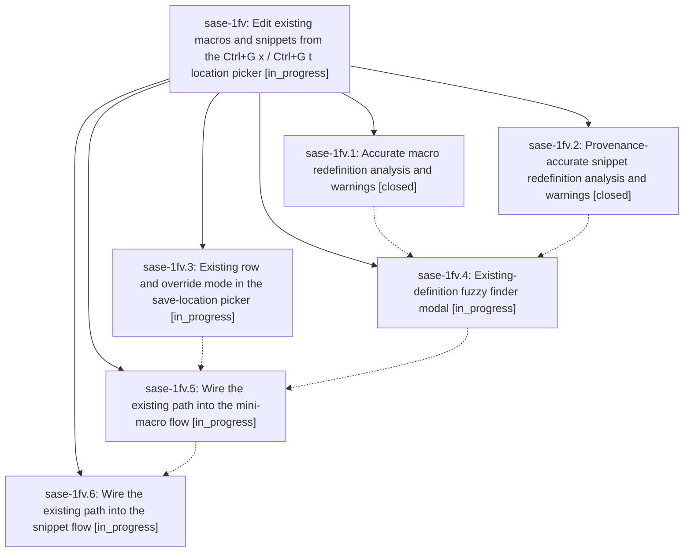

# Bead: sase-1fv — Edit existing macros and snippets from the Ctrl+G x / Ctrl+G t location picker

[Bead Pages](../README.md) / sase-1fv

**Status:** ◐ in_progress · **Type:** ▸ plan · **Tier:** epic
**Owner:** `bryanbugyi34@gmail.com` · **Created by:** [bbugyi200.athena.0w7](https://github.com/sase-org/sase--agents/blob/main/sessions/bbugyi200.athena.0w7.md) · **Assignee:** `sase-1fv.land`
**Created:** 2026-10-04 06:32:58 EDT
**Plan:** [202610/existing\_macro\_snippet\_editing.md](https://github.com/sase-org/sase--plans/blob/main/202610/existing_macro_snippet_editing.md)

## Description

From the prompt input, `Ctrl+G x` / `Ctrl+G t` (and `gx` / `gt`) offer an `e` (existing) row in the location picker that opens a beautiful fuzzy finder over every macro or snippet definition in every supported file. Picking one opens it in the existing mini-macro / snippet pane for in-place editing, or starts a guided override when the definition is read-only. Every path that would redefine an existing macro or snippet, whatever destination the user chose, shows an accurate warning that names where the name already lives and whether the new copy will take effect.

## Phases

| Bead | Title | Status | Size | Created | Agents | Commits |
|---|---|---|---|---|---:|---:|
| [sase-1fv.1](sase-1fv.1.md) | Accurate macro redefinition analysis and warnings | ✓ closed | medium | 2026-10-04 | 1 | 1 |
| [sase-1fv.2](sase-1fv.2.md) | Provenance-accurate snippet redefinition analysis and warnings | ✓ closed | medium | 2026-10-04 | 1 | 0 |
| [sase-1fv.3](sase-1fv.3.md) | Existing row and override mode in the save-location picker | ◐ in_progress | medium | 2026-10-04 | 1 | 0 |
| [sase-1fv.4](sase-1fv.4.md) | Existing-definition fuzzy finder modal | ◐ in_progress | medium | 2026-10-04 | 1 | 0 |
| [sase-1fv.5](sase-1fv.5.md) | Wire the existing path into the mini-macro flow | ◐ in_progress | medium | 2026-10-04 | 1 | 0 |
| [sase-1fv.6](sase-1fv.6.md) | Wire the existing path into the snippet flow | ◐ in_progress | medium | 2026-10-04 | 1 | 0 |

## Lineage

## Agents

| Agent | Bead | Commits |
|---|---|---:|
| [bbugyi200.athena.sase-1fv.1](https://github.com/sase-org/sase--agents/blob/main/agents/bbugyi200.athena.sase-1fv.1/README.md) | [sase-1fv.1](sase-1fv.1.md) | 1 |
| [bbugyi200.athena.sase-1fv.2](https://github.com/sase-org/sase--agents/blob/main/sessions/bbugyi200.athena.sase-1fv.2.md) | [sase-1fv.2](sase-1fv.2.md) | 0 |
| [bbugyi200.athena.sase-1fv.3](https://github.com/sase-org/sase--agents/blob/main/agents/bbugyi200.athena.sase-1fv.3/README.md) | [sase-1fv.3](sase-1fv.3.md) | 0 |
| [bbugyi200.athena.sase-1fv.4](https://github.com/sase-org/sase--agents/blob/main/agents/bbugyi200.athena.sase-1fv.4/README.md) | [sase-1fv.4](sase-1fv.4.md) | 0 |
| [bbugyi200.athena.sase-1fv.5](https://github.com/sase-org/sase--agents/blob/main/agents/bbugyi200.athena.sase-1fv.5/README.md) | [sase-1fv.5](sase-1fv.5.md) | 0 |
| [bbugyi200.athena.sase-1fv.6](https://github.com/sase-org/sase--agents/blob/main/agents/bbugyi200.athena.sase-1fv.6/README.md) | [sase-1fv.6](sase-1fv.6.md) | 0 |
| [bbugyi200.athena.sase-1fv.land](https://github.com/sase-org/sase--agents/blob/main/agents/bbugyi200.athena.sase-1fv.land/README.md) | [sase-1fv](README.md) | 0 |

## Commits

| Repo | Commit | Subject | Bead | Committed |
|---|---|---|---|---|
| sase | [`a963c0d`](https://github.com/sase-org/sase/commit/a963c0d3da2572a0c623a503286160e979d27db5) | feat(ace): warn accurately on mini-macro redefinitions | [sase-1fv.1](sase-1fv.1.md) | 2026-10-04 07:33:32 EDT |
