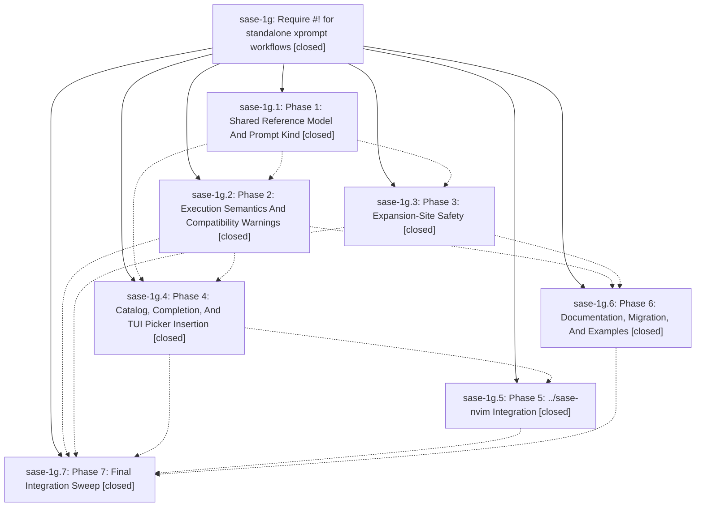

# Bead: sase-1g — Require #! for standalone xprompt workflows

[Bead Pages](../README.md) / sase-1g

**Status:** ✓ closed · **Resolution:** (unrecorded) · **Type:** plan · **Tier:** epic
**Owner:** `bryanbugyi34@gmail.com`
**Created:** 2026-04-30 03:29:38 UTC · **Closed:** 2026-04-30 05:42:27 UTC
**Plan:** [202604/standalone\_xprompt\_bang\_prefix.md](https://github.com/sase-org/sase--plans/blob/main/202604/standalone_xprompt_bang_prefix.md)

## Phases

| Bead | Title | Status | Size | Agents | Commits |
|---|---|---|---|---:|---:|
| [sase-1g.1](sase-1g.1.md) | Phase 1: Shared Reference Model And Prompt Kind | ✓ closed | small | 0 | 1 |
| [sase-1g.2](sase-1g.2.md) | Phase 2: Execution Semantics And Compatibility Warnings | ✓ closed | small | 0 | 1 |
| [sase-1g.3](sase-1g.3.md) | Phase 3: Expansion-Site Safety | ✓ closed | small | 0 | 1 |
| [sase-1g.4](sase-1g.4.md) | Phase 4: Catalog, Completion, And TUI Picker Insertion | ✓ closed | small | 0 | 1 |
| [sase-1g.5](sase-1g.5.md) | Phase 5: ../sase-nvim Integration | ✓ closed | small | 0 | 0 |
| [sase-1g.6](sase-1g.6.md) | Phase 6: Documentation, Migration, And Examples | ✓ closed | small | 0 | 2 |
| [sase-1g.7](sase-1g.7.md) | Phase 7: Final Integration Sweep | ✓ closed | small | 0 | 1 |

## Lineage

## Commits

| Commit | Subject | Bead | Committed (UTC) |
|---|---|---|---|
| [`74d7bd3`](https://github.com/sase-org/sase/commit/74d7bd3182d9d4038b038641c87217ed0ae5e471) | feat: add shared xprompt reference model (sase-1g.1) | [sase-1g.1](sase-1g.1.md) | 2026-04-30 03:39:03 |
| [`1ea4c04`](https://github.com/sase-org/sase/commit/1ea4c04cbd0d4a2c141dda8321bb09fe136aa153) | feat: add standalone workflow bang execution (sase-1g.2) | [sase-1g.2](sase-1g.2.md) | 2026-04-30 05:12:19 |
| [`eae4c65`](https://github.com/sase-org/sase/commit/eae4c65239a921e1f9ce8441f551f3cf7e48347b) | feat: enforce inline expansion safety for standalone workflows (sase-1g.3) | [sase-1g.3](sase-1g.3.md) | 2026-04-30 05:17:18 |
| [`0e3a07f`](https://github.com/sase-org/sase/commit/0e3a07f1dcefbf01580e2860014bc7278748c596) | chore: add SASE component communication infographic (sase-1g.6) | [sase-1g.6](sase-1g.6.md) | 2026-04-30 05:21:42 |
| [`d726b06`](https://github.com/sase-org/sase/commit/d726b06760d30372ca1ca2d0f890f77609cd4fd1) | feat: add kind-aware xprompt insertion (sase-1g.4) | [sase-1g.4](sase-1g.4.md) | 2026-04-30 05:23:56 |
| [`0e53473`](https://github.com/sase-org/sase/commit/0e53473f21e02678452b42f2b932eaa207782086) | chore: document standalone xprompt syntax (sase-1g.6) | [sase-1g.6](sase-1g.6.md) | 2026-04-30 05:26:59 |
| [`ac34af5`](https://github.com/sase-org/sase/commit/ac34af531082fbb7d956a47acf0747a4fb14c74a) | chore: close standalone xprompt integration sweep (sase-1g.7) | [sase-1g.7](sase-1g.7.md) | 2026-04-30 05:38:05 |
