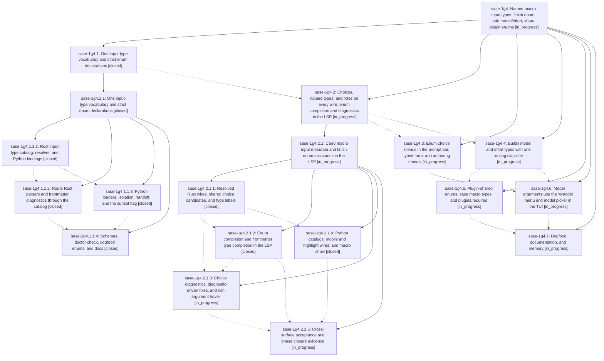

# Bead: sase-1g4 — Named macro input types: finish enum, add model/effort, share plugin enums

[Bead Pages](../README.md) / sase-1g4

**Status:** ◐ in_progress · **Type:** ▸ plan · **Tier:** epic
**Owner:** `bryanbugyi34@gmail.com` · **Created by:** [bbugyi200.athena.0wj](https://github.com/sase-org/sase--agents/blob/main/sessions/bbugyi200.athena.0wj.md) · **Assignee:** `sase-1g4.land`
**Created:** 2026-10-04 18:19:27 EDT
**Plan:** [202610/macro\_named\_input\_types.md](https://github.com/sase-org/sase--plans/blob/main/202610/macro_named_input_types.md)

<!-- sase:links:start -->

## Links

| Relation | Artifact | Why |
| --- | --- | --- |
| implemented-by | [plan:202610/macro_named_input_types.md][1] | derived from the plan's `bead_id:` frontmatter field |

[1]: https://github.com/sase-org/sase--plans/blob/main/202610/macro_named_input_types.md

<!-- sase:links:end -->

## Description

A macro input's `type` names what its value is: a scalar keyword, `enum` with inline `choices`, a builtin type (`agent`, `model`, `effort`), or a plugin's shared enum (`<dist>@<id>`). Every such value completes, validates, and explains itself the same way in the TUI prompt bar, the typed launch form, the LSP (Neovim and other editors), `sase macro show`/`types`, and the runtime binder, because sase-core owns one type vocabulary, one validator, and one candidate builder.

## Phases

| Bead | Title | Status | Size | Created | Agents | Commits |
|---|---|---|---|---|---:|---:|
| [sase-1g4.1](sase-1g4.1.md) | One input-type vocabulary and strict enum declarations | ✓ closed | large | 2026-10-04 | 1 | 0 |
| [sase-1g4.2](sase-1g4.2.md) | Choices, named types, and roles on every wire; enum completion and diagnostics in the LSP | ◐ in_progress | large | 2026-10-04 | 1 | 0 |
| [sase-1g4.3](sase-1g4.3.md) | Enum choice menus in the prompt bar, typed form, and authoring modals | ◐ in_progress | large | 2026-10-04 | 1 | 0 |
| [sase-1g4.4](sase-1g4.4.md) | Builtin model and effort types with one routing classifier | ◐ in_progress | large | 2026-10-04 | 1 | 0 |
| [sase-1g4.5](sase-1g4.5.md) | Plugin-shared enums, sase macro types, and plugins.required | ◐ in_progress | large | 2026-10-04 | 1 | 0 |
| [sase-1g4.6](sase-1g4.6.md) | Model arguments use the %model menu and model picker in the TUI | ◐ in_progress | medium | 2026-10-04 | 1 | 0 |
| [sase-1g4.7](sase-1g4.7.md) | Dogfood, documentation, and memory | ◐ in_progress | medium | 2026-10-04 | 1 | 0 |

## Lineage

## Agents

| Agent | Bead | Commits |
|---|---|---:|
| [bbugyi200.athena.sase-1g4.1](https://github.com/sase-org/sase--agents/blob/main/sessions/bbugyi200.athena.sase-1g4.1.md) | [sase-1g4.1](sase-1g4.1.md) | 0 |
| [bbugyi200.athena.sase-1g4.1.1.1](https://github.com/sase-org/sase--agents/blob/main/agents/bbugyi200.athena.sase-1g4.1.1.1/README.md) | [sase-1g4.1.1.1](sase-1g4.1.1.1.md) | 1 |
| [bbugyi200.athena.sase-1g4.1.1.2](https://github.com/sase-org/sase--agents/blob/main/sessions/bbugyi200.athena.sase-1g4.1.1.2.md) | [sase-1g4.1.1.2](sase-1g4.1.1.2.md) | 2 |
| [bbugyi200.athena.sase-1g4.1.1.3](https://github.com/sase-org/sase--agents/blob/main/agents/bbugyi200.athena.sase-1g4.1.1.3/README.md) | [sase-1g4.1.1.3](sase-1g4.1.1.3.md) | 0 |
| [bbugyi200.athena.sase-1g4.1.1.4](https://github.com/sase-org/sase--agents/blob/main/sessions/bbugyi200.athena.sase-1g4.1.1.4.md) | [sase-1g4.1.1.4](sase-1g4.1.1.4.md) | 1 |
| [bbugyi200.athena.sase-1g4.1.1.land](https://github.com/sase-org/sase--agents/blob/main/sessions/bbugyi200.athena.sase-1g4.1.1.land.md) | [sase-1g4.1.1](sase-1g4.1.1.md) | 2 |
| [bbugyi200.athena.sase-1g4.2](https://github.com/sase-org/sase--agents/blob/main/sessions/bbugyi200.athena.sase-1g4.2.md) | [sase-1g4.2](sase-1g4.2.md) | 0 |
| [bbugyi200.athena.sase-1g4.2.1.1](https://github.com/sase-org/sase--agents/blob/main/agents/bbugyi200.athena.sase-1g4.2.1.1/README.md) | [sase-1g4.2.1.1](sase-1g4.2.1.1.md) | 2 |
| [bbugyi200.athena.sase-1g4.2.1.2](https://github.com/sase-org/sase--agents/blob/main/agents/bbugyi200.athena.sase-1g4.2.1.2/README.md) | [sase-1g4.2.1.2](sase-1g4.2.1.2.md) | 2 |
| [bbugyi200.athena.sase-1g4.2.1.3](https://github.com/sase-org/sase--agents/blob/main/agents/bbugyi200.athena.sase-1g4.2.1.3/README.md) | [sase-1g4.2.1.3](sase-1g4.2.1.3.md) | 0 |
| [bbugyi200.athena.sase-1g4.2.1.4](https://github.com/sase-org/sase--agents/blob/main/agents/bbugyi200.athena.sase-1g4.2.1.4/README.md) | [sase-1g4.2.1.4](sase-1g4.2.1.4.md) | 1 |
| [bbugyi200.athena.sase-1g4.2.1.5](https://github.com/sase-org/sase--agents/blob/main/agents/bbugyi200.athena.sase-1g4.2.1.5/README.md) | [sase-1g4.2.1.5](sase-1g4.2.1.5.md) | 0 |
| [bbugyi200.athena.sase-1g4.2.1.land](https://github.com/sase-org/sase--agents/blob/main/agents/bbugyi200.athena.sase-1g4.2.1.land/README.md) | [sase-1g4.2.1](sase-1g4.2.1.md) | 0 |
| [bbugyi200.athena.sase-1g4.3](https://github.com/sase-org/sase--agents/blob/main/agents/bbugyi200.athena.sase-1g4.3/README.md) | [sase-1g4.3](sase-1g4.3.md) | 0 |
| [bbugyi200.athena.sase-1g4.4](https://github.com/sase-org/sase--agents/blob/main/agents/bbugyi200.athena.sase-1g4.4/README.md) | [sase-1g4.4](sase-1g4.4.md) | 0 |
| [bbugyi200.athena.sase-1g4.5](https://github.com/sase-org/sase--agents/blob/main/agents/bbugyi200.athena.sase-1g4.5/README.md) | [sase-1g4.5](sase-1g4.5.md) | 0 |
| [bbugyi200.athena.sase-1g4.6](https://github.com/sase-org/sase--agents/blob/main/agents/bbugyi200.athena.sase-1g4.6/README.md) | [sase-1g4.6](sase-1g4.6.md) | 0 |
| [bbugyi200.athena.sase-1g4.7](https://github.com/sase-org/sase--agents/blob/main/agents/bbugyi200.athena.sase-1g4.7/README.md) | [sase-1g4.7](sase-1g4.7.md) | 0 |
| [bbugyi200.athena.sase-1g4.land](https://github.com/sase-org/sase--agents/blob/main/agents/bbugyi200.athena.sase-1g4.land/README.md) | [sase-1g4](README.md) | 0 |

## Commits

| Repo | Commit | Subject | Bead | Committed |
|---|---|---|---|---|
| sase-core | [`sase-core@2838c7e`](https://github.com/sase-org/sase-core/commit/2838c7eb181521c81e16a29c293f52bfd10d6d3e) | feat: add macro input-type catalog, resolver, and Python bindings | [sase-1g4.1.1.1](sase-1g4.1.1.1.md) | 2026-10-04 19:12:13 EDT |
| sase-core | [`sase-core@048b649`](https://github.com/sase-org/sase-core/commit/048b6490a91de0c1567c4d461a69dd7219fe373c) | feat(editor): route macro input validation through shared catalog | [sase-1g4.1.1.2](sase-1g4.1.1.2.md) | 2026-10-04 21:20:22 EDT |
| sase | [`25cc3c4`](https://github.com/sase-org/sase/commit/25cc3c475d278b652c9d06e182c101efeeabf600) | chore(core): restore phase revision pin after clean-base check | [sase-1g4.1.1.2](sase-1g4.1.1.2.md) | 2026-10-04 21:24:41 EDT |
| sase | [`2a55a03`](https://github.com/sase-org/sase/commit/2a55a03deb48f86f002ae6cde3025ec8459df74b) | feat(macros): generate input-type schemas and dogfood #pr status enum | [sase-1g4.1.1.4](sase-1g4.1.1.4.md) | 2026-10-05 01:02:47 EDT |
| sase | [`95291ab`](https://github.com/sase-org/sase/commit/95291ab31a447dcb720dcbdf1b87ae21590f2968) | feat(macros): wire loaders through input type catalog | [sase-1g4.1.1](sase-1g4.1.1.md) | 2026-10-05 02:10:43 EDT |
| sase--plans | [`sase--plans@db464b9`](https://github.com/sase-org/sase--plans/commit/db464b9c5446ba963bd8b42de909d8cf10bb1e48) | docs(plans): mark input type vocabulary plan done | [sase-1g4.1.1](sase-1g4.1.1.md) | 2026-10-05 02:14:11 EDT |
| sase-core | [`sase-core@0d27dad`](https://github.com/sase-org/sase-core/commit/0d27dada58d711d4bb71b179a6624c1bff882b63) | feat(macros): carry resolved choice metadata and shared candidates | [sase-1g4.2.1.1](sase-1g4.2.1.1.md) | 2026-10-05 02:58:52 EDT |
| sase | [`4fd4039`](https://github.com/sase-org/sase/commit/4fd4039a5acd2a4db3da82d1c6230ef244e27096) | feat(macros): probe shared choice candidates and type labels | [sase-1g4.2.1.1](sase-1g4.2.1.1.md) | 2026-10-05 03:03:20 EDT |
| sase | [`399b13f`](https://github.com/sase-org/sase/commit/399b13f3efa427ddc549ff82c0135a505053f894) | feat(macro): preserve input choice metadata | [sase-1g4.2.1.4](sase-1g4.2.1.4.md) | 2026-10-05 03:40:35 EDT |
| sase-core | [`sase-core@57fee30`](https://github.com/sase-org/sase-core/commit/57fee3065a18e2ec2af4845b590040c77deab535) | feat(lsp): complete enum and frontmatter type values in the macro LSP | [sase-1g4.2.1.2](sase-1g4.2.1.2.md) | 2026-10-05 04:22:32 EDT |
| sase | [`a6df140`](https://github.com/sase-org/sase/commit/a6df140bcced9f6b1ced1154408e516fcdedb5ea) | docs(editor): document enum and frontmatter type completion in the LSP | [sase-1g4.2.1.2](sase-1g4.2.1.2.md) | 2026-10-05 04:27:05 EDT |
