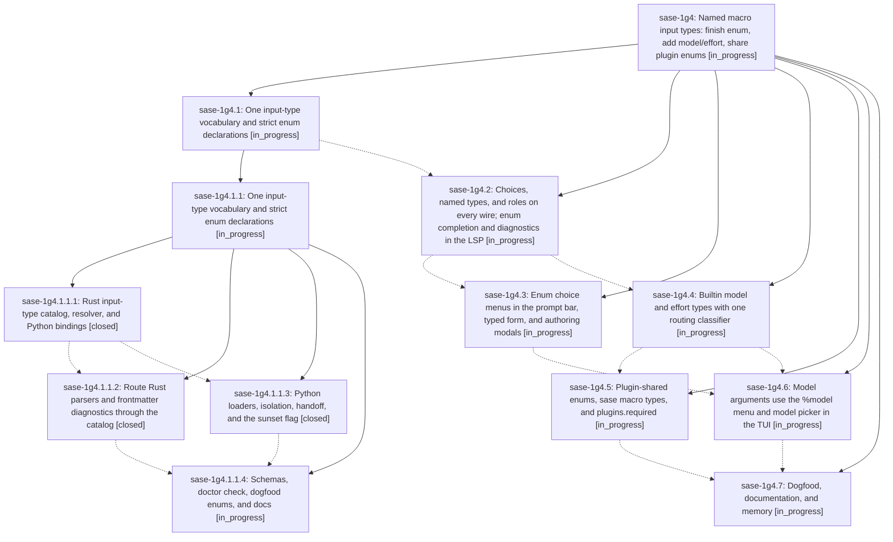

# Bead: sase-1g4 — Named macro input types: finish enum, add model/effort, share plugin enums

[Bead Pages](../README.md) / sase-1g4

**Status:** ◐ in_progress · **Type:** ▸ plan · **Tier:** epic
**Owner:** `bryanbugyi34@gmail.com` · **Created by:** [bbugyi200.athena.0wj](https://github.com/sase-org/sase--agents/blob/main/sessions/bbugyi200.athena.0wj.md) · **Assignee:** `sase-1g4.land`
**Created:** 2026-10-04 18:19:27 EDT
**Plan:** [202610/macro\_named\_input\_types.md](https://github.com/sase-org/sase--plans/blob/main/202610/macro_named_input_types.md)

<!-- sase:links:start -->

## Links

| Relation | Artifact | Why |
| --- | --- | --- |
| implemented-by | [plan:202610/macro_named_input_types.md][1] | derived from the plan's `bead_id:` frontmatter field |

[1]: https://github.com/sase-org/sase--plans/blob/main/202610/macro_named_input_types.md

<!-- sase:links:end -->

## Description

A macro input's `type` names what its value is: a scalar keyword, `enum` with inline `choices`, a builtin type (`agent`, `model`, `effort`), or a plugin's shared enum (`<dist>@<id>`). Every such value completes, validates, and explains itself the same way in the TUI prompt bar, the typed launch form, the LSP (Neovim and other editors), `sase macro show`/`types`, and the runtime binder, because sase-core owns one type vocabulary, one validator, and one candidate builder.

## Phases

| Bead | Title | Status | Size | Created | Agents | Commits |
|---|---|---|---|---|---:|---:|
| [sase-1g4.1](sase-1g4.1.md) | One input-type vocabulary and strict enum declarations | ◐ in_progress | large | 2026-10-04 | 1 | 0 |
| [sase-1g4.2](sase-1g4.2.md) | Choices, named types, and roles on every wire; enum completion and diagnostics in the LSP | ◐ in_progress | large | 2026-10-04 | 1 | 0 |
| [sase-1g4.3](sase-1g4.3.md) | Enum choice menus in the prompt bar, typed form, and authoring modals | ◐ in_progress | large | 2026-10-04 | 1 | 0 |
| [sase-1g4.4](sase-1g4.4.md) | Builtin model and effort types with one routing classifier | ◐ in_progress | large | 2026-10-04 | 1 | 0 |
| [sase-1g4.5](sase-1g4.5.md) | Plugin-shared enums, sase macro types, and plugins.required | ◐ in_progress | large | 2026-10-04 | 1 | 0 |
| [sase-1g4.6](sase-1g4.6.md) | Model arguments use the %model menu and model picker in the TUI | ◐ in_progress | medium | 2026-10-04 | 1 | 0 |
| [sase-1g4.7](sase-1g4.7.md) | Dogfood, documentation, and memory | ◐ in_progress | medium | 2026-10-04 | 1 | 0 |

## Lineage

## Agents

| Agent | Bead | Commits |
|---|---|---:|
| [bbugyi200.athena.sase-1g4.1](https://github.com/sase-org/sase--agents/blob/main/sessions/bbugyi200.athena.sase-1g4.1.md) | [sase-1g4.1](sase-1g4.1.md) | 0 |
| [bbugyi200.athena.sase-1g4.1.1.1](https://github.com/sase-org/sase--agents/blob/main/agents/bbugyi200.athena.sase-1g4.1.1.1/README.md) | [sase-1g4.1.1.1](sase-1g4.1.1.1.md) | 1 |
| [bbugyi200.athena.sase-1g4.1.1.2](https://github.com/sase-org/sase--agents/blob/main/sessions/bbugyi200.athena.sase-1g4.1.1.2.md) | [sase-1g4.1.1.2](sase-1g4.1.1.2.md) | 1 |
| [bbugyi200.athena.sase-1g4.1.1.3](https://github.com/sase-org/sase--agents/blob/main/agents/bbugyi200.athena.sase-1g4.1.1.3/README.md) | [sase-1g4.1.1.3](sase-1g4.1.1.3.md) | 0 |
| [bbugyi200.athena.sase-1g4.1.1.4](https://github.com/sase-org/sase--agents/blob/main/agents/bbugyi200.athena.sase-1g4.1.1.4/README.md) | [sase-1g4.1.1.4](sase-1g4.1.1.4.md) | 0 |
| [bbugyi200.athena.sase-1g4.1.1.land](https://github.com/sase-org/sase--agents/blob/main/agents/bbugyi200.athena.sase-1g4.1.1.land/README.md) | [sase-1g4.1.1](sase-1g4.1.1.md) | 0 |
| [bbugyi200.athena.sase-1g4.2](https://github.com/sase-org/sase--agents/blob/main/agents/bbugyi200.athena.sase-1g4.2/README.md) | [sase-1g4.2](sase-1g4.2.md) | 0 |
| [bbugyi200.athena.sase-1g4.3](https://github.com/sase-org/sase--agents/blob/main/agents/bbugyi200.athena.sase-1g4.3/README.md) | [sase-1g4.3](sase-1g4.3.md) | 0 |
| [bbugyi200.athena.sase-1g4.4](https://github.com/sase-org/sase--agents/blob/main/agents/bbugyi200.athena.sase-1g4.4/README.md) | [sase-1g4.4](sase-1g4.4.md) | 0 |
| [bbugyi200.athena.sase-1g4.5](https://github.com/sase-org/sase--agents/blob/main/agents/bbugyi200.athena.sase-1g4.5/README.md) | [sase-1g4.5](sase-1g4.5.md) | 0 |
| [bbugyi200.athena.sase-1g4.6](https://github.com/sase-org/sase--agents/blob/main/agents/bbugyi200.athena.sase-1g4.6/README.md) | [sase-1g4.6](sase-1g4.6.md) | 0 |
| [bbugyi200.athena.sase-1g4.7](https://github.com/sase-org/sase--agents/blob/main/agents/bbugyi200.athena.sase-1g4.7/README.md) | [sase-1g4.7](sase-1g4.7.md) | 0 |
| [bbugyi200.athena.sase-1g4.land](https://github.com/sase-org/sase--agents/blob/main/agents/bbugyi200.athena.sase-1g4.land/README.md) | [sase-1g4](README.md) | 0 |

## Commits

| Repo | Commit | Subject | Bead | Committed |
|---|---|---|---|---|
| sase-core | [`sase-core@2838c7e`](https://github.com/sase-org/sase-core/commit/2838c7eb181521c81e16a29c293f52bfd10d6d3e) | feat: add macro input-type catalog, resolver, and Python bindings | [sase-1g4.1.1.1](sase-1g4.1.1.1.md) | 2026-10-04 19:12:13 EDT |
| sase-core | [`sase-core@048b649`](https://github.com/sase-org/sase-core/commit/048b6490a91de0c1567c4d461a69dd7219fe373c) | feat(editor): route macro input validation through shared catalog | [sase-1g4.1.1.2](sase-1g4.1.1.2.md) | 2026-10-04 21:20:22 EDT |
