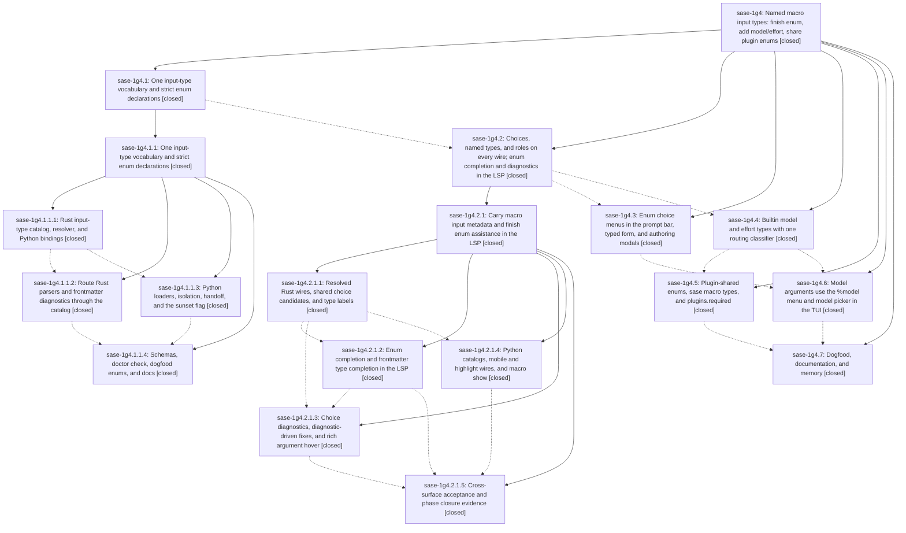

# Bead: sase-1g4 — Named macro input types: finish enum, add model/effort, share plugin enums

[Bead Pages](../README.md) / sase-1g4

**Status:** ✓ closed · **Resolution:** done · **Type:** ▸ plan · **Tier:** epic
**Owner:** `bryanbugyi34@gmail.com` · **Created by:** [bbugyi200.athena.0wj](https://github.com/sase-org/sase--agents/blob/main/sessions/bbugyi200.athena.0wj.md) · **Assignee:** `sase-1g4.land`
**Created:** 2026-10-04 18:19:27 EDT · **Closed:** 2026-10-05 21:11:39 EDT
**Plan:** [202610/macro\_named\_input\_types.md](https://github.com/sase-org/sase--plans/blob/main/202610/macro_named_input_types.md)

<!-- sase:links:start -->

## Links

| Relation | Artifact | Why |
| --- | --- | --- |
| implemented-by | [plan:202610/macro_named_input_types.md][1] | derived from the plan's `bead_id:` frontmatter field |

_Plus 2 automatic references — see [Referenced By](#referenced-by)._

[1]: https://github.com/sase-org/sase--plans/blob/main/202610/macro_named_input_types.md

<!-- sase:links:end -->

## Description

A macro input's `type` names what its value is: a scalar keyword, `enum` with inline `choices`, a builtin type (`agent`, `model`, `effort`), or a plugin's shared enum (`<dist>@<id>`). Every such value completes, validates, and explains itself the same way in the TUI prompt bar, the typed launch form, the LSP (Neovim and other editors), `sase macro show`/`types`, and the runtime binder, because sase-core owns one type vocabulary, one validator, and one candidate builder.

## Notes

[2026-10-05T10:47:44Z · claude-code-interactive] DISCOVERED ISSUE: InputItemModal crashes the TUI when it opens for a new input. src/sase/ace/tui/modals/input_item_modal.py:100 still evaluates InputType.LINE.value when `existing` is None, but 95291ab31a (sase-1g4.1.1, "wire loaders through input type catalog") removed the InputType import. Reproduced on sase master f0893af93b by mounting InputItemModal() in a headless Textual app: NameError "name 'InputType' is not defined" raised from compose(). mypy flags the same line (name-defined). This most likely falls within sase-1g4.3's authoring-modals scope.

[2026-10-05T21:19:03Z · 0x4] Its DISCOVERED ISSUE (InputItemModal NameError on InputType when opened for a new input) was resolved by a958ba4e87; test_input_modal_saves_constructed_arg constructs InputItemModal() with no existing and passes, and test_input_modal_surfaces_duplicate_choice_error covers the shared choices helper.

[2026-10-06T00:23:28Z · sase-1g4.land] LANDING TRIAGE (sase-1g4.land, 2026-10-05, sase master abcfedc31d, core pin af5df614 = core origin/master).

Verified: all 7 phases closed. Nested epics sase-1g4.1.1 and sase-1g4.2.1 closed with their own landings. Phase notes match the source: one Rust catalog and resolver; strict_macro_input_types, with flag bead sase-1g9 open; per-macro isolation; #pr status enum; choices, named_type and value_role on every wire; LSP enum and model completion, diagnostics, quick fixes and hover; builtin effort and model types with the routing classifier, and _model_token_routes deleted; plugin input_types.yml registry and LSP export; sase macro types; doctor config.macro_input_types, which is clean on this project; TUI enum and model menus and the typed-form picker; sase-research-artifacts audio_edition plus typed research_swarm/research_audio inputs (bea92af); docs, and the memory Inputs line. The epic note #1 InputItemModal NameError was fixed by a958ba4e87, per note #2. epic-symbols: none.

Integration: no non-epic commit since 25cc3c475d needs changes. The Grok models and aliases flow into model_validity_snapshot through the registry; 25010b94ce and 17c2907d3b preserved named_type plumbing and isolation; and no new bundled macros declare model, effort or closed-set inputs.

REMAINING EPIC WORK, planned as a tale:
(1) Python stale-binding fallbacks added by a958ba4e87/8fc4b4ccd6/ce7c7148c0 that violate decisions:rust-core-required, including a hard-coded true/false bool menu the plan said to delete.
(2) The +64-byte span window in _rust_span_bounds_for_cursor (a958ba4e87).
(3) `sase macro types NAME` prints a literal [bold]...[/bold], duplicates description/rule, and forces ANSI color when piped.
(4) MacroConfigEntryModal still validates types against the Python InputType enum, so it rejects model/effort/<dist>@<id> and accepts enum without choices.
(5) The value-menu title deviates from the design's `<input> · <named_type or enum>` (sase-1g4.3 #2).
(6) Three duplicate hint-to-wire serializers for macro_input_type_label (sase-1g4.3 #3).
(7) docs/configuration.md has no `sase macro types` CLI section, and the docs/cli.md link target is wrong.

FOLLOW-UP OUTCOMES:
- sase-1g4.3 #1 parallel flakes: +1 sase-1br (test_block_spread_bracket_top_aligns). test_tab_after_background_refresh_stays_on_agents is in test_prompt_tab_focus_steal.py, so +1 sase-1fy.
- sase-1g4.3 #2 and #3: epic work, in the tale.
- sase-1g4.3 #4 detection: the 64-byte window is epic work, in the tale. The quote-blind comma splitter predates the epic (a295e0313c/762736fd68). Reproduced: `#m:"a,b",` resolves to the wrong input and `#m("a)b",s` opens no menu. Filed bug sase-1h1 (large).
- sase-1g4.3 #5 dead InputItemModal/MacroItemModal: unreachable since 7776f7a857 (2026-07-10), so pre-existing. Filed bug sase-1h0 (small).
- sase-1g4.4 #3-#6 sase-core rename-fallout test failures: caused by active epic sase-1eq and already recorded there as a DISCOVERED ISSUE by sase-1g4.2.1.land. Declined, no task.
- sase-1g4.4 #7: +1 sase-1fy (test_prompt_tab_focus_steal) and +1 sase-1gp (test_distinct_ace_apps_do_not_share_session_state).
- sase-1g4.4 #8 sase_gateway load flakes: +1 sase-15h (sudo_runner ETXTBSY). Filed flake sase-1gz for federation_worker listener_creates_private_socket_and_rejects_symlink (no prior task).
- sase-1g4.5 #1/#3 and sase-1g4.7 #1 test_macro_docs_and_memory_avoid_xprompt_terms: still fails at HEAD with 11 lines in docs/images/macro-resolution-infographic.prompt.md from b6114d4f95 (sase-1eq.12.3). Caused by active epic sase-1eq and already recorded there as a DISCOVERED ISSUE. Declined, no task.
- sase-1g4.6 #1 grok_rules_delivery schema drift: declined as fixed; tools/sync_feature_flags_schema --check passes at HEAD.
- sase-1g4.7 #2 grok stream fixture failures: declined as fixed; tests/llm_provider/test_grok_provider_stream.py passes at HEAD (3 passed). The symvision _runs imports item gets checked by the closeout's just symvision.
- Incidental: +1 sase-1gs. `sase bead read` with links and `sase artifact link add` fail with the bead id segment validation error.

[2026-10-06T01:11:39Z · sase-1g4.land--2] LANDING VERIFICATION (sase-1g4.land, 2026-10-06): all 7 phases verified, no integration needed per note #3 triage. Seven fixes+tests landed in this effort (mypy choices:object fix in _input_hint_wire.py + stale type-ignore drop in highlight.py; focused suites 106 passed; doctor config.macro_input_types OK; macro types effort pipe clean of [bold]/ANSI; PNG goldens prompt_macro_arg_enum_value light/dark regenerated and inspected). ToolRun c7aaf1c3ce16124ab2e9d30705097171 verdict no_new_failures (3 KNOWN only: test_macro_docs_and_memory_avoid_xprompt_terms owned by sase-1eq, 2 symvision _runs KNOWN). epic-symbols: none. just symvision: only the same 2 KNOWN _runs items. Follow-up outcomes per note #3 stand; plan status set done.

## Phases

| Bead | Title | Status | Size | Created | Agents | Commits |
|---|---|---|---|---|---:|---:|
| [sase-1g4.1](sase-1g4.1.md) | One input-type vocabulary and strict enum declarations | ✓ closed | large | 2026-10-04 | 1 | 0 |
| [sase-1g4.2](sase-1g4.2.md) | Choices, named types, and roles on every wire; enum completion and diagnostics in the LSP | ✓ closed | large | 2026-10-04 | 1 | 0 |
| [sase-1g4.3](sase-1g4.3.md) | Enum choice menus in the prompt bar, typed form, and authoring modals | ✓ closed | large | 2026-10-04 | 2 | 2 |
| [sase-1g4.4](sase-1g4.4.md) | Builtin model and effort types with one routing classifier | ✓ closed | large | 2026-10-04 | 1 | 3 |
| [sase-1g4.5](sase-1g4.5.md) | Plugin-shared enums, sase macro types, and plugins.required | ✓ closed | large | 2026-10-04 | 1 | 2 |
| [sase-1g4.6](sase-1g4.6.md) | Model arguments use the %model menu and model picker in the TUI | ✓ closed | medium | 2026-10-04 | 1 | 1 |
| [sase-1g4.7](sase-1g4.7.md) | Dogfood, documentation, and memory | ✓ closed | medium | 2026-10-04 | 1 | 2 |

## Lineage

## Agents

| Agent | Bead | Commits |
|---|---|---:|
| [bbugyi200.athena.0x4](https://github.com/sase-org/sase--agents/blob/main/sessions/bbugyi200.athena.0x4.md) | [sase-1g4.3](sase-1g4.3.md) | 1 |
| [bbugyi200.athena.sase-1g4.1](https://github.com/sase-org/sase--agents/blob/main/sessions/bbugyi200.athena.sase-1g4.1.md) | [sase-1g4.1](sase-1g4.1.md) | 0 |
| [bbugyi200.athena.sase-1g4.1.1.1](https://github.com/sase-org/sase--agents/blob/main/agents/bbugyi200.athena.sase-1g4.1.1.1/README.md) | [sase-1g4.1.1.1](sase-1g4.1.1.1.md) | 1 |
| [bbugyi200.athena.sase-1g4.1.1.2](https://github.com/sase-org/sase--agents/blob/main/sessions/bbugyi200.athena.sase-1g4.1.1.2.md) | [sase-1g4.1.1.2](sase-1g4.1.1.2.md) | 2 |
| [bbugyi200.athena.sase-1g4.1.1.3](https://github.com/sase-org/sase--agents/blob/main/agents/bbugyi200.athena.sase-1g4.1.1.3/README.md) | [sase-1g4.1.1.3](sase-1g4.1.1.3.md) | 0 |
| [bbugyi200.athena.sase-1g4.1.1.4](https://github.com/sase-org/sase--agents/blob/main/sessions/bbugyi200.athena.sase-1g4.1.1.4.md) | [sase-1g4.1.1.4](sase-1g4.1.1.4.md) | 1 |
| [bbugyi200.athena.sase-1g4.1.1.land](https://github.com/sase-org/sase--agents/blob/main/sessions/bbugyi200.athena.sase-1g4.1.1.land.md) | [sase-1g4.1.1](sase-1g4.1.1.md) | 2 |
| [bbugyi200.athena.sase-1g4.2](https://github.com/sase-org/sase--agents/blob/main/sessions/bbugyi200.athena.sase-1g4.2.md) | [sase-1g4.2](sase-1g4.2.md) | 0 |
| [bbugyi200.athena.sase-1g4.2.1.1](https://github.com/sase-org/sase--agents/blob/main/agents/bbugyi200.athena.sase-1g4.2.1.1/README.md) | [sase-1g4.2.1.1](sase-1g4.2.1.1.md) | 2 |
| [bbugyi200.athena.sase-1g4.2.1.2](https://github.com/sase-org/sase--agents/blob/main/agents/bbugyi200.athena.sase-1g4.2.1.2/README.md) | [sase-1g4.2.1.2](sase-1g4.2.1.2.md) | 2 |
| [bbugyi200.athena.sase-1g4.2.1.3](https://github.com/sase-org/sase--agents/blob/main/agents/bbugyi200.athena.sase-1g4.2.1.3/README.md) | [sase-1g4.2.1.3](sase-1g4.2.1.3.md) | 2 |
| [bbugyi200.athena.sase-1g4.2.1.4](https://github.com/sase-org/sase--agents/blob/main/agents/bbugyi200.athena.sase-1g4.2.1.4/README.md) | [sase-1g4.2.1.4](sase-1g4.2.1.4.md) | 1 |
| [bbugyi200.athena.sase-1g4.2.1.5](https://github.com/sase-org/sase--agents/blob/main/sessions/bbugyi200.athena.sase-1g4.2.1.5.md) | [sase-1g4.2.1.5](sase-1g4.2.1.5.md) | 0 |
| [bbugyi200.athena.sase-1g4.2.1.land](https://github.com/sase-org/sase--agents/blob/main/sessions/bbugyi200.athena.sase-1g4.2.1.land.md) | [sase-1g4.2.1](sase-1g4.2.1.md) | 3 |
| [bbugyi200.athena.sase-1g4.3](https://github.com/sase-org/sase--agents/blob/main/sessions/bbugyi200.athena.sase-1g4.3.md) | [sase-1g4.3](sase-1g4.3.md) | 1 |
| [bbugyi200.athena.sase-1g4.4](https://github.com/sase-org/sase--agents/blob/main/sessions/bbugyi200.athena.sase-1g4.4.md) | [sase-1g4.4](sase-1g4.4.md) | 3 |
| [bbugyi200.athena.sase-1g4.5](https://github.com/sase-org/sase--agents/blob/main/sessions/bbugyi200.athena.sase-1g4.5.md) | [sase-1g4.5](sase-1g4.5.md) | 2 |
| [bbugyi200.athena.sase-1g4.6](https://github.com/sase-org/sase--agents/blob/main/agents/bbugyi200.athena.sase-1g4.6/README.md) | [sase-1g4.6](sase-1g4.6.md) | 1 |
| [bbugyi200.athena.sase-1g4.7](https://github.com/sase-org/sase--agents/blob/main/agents/bbugyi200.athena.sase-1g4.7/README.md) | [sase-1g4.7](sase-1g4.7.md) | 2 |
| [bbugyi200.athena.sase-1g4.land](https://github.com/sase-org/sase--agents/blob/main/sessions/bbugyi200.athena.sase-1g4.land.md) | [sase-1g4](README.md) | 1 |

## Commits

| Repo | Commit | Subject | Bead | Committed |
|---|---|---|---|---|
| sase-core | [`sase-core@2838c7e`](https://github.com/sase-org/sase-core/commit/2838c7eb181521c81e16a29c293f52bfd10d6d3e) | feat: add macro input-type catalog, resolver, and Python bindings | [sase-1g4.1.1.1](sase-1g4.1.1.1.md) | 2026-10-04 19:12:13 EDT |
| sase-core | [`sase-core@048b649`](https://github.com/sase-org/sase-core/commit/048b6490a91de0c1567c4d461a69dd7219fe373c) | feat(editor): route macro input validation through shared catalog | [sase-1g4.1.1.2](sase-1g4.1.1.2.md) | 2026-10-04 21:20:22 EDT |
| sase | [`25cc3c4`](https://github.com/sase-org/sase/commit/25cc3c475d278b652c9d06e182c101efeeabf600) | chore(core): restore phase revision pin after clean-base check | [sase-1g4.1.1.2](sase-1g4.1.1.2.md) | 2026-10-04 21:24:41 EDT |
| sase | [`2a55a03`](https://github.com/sase-org/sase/commit/2a55a03deb48f86f002ae6cde3025ec8459df74b) | feat(macros): generate input-type schemas and dogfood #pr status enum | [sase-1g4.1.1.4](sase-1g4.1.1.4.md) | 2026-10-05 01:02:47 EDT |
| sase | [`95291ab`](https://github.com/sase-org/sase/commit/95291ab31a447dcb720dcbdf1b87ae21590f2968) | feat(macros): wire loaders through input type catalog | [sase-1g4.1.1](sase-1g4.1.1.md) | 2026-10-05 02:10:43 EDT |
| sase--plans | [`sase--plans@db464b9`](https://github.com/sase-org/sase--plans/commit/db464b9c5446ba963bd8b42de909d8cf10bb1e48) | docs(plans): mark input type vocabulary plan done | [sase-1g4.1.1](sase-1g4.1.1.md) | 2026-10-05 02:14:11 EDT |
| sase-core | [`sase-core@0d27dad`](https://github.com/sase-org/sase-core/commit/0d27dada58d711d4bb71b179a6624c1bff882b63) | feat(macros): carry resolved choice metadata and shared candidates | [sase-1g4.2.1.1](sase-1g4.2.1.1.md) | 2026-10-05 02:58:52 EDT |
| sase | [`4fd4039`](https://github.com/sase-org/sase/commit/4fd4039a5acd2a4db3da82d1c6230ef244e27096) | feat(macros): probe shared choice candidates and type labels | [sase-1g4.2.1.1](sase-1g4.2.1.1.md) | 2026-10-05 03:03:20 EDT |
| sase | [`399b13f`](https://github.com/sase-org/sase/commit/399b13f3efa427ddc549ff82c0135a505053f894) | feat(macro): preserve input choice metadata | [sase-1g4.2.1.4](sase-1g4.2.1.4.md) | 2026-10-05 03:40:35 EDT |
| sase-core | [`sase-core@57fee30`](https://github.com/sase-org/sase-core/commit/57fee3065a18e2ec2af4845b590040c77deab535) | feat(lsp): complete enum and frontmatter type values in the macro LSP | [sase-1g4.2.1.2](sase-1g4.2.1.2.md) | 2026-10-05 04:22:32 EDT |
| sase | [`a6df140`](https://github.com/sase-org/sase/commit/a6df140bcced9f6b1ced1154408e516fcdedb5ea) | docs(editor): document enum and frontmatter type completion in the LSP | [sase-1g4.2.1.2](sase-1g4.2.1.2.md) | 2026-10-05 04:27:05 EDT |
| sase-core | [`sase-core@ecd2e07`](https://github.com/sase-org/sase-core/commit/ecd2e074b4489c0c326e2137075dfd29be2bc384) | feat(lsp): classify enum diagnostics and drive diagnostic quick fixes | [sase-1g4.2.1.3](sase-1g4.2.1.3.md) | 2026-10-05 05:51:47 EDT |
| sase | [`6fde796`](https://github.com/sase-org/sase/commit/6fde79660418540d98dd81fbcdd317f50c062cf8) | docs(editor): document choice diagnostics, quick fixes, and argument hover | [sase-1g4.2.1.3](sase-1g4.2.1.3.md) | 2026-10-05 05:56:18 EDT |
| sase-core | [`sase-core@fe2ef0e`](https://github.com/sase-org/sase-core/commit/fe2ef0e6af311dc6ae7ba7340e85d54822504f26) | fix(lsp): land choice-wire tale: clippy named structs, invalid\_macro\_arg\_choice rename | [sase-1g4.2.1](sase-1g4.2.1.md) | 2026-10-05 08:59:59 EDT |
| sase | [`0a7ccdf`](https://github.com/sase-org/sase/commit/0a7ccdf92c6c2ff6777a7d0e3032e719a21dc936) | fix(macro): land choice-wire tale: macro-spelled choice diagnostic docs, orphan removal, stale-pair cleanup | [sase-1g4.2.1](sase-1g4.2.1.md) | 2026-10-05 09:04:27 EDT |
| sase--plans | [`sase--plans@16c1965`](https://github.com/sase-org/sase--plans/commit/16c1965452f256b506f4376aef60c19d420bd827) | docs(plans): mark macro\_choice\_wires\_lsp epic plan done | [sase-1g4.2.1](sase-1g4.2.1.md) | 2026-10-05 09:08:00 EDT |
| sase | [`a958ba4`](https://github.com/sase-org/sase/commit/a958ba4e872c80db0f3f75c039c169fe2deca9eb) | feat(tui-enum): route enum and bool args through Rust choice builder with picker and modal editors | [sase-1g4.3](sase-1g4.3.md) | 2026-10-05 10:36:14 EDT |
| sase-core | [`sase-core@16095fc`](https://github.com/sase-org/sase-core/commit/16095fcf715cf64a6f4d217961ce3f2083ab3b7f) | feat(macros): add builtin model and effort types with one routing classifier | [sase-1g4.4](sase-1g4.4.md) | 2026-10-05 11:28:10 EDT |
| sase | [`ce7c714`](https://github.com/sase-org/sase/commit/ce7c7148c0822b565a8dd2a46b02111096fce96f) | feat(macro): add builtin model and effort input types with one routing classifier | [sase-1g4.4](sase-1g4.4.md) | 2026-10-05 11:31:58 EDT |
| sase-core | [`sase-core@2fa78ad`](https://github.com/sase-org/sase-core/commit/2fa78ad066f4f2c77a1e4ee8c7bd303ac0d01c18) | feat(macros): add builtin effort argument completion test | [sase-1g4.4](sase-1g4.4.md) | 2026-10-05 12:47:39 EDT |
| sase-core | [`sase-core@af5df61`](https://github.com/sase-org/sase-core/commit/af5df614a70a02995a1dc0b9c05337b719145289) | feat(core): load plugin input\_type registries with resolution, catalog, and LSP wiring | [sase-1g4.5](sase-1g4.5.md) | 2026-10-05 15:29:56 EDT |
| sase | [`8fc4b4c`](https://github.com/sase-org/sase/commit/8fc4b4ccd65b3e39205847990076da0b9ec3152c) | feat(macro): resolve plugin-shared enum input types in runtime, LSP, CLI, and doctor | [sase-1g4.5](sase-1g4.5.md) | 2026-10-05 15:34:30 EDT |
| sase | [`1a2dc5e`](https://github.com/sase-org/sase/commit/1a2dc5e4ddc7e2aec8f0bc444cd698744f4a79e9) | feat(tui-enum): route enum and bool args through Rust choice builder with picker and modal editing (sase-1g4.3) | [sase-1g4.3](sase-1g4.3.md) | 2026-10-05 18:06:50 EDT |
| sase | [`55c46c3`](https://github.com/sase-org/sase/commit/55c46c363386403e4e80aa3f48cf9e7d6c89dfe4) | feat(ace): add macro model argument completion | [sase-1g4.6](sase-1g4.6.md) | 2026-10-05 18:32:47 EDT |
| sase | [`abcfedc`](https://github.com/sase-org/sase/commit/abcfedc31d7b71f6bb2fa72fbc6e58d7f49e2b70) | feat(macros): document named input types and add runtime/LSP/TUI parity | [sase-1g4.7](sase-1g4.7.md) | 2026-10-05 19:49:38 EDT |
| sase-research-artifacts | [`sase-research-artifacts@bea92af`](https://github.com/sase-org/sase-research-artifacts/commit/bea92afb713db71c666a4f62ea53c4652460e2c4) | feat(macros): ship audio\_edition type and type research model inputs | [sase-1g4.7](sase-1g4.7.md) | 2026-10-05 19:53:50 EDT |
| sase | [`81eaae5`](https://github.com/sase-org/sase/commit/81eaae59eaf4da222c4950a0e27089da6d283a28) | feat(macro): land named macro input types with enum, model, effort and shared plugin enums | [sase-1g4](README.md) | 2026-10-05 21:12:44 EDT |

<!-- sase:referenced-by:start -->

## Referenced By

| Relation | Artifact | Why | Uses |
| --- | --- | --- | ---: |
| read-by | [agent:sase-1g4.5--3][1] | continue plugin_input_types phase after monitor check | 2 |
| read-by | [agent:sase-1g4.7][2] | Need parent epic context for phase sase-1g4.7 | 1 |

[1]: https://github.com/sase-org/sase--agents/blob/main/sessions/bbugyi200.athena.sase-1g4.5.md
[2]: https://github.com/sase-org/sase--agents/blob/main/agents/bbugyi200.athena.sase-1g4.7/README.md

<!-- sase:referenced-by:end -->
