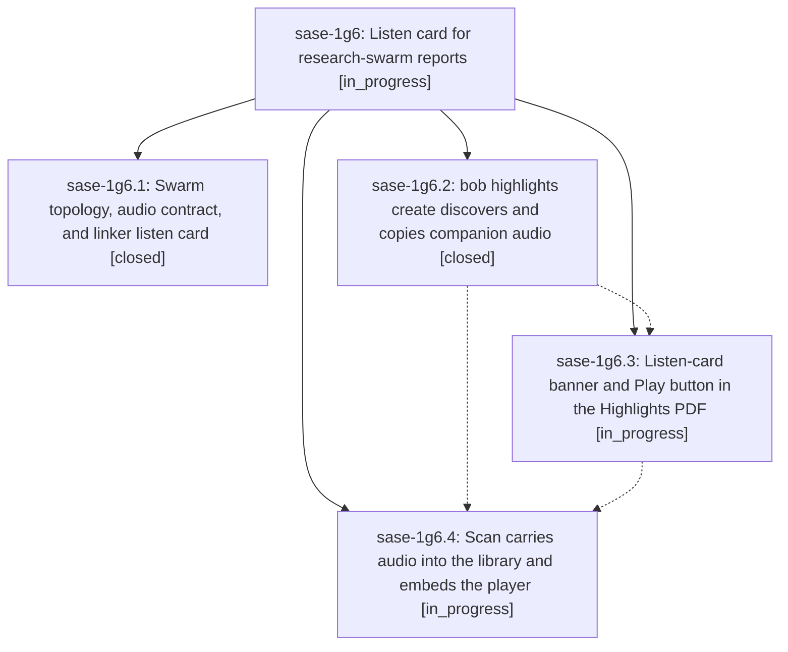

# Bead: sase-1g6 — Listen card for research-swarm reports

[Bead Pages](../README.md) / sase-1g6

**Status:** ◐ in_progress · **Type:** ▸ plan · **Tier:** epic
**Owner:** `bryanbugyi34@gmail.com` · **Created by:** [bbugyi200.apollo.research.0b.linker.w0](https://github.com/sase-org/sase--agents/blob/main/sessions/bbugyi200.apollo.research.0b.linker.w0.md) · **Assignee:** `sase-1g6.land`
**Created:** 2026-10-04 18:40:06 EDT
**Plan:** [202610/research\_swarm\_listen\_card.md](https://github.com/sase-org/sase--plans/blob/main/202610/research_swarm_listen_card.md)

<!-- sase:links:start -->

## Links

| Relation | Artifact | Why |
| --- | --- | --- |
| implemented-by | [plan:202610/research_swarm_listen_card.md][1] | derived from the plan's `bead_id:` frontmatter field |

[1]: https://github.com/sase-org/sase--plans/blob/main/202610/research_swarm_listen_card.md

<!-- sase:links:end -->

## Description

When `#research_swarm(..., audio=true)` runs, the canonical `<name>.md` the linker publishes opens with a quiet listen card, its Highlights PDF carries a one-click "▶ Play" button, and its Obsidian reference note embeds a native audio player — with no MP3 in the public research repo, and with a failed TTS render never blocking publication.

## Phases

| Bead | Title | Status | Size | Created | Agents | Commits |
|---|---|---|---|---|---:|---:|
| [sase-1g6.1](sase-1g6.1.md) | Swarm topology, audio contract, and linker listen card | ✓ closed | medium | 2026-10-04 | 1 | 2 |
| [sase-1g6.2](sase-1g6.2.md) | bob highlights create discovers and copies companion audio | ✓ closed | medium | 2026-10-04 | 1 | 0 |
| [sase-1g6.3](sase-1g6.3.md) | Listen-card banner and Play button in the Highlights PDF | ◐ in_progress | small | 2026-10-04 | 1 | 0 |
| [sase-1g6.4](sase-1g6.4.md) | Scan carries audio into the library and embeds the player | ◐ in_progress | medium | 2026-10-04 | 1 | 0 |

## Lineage

## Agents

| Agent | Bead | Commits |
|---|---|---:|
| [bbugyi200.apollo.sase-1g6.1](https://github.com/sase-org/sase--agents/blob/main/agents/bbugyi200.apollo.sase-1g6.1/README.md) | [sase-1g6.1](sase-1g6.1.md) | 2 |
| [bbugyi200.apollo.sase-1g6.2](https://github.com/sase-org/sase--agents/blob/main/sessions/bbugyi200.apollo.sase-1g6.2.md) | [sase-1g6.2](sase-1g6.2.md) | 0 |
| [bbugyi200.apollo.sase-1g6.3](https://github.com/sase-org/sase--agents/blob/main/agents/bbugyi200.apollo.sase-1g6.3/README.md) | [sase-1g6.3](sase-1g6.3.md) | 0 |
| [bbugyi200.apollo.sase-1g6.4](https://github.com/sase-org/sase--agents/blob/main/agents/bbugyi200.apollo.sase-1g6.4/README.md) | [sase-1g6.4](sase-1g6.4.md) | 0 |
| [bbugyi200.apollo.sase-1g6.land](https://github.com/sase-org/sase--agents/blob/main/agents/bbugyi200.apollo.sase-1g6.land/README.md) | [sase-1g6](README.md) | 0 |

## Commits

| Repo | Commit | Subject | Bead | Committed |
|---|---|---|---|---|
| sase-listen | [`sase-listen@ec1196b`](https://github.com/sase-org/sase-listen/commit/ec1196b8d2f517dd4430a90d70ad19148c4dd5c1) | docs(sase-integration): document swarm listen card and audio waits | [sase-1g6.1](sase-1g6.1.md) | 2026-10-04 19:17:55 EDT |
| sase-research-artifacts | [`sase-research-artifacts@867222d`](https://github.com/sase-org/sase-research-artifacts/commit/867222d4fb2c9825958a5a08187af0db2d7d452b) | feat(xprompts): wire audio into swarm topology and linker listen card | [sase-1g6.1](sase-1g6.1.md) | 2026-10-04 19:21:34 EDT |
