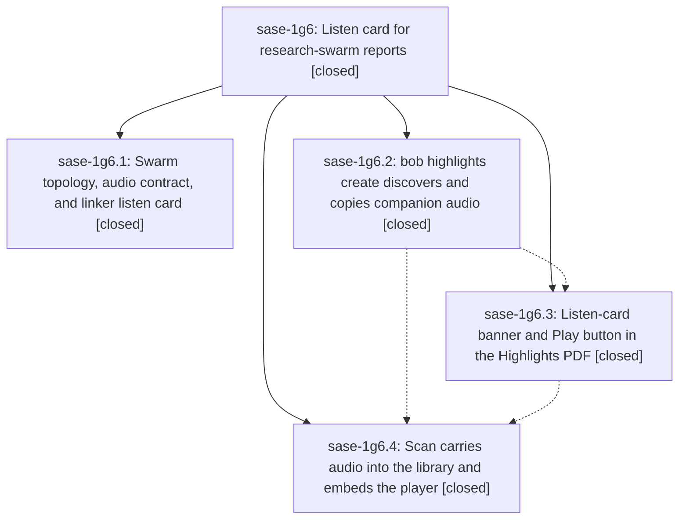

# Bead: sase-1g6 — Listen card for research-swarm reports

[Bead Pages](../README.md) / sase-1g6

**Status:** ✓ closed · **Resolution:** done · **Type:** ▸ plan · **Tier:** epic
**Owner:** `bryanbugyi34@gmail.com` · **Created by:** [bbugyi200.apollo.research.0b.linker.w0](https://github.com/sase-org/sase--agents/blob/main/sessions/bbugyi200.apollo.research.0b.linker.w0.md) · **Assignee:** `sase-1g6.land`
**Created:** 2026-10-04 18:40:06 EDT · **Closed:** 2026-10-04 21:21:08 EDT
**Plan:** [202610/research\_swarm\_listen\_card.md](https://github.com/sase-org/sase--plans/blob/main/202610/research_swarm_listen_card.md)

<!-- sase:links:start -->

## Links

| Relation | Artifact | Why |
| --- | --- | --- |
| implemented-by | [plan:202610/research_swarm_listen_card.md][1] | derived from the plan's `bead_id:` frontmatter field |
| related | [bead:sase-1ga][2] | Proposed by sase-1g6.2 during listen-card landing; pre-existing clippy deny, not listen-card work |
| related | [bead:sase-1gb][3] | Proposed by sase-1g6.4 during listen-card landing; parallel zsh flake, not listen-card work |

_Plus 1 automatic references — see [Referenced By](#referenced-by)._

[1]: https://github.com/sase-org/sase--plans/blob/main/202610/research_swarm_listen_card.md
[2]: https://github.com/sase-org/sase--beads/blob/main/pages/sase-1ga/README.md
[3]: https://github.com/sase-org/sase--beads/blob/main/pages/sase-1gb/README.md

<!-- sase:links:end -->

## Description

When `#research_swarm(..., audio=true)` runs, the canonical `<name>.md` the linker publishes opens with a quiet listen card, its Highlights PDF carries a one-click "▶ Play" button, and its Obsidian reference note embeds a native audio player — with no MP3 in the public research repo, and with a failed TTS render never blocking publication.

## Notes

[2026-10-05T01:03:51Z · sase-1g6.land] Landing triage before the remaining-work tale. Phases 1, 3, and 4 are on origin. Phase 2 is not, so the epic stays open.

Verified:
- sase-1g6.1 is sase-research-artifacts 867222d (HEAD, origin/master): audio implies the linker, audio waits on lead and on image only when image is set, the linker waits on audio, the listen card and audio frontmatter are success-only, and TTS failure completes with ok=false. No later commits in that repo.
- sase-1g6.3 is bob-cli 99293a5: LaTeX listen-card banner and encoded Obsidian Play URI. bound_audio_path only sees a same-stem mp3 already beside the PDF.
- sase-1g6.4 is bob-cli f7c268d (origin/master): scan moves and late-pairs companion audio, writes command-managed audio frontmatter, and embeds the player once.
- sase-1g6.2 has no commit on any bob-cli branch. Create does not discover episode ids or narration-script hashes and does not copy library audio.
- sase-listen commits after ec1196b (e085c63, 0e03944, 9f491ac, epic sase-1g7) do not edit the swarm integration doc and do not change the narration-script render contract. Left in place.
- No non-epic bob-cli commit since the epic started touches highlights.
- sase bead epic-symbols sase-1g6 lists nothing. The epic has no parent.

Follow-ups:
- Clippy deny at tests/cli/capture/pomodoro_name.rs:808 (unconditional || true, blame 7d1c8dd3, pre-existing). Proposed by sase-1g6.2, repeated by sase-1g6.3 and sase-1g6.4. No existing task. Filed sase-1ga (task ci, size small, ready) and linked it to this epic. Not epic work.
- zsh completion::zsh_adapter::real_zsh_first_tab_completes failed once under the full parallel suite with "zpty driver failed" and passed in isolation on the same tree and on origin. Proposed by sase-1g6.4. No existing task. Filed sase-1gb (task flake, size large, ready) and linked it to this epic. Not epic work.
- Declined a separate task for "phase 2 discovery did not land" (proposed by sase-1g6.4). That gap is this epic's unfinished work. Tale sase_plan_listen_card_create_audio.md implements create-time discovery against f7c268d, wires it to the landed Play button, and closes this epic in the same turn.

[2026-10-05T01:21:08Z · sase-1g6.land] Phase 1 is 867222d on sase-research-artifacts HEAD: audio implies the linker, audio waits on lead and image only when image is on, the linker waits on audio, the listen card and audio: frontmatter are written only on success, and TTS failure completes the audio agent with ok=false. Phase 3 is 99293a5: LaTeX listen-card banner and encoded Obsidian Play URI. Phase 4 is f7c268d: scan moves and late-pairs companion audio, writes command-managed audio frontmatter, and embeds the player once. Phase 2 had no commit. This tale added create-time discovery (--audio, frontmatter audio.episode_id, narration-script sha256 against sase-listen library via BOB_HIGHLIGHTS_AUDIO_LIBRARY/highlights.audio_library/XDG_DATA_HOME/HOME), the atomic copy beside the PDF target before stamp_and_install with identical-reuse/force/library-dest guards, and the Play-button binding to the library location. Tests passed: cargo fmt --check and git diff --check clean; 115 highlights_ref lib tests including 8 new audio discovery tests (episode-id validation, frontmatter parsing, episode resolve, traversal rejection, narration candidate, newest-created_at tie-break, library-root precedence, explicit validation); 21 highlights create CLI tests including 8 new (dry-run planned copy, identical reuse, different-bytes refuse with --force override, library-dest refuse, --no-audio skips, --audio/--no-audio conflict exit 2, bad audio paths, fake-pandoc render copies audio before PDF with audio_link to lib location) and 119 highlights CLI tests total. sase-listen e085c63, 0e03944, 9f491ac (sase-1g7) do not change the narration-script render contract, so they were left in place. Follow-ups: filed sase-1ga (clippy || true in pomodoro_name.rs:808, size small, ready) from sase-1g6.2/sase-1g6.3/sase-1g6.4, and sase-1gb (zsh real_zsh_first_tab_completes parallel flake, size large, ready) from sase-1g6.4. Declined a separate task for the missing phase-2 commit because that gap is this epic's work and this tale lands it.

## Phases

| Bead | Title | Status | Size | Created | Agents | Commits |
|---|---|---|---|---|---:|---:|
| [sase-1g6.1](sase-1g6.1.md) | Swarm topology, audio contract, and linker listen card | ✓ closed | medium | 2026-10-04 | 1 | 2 |
| [sase-1g6.2](sase-1g6.2.md) | bob highlights create discovers and copies companion audio | ✓ closed | medium | 2026-10-04 | 1 | 0 |
| [sase-1g6.3](sase-1g6.3.md) | Listen-card banner and Play button in the Highlights PDF | ✓ closed | small | 2026-10-04 | 1 | 0 |
| [sase-1g6.4](sase-1g6.4.md) | Scan carries audio into the library and embeds the player | ✓ closed | medium | 2026-10-04 | 1 | 0 |

## Lineage

## Agents

| Agent | Bead | Commits |
|---|---|---:|
| [bbugyi200.apollo.sase-1g6.1](https://github.com/sase-org/sase--agents/blob/main/agents/bbugyi200.apollo.sase-1g6.1/README.md) | [sase-1g6.1](sase-1g6.1.md) | 2 |
| [bbugyi200.apollo.sase-1g6.2](https://github.com/sase-org/sase--agents/blob/main/sessions/bbugyi200.apollo.sase-1g6.2.md) | [sase-1g6.2](sase-1g6.2.md) | 0 |
| [bbugyi200.apollo.sase-1g6.3](https://github.com/sase-org/sase--agents/blob/main/agents/bbugyi200.apollo.sase-1g6.3/README.md) | [sase-1g6.3](sase-1g6.3.md) | 0 |
| [bbugyi200.apollo.sase-1g6.4](https://github.com/sase-org/sase--agents/blob/main/agents/bbugyi200.apollo.sase-1g6.4/README.md) | [sase-1g6.4](sase-1g6.4.md) | 0 |
| [bbugyi200.apollo.sase-1g6.land](https://github.com/sase-org/sase--agents/blob/main/sessions/bbugyi200.apollo.sase-1g6.land.md) | [sase-1g6](README.md) | 1 |

## Commits

| Repo | Commit | Subject | Bead | Committed |
|---|---|---|---|---|
| sase-listen | [`sase-listen@ec1196b`](https://github.com/sase-org/sase-listen/commit/ec1196b8d2f517dd4430a90d70ad19148c4dd5c1) | docs(sase-integration): document swarm listen card and audio waits | [sase-1g6.1](sase-1g6.1.md) | 2026-10-04 19:17:55 EDT |
| sase-research-artifacts | [`sase-research-artifacts@867222d`](https://github.com/sase-org/sase-research-artifacts/commit/867222d4fb2c9825958a5a08187af0db2d7d452b) | feat(xprompts): wire audio into swarm topology and linker listen card | [sase-1g6.1](sase-1g6.1.md) | 2026-10-04 19:21:34 EDT |
| sase--plans | [`sase--plans@ccfeaf1`](https://github.com/sase-org/sase--plans/commit/ccfeaf15b52094fa350224b7f750f5c2510833b5) | docs(plans): mark listen-card epic plan done | [sase-1g6](README.md) | 2026-10-04 21:35:46 EDT |

<!-- sase:referenced-by:start -->

## Referenced By

| Relation | Artifact | Why | Uses |
| --- | --- | --- | ---: |
| read-by | [agent:sase-1g6.4][1] | Need parent epic scope and phase list | 1 |

[1]: https://github.com/sase-org/sase--agents/blob/main/agents/bbugyi200.apollo.sase-1g6.4/README.md

<!-- sase:referenced-by:end -->
