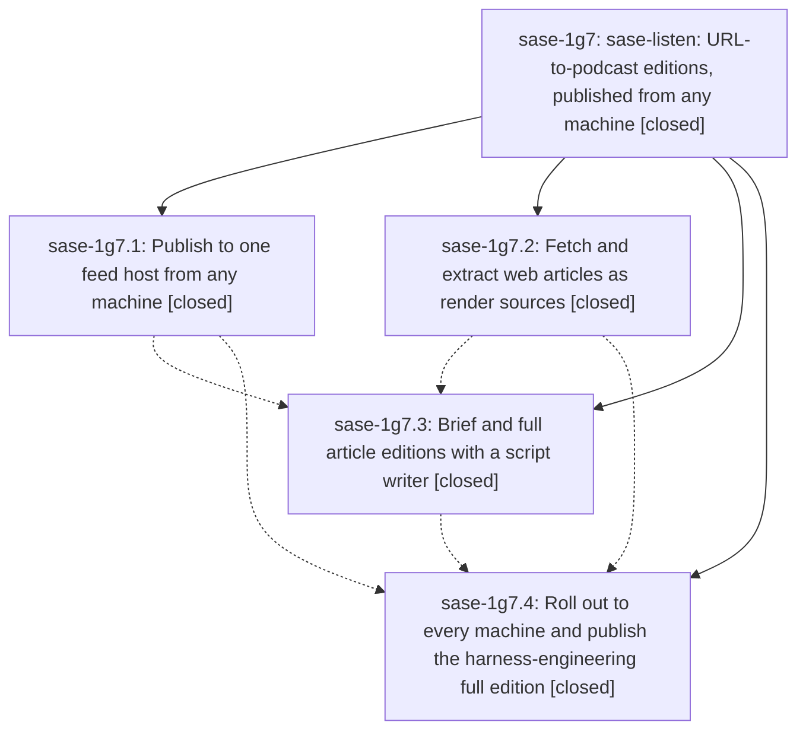

# Bead: sase-1g7 — sase-listen: URL-to-podcast editions, published from any machine

[Bead Pages](../README.md) / sase-1g7

**Status:** ✓ closed · **Resolution:** done · **Type:** ▸ plan · **Tier:** epic
**Owner:** `bryanbugyi34@gmail.com` · **Created by:** [bbugyi200.athena.0wl](https://github.com/sase-org/sase--agents/blob/main/sessions/bbugyi200.athena.0wl.md) · **Assignee:** `sase-1g7.land`
**Created:** 2026-10-04 19:02:08 EDT · **Closed:** 2026-10-04 21:37:02 EDT
**Plan:** [202610/listen\_urls\_any\_machine.md](https://github.com/sase-org/sase--plans/blob/main/202610/listen_urls_any_machine.md)

<!-- sase:links:start -->

## Links

| Relation | Artifact | Why |
| --- | --- | --- |
| implemented-by | [plan:202610/listen_urls_any_machine.md][1] | derived from the plan's `bead_id:` frontmatter field |

_Plus 1 automatic references — see [Referenced By](#referenced-by)._

[1]: https://github.com/sase-org/sase--plans/blob/main/202610/listen_urls_any_machine.md

<!-- sase:links:end -->

## Description

From athena, apollo, or the Mac, `sase-listen render <URL> --edition brief|full` fetches a web article, writes a fidelity-checked narration script, renders it, and auto-publishes the episode to the single AntennaPod feed served from apollo. This is proven by a full edition of OpenAI's harness-engineering post, rendered on athena, appearing in the live served feed.

## Notes

[2026-10-05T01:37:02Z · sase-1g7.land] LAND VERIFIED (2026-10-04): Read the epic scope, complete approved plan, all four children, and every note; verified actual source and landed commits rather than relying on closed statuses. All four named phases are closed done. sase-listen commits e085c63 (sase-1g7.2), 0e03944 (.1), 9f491ac (.3), and 69a52a4 (.4) are on origin/master; chezmoi 9e8d272c is landed.

Feed-host: checked host/host_ssh/env configuration, safe extractfile-based receive validation, host-library import, re-entrant feed locking, SSH fallback and misrouting/old-host errors, token masking, remote feed/publish/unpublish/doctor, retry outbox, and queue-on-failed-auto-publish. Current check includes archive rejection, transport, locking, remote research auto-publish, and pending-flush tests. URL acquisition: checked local browser fetch/challenge/HTML fallback, Trafilatura outline repair, atomic source/index storage and reuse, article metadata, URL-before-ref dispatch, deterministic verbatim, stable direct-script identity, intro/cover/manifest integration. Live stored source has 11 restored headings. Writer: checked Gemini request/error mapping, deterministic metadata, bounded lint repair and cache provenance, edition titles/coverage/source links. Actual successful writer records show gemini-3.1-pro-preview; brief is 520 words/3 chapters and full is 1996 words/8 chapters, both lint --source clean with zero findings. Read full script and spot-checked the zero-manual-code, one-tenth-time, million-lines, five-month claims and third-person attribution against the stored source.

Rollout proof: live served feed contains harness-engineering-leveraging-codex-in-an-agent-first-world-ea4e4f with the correct (Full) title, full coverage sentence, original openai.com link, MP3 HEAD 200 and matching 6445892-byte Content-Length, cover JPEG 200, and chapters JSON 200. All nine earlier episodes remain (10 total), outbox is empty, and athena doctor reports healthy apollo via apollo. Full dry-run has 10 cached chunks, no synthesis needed, no warnings. Completed the required post-commit chezmoi update -a --force on athena and apollo (login-shell PATH needed on apollo); independently confirmed both effective configs set feed.host=apollo, host_ssh=[apollo,apollo-do], and auto_publish=true.

INTEGRATION: reviewed every non-epic commit since creation, including the overlapping ec1196b sase-listen research-audio documentation and 867222d sase-research-artifacts swarm/audio/listen-card wiring (both predate the first URL commit but landed during this epic). Their research source/JSON/artifact flow is preserved, and receive_episode imports remote episodes into the apollo library used by research discovery. No duplicate or conflicting implementation remains and no additional source change is needed. The only later primary sase commit, 25cc3c475d, changes the unrelated core revision pin. Chezmoi's feed-host source is portable to macOS.

FOLLOW-UP TRIAGE via /sase_new_task: sase-1g7.4 note #1 -> new small feature task sase-1gc, now READY, with exact Mac install/config/credentials/doctor/brief-script checklist and related link to sase-1eh (git install until PyPI exists). Independent Mac SSH again timed out; the approved plan explicitly makes that offline rollout best-effort, so it is not unfinished epic work. Note #2 -> DISCOVERED ISSUE on still-open original TTS epic sase-1e3, identifying proposing bead/note and live field-note evidence. Gemini engines/gemini.py is unchanged since ae83bd0 (sase-1e3.5); an independent stub check confirms HTTP 400 maps to PermanentEngineError and is attempted once, and inherited synthesize_one exits 4. Thus bounded unchanged-text split recovery belongs to the originating engine/pipeline epic, not this URL/feed-host epic. No separate duplicate task was created. Searched all task statuses, swept the last week, and inspected active epic scopes; sase-1ej (429 quota/Funnel) and sase-1ek (OpenAI-compatible max_chars) were considered and declined as duplicates because their root causes/remediation differ. No proposal was dropped.

VERIFICATION: fresh sase-listen sase tool run check 15f1e8f5e7c8236910368c048f59d21c succeeded (ruff, format, mypy strict, codespell; 225 tests passed, 2 live tests skipped). No check-full was run. Linked epic plan validates with zero warnings. sase bead epic-symbols sase-1g7 reports no entries in the epic/phase closure set. Closing normally as done, with no force.

[2026-10-05T01:54:48Z · sase-1g7.land] POST-CLOSE VERIFIED: just symvision exited 0 after its Rust extension/LSP setup completed; all public/private classes/functions are used properly and no stale epic whitelist entries remain. Linked plan plan:202610/listen_urls_any_machine.md is status: done and validates with zero warnings. Audited parent-link read confirms this epic has no parent_bead; no ancestor closeout is required.

## Phases

| Bead | Title | Status | Size | Created | Agents | Commits |
|---|---|---|---|---|---:|---:|
| [sase-1g7.1](sase-1g7.1.md) | Publish to one feed host from any machine | ✓ closed | medium | 2026-10-04 | 1 | 1 |
| [sase-1g7.2](sase-1g7.2.md) | Fetch and extract web articles as render sources | ✓ closed | medium | 2026-10-04 | 1 | 1 |
| [sase-1g7.3](sase-1g7.3.md) | Brief and full article editions with a script writer | ✓ closed | medium | 2026-10-04 | 1 | 1 |
| [sase-1g7.4](sase-1g7.4.md) | Roll out to every machine and publish the harness-engineering full edition | ✓ closed | medium | 2026-10-04 | 1 | 2 |

## Lineage

## Agents

| Agent | Bead | Commits |
|---|---|---:|
| [bbugyi200.athena.sase-1g7.1](https://github.com/sase-org/sase--agents/blob/main/agents/bbugyi200.athena.sase-1g7.1/README.md) | [sase-1g7.1](sase-1g7.1.md) | 1 |
| [bbugyi200.athena.sase-1g7.2](https://github.com/sase-org/sase--agents/blob/main/agents/bbugyi200.athena.sase-1g7.2/README.md) | [sase-1g7.2](sase-1g7.2.md) | 1 |
| [bbugyi200.athena.sase-1g7.3](https://github.com/sase-org/sase--agents/blob/main/agents/bbugyi200.athena.sase-1g7.3/README.md) | [sase-1g7.3](sase-1g7.3.md) | 1 |
| [bbugyi200.athena.sase-1g7.4](https://github.com/sase-org/sase--agents/blob/main/sessions/bbugyi200.athena.sase-1g7.4.md) | [sase-1g7.4](sase-1g7.4.md) | 2 |
| [bbugyi200.athena.sase-1g7.land](https://github.com/sase-org/sase--agents/blob/main/agents/bbugyi200.athena.sase-1g7.land/README.md) | [sase-1g7](README.md) | 1 |

## Commits

| Repo | Commit | Subject | Bead | Committed |
|---|---|---|---|---|
| sase-listen | [`sase-listen@e085c63`](https://github.com/sase-org/sase-listen/commit/e085c63bc509d4d2dab076842c461961dce37f52) | feat(web): fetch and render article URLs | [sase-1g7.2](sase-1g7.2.md) | 2026-10-04 19:30:39 EDT |
| sase-listen | [`sase-listen@0e03944`](https://github.com/sase-org/sase-listen/commit/0e0394432210d4d7c7729328c79a4120189b0253) | feat(feed): publish episodes to one SSH feed host from any machine | [sase-1g7.1](sase-1g7.1.md) | 2026-10-04 19:39:21 EDT |
| sase-listen | [`sase-listen@9f491ac`](https://github.com/sase-org/sase-listen/commit/9f491ac5d51cf7fedc8700c3d3adef6f0d45e232) | feat(writer): add brief and full article editions | [sase-1g7.3](sase-1g7.3.md) | 2026-10-04 20:19:04 EDT |
| chezmoi | [`chezmoi@9e8d272`](https://github.com/bbugyi200/dotfiles/commit/9e8d272ca6d195b1290869ec1155a51dcc592ae3) | feat(sase-listen): point feed.host at apollo for multi-machine publish | [sase-1g7.4](sase-1g7.4.md) | 2026-10-04 21:13:45 EDT |
| sase-listen | [`sase-listen@69a52a4`](https://github.com/sase-org/sase-listen/commit/69a52a449a421126197748025fd0e3111fc38233) | fix(feed): report remote via as the SSH destination | [sase-1g7.4](sase-1g7.4.md) | 2026-10-04 21:17:35 EDT |
| sase--plans | [`sase--plans@51df9c4`](https://github.com/sase-org/sase--plans/commit/51df9c4bcd3a6e96dc6f214aed1a27d3548f1dcb) | chore(plan): mark sase-1g7 URL podcast epic done | [sase-1g7](README.md) | 2026-10-04 21:57:51 EDT |

<!-- sase:referenced-by:start -->

## Referenced By

| Relation | Artifact | Why | Uses |
| --- | --- | --- | ---: |
| read-by | [agent:sase-1g7.4--1][1] | Confirm parent epic still open after phase close | 1 |

[1]: https://github.com/sase-org/sase--agents/blob/main/sessions/bbugyi200.athena.sase-1g7.4.md

<!-- sase:referenced-by:end -->
