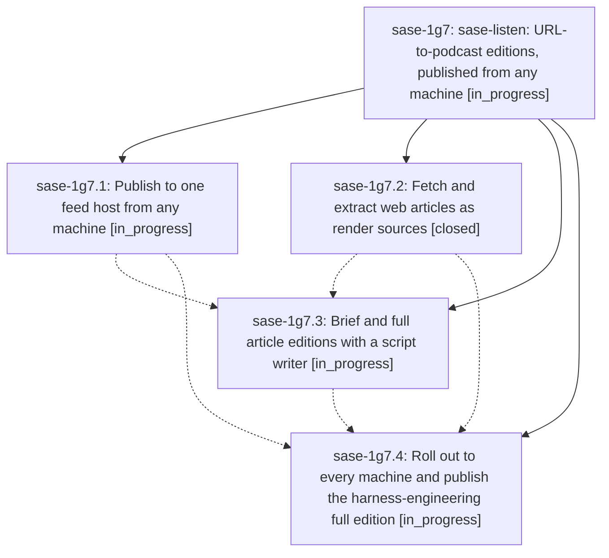

# Bead: sase-1g7 — sase-listen: URL-to-podcast editions, published from any machine

[Bead Pages](../README.md) / sase-1g7

**Status:** ◐ in_progress · **Type:** ▸ plan · **Tier:** epic
**Owner:** `bryanbugyi34@gmail.com` · **Created by:** [bbugyi200.athena.0wl](https://github.com/sase-org/sase--agents/blob/main/sessions/bbugyi200.athena.0wl.md) · **Assignee:** `sase-1g7.land`
**Created:** 2026-10-04 19:02:08 EDT
**Plan:** [202610/listen\_urls\_any\_machine.md](https://github.com/sase-org/sase--plans/blob/main/202610/listen_urls_any_machine.md)

## Description

From athena, apollo, or the Mac, `sase-listen render <URL> --edition brief|full` fetches a web article, writes a fidelity-checked narration script, renders it, and auto-publishes the episode to the single AntennaPod feed served from apollo. This is proven by a full edition of OpenAI's harness-engineering post, rendered on athena, appearing in the live served feed.

## Phases

| Bead | Title | Status | Size | Created | Agents | Commits |
|---|---|---|---|---|---:|---:|
| [sase-1g7.1](sase-1g7.1.md) | Publish to one feed host from any machine | ◐ in_progress | medium | 2026-10-04 | 1 | 0 |
| [sase-1g7.2](sase-1g7.2.md) | Fetch and extract web articles as render sources | ✓ closed | medium | 2026-10-04 | 1 | 1 |
| [sase-1g7.3](sase-1g7.3.md) | Brief and full article editions with a script writer | ◐ in_progress | medium | 2026-10-04 | 1 | 0 |
| [sase-1g7.4](sase-1g7.4.md) | Roll out to every machine and publish the harness-engineering full edition | ◐ in_progress | medium | 2026-10-04 | 1 | 0 |

## Lineage

## Agents

| Agent | Bead | Commits |
|---|---|---:|
| [bbugyi200.athena.sase-1g7.1](https://github.com/sase-org/sase--agents/blob/main/agents/bbugyi200.athena.sase-1g7.1/README.md) | [sase-1g7.1](sase-1g7.1.md) | 0 |
| [bbugyi200.athena.sase-1g7.2](https://github.com/sase-org/sase--agents/blob/main/agents/bbugyi200.athena.sase-1g7.2/README.md) | [sase-1g7.2](sase-1g7.2.md) | 1 |
| [bbugyi200.athena.sase-1g7.3](https://github.com/sase-org/sase--agents/blob/main/agents/bbugyi200.athena.sase-1g7.3/README.md) | [sase-1g7.3](sase-1g7.3.md) | 0 |
| [bbugyi200.athena.sase-1g7.4](https://github.com/sase-org/sase--agents/blob/main/agents/bbugyi200.athena.sase-1g7.4/README.md) | [sase-1g7.4](sase-1g7.4.md) | 0 |
| [bbugyi200.athena.sase-1g7.land](https://github.com/sase-org/sase--agents/blob/main/agents/bbugyi200.athena.sase-1g7.land/README.md) | [sase-1g7](README.md) | 0 |

## Commits

| Repo | Commit | Subject | Bead | Committed |
|---|---|---|---|---|
| sase-listen | [`sase-listen@e085c63`](https://github.com/sase-org/sase-listen/commit/e085c63bc509d4d2dab076842c461961dce37f52) | feat(web): fetch and render article URLs | [sase-1g7.2](sase-1g7.2.md) | 2026-10-04 19:30:39 EDT |
