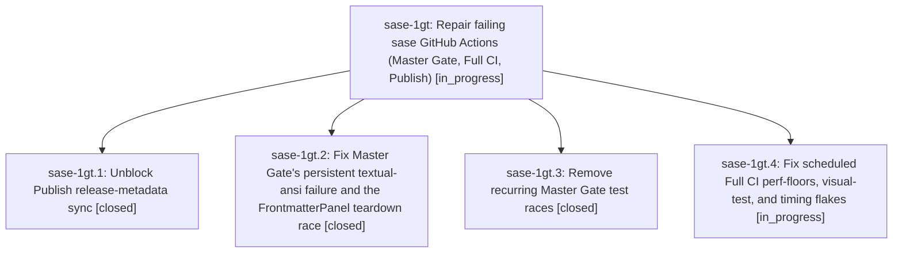

# Bead: sase-1gt — Repair failing sase GitHub Actions (Master Gate, Full CI, Publish)

[Bead Pages](../README.md) / sase-1gt

**Status:** ◐ in_progress · **Type:** ▸ plan · **Tier:** epic
**Owner:** `bryanbugyi34@gmail.com` · **Created by:** [bbugyi200.athena.0ww](https://github.com/sase-org/sase--agents/blob/main/sessions/bbugyi200.athena.0ww.md) · **Assignee:** `sase-1gt.land`
**Created:** 2026-10-05 12:16:20 EDT
**Plan:** [202610/fix\_sase\_ci\_failures.md](https://github.com/sase-org/sase--plans/blob/main/202610/fix_sase_ci_failures.md)

## Description

Master Gate, the scheduled Full CI lanes, and the scheduled Publish workflow stop failing for reasons this repo owns. The persistent failures get root-cause fixes and the recurring flakes get race-free fixes. The only remaining release-PR blocker is the upstream sase-core 0.36.6 publish.

## Phases

| Bead | Title | Status | Size | Created | Agents | Commits |
|---|---|---|---|---|---:|---:|
| [sase-1gt.1](sase-1gt.1.md) | Unblock Publish release-metadata sync | ✓ closed | small | 2026-10-05 | 1 | 1 |
| [sase-1gt.2](sase-1gt.2.md) | Fix Master Gate's persistent textual-ansi failure and the FrontmatterPanel teardown race | ✓ closed | small | 2026-10-05 | 1 | 1 |
| [sase-1gt.3](sase-1gt.3.md) | Remove recurring Master Gate test races | ✓ closed | medium | 2026-10-05 | 1 | 1 |
| [sase-1gt.4](sase-1gt.4.md) | Fix scheduled Full CI perf-floors, visual-test, and timing flakes | ◐ in_progress | small | 2026-10-05 | 1 | 0 |

## Lineage

## Agents

| Agent | Bead | Commits |
|---|---|---:|
| [bbugyi200.athena.sase-1gt.1](https://github.com/sase-org/sase--agents/blob/main/sessions/bbugyi200.athena.sase-1gt.1.md) | [sase-1gt.1](sase-1gt.1.md) | 1 |
| [bbugyi200.athena.sase-1gt.2](https://github.com/sase-org/sase--agents/blob/main/agents/bbugyi200.athena.sase-1gt.2/README.md) | [sase-1gt.2](sase-1gt.2.md) | 1 |
| [bbugyi200.athena.sase-1gt.3](https://github.com/sase-org/sase--agents/blob/main/sessions/bbugyi200.athena.sase-1gt.3.md) | [sase-1gt.3](sase-1gt.3.md) | 1 |
| [bbugyi200.athena.sase-1gt.4](https://github.com/sase-org/sase--agents/blob/main/sessions/bbugyi200.athena.sase-1gt.4.md) | [sase-1gt.4](sase-1gt.4.md) | 0 |
| [bbugyi200.athena.sase-1gt.land](https://github.com/sase-org/sase--agents/blob/main/agents/bbugyi200.athena.sase-1gt.land/README.md) | [sase-1gt](README.md) | 0 |

## Commits

| Repo | Commit | Subject | Bead | Committed |
|---|---|---|---|---|
| sase | [`69b492c`](https://github.com/sase-org/sase/commit/69b492c27848b08c25c10cadb2045825a57a3e52) | fix(pager,ace): handle Textual 8.2 theme removal and childless frontmatter mount | [sase-1gt.2](sase-1gt.2.md) | 2026-10-05 12:48:50 EDT |
| sase | [`b3e571a`](https://github.com/sase-org/sase/commit/b3e571a8ab0cce87432397a5cd6d01ca1cf4cbc4) | fix(release): ignore uv lock revision header in ratchet\_core\_window | [sase-1gt.1](sase-1gt.1.md) | 2026-10-05 13:10:47 EDT |
| sase | [`3569571`](https://github.com/sase-org/sase/commit/3569571a737f2ab31aacc97bdc3c7e1b16b742b4) | fix(gate-flakes): remove five recurring Master Gate test races | [sase-1gt.3](sase-1gt.3.md) | 2026-10-05 13:15:43 EDT |
