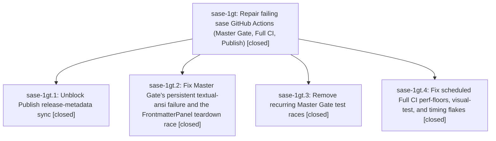

# Bead: sase-1gt — Repair failing sase GitHub Actions (Master Gate, Full CI, Publish)

[Bead Pages](../README.md) / sase-1gt

**Status:** ✓ closed · **Resolution:** done · **Type:** ▸ plan · **Tier:** epic
**Owner:** `bryanbugyi34@gmail.com` · **Created by:** [bbugyi200.athena.0ww](https://github.com/sase-org/sase--agents/blob/main/sessions/bbugyi200.athena.0ww.md) · **Assignee:** `sase-1gt.land`
**Created:** 2026-10-05 12:16:20 EDT · **Closed:** 2026-10-05 14:10:48 EDT
**Plan:** [202610/fix\_sase\_ci\_failures.md](https://github.com/sase-org/sase--plans/blob/main/202610/fix_sase_ci_failures.md)

## Description

Master Gate, the scheduled Full CI lanes, and the scheduled Publish workflow stop failing for reasons this repo owns. The persistent failures get root-cause fixes and the recurring flakes get race-free fixes. The only remaining release-PR blocker is the upstream sase-core 0.36.6 publish.

## Notes

[2026-10-05T17:45:56Z · sase-1gt.land] LANDING TRIAGE: Reviewed every epic/phase note and all 7 PROPOSED FOLLOW-UP entries. (1) sase-1gt.1 #1 and .2 #2 (peak_tree_rss_kib == 0) duplicate task sase-1f0; +1 recorded with both proposing beads. (2) sase-1gt.2 #1, .3 #1, and .4 #2 (macro terminology) reproduce at master 1c9a2cd5df: all 11 findings are old-to-new historical labels added by b6114d4f95 to the infographic prompt record. Routed as DISCOVERED ISSUE to active causal rename epic sase-1eq.12 (phase .12.3), no new task. (3) sase-1gt.3 #2 and .4 #1 (5 prompt-tab focus failures/errors) duplicate task sase-1fy; +1 recorded, including the phase .4 corroboration already on that task. This failure is independently reproduced before the relevant CI changes and is distinct from the fixed childless-mount exception. Additional lander discovery: default bead reads fail artifact-link validation; independently corroborated existing task sase-1gs (+1), no duplicate. No proposals declined or new tasks required. Rare link-follow/vim-containment flakes, uv pinning, and a new lock CI gate are explicitly excluded by the approved plan; no new reproductions or concrete need were found to warrant speculative tasks. All four epic commits inspected and present. First epic commit 69b492c278 through current HEAD 1c9a2cd5df contains only epic commits; freshly fetched origin/master has no additional commits. Focused guarded ToolRun 06c426c807090c7b2db8f4571bfbd996 passed 109 tests, uv lock --check passed, and the output-variables golden was visually inspected. Final guarded check e4fb4dfc74f7403d1489beca7de560d4 is pending; do not close until its result is reviewed. No parent bead; no epic-symbol entries.

[2026-10-05T18:10:48Z · sase-1gt.land] Verified every note on sase-1gt and all four closed phases against plan:202610/fix_sase_ci_failures.md and commits 69b492c278 (.2), b3e571a8ab (.1), 3569571a73 (.3), and 1c9a2cd5df (.4). The revision-only lock relaxation preserves strict dependency metadata, the refreshed lock passes uv lock --check, terminal-native themes and childless FrontmatterPanel mounts are covered, all five race fixes are wired, and Full CI smoke/clock/query/golden changes match the plan. Inspected the paged output-variables PNG and all four visible variables. Focused guarded test run 06c426c807090c7b2db8f4571bfbd996: 109 passed. Final just check via ToolRun e4fb4dfc74f7403d1489beca7de560d4: every lint/validation gate passed; full-suite fallback 52705 passed, 16 skipped, 1 KNOWN macro-doc terminology failure; verdict no_new_failures, exit 1 preserved. This sole failure predates the epic and is caused by rename phase sase-1eq.12.3. Integration: freshly fetched master added 4fc315e9e2 (Stash-to-Trash no-confirm); inspected its entire source diff, fast-forwarded to it, found no conflicting or duplicate epic logic, and verified 35 Stash/lifecycle/drain tests in guarded run 6a8ee53afb9627f28efa9ded43b69f94. All 7 PROPOSED FOLLOW-UP outcomes: .1 #1/.2 #2 RSS sampling -> existing sase-1f0, +1; .2 #1/.3 #1/.4 #2 macro-doc guard -> DISCOVERED ISSUE on active causal epic sase-1eq.12, no new task; .3 #2/.4 #1 focus isolation -> existing sase-1fy, +1 (phase .4 evidence also already recorded). Additional default bead-read artifact-link validation failure -> existing sase-1gs, +1. No proposals declined; duplicate/causal routes avoid new tasks. Explicit plan non-goals and un-reproduced rare flakes do not warrant speculative tasks. No epic-caused work remains, no unclosed descendants, no --epic-symbol entries, and no parent bead. Post-close Symvision and plan status update follow.

[2026-10-05T18:12:25Z · sase-1gt.land] POST-CLOSE: just symvision passed on integrated master 4fc315e9e2 with all public/private symbols used properly. Epic plan plan:202610/fix_sase_ci_failures.md now has status: done; only that frontmatter field changed. Post-close audited read confirms resolution done, parent_id null, and no ancestors. No parent closeout is required.

## Phases

| Bead | Title | Status | Size | Created | Agents | Commits |
|---|---|---|---|---|---:|---:|
| [sase-1gt.1](sase-1gt.1.md) | Unblock Publish release-metadata sync | ✓ closed | small | 2026-10-05 | 1 | 1 |
| [sase-1gt.2](sase-1gt.2.md) | Fix Master Gate's persistent textual-ansi failure and the FrontmatterPanel teardown race | ✓ closed | small | 2026-10-05 | 1 | 1 |
| [sase-1gt.3](sase-1gt.3.md) | Remove recurring Master Gate test races | ✓ closed | medium | 2026-10-05 | 1 | 1 |
| [sase-1gt.4](sase-1gt.4.md) | Fix scheduled Full CI perf-floors, visual-test, and timing flakes | ✓ closed | small | 2026-10-05 | 1 | 1 |

## Lineage

## Agents

| Agent | Bead | Commits |
|---|---|---:|
| [bbugyi200.athena.sase-1gt.1](https://github.com/sase-org/sase--agents/blob/main/sessions/bbugyi200.athena.sase-1gt.1.md) | [sase-1gt.1](sase-1gt.1.md) | 1 |
| [bbugyi200.athena.sase-1gt.2](https://github.com/sase-org/sase--agents/blob/main/agents/bbugyi200.athena.sase-1gt.2/README.md) | [sase-1gt.2](sase-1gt.2.md) | 1 |
| [bbugyi200.athena.sase-1gt.3](https://github.com/sase-org/sase--agents/blob/main/sessions/bbugyi200.athena.sase-1gt.3.md) | [sase-1gt.3](sase-1gt.3.md) | 1 |
| [bbugyi200.athena.sase-1gt.4](https://github.com/sase-org/sase--agents/blob/main/sessions/bbugyi200.athena.sase-1gt.4.md) | [sase-1gt.4](sase-1gt.4.md) | 1 |
| [bbugyi200.athena.sase-1gt.land](https://github.com/sase-org/sase--agents/blob/main/agents/bbugyi200.athena.sase-1gt.land/README.md) | [sase-1gt](README.md) | 1 |

## Commits

| Repo | Commit | Subject | Bead | Committed |
|---|---|---|---|---|
| sase | [`69b492c`](https://github.com/sase-org/sase/commit/69b492c27848b08c25c10cadb2045825a57a3e52) | fix(pager,ace): handle Textual 8.2 theme removal and childless frontmatter mount | [sase-1gt.2](sase-1gt.2.md) | 2026-10-05 12:48:50 EDT |
| sase | [`b3e571a`](https://github.com/sase-org/sase/commit/b3e571a8ab0cce87432397a5cd6d01ca1cf4cbc4) | fix(release): ignore uv lock revision header in ratchet\_core\_window | [sase-1gt.1](sase-1gt.1.md) | 2026-10-05 13:10:47 EDT |
| sase | [`3569571`](https://github.com/sase-org/sase/commit/3569571a737f2ab31aacc97bdc3c7e1b16b742b4) | fix(gate-flakes): remove five recurring Master Gate test races | [sase-1gt.3](sase-1gt.3.md) | 2026-10-05 13:15:43 EDT |
| sase | [`1c9a2cd`](https://github.com/sase-org/sase/commit/1c9a2cd5df1f90c5d8bf2f8e1ca81d858b2092e3) | fix(ci): stop full-ci perf-floor, visual, and timing flakes | [sase-1gt.4](sase-1gt.4.md) | 2026-10-05 13:29:11 EDT |
| sase--plans | [`sase--plans@1fcba7b`](https://github.com/sase-org/sase--plans/commit/1fcba7bde2735e7cbb829f301cb9217e0cc26b7c) | chore(plans): mark sase-1gt CI repair epic done | [sase-1gt](README.md) | 2026-10-05 14:13:47 EDT |
