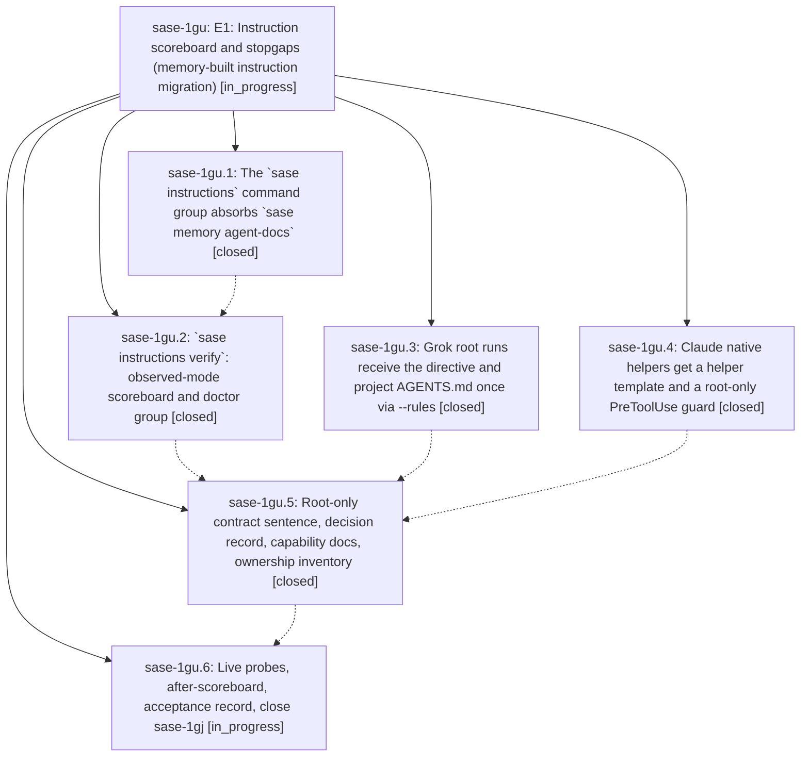

# Bead: sase-1gu — E1: Instruction scoreboard and stopgaps (memory-built instruction migration)

[Bead Pages](../README.md) / sase-1gu

**Status:** ◐ in_progress · **Type:** ▸ plan · **Tier:** epic
**Owner:** `bryanbugyi34@gmail.com` · **Created by:** [bbugyi200.athena.0x2](https://github.com/sase-org/sase--agents/blob/main/sessions/bbugyi200.athena.0x2.md) · **Assignee:** `sase-1gu.land`
**Created:** 2026-10-05 15:52:18 EDT
**Plan:** [202610/e1\_instruction\_scoreboard\_and\_stopgaps.md](https://github.com/sase-org/sase--plans/blob/main/202610/e1_instruction_scoreboard_and_stopgaps.md)

<!-- sase:links:start -->

## Links

| Relation | Artifact | Why |
| --- | --- | --- |
| implemented-by | [plan:202610/e1_instruction_scoreboard_and_stopgaps.md][1] | derived from the plan's `bead_id:` frontmatter field |

_Plus 1 automatic references — see [Referenced By](#referenced-by)._

[1]: https://github.com/sase-org/sase--plans/blob/main/202610/e1_instruction_scoreboard_and_stopgaps.md

<!-- sase:links:end -->

## Description

One read-only command, `sase instructions verify`, shows what each provider's SASE runs and native helpers actually loaded, read from the providers' own session records. It reproduces today's delivery bugs: Claude and Codex load the contract twice, Muse gets no home layer, and Grok gets nothing. The two measured harms stop. Grok root runs get the SASE single-turn directive and the project `AGENTS.md` exactly once through `--rules`. Claude native helpers get a packaged helper template, and a per-run PreToolUse guard denies their root-only operations (`sase final …`, turn-ending skills). Both stopgaps have sunset kill switches. Baseline and after scoreboard JSON plus an acceptance record are attached to this epic, and bead `sase-1gj` is closed as superseded.

## Notes

[2026-10-05T21:08:00Z · sase-1gu.2] E1 scoreboard live baseline: claude 2x, codex 1x (observed; see note), muse 1x no-home, grok 0

🔒 instructions\_baseline.json

## Attachments

- 🔒 instructions\_baseline.json · application/json · 1.47852 KiB (private attachment)

## Phases

| Bead | Title | Status | Size | Created | Agents | Commits |
|---|---|---|---|---|---:|---:|
| [sase-1gu.1](sase-1gu.1.md) | The \`sase instructions\` command group absorbs \`sase memory agent-docs\` | ✓ closed | small | 2026-10-05 | 1 | 1 |
| [sase-1gu.2](sase-1gu.2.md) | \`sase instructions verify\`: observed-mode scoreboard and doctor group | ✓ closed | medium | 2026-10-05 | 1 | 1 |
| [sase-1gu.3](sase-1gu.3.md) | Grok root runs receive the directive and project AGENTS.md once via --rules | ✓ closed | small | 2026-10-05 | 1 | 1 |
| [sase-1gu.4](sase-1gu.4.md) | Claude native helpers get a helper template and a root-only PreToolUse guard | ✓ closed | medium | 2026-10-05 | 1 | 1 |
| [sase-1gu.5](sase-1gu.5.md) | Root-only contract sentence, decision record, capability docs, ownership inventory | ✓ closed | medium | 2026-10-05 | 1 | 1 |
| [sase-1gu.6](sase-1gu.6.md) | Live probes, after-scoreboard, acceptance record, close sase-1gj | ◐ in_progress | small | 2026-10-05 | 1 | 0 |

## Lineage

## Agents

| Agent | Bead | Commits |
|---|---|---:|
| [bbugyi200.athena.sase-1gu.1](https://github.com/sase-org/sase--agents/blob/main/agents/bbugyi200.athena.sase-1gu.1/README.md) | [sase-1gu.1](sase-1gu.1.md) | 1 |
| [bbugyi200.athena.sase-1gu.2](https://github.com/sase-org/sase--agents/blob/main/agents/bbugyi200.athena.sase-1gu.2/README.md) | [sase-1gu.2](sase-1gu.2.md) | 1 |
| [bbugyi200.athena.sase-1gu.3](https://github.com/sase-org/sase--agents/blob/main/agents/bbugyi200.athena.sase-1gu.3/README.md) | [sase-1gu.3](sase-1gu.3.md) | 1 |
| [bbugyi200.athena.sase-1gu.4](https://github.com/sase-org/sase--agents/blob/main/agents/bbugyi200.athena.sase-1gu.4/README.md) | [sase-1gu.4](sase-1gu.4.md) | 1 |
| [bbugyi200.athena.sase-1gu.5](https://github.com/sase-org/sase--agents/blob/main/agents/bbugyi200.athena.sase-1gu.5/README.md) | [sase-1gu.5](sase-1gu.5.md) | 1 |
| [bbugyi200.athena.sase-1gu.6](https://github.com/sase-org/sase--agents/blob/main/agents/bbugyi200.athena.sase-1gu.6/README.md) | [sase-1gu.6](sase-1gu.6.md) | 0 |
| [bbugyi200.athena.sase-1gu.land](https://github.com/sase-org/sase--agents/blob/main/agents/bbugyi200.athena.sase-1gu.land/README.md) | [sase-1gu](README.md) | 0 |

## Commits

| Repo | Commit | Subject | Bead | Committed |
|---|---|---|---|---|
| sase | [`724f9ea`](https://github.com/sase-org/sase/commit/724f9ea9c204296569c103f4ca6ceaa118d5e509) | feat(llm-provider): add Grok provider core with docs and registry | [sase-1gu.3](sase-1gu.3.md) | 2026-10-05 16:04:16 EDT |
| sase | [`8071b49`](https://github.com/sase-org/sase/commit/8071b49282a7642d0eab85a97fe8f65bbf179a92) | feat(cli)!: add sase instructions group absorbing memory agent-docs | [sase-1gu.1](sase-1gu.1.md) | 2026-10-05 16:37:13 EDT |
| sase | [`421c3ba`](https://github.com/sase-org/sase/commit/421c3ba045b9f7376c4f5bc05eb6c01d4acfdaf7) | feat(claude): add helper guard and channel with sunset flag | [sase-1gu.4](sase-1gu.4.md) | 2026-10-05 17:13:38 EDT |
| sase | [`08c8a56`](https://github.com/sase-org/sase/commit/08c8a56b365119cc9ba962d9ebd6cf4be5113e12) | feat(instructions): add observed-mode instruction delivery verifier | [sase-1gu.2](sase-1gu.2.md) | 2026-10-05 17:18:38 EDT |
| sase | [`336d754`](https://github.com/sase-org/sase/commit/336d754b4c48534acbeb2824541293481ac50a7c) | feat(instructions): root-only final declaration with helper-return contract | [sase-1gu.5](sase-1gu.5.md) | 2026-10-06 08:02:38 EDT |

<!-- sase:referenced-by:start -->

## Referenced By

| Relation | Artifact | Why | Uses |
| --- | --- | --- | ---: |
| read-by | [agent:sase-1gu.2][1] | epic context | 1 |

[1]: https://github.com/sase-org/sase--agents/blob/main/agents/bbugyi200.athena.sase-1gu.2/README.md

<!-- sase:referenced-by:end -->
