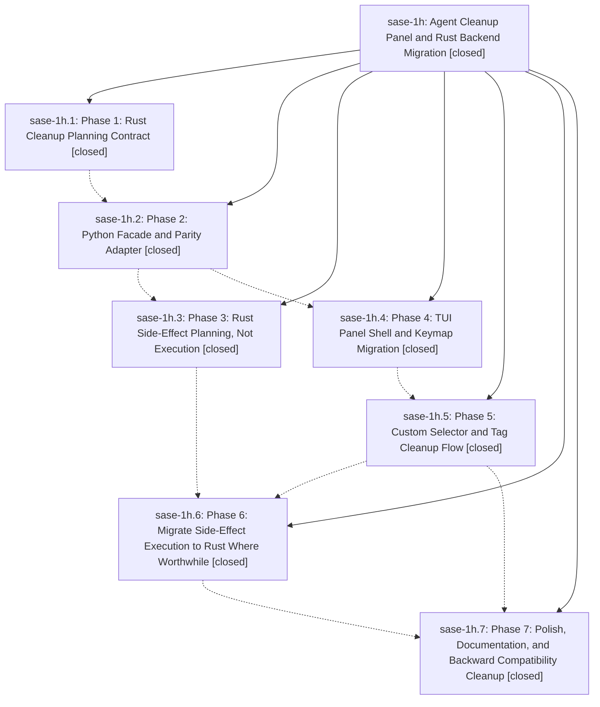

# Bead: sase-1h — Agent Cleanup Panel and Rust Backend Migration

[Bead Pages](../README.md) / sase-1h

**Status:** ✓ closed · **Resolution:** (unrecorded) · **Type:** plan · **Tier:** epic
**Owner:** `bryanbugyi34@gmail.com`
**Created:** 2026-04-30 05:17:51 UTC · **Closed:** 2026-04-30 06:48:47 UTC
**Plan:** [202604/agent\_cleanup\_panel.md](https://github.com/sase-org/sase--plans/blob/main/202604/agent_cleanup_panel.md)

## Phases

| Bead | Title | Status | Size | Agents | Commits |
|---|---|---|---|---:|---:|
| [sase-1h.1](sase-1h.1.md) | Phase 1: Rust Cleanup Planning Contract | ✓ closed | small | 0 | 0 |
| [sase-1h.2](sase-1h.2.md) | Phase 2: Python Facade and Parity Adapter | ✓ closed | small | 0 | 1 |
| [sase-1h.3](sase-1h.3.md) | Phase 3: Rust Side-Effect Planning, Not Execution | ✓ closed | small | 0 | 1 |
| [sase-1h.4](sase-1h.4.md) | Phase 4: TUI Panel Shell and Keymap Migration | ✓ closed | small | 0 | 1 |
| [sase-1h.5](sase-1h.5.md) | Phase 5: Custom Selector and Tag Cleanup Flow | ✓ closed | small | 0 | 1 |
| [sase-1h.6](sase-1h.6.md) | Phase 6: Migrate Side-Effect Execution to Rust Where Worthwhile | ✓ closed | small | 0 | 1 |
| [sase-1h.7](sase-1h.7.md) | Phase 7: Polish, Documentation, and Backward Compatibility Cleanup | ✓ closed | small | 0 | 1 |

## Lineage

## Commits

| Commit | Subject | Bead | Committed (UTC) |
|---|---|---|---|
| [`193e80a`](https://github.com/sase-org/sase/commit/193e80a088c6dd0a1219e9e4458d4736a22ced22) | feat: add agent cleanup planning facade (sase-1h.2) | [sase-1h.2](sase-1h.2.md) | 2026-04-30 05:49:16 |
| [`425d936`](https://github.com/sase-org/sase/commit/425d9362ea6ce7940769b8196d93e494a1026c51) | feat: add agent cleanup panel shell (sase-1h.4) | [sase-1h.4](sase-1h.4.md) | 2026-04-30 06:04:15 |
| [`38df36f`](https://github.com/sase-org/sase/commit/38df36f5114bf7972a0da206f3db3420c97012d0) | feat: consume agent cleanup side-effect intents (sase-1h.3) | [sase-1h.3](sase-1h.3.md) | 2026-04-30 06:10:18 |
| [`a7c3d2a`](https://github.com/sase-org/sase/commit/a7c3d2ace0026e95c7ace9e1249d27d836bbe47d) | feat: add agent cleanup tag and custom selectors (sase-1h.5) | [sase-1h.5](sase-1h.5.md) | 2026-04-30 06:20:31 |
| [`67ffc58`](https://github.com/sase-org/sase/commit/67ffc58c37310e884dd56fb199a3566b95ddab67) | feat: delegate cleanup execution helpers to Rust (sase-1h.6) | [sase-1h.6](sase-1h.6.md) | 2026-04-30 06:35:04 |
| [`60db2bf`](https://github.com/sase-org/sase/commit/60db2bf4a2303e792107a59e2d2d814df56a7ded) | chore: finish agent cleanup panel polish (sase-1h.7) | [sase-1h.7](sase-1h.7.md) | 2026-04-30 06:43:44 |
