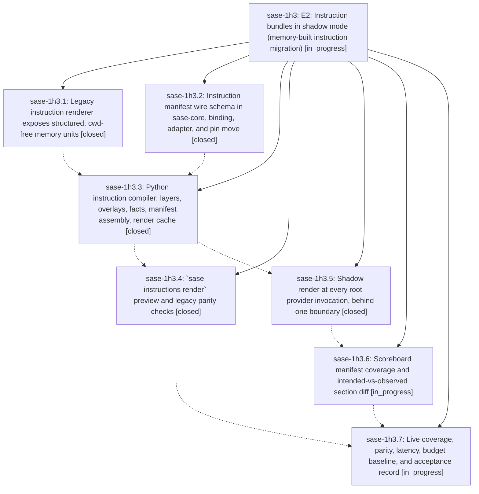

# Bead: sase-1h3 — E2: Instruction bundles in shadow mode (memory-built instruction migration)

[Bead Pages](../README.md) / sase-1h3

**Status:** ◐ in_progress · **Type:** ▸ plan · **Tier:** epic
**Owner:** `bryanbugyi34@gmail.com` · **Created by:** [bbugyi200.athena.0xc](https://github.com/sase-org/sase--agents/blob/main/sessions/bbugyi200.athena.0xc.md) · **Assignee:** `sase-1h3.land`
**Created:** 2026-10-06 12:43:24 EDT
**Plan:** [202610/e2\_instruction\_bundles\_shadow\_mode.md](https://github.com/sase-org/sase--plans/blob/main/202610/e2_instruction_bundles_shadow_mode.md)

<!-- sase:links:start -->

## Links

| Relation | Artifact | Why |
| --- | --- | --- |
| implemented-by | [plan:202610/e2_instruction_bundles_shadow_mode.md][1] | derived from the plan's `bead_id:` frontmatter field |

[1]: https://github.com/sase-org/sase--plans/blob/main/202610/e2_instruction_bundles_shadow_mode.md

<!-- sase:links:end -->

## Description

Every root provider invocation renders the memory-built instruction bundle it would receive and records it with a sase-core-validated instruction manifest, without delivering it; a preview command, legacy parity checks, and scoreboard coverage prove the bundle matches today's files with the contract exactly once, so E3 can switch delivery on a proven renderer.

## Phases

| Bead | Title | Status | Size | Created | Agents | Commits |
|---|---|---|---|---|---:|---:|
| [sase-1h3.1](sase-1h3.1.md) | Legacy instruction renderer exposes structured, cwd-free memory units | ✓ closed | medium | 2026-10-06 | 1 | 1 |
| [sase-1h3.2](sase-1h3.2.md) | Instruction manifest wire schema in sase-core, binding, adapter, and pin move | ✓ closed | medium | 2026-10-06 | 1 | 2 |
| [sase-1h3.3](sase-1h3.3.md) | Python instruction compiler: layers, overlays, facts, manifest assembly, render cache | ✓ closed | medium | 2026-10-06 | 1 | 1 |
| [sase-1h3.4](sase-1h3.4.md) | \`sase instructions render\` preview and legacy parity checks | ✓ closed | medium | 2026-10-06 | 1 | 1 |
| [sase-1h3.5](sase-1h3.5.md) | Shadow render at every root provider invocation, behind one boundary | ✓ closed | medium | 2026-10-06 | 1 | 1 |
| [sase-1h3.6](sase-1h3.6.md) | Scoreboard manifest coverage and intended-vs-observed section diff | ◐ in_progress | medium | 2026-10-06 | 1 | 0 |
| [sase-1h3.7](sase-1h3.7.md) | Live coverage, parity, latency, budget baseline, and acceptance record | ◐ in_progress | small | 2026-10-06 | 1 | 0 |

## Lineage

## Agents

| Agent | Bead | Commits |
|---|---|---:|
| [bbugyi200.athena.sase-1h3.1](https://github.com/sase-org/sase--agents/blob/main/sessions/bbugyi200.athena.sase-1h3.1.md) | [sase-1h3.1](sase-1h3.1.md) | 1 |
| [bbugyi200.athena.sase-1h3.2](https://github.com/sase-org/sase--agents/blob/main/sessions/bbugyi200.athena.sase-1h3.2.md) | [sase-1h3.2](sase-1h3.2.md) | 2 |
| [bbugyi200.athena.sase-1h3.3](https://github.com/sase-org/sase--agents/blob/main/sessions/bbugyi200.athena.sase-1h3.3.md) | [sase-1h3.3](sase-1h3.3.md) | 1 |
| [bbugyi200.athena.sase-1h3.4](https://github.com/sase-org/sase--agents/blob/main/agents/bbugyi200.athena.sase-1h3.4/README.md) | [sase-1h3.4](sase-1h3.4.md) | 1 |
| [bbugyi200.athena.sase-1h3.5](https://github.com/sase-org/sase--agents/blob/main/sessions/bbugyi200.athena.sase-1h3.5.md) | [sase-1h3.5](sase-1h3.5.md) | 1 |
| [bbugyi200.athena.sase-1h3.6](https://github.com/sase-org/sase--agents/blob/main/agents/bbugyi200.athena.sase-1h3.6/README.md) | [sase-1h3.6](sase-1h3.6.md) | 0 |
| [bbugyi200.athena.sase-1h3.7](https://github.com/sase-org/sase--agents/blob/main/agents/bbugyi200.athena.sase-1h3.7/README.md) | [sase-1h3.7](sase-1h3.7.md) | 0 |
| [bbugyi200.athena.sase-1h3.land](https://github.com/sase-org/sase--agents/blob/main/agents/bbugyi200.athena.sase-1h3.land/README.md) | [sase-1h3](README.md) | 0 |

## Commits

| Repo | Commit | Subject | Bead | Committed |
|---|---|---|---|---|
| sase | [`ed2a8f7`](https://github.com/sase-org/sase/commit/ed2a8f78ad273cf6dccb40b5c041e77e2f70976a) | feat(instructions): expose structured cwd-free memory units for legacy renderer | [sase-1h3.1](sase-1h3.1.md) | 2026-10-06 13:41:54 EDT |
| sase-core | [`sase-core@fa39036`](https://github.com/sase-org/sase-core/commit/fa390362a556fe156701ee6bdf505411d4f0f7c5) | feat(instructions): instruction manifest v1 wire schema, binding, and golden fixture (sase-1h3.2) | [sase-1h3.2](sase-1h3.2.md) | 2026-10-06 14:15:22 EDT |
| sase | [`ec6ffa3`](https://github.com/sase-org/sase/commit/ec6ffa33a8019ccc4c7121199fb707774796682b) | feat(instructions): manifest-wire sase adapter, parity fixture, and docs (sase-1h3.2) | [sase-1h3.2](sase-1h3.2.md) | 2026-10-06 14:19:33 EDT |
| sase | [`22ea0cf`](https://github.com/sase-org/sase/commit/22ea0cf4db9b383bb2d907f31f0884cc0de3a6e9) | feat(instructions): add instruction bundle compiler with cache and directives | [sase-1h3.3](sase-1h3.3.md) | 2026-10-06 15:35:31 EDT |
| sase | [`620e531`](https://github.com/sase-org/sase/commit/620e5310d48952dc5994d0eca91d750fd9789785) | feat(instructions): shadow render bundles at provider invoke boundary | [sase-1h3.5](sase-1h3.5.md) | 2026-10-06 16:31:23 EDT |
| sase | [`8e4543b`](https://github.com/sase-org/sase/commit/8e4543bd43a34c429782df8ca441f2438335ce11) | feat(instructions): add render CLI with parity preview and section filtering | [sase-1h3.4](sase-1h3.4.md) | 2026-10-06 17:09:44 EDT |
