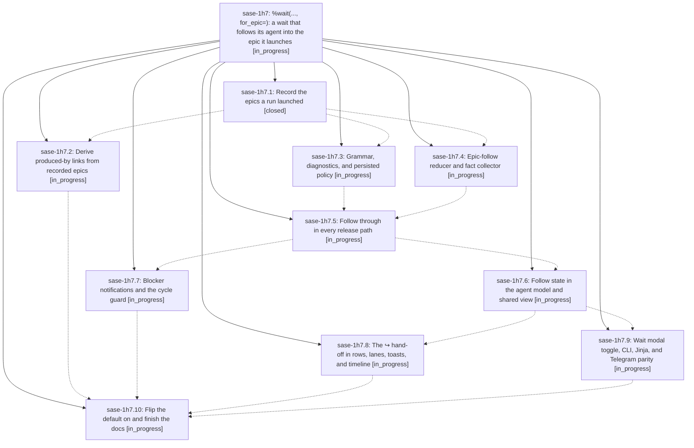

# Bead: sase-1h7 — %wait(..., for\_epic=): a wait that follows its agent into the epic it launches

[Bead Pages](../README.md) / sase-1h7

**Status:** ◐ in_progress · **Type:** ▸ plan · **Tier:** epic
**Owner:** `bryanbugyi34@gmail.com` · **Created by:** [bbugyi200.athena.research.3v.linker.w0](https://github.com/sase-org/sase--agents/blob/main/sessions/bbugyi200.athena.research.3v.linker.w0.md) · **Assignee:** `sase-1h7.land`
**Created:** 2026-10-06 18:17:32 EDT
**Plan:** [202610/wait\_for\_epic.md](https://github.com/sase-org/sase--plans/blob/main/202610/wait_for_epic.md)

<!-- sase:links:start -->

## Links

| Relation | Artifact | Why |
| --- | --- | --- |
| implemented-by | [plan:202610/wait_for_epic.md][1] | derived from the plan's `bead_id:` frontmatter field |

[1]: https://github.com/sase-org/sase--plans/blob/main/202610/wait_for_epic.md

<!-- sase:links:end -->

## Description

`%wait:planner` waits for the planner and then for every epic bead the planner (or any member of its session, clan, workflow, or bound tribe) launches, so users can submit follow-up prompts before the epic's ID exists. A per-occurrence `for_epic=true|false` keyword controls the behavior. It defaults to true for user-authored agent targets, and using it without an agent target is a hard error in the launcher and the editor. The hand-off is recorded reliably, never deadlocks the epic machinery, and is clearly visible in the TUI as a teal `↪` hand-off.

## Phases

| Bead | Title | Status | Size | Created | Agents | Commits |
|---|---|---|---|---|---:|---:|
| [sase-1h7.1](sase-1h7.1.md) | Record the epics a run launched | ✓ closed | medium | 2026-10-06 | 1 | 1 |
| [sase-1h7.10](sase-1h7.10.md) | Flip the default on and finish the docs | ◐ in_progress | medium | 2026-10-06 | 1 | 0 |
| [sase-1h7.2](sase-1h7.2.md) | Derive produced-by links from recorded epics | ◐ in_progress | small | 2026-10-06 | 1 | 0 |
| [sase-1h7.3](sase-1h7.3.md) | Grammar, diagnostics, and persisted policy | ◐ in_progress | medium | 2026-10-06 | 1 | 0 |
| [sase-1h7.4](sase-1h7.4.md) | Epic-follow reducer and fact collector | ◐ in_progress | medium | 2026-10-06 | 1 | 0 |
| [sase-1h7.5](sase-1h7.5.md) | Follow through in every release path | ◐ in_progress | large | 2026-10-06 | 1 | 0 |
| [sase-1h7.6](sase-1h7.6.md) | Follow state in the agent model and shared view | ◐ in_progress | medium | 2026-10-06 | 1 | 0 |
| [sase-1h7.7](sase-1h7.7.md) | Blocker notifications and the cycle guard | ◐ in_progress | medium | 2026-10-06 | 1 | 0 |
| [sase-1h7.8](sase-1h7.8.md) | The ↪ hand-off in rows, lanes, toasts, and timeline | ◐ in_progress | medium | 2026-10-06 | 1 | 0 |
| [sase-1h7.9](sase-1h7.9.md) | Wait modal toggle, CLI, Jinja, and Telegram parity | ◐ in_progress | medium | 2026-10-06 | 1 | 0 |

## Lineage

## Agents

| Agent | Bead | Commits |
|---|---|---:|
| [bbugyi200.athena.sase-1h7.1](https://github.com/sase-org/sase--agents/blob/main/agents/bbugyi200.athena.sase-1h7.1/README.md) | [sase-1h7.1](sase-1h7.1.md) | 1 |
| [bbugyi200.athena.sase-1h7.10](https://github.com/sase-org/sase--agents/blob/main/agents/bbugyi200.athena.sase-1h7.10/README.md) | [sase-1h7.10](sase-1h7.10.md) | 0 |
| [bbugyi200.athena.sase-1h7.2](https://github.com/sase-org/sase--agents/blob/main/agents/bbugyi200.athena.sase-1h7.2/README.md) | [sase-1h7.2](sase-1h7.2.md) | 0 |
| [bbugyi200.athena.sase-1h7.3](https://github.com/sase-org/sase--agents/blob/main/agents/bbugyi200.athena.sase-1h7.3/README.md) | [sase-1h7.3](sase-1h7.3.md) | 0 |
| [bbugyi200.athena.sase-1h7.4](https://github.com/sase-org/sase--agents/blob/main/agents/bbugyi200.athena.sase-1h7.4/README.md) | [sase-1h7.4](sase-1h7.4.md) | 0 |
| [bbugyi200.athena.sase-1h7.5](https://github.com/sase-org/sase--agents/blob/main/agents/bbugyi200.athena.sase-1h7.5/README.md) | [sase-1h7.5](sase-1h7.5.md) | 0 |
| [bbugyi200.athena.sase-1h7.6](https://github.com/sase-org/sase--agents/blob/main/agents/bbugyi200.athena.sase-1h7.6/README.md) | [sase-1h7.6](sase-1h7.6.md) | 0 |
| [bbugyi200.athena.sase-1h7.7](https://github.com/sase-org/sase--agents/blob/main/agents/bbugyi200.athena.sase-1h7.7/README.md) | [sase-1h7.7](sase-1h7.7.md) | 0 |
| [bbugyi200.athena.sase-1h7.8](https://github.com/sase-org/sase--agents/blob/main/agents/bbugyi200.athena.sase-1h7.8/README.md) | [sase-1h7.8](sase-1h7.8.md) | 0 |
| [bbugyi200.athena.sase-1h7.9](https://github.com/sase-org/sase--agents/blob/main/agents/bbugyi200.athena.sase-1h7.9/README.md) | [sase-1h7.9](sase-1h7.9.md) | 0 |
| [bbugyi200.athena.sase-1h7.land](https://github.com/sase-org/sase--agents/blob/main/agents/bbugyi200.athena.sase-1h7.land/README.md) | [sase-1h7](README.md) | 0 |

## Commits

| Repo | Commit | Subject | Bead | Committed |
|---|---|---|---|---|
| sase-core | [`sase-core@436dba6`](https://github.com/sase-org/sase-core/commit/436dba6c65670ff6bf4a9bbf5255ce411da4df1e) | feat(wire): add CreatedEpicWire to agent-meta wire | [sase-1h7.1](sase-1h7.1.md) | 2026-10-06 20:05:44 EDT |
