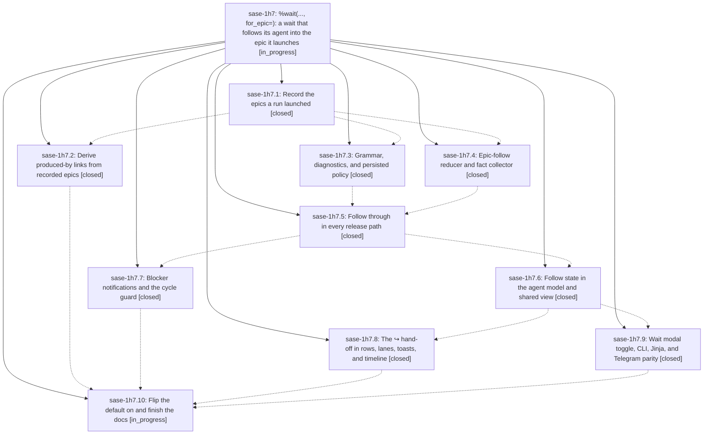

# Bead: sase-1h7 — %wait(..., for\_epic=): a wait that follows its agent into the epic it launches

[Bead Pages](../README.md) / sase-1h7

**Status:** ◐ in_progress · **Type:** ▸ plan · **Tier:** epic
**Owner:** `bryanbugyi34@gmail.com` · **Created by:** [bbugyi200.athena.research.3v.linker.w0](https://github.com/sase-org/sase--agents/blob/main/sessions/bbugyi200.athena.research.3v.linker.w0.md) · **Assignee:** `sase-1h7.land`
**Created:** 2026-10-06 18:17:32 EDT
**Plan:** [202610/wait\_for\_epic.md](https://github.com/sase-org/sase--plans/blob/main/202610/wait_for_epic.md)

<!-- sase:links:start -->

## Links

| Relation | Artifact | Why |
| --- | --- | --- |
| implemented-by | [plan:202610/wait_for_epic.md][1] | derived from the plan's `bead_id:` frontmatter field |

_Plus 3 automatic references — see [Referenced By](#referenced-by)._

[1]: https://github.com/sase-org/sase--plans/blob/main/202610/wait_for_epic.md

<!-- sase:links:end -->

## Description

`%wait:planner` waits for the planner and then for every epic bead the planner (or any member of its session, clan, workflow, or bound tribe) launches, so users can submit follow-up prompts before the epic's ID exists. A per-occurrence `for_epic=true|false` keyword controls the behavior. It defaults to true for user-authored agent targets, and using it without an agent target is a hard error in the launcher and the editor. The hand-off is recorded reliably, never deadlocks the epic machinery, and is clearly visible in the TUI as a teal `↪` hand-off.

## Notes

[2026-10-07T13:25:40Z · sase-1h9.land] DISCOVERED ISSUE: Wait-arg completion now inserts for_epic= ahead of hood=, and three sase tests still expect the old keyword list. Reproduced 2026-10-07 on sase master 5230c3080e during sase-1h9 landing (not caused by that epic; its diff does not touch completion). Isolated pytest:

tests/ace/tui/widgets/test_directive_arg_completion.py::test_wait_arg_completion_excludes_selected_keywords_case_insensitively
tests/ace/tui/widgets/test_wait_directive_completion_interactions.py::test_wait_arg_completion_excludes_selected_agent_and_groups
tests/test_macro_directive_completion_parity.py::test_failure_degradation_retains_static_directive_rows

Each fails at index 2 with for_epic= != hood=. The actual rows are the expected list plus an inserted for_epic= (hood= is still present). Rows come from core_candidate_rows in src/sase/ace/tui/widgets/directive_completion.py. Proposed by sase-1h9.1 note #1 and sase-1h9.2 note #1 (the latter named KNOWN witness 477276a723e911ef2ce08d5f4e412d7f). No task filed; this vocabulary belongs to sase-1h7.

## Phases

| Bead | Title | Status | Size | Created | Agents | Commits |
|---|---|---|---|---|---:|---:|
| [sase-1h7.1](sase-1h7.1.md) | Record the epics a run launched | ✓ closed | medium | 2026-10-06 | 1 | 2 |
| [sase-1h7.10](sase-1h7.10.md) | Flip the default on and finish the docs | ◐ in_progress | medium | 2026-10-06 | 1 | 0 |
| [sase-1h7.2](sase-1h7.2.md) | Derive produced-by links from recorded epics | ✓ closed | small | 2026-10-06 | 1 | 2 |
| [sase-1h7.3](sase-1h7.3.md) | Grammar, diagnostics, and persisted policy | ✓ closed | medium | 2026-10-06 | 1 | 2 |
| [sase-1h7.4](sase-1h7.4.md) | Epic-follow reducer and fact collector | ✓ closed | medium | 2026-10-06 | 1 | 2 |
| [sase-1h7.5](sase-1h7.5.md) | Follow through in every release path | ✓ closed | large | 2026-10-06 | 1 | 2 |
| [sase-1h7.6](sase-1h7.6.md) | Follow state in the agent model and shared view | ✓ closed | medium | 2026-10-06 | 1 | 1 |
| [sase-1h7.7](sase-1h7.7.md) | Blocker notifications and the cycle guard | ✓ closed | medium | 2026-10-06 | 1 | 1 |
| [sase-1h7.8](sase-1h7.8.md) | The ↪ hand-off in rows, lanes, toasts, and timeline | ✓ closed | medium | 2026-10-06 | 1 | 1 |
| [sase-1h7.9](sase-1h7.9.md) | Wait modal toggle, CLI, Jinja, and Telegram parity | ✓ closed | medium | 2026-10-06 | 1 | 2 |

## Lineage

## Agents

| Agent | Bead | Commits |
|---|---|---:|
| [bbugyi200.athena.sase-1h7.1](https://github.com/sase-org/sase--agents/blob/main/agents/bbugyi200.athena.sase-1h7.1/README.md) | [sase-1h7.1](sase-1h7.1.md) | 2 |
| [bbugyi200.athena.sase-1h7.10](https://github.com/sase-org/sase--agents/blob/main/agents/bbugyi200.athena.sase-1h7.10/README.md) | [sase-1h7.10](sase-1h7.10.md) | 0 |
| [bbugyi200.athena.sase-1h7.2](https://github.com/sase-org/sase--agents/blob/main/agents/bbugyi200.athena.sase-1h7.2/README.md) | [sase-1h7.2](sase-1h7.2.md) | 2 |
| [bbugyi200.athena.sase-1h7.3](https://github.com/sase-org/sase--agents/blob/main/sessions/bbugyi200.athena.sase-1h7.3.md) | [sase-1h7.3](sase-1h7.3.md) | 2 |
| [bbugyi200.athena.sase-1h7.4](https://github.com/sase-org/sase--agents/blob/main/sessions/bbugyi200.athena.sase-1h7.4.md) | [sase-1h7.4](sase-1h7.4.md) | 2 |
| [bbugyi200.athena.sase-1h7.5](https://github.com/sase-org/sase--agents/blob/main/sessions/bbugyi200.athena.sase-1h7.5.md) | [sase-1h7.5](sase-1h7.5.md) | 2 |
| [bbugyi200.athena.sase-1h7.6](https://github.com/sase-org/sase--agents/blob/main/agents/bbugyi200.athena.sase-1h7.6/README.md) | [sase-1h7.6](sase-1h7.6.md) | 1 |
| [bbugyi200.athena.sase-1h7.7](https://github.com/sase-org/sase--agents/blob/main/sessions/bbugyi200.athena.sase-1h7.7.md) | [sase-1h7.7](sase-1h7.7.md) | 1 |
| [bbugyi200.athena.sase-1h7.8](https://github.com/sase-org/sase--agents/blob/main/agents/bbugyi200.athena.sase-1h7.8/README.md) | [sase-1h7.8](sase-1h7.8.md) | 1 |
| [bbugyi200.athena.sase-1h7.9](https://github.com/sase-org/sase--agents/blob/main/agents/bbugyi200.athena.sase-1h7.9/README.md) | [sase-1h7.9](sase-1h7.9.md) | 2 |
| [bbugyi200.athena.sase-1h7.land](https://github.com/sase-org/sase--agents/blob/main/agents/bbugyi200.athena.sase-1h7.land/README.md) | [sase-1h7](README.md) | 0 |

## Commits

| Repo | Commit | Subject | Bead | Committed |
|---|---|---|---|---|
| sase-core | [`sase-core@436dba6`](https://github.com/sase-org/sase-core/commit/436dba6c65670ff6bf4a9bbf5255ce411da4df1e) | feat(wire): add CreatedEpicWire to agent-meta wire | [sase-1h7.1](sase-1h7.1.md) | 2026-10-06 20:05:44 EDT |
| sase | [`997b9e2`](https://github.com/sase-org/sase/commit/997b9e26ff9b1315e0ab0c386f4ecf8e7052f454) | feat(record): track created epics via locked agent-meta updates | [sase-1h7.1](sase-1h7.1.md) | 2026-10-06 21:05:13 EDT |
| sase-core | [`sase-core@f4be6ce`](https://github.com/sase-org/sase-core/commit/f4be6cee136df4258e54af1ede98ac82e5a776a1) | feat(artifact-link): widen produced-by guidance to bead sources | [sase-1h7.2](sase-1h7.2.md) | 2026-10-06 21:55:25 EDT |
| sase | [`d58a45a`](https://github.com/sase-org/sase/commit/d58a45a75f58bddb5662a20bff206006b6f26508) | feat(artifact-links): publish created\_epic\_ids and project agent-created-epic links | [sase-1h7.2](sase-1h7.2.md) | 2026-10-06 22:00:53 EDT |
| sase-core | [`sase-core@21c539f`](https://github.com/sase-org/sase-core/commit/21c539fd30aff96530611f56903c5026e70ce3c3) | feat(wait): mirror wait\_for\_epics\_of in scan wires and editor grammar (sase-1h7.3) | [sase-1h7.3](sase-1h7.3.md) | 2026-10-06 22:35:05 EDT |
| sase-core | [`sase-core@4b4a052`](https://github.com/sase-org/sase-core/commit/4b4a0527c3c604b09dea759d3f6e3b4a23300e9e) | feat(wait): add pure wait\_epic\_follow reducer with Python binding (sase-1h7.4) | [sase-1h7.4](sase-1h7.4.md) | 2026-10-06 22:57:12 EDT |
| sase | [`313aa2c`](https://github.com/sase-org/sase/commit/313aa2c9930455835f3c29dd50ff2e279ea6a1f8) | feat(wait): add epic-follow reducer and fact collector (sase-1h7.4) | [sase-1h7.4](sase-1h7.4.md) | 2026-10-06 23:29:44 EDT |
| sase | [`7c5fa40`](https://github.com/sase-org/sase/commit/7c5fa40d11f61c94b1dc34981a21232d2d56f143) | feat(wait): accept and validate for\_epic= on %wait with persisted wait\_for\_epics\_of (sase-1h7.3) | [sase-1h7.3](sase-1h7.3.md) | 2026-10-07 09:21:06 EDT |
| sase-core | [`sase-core@d742e20`](https://github.com/sase-org/sase-core/commit/d742e207c697249c75dd42fac669d338e4bbed0b) | feat(wait): wire wait\_epic\_follows scan fields and dismissed-member reducer fix (sase-1h7.5) | [sase-1h7.5](sase-1h7.5.md) | 2026-10-07 15:38:14 EDT |
| sase | [`333034a`](https://github.com/sase-org/sase/commit/333034a60aa09d6279d508b4d39f0ab9707da912) | feat(wait): route every release path through shared epic-follow release (sase-1h7.5) | [sase-1h7.5](sase-1h7.5.md) | 2026-10-07 16:26:49 EDT |
| sase | [`6e2bc57`](https://github.com/sase-org/sase/commit/6e2bc577260805ecec2695b93697cd5bfe3f66ac) | feat(wait): add epic follow view for wait\_for\_epics\_of targets | [sase-1h7.6](sase-1h7.6.md) | 2026-10-07 17:04:08 EDT |
| sase | [`7a3e388`](https://github.com/sase-org/sase/commit/7a3e3882c9c1115622e4512a0c6069518f70c47d) | feat(axe): add chop wait epic-follow safety phase with blocker notifications and cycle guard | [sase-1h7.7](sase-1h7.7.md) | 2026-10-07 17:25:41 EDT |
| sase | [`0a80039`](https://github.com/sase-org/sase/commit/0a80039618ee8f2ca8d9bce6ec9d21b8f4c1c3b7) | feat(ace-tui): render epic-follow hand-off across agents surfaces | [sase-1h7.8](sase-1h7.8.md) | 2026-10-07 17:46:25 EDT |
| sase | [`5a3f8ae`](https://github.com/sase-org/sase/commit/5a3f8ae57447ed8ced231dc82e170e0834c9df3c) | feat(wait): tri-state Follow epics toggle with split for\_epic occurrences | [sase-1h7.9](sase-1h7.9.md) | 2026-10-07 19:38:28 EDT |
| sase-telegram | [`sase-telegram@15ccce3`](https://github.com/sase-org/sase-telegram/commit/15ccce3857d6802b2fe9a57e4e4d4df846dd4bf1) | feat(telegram): render wait follow suffixes on agent tokens | [sase-1h7.9](sase-1h7.9.md) | 2026-10-07 20:08:33 EDT |

<!-- sase:referenced-by:start -->

## Referenced By

| Relation | Artifact | Why | Uses |
| --- | --- | --- | ---: |
| read-by | [agent:research.3z.final][1] | Verify bead title/status before citing it in consolidated reading-list report | 1 |
| read-by | [agent:sase-1h7.2][2] | links phase: sample epic created_by shape | 1 |
| read-by | [agent:sase-1h9.land][3] | Need existing notes before recording for_epic completion drift | 3 |

[1]: https://github.com/sase-org/sase--agents/blob/main/agents/bbugyi200.athena.research.3z.final/README.md
[2]: https://github.com/sase-org/sase--agents/blob/main/agents/bbugyi200.athena.sase-1h7.2/README.md
[3]: https://github.com/sase-org/sase--agents/blob/main/agents/bbugyi200.athena.sase-1h9.land/README.md

<!-- sase:referenced-by:end -->
