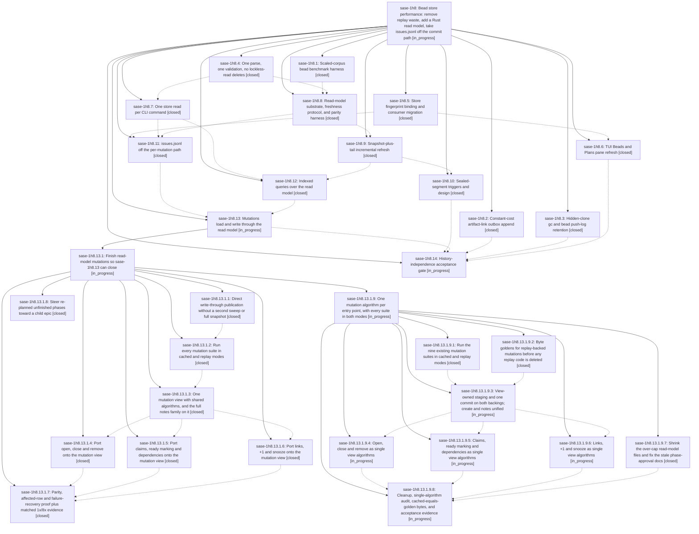

# Bead: sase-1h8 — Bead store performance: remove replay waste, add a Rust read model, take issues.jsonl off the commit path

[Bead Pages](../README.md) / sase-1h8

**Status:** ◐ in_progress · **Type:** ▸ plan · **Tier:** epic
**Owner:** `bryanbugyi34@gmail.com` · **Created by:** [bbugyi200.athena.research.3u.linker.w0](https://github.com/sase-org/sase--agents/blob/main/sessions/bbugyi200.athena.research.3u.linker.w0.md) · **Assignee:** `sase-1h8.land`
**Created:** 2026-10-06 18:59:27 EDT
**Plan:** [202610/bead\_store\_history\_independent\_performance.md](https://github.com/sase-org/sase--plans/blob/main/202610/bead_store_history_independent_performance.md)

<!-- sase:links:start -->

## Links

| Relation | Artifact | Why |
| --- | --- | --- |
| implemented-by | [plan:202610/bead_store_history_independent_performance.md][1] | derived from the plan's `bead_id:` frontmatter field |

_Plus 10 automatic references — see [Referenced By](#referenced-by)._

[1]: https://github.com/sase-org/sase--plans/blob/main/202610/bead_store_history_independent_performance.md

<!-- sase:links:end -->

## Description

Hot-path bead reads and writes stop scaling with closed history. Every recommendation in the bead-history research report is implemented: the measured waste is removed, a Rust-owned, disposable, fingerprint-validated read model serves current state, issues.jsonl leaves the per-mutation commit path, and the physical sealed-archive design sits behind measured triggers. No bead event is ever edited, compressed in place, or deleted.

## Notes

[2026-10-08T01:55:11Z · sase-1hf.land] DISCOVERED ISSUE (sase-1hf landing, master 3a4178b15a, 2026-10-07): Symvision's private-symbol rule returns before the unused-public rule. Once the sase-1hf land agent deleted the dead `_list_bead_state_changes_silent` (orphaned by 39dc48f03c), `just symvision` reported these sase-1h8 unused public symbols, previously masked: bead_push_log_retention_config (src/sase/bead/_sync_logs.py), hidden_sidecar_clone_dirs and maybe_gc_hidden_sidecar_clone (src/sase/sdd/_store_maintenance.py), all from sase-1h8.3 (69ecdace02); BeadStoreFingerprint (src/sase/core/bead_read_facade.py, sase-1h8.5); BeadBoardSnapshot (same file, sase-1h8.6). Privatize, wire, or delete per the symvision memory, or add --epic-symbol rows keyed to a still-open sase-1h8 phase that will consume them.

[2026-10-08T02:58:19Z · sase-1hf.land] DISCOVERED ISSUE (sase-1hf landing check, master 3a4178b15a, 2026-10-07; reproduced on a clean tree): tests/test_bead/test_claimed_status.py::test_default_list_includes_claimed_with_shared_glyph fails with `AttributeError: '_ReadView' object has no attribute 'list_issue_page'` at src/sase/bead/cli_query.py:109. 446f1833de (sase-1h8.12, list/status from indexed read-model tables) calls list_issue_page on a read view the test's fake (or a fallback path) does not provide. Either give that view the method or fix the test double.

[2026-10-08T05:15:50Z · sase-1h7.land] DISCOVERED ISSUE (sase-1h7 landing, sase-core def5ad5b, 2026-10-08; reproduced on a clean sase-core tree): crates/sase_core/tests/bead_read_parity.rs::event_store_supports_read_queries_without_legacy_projection fails at line 486 asserting bead_doctor(...) contains 'WARNING: issues.jsonl missing'. sase-core 7df86f4a (sase-1h8.11) deliberately limited that warning to legacy stores (crates/sase_core/src/bead/read.rs:539, '!legacy_path.exists() && !event_store_is_present'), but this event-store test still expects it. Update the test's expectation (assert the warning is absent for event stores) rather than restoring the warning. Breaks sase-core just check (fail-fast stops before sase_core_py and later crates).

[2026-10-08T15:21:06Z · sase-1i4.land] DISCOVERED ISSUE (supplementary, from sase-1i4 landing): BeadStoreFingerprint in src/sase/core/bead_read_facade.py was proposed again by phases sase-1i4.1 and sase-1i4.2. It remains on this epic. No second task was filed.

[2026-10-08T18:55:12Z · sase-1i5.9.1.1] Phase sase-1i5.9.1.1 applied the note-#3 recorded expectation fix in sase-core (assert WARNING: issues.jsonl missing is absent for event stores in event_store_supports_read_queries_without_legacy_projection); sase tool run check passed on the fix commit. -r plan requires noting sase-1h8 that this phase applied the recorded fix

[2026-10-09T01:15:26Z · sase-1h8.13.1.land] DISCOVERED ISSUE (sase-1h8.13.1 landing, from proof phase sase-1h8.13.1.7 PROPOSED FOLLOW-UP #1, 2026-10-08): after the read-model mutation ports, matched binding-level note/update cost still misses this epic's '< 10% from 1x to 8x' target. Seed 20261006, 20 runs, same corpora (1x 6899 beads/2000 streams; 8x 55516 beads/16000 streams), host load ~17. p95 before->after: 1x note 238.6->114.5ms, update 267.6->156.5ms; 8x note 1337.9->321.3ms, update 1586.2->455.5ms. 1x->8x p95 ratio after = 2.8x (note), 2.9x (update). Artifacts: before file:explicit:c6e84b9abb0aa9ec8460fdf0, after file:explicit:cf5bda21694e0423eeb52bd1. The perf gate sase-1h8.14 owns this: break the 8x cost down into admission sweep (still a full stat sweep per mutation, which grows with stream count), publication and binding overhead. Do not relax the threshold. Routed here instead of a task because it is this epic's own acceptance target.

## Phases

| Bead | Title | Status | Size | Created | Agents | Commits |
|---|---|---|---|---|---:|---:|
| [sase-1h8.1](sase-1h8.1.md) | Scaled-corpus bead benchmark harness | ✓ closed | medium | 2026-10-06 | 1 | 1 |
| [sase-1h8.10](sase-1h8.10.md) | Sealed-segment triggers and design | ✓ closed | small | 2026-10-06 | 1 | 2 |
| [sase-1h8.11](sase-1h8.11.md) | issues.jsonl off the per-mutation path | ✓ closed | medium | 2026-10-06 | 1 | 2 |
| [sase-1h8.12](sase-1h8.12.md) | Indexed queries over the read model | ✓ closed | medium | 2026-10-06 | 1 | 2 |
| [sase-1h8.13](sase-1h8.13.md) | Mutations load and write through the read model | ◐ in_progress | large | 2026-10-06 | 1 | 3 |
| [sase-1h8.14](sase-1h8.14.md) | History-independence acceptance gate | ◐ in_progress | medium | 2026-10-06 | 1 | 0 |
| [sase-1h8.2](sase-1h8.2.md) | Constant-cost artifact-link outbox append | ✓ closed | small | 2026-10-06 | 1 | 1 |
| [sase-1h8.3](sase-1h8.3.md) | Hidden-clone gc and bead push-log retention | ✓ closed | small | 2026-10-06 | 1 | 1 |
| [sase-1h8.4](sase-1h8.4.md) | One parse, one validation, no lockless-read deletes | ✓ closed | medium | 2026-10-06 | 1 | 1 |
| [sase-1h8.5](sase-1h8.5.md) | Store fingerprint binding and consumer migration | ✓ closed | medium | 2026-10-06 | 1 | 2 |
| [sase-1h8.6](sase-1h8.6.md) | TUI Beads and Plans pane refresh | ✓ closed | medium | 2026-10-06 | 1 | 2 |
| [sase-1h8.7](sase-1h8.7.md) | One store read per CLI command | ✓ closed | medium | 2026-10-06 | 1 | 3 |
| [sase-1h8.8](sase-1h8.8.md) | Read-model substrate, freshness protocol, and parity harness | ✓ closed | medium | 2026-10-06 | 1 | 2 |
| [sase-1h8.9](sase-1h8.9.md) | Snapshot-plus-tail incremental refresh | ✓ closed | medium | 2026-10-06 | 1 | 2 |

## Lineage

## Agents

| Agent | Bead | Commits |
|---|---|---:|
| [bbugyi200.athena.sase-1h8.1](https://github.com/sase-org/sase--agents/blob/main/agents/bbugyi200.athena.sase-1h8.1/README.md) | [sase-1h8.1](sase-1h8.1.md) | 1 |
| [bbugyi200.athena.sase-1h8.10](https://github.com/sase-org/sase--agents/blob/main/agents/bbugyi200.athena.sase-1h8.10/README.md) | [sase-1h8.10](sase-1h8.10.md) | 2 |
| [bbugyi200.athena.sase-1h8.11](https://github.com/sase-org/sase--agents/blob/main/agents/bbugyi200.athena.sase-1h8.11/README.md) | [sase-1h8.11](sase-1h8.11.md) | 2 |
| [bbugyi200.athena.sase-1h8.12](https://github.com/sase-org/sase--agents/blob/main/sessions/bbugyi200.athena.sase-1h8.12.md) | [sase-1h8.12](sase-1h8.12.md) | 2 |
| [bbugyi200.athena.sase-1h8.13](https://github.com/sase-org/sase--agents/blob/main/sessions/bbugyi200.athena.sase-1h8.13.md) | [sase-1h8.13](sase-1h8.13.md) | 3 |
| [bbugyi200.athena.sase-1h8.13.1.1](https://github.com/sase-org/sase--agents/blob/main/agents/bbugyi200.athena.sase-1h8.13.1.1/README.md) | [sase-1h8.13.1.1](sase-1h8.13.1.1.md) | 1 |
| [bbugyi200.athena.sase-1h8.13.1.2](https://github.com/sase-org/sase--agents/blob/main/agents/bbugyi200.athena.sase-1h8.13.1.2/README.md) | [sase-1h8.13.1.2](sase-1h8.13.1.2.md) | 1 |
| [bbugyi200.athena.sase-1h8.13.1.3](https://github.com/sase-org/sase--agents/blob/main/agents/bbugyi200.athena.sase-1h8.13.1.3/README.md) | [sase-1h8.13.1.3](sase-1h8.13.1.3.md) | 1 |
| [bbugyi200.athena.sase-1h8.13.1.4](https://github.com/sase-org/sase--agents/blob/main/agents/bbugyi200.athena.sase-1h8.13.1.4/README.md) | [sase-1h8.13.1.4](sase-1h8.13.1.4.md) | 1 |
| [bbugyi200.athena.sase-1h8.13.1.5](https://github.com/sase-org/sase--agents/blob/main/agents/bbugyi200.athena.sase-1h8.13.1.5/README.md) | [sase-1h8.13.1.5](sase-1h8.13.1.5.md) | 1 |
| [bbugyi200.athena.sase-1h8.13.1.6](https://github.com/sase-org/sase--agents/blob/main/agents/bbugyi200.athena.sase-1h8.13.1.6/README.md) | [sase-1h8.13.1.6](sase-1h8.13.1.6.md) | 1 |
| [bbugyi200.athena.sase-1h8.13.1.7](https://github.com/sase-org/sase--agents/blob/main/agents/bbugyi200.athena.sase-1h8.13.1.7/README.md) | [sase-1h8.13.1.7](sase-1h8.13.1.7.md) | 1 |
| [bbugyi200.athena.sase-1h8.13.1.8](https://github.com/sase-org/sase--agents/blob/main/sessions/bbugyi200.athena.sase-1h8.13.1.8.md) | [sase-1h8.13.1.8](sase-1h8.13.1.8.md) | 1 |
| [bbugyi200.athena.sase-1h8.13.1.9.1](https://github.com/sase-org/sase--agents/blob/main/agents/bbugyi200.athena.sase-1h8.13.1.9.1/README.md) | [sase-1h8.13.1.9.1](sase-1h8.13.1.9.1.md) | 1 |
| [bbugyi200.athena.sase-1h8.13.1.9.2](https://github.com/sase-org/sase--agents/blob/main/agents/bbugyi200.athena.sase-1h8.13.1.9.2/README.md) | [sase-1h8.13.1.9.2](sase-1h8.13.1.9.2.md) | 1 |
| [bbugyi200.athena.sase-1h8.13.1.9.3](https://github.com/sase-org/sase--agents/blob/main/agents/bbugyi200.athena.sase-1h8.13.1.9.3/README.md) | [sase-1h8.13.1.9.3](sase-1h8.13.1.9.3.md) | 0 |
| [bbugyi200.athena.sase-1h8.13.1.9.4](https://github.com/sase-org/sase--agents/blob/main/agents/bbugyi200.athena.sase-1h8.13.1.9.4/README.md) | [sase-1h8.13.1.9.4](sase-1h8.13.1.9.4.md) | 0 |
| [bbugyi200.athena.sase-1h8.13.1.9.5](https://github.com/sase-org/sase--agents/blob/main/agents/bbugyi200.athena.sase-1h8.13.1.9.5/README.md) | [sase-1h8.13.1.9.5](sase-1h8.13.1.9.5.md) | 0 |
| [bbugyi200.athena.sase-1h8.13.1.9.6](https://github.com/sase-org/sase--agents/blob/main/agents/bbugyi200.athena.sase-1h8.13.1.9.6/README.md) | [sase-1h8.13.1.9.6](sase-1h8.13.1.9.6.md) | 0 |
| [bbugyi200.athena.sase-1h8.13.1.9.7](https://github.com/sase-org/sase--agents/blob/main/agents/bbugyi200.athena.sase-1h8.13.1.9.7/README.md) | [sase-1h8.13.1.9.7](sase-1h8.13.1.9.7.md) | 2 |
| [bbugyi200.athena.sase-1h8.13.1.9.8](https://github.com/sase-org/sase--agents/blob/main/agents/bbugyi200.athena.sase-1h8.13.1.9.8/README.md) | [sase-1h8.13.1.9.8](sase-1h8.13.1.9.8.md) | 0 |
| [bbugyi200.athena.sase-1h8.13.1.9.land](https://github.com/sase-org/sase--agents/blob/main/agents/bbugyi200.athena.sase-1h8.13.1.9.land/README.md) | [sase-1h8.13.1.9](sase-1h8.13.1.9.md) | 0 |
| [bbugyi200.athena.sase-1h8.13.1.land](https://github.com/sase-org/sase--agents/blob/main/sessions/bbugyi200.athena.sase-1h8.13.1.land.md) | [sase-1h8.13.1](sase-1h8.13.1.md) | 0 |
| [bbugyi200.athena.sase-1h8.14](https://github.com/sase-org/sase--agents/blob/main/agents/bbugyi200.athena.sase-1h8.14/README.md) | [sase-1h8.14](sase-1h8.14.md) | 0 |
| [bbugyi200.athena.sase-1h8.2](https://github.com/sase-org/sase--agents/blob/main/sessions/bbugyi200.athena.sase-1h8.2.md) | [sase-1h8.2](sase-1h8.2.md) | 1 |
| [bbugyi200.athena.sase-1h8.3](https://github.com/sase-org/sase--agents/blob/main/sessions/bbugyi200.athena.sase-1h8.3.md) | [sase-1h8.3](sase-1h8.3.md) | 1 |
| [bbugyi200.athena.sase-1h8.4](https://github.com/sase-org/sase--agents/blob/main/agents/bbugyi200.athena.sase-1h8.4/README.md) | [sase-1h8.4](sase-1h8.4.md) | 1 |
| [bbugyi200.athena.sase-1h8.5](https://github.com/sase-org/sase--agents/blob/main/sessions/bbugyi200.athena.sase-1h8.5.md) | [sase-1h8.5](sase-1h8.5.md) | 2 |
| [bbugyi200.athena.sase-1h8.6](https://github.com/sase-org/sase--agents/blob/main/sessions/bbugyi200.athena.sase-1h8.6.md) | [sase-1h8.6](sase-1h8.6.md) | 2 |
| [bbugyi200.athena.sase-1h8.7](https://github.com/sase-org/sase--agents/blob/main/agents/bbugyi200.athena.sase-1h8.7/README.md) | [sase-1h8.7](sase-1h8.7.md) | 3 |
| [bbugyi200.athena.sase-1h8.8](https://github.com/sase-org/sase--agents/blob/main/sessions/bbugyi200.athena.sase-1h8.8.md) | [sase-1h8.8](sase-1h8.8.md) | 2 |
| [bbugyi200.athena.sase-1h8.9](https://github.com/sase-org/sase--agents/blob/main/sessions/bbugyi200.athena.sase-1h8.9.md) | [sase-1h8.9](sase-1h8.9.md) | 2 |
| [bbugyi200.athena.sase-1h8.land](https://github.com/sase-org/sase--agents/blob/main/agents/bbugyi200.athena.sase-1h8.land/README.md) | [sase-1h8](README.md) | 0 |

## Commits

| Repo | Commit | Subject | Bead | Committed |
|---|---|---|---|---|
| sase | [`545caa7`](https://github.com/sase-org/sase/commit/545caa7abdfb746e83900b2fc1590f40635783d2) | feat(outbox): constant-cost artifact-link outbox append (sase-1h8.2) | [sase-1h8.2](sase-1h8.2.md) | 2026-10-06 19:28:48 EDT |
| sase-core | [`sase-core@6573ebb`](https://github.com/sase-org/sase-core/commit/6573ebb0f2853658480086a6c821afdfcb0e7cd0) | feat(beads): one parse, one validation, no lockless-read deletes (sase-1h8.4) | [sase-1h8.4](sase-1h8.4.md) | 2026-10-06 19:40:19 EDT |
| sase | [`69ecdac`](https://github.com/sase-org/sase/commit/69ecdace02734e279daa201590722a5f4209ff5b) | feat(bead): hidden-clone gc and bead push-log retention (sase-1h8.3) | [sase-1h8.3](sase-1h8.3.md) | 2026-10-06 19:41:20 EDT |
| sase-core | [`sase-core@7af3a73`](https://github.com/sase-org/sase-core/commit/7af3a73a427aa248a7e5021fb146160b55a97735) | feat(bead-store): add bead\_store\_fingerprint core binding with stat-only exact key | [sase-1h8.5](sase-1h8.5.md) | 2026-10-06 19:50:32 EDT |
| sase | [`4a7ffac`](https://github.com/sase-org/sase/commit/4a7ffacb6c11c98b6203bb190391fa46b9739558) | feat(bead-store): add bead\_store\_fingerprint binding and migrate five consumers | [sase-1h8.5](sase-1h8.5.md) | 2026-10-06 19:55:09 EDT |
| sase | [`dcda0f0`](https://github.com/sase-org/sase/commit/dcda0f0afd74748b9588d8fb8e2015599d4f5610) | feat(perf): add scaled-corpus bead benchmark harness | [sase-1h8.1](sase-1h8.1.md) | 2026-10-06 21:09:38 EDT |
| sase-core | [`sase-core@0506689`](https://github.com/sase-org/sase-core/commit/0506689b381e7a95eb7507becf1d149b0b829a45) | feat(core): bead board\_snapshot with single-read list/ready/blocked | [sase-1h8.6](sase-1h8.6.md) | 2026-10-06 21:48:15 EDT |
| sase | [`7615e25`](https://github.com/sase-org/sase/commit/7615e253d84c0d14d1863d658d3ed9a66dbffe2f) | feat(tui): board-snapshot bead refresh with one-pass grouping and explicit refresh lanes | [sase-1h8.6](sase-1h8.6.md) | 2026-10-06 22:35:28 EDT |
| sase-core | [`sase-core@bff4860`](https://github.com/sase-org/sase-core/commit/bff4860c273afc0270248c6eeb203dddda466435) | feat(bead): one-replay core support for in-mutation resolution and target probing | [sase-1h8.7](sase-1h8.7.md) | 2026-10-07 00:01:34 EDT |
| sase-core | [`sase-core@91e0e49`](https://github.com/sase-org/sase-core/commit/91e0e49c083119e64118d7e56a6b51b1e0a13e84) | feat(bead): add versioned SQLite read model with freshness token and parity harness | [sase-1h8.8](sase-1h8.8.md) | 2026-10-07 00:57:36 EDT |
| sase | [`7da1570`](https://github.com/sase-org/sase/commit/7da15707ea0331e509f65553b5721f5e465c0d5a) | feat(bead-store): versioned SQLite read model with freshness token and verify-cache (sase-1h8.8) | [sase-1h8.8](sase-1h8.8.md) | 2026-10-07 09:20:33 EDT |
| sase-core | [`sase-core@26ec2d6`](https://github.com/sase-org/sase-core/commit/26ec2d61d9c60eede1596ae7d8c897e74dfb8141) | feat(bead): report update request-order IDs and enforce create parent (sase-1h8.7) | [sase-1h8.7](sase-1h8.7.md) | 2026-10-07 10:19:25 EDT |
| sase | [`b0687d0`](https://github.com/sase-org/sase/commit/b0687d0180e1fe8ff2c1cf8f64bc8db94dab8b47) | feat(bead): one store read per CLI command (sase-1h8.7) | [sase-1h8.7](sase-1h8.7.md) | 2026-10-07 10:48:43 EDT |
| sase-core | [`sase-core@f8d05ef`](https://github.com/sase-org/sase-core/commit/f8d05efc58310eca985f2112afc89379ff7a6636) | feat(bead-read-model): snapshot-plus-tail incremental refresh in sase-core | [sase-1h8.9](sase-1h8.9.md) | 2026-10-07 12:20:26 EDT |
| sase | [`aebe28d`](https://github.com/sase-org/sase/commit/aebe28de8414ebc34438e4fb4d57fc7519153b08) | feat(bead-read-model): snapshot-plus-tail incremental refresh telemetry and doctor tests | [sase-1h8.9](sase-1h8.9.md) | 2026-10-07 13:09:32 EDT |
| sase-core | [`sase-core@7df86f4`](https://github.com/sase-org/sase-core/commit/7df86f4a3ae3aa677386d875d3fc5a1f348c376c) | feat(bead): skip projection rewrite on event-store save; add referenced-artifact-ids query (sase-1h8.11) | [sase-1h8.11](sase-1h8.11.md) | 2026-10-07 14:00:07 EDT |
| sase-core | [`sase-core@4b3831f`](https://github.com/sase-org/sase-core/commit/4b3831fd8d00fb1405e70e974a8fa1070ba22b90) | feat(bead): add seal-watch threshold probe and binding | [sase-1h8.10](sase-1h8.10.md) | 2026-10-07 14:23:25 EDT |
| sase | [`de751c2`](https://github.com/sase-org/sase/commit/de751c2d1aac0b06b75baed3217f966719b568f7) | feat(bead): add seal-watch triggers to bead doctor | [sase-1h8.10](sase-1h8.10.md) | 2026-10-07 14:40:18 EDT |
| sase | [`ee00218`](https://github.com/sase-org/sase/commit/ee0021821fa3adf8401ea725967e1414682432d0) | feat(bead): take issues.jsonl off the per-mutation path (sase-1h8.11) | [sase-1h8.11](sase-1h8.11.md) | 2026-10-07 14:52:27 EDT |
| sase-core | [`sase-core@d2a56b4`](https://github.com/sase-org/sase-core/commit/d2a56b4ca928c602379619bb35869d133df9800e) | feat(bead): add indexed read-model query layer with Python bindings | [sase-1h8.12](sase-1h8.12.md) | 2026-10-07 15:52:25 EDT |
| sase | [`446f183`](https://github.com/sase-org/sase/commit/446f1833deb92962992f7fb9538a82a21f3c0982) | feat(bead): serve list and status queries from indexed read-model tables | [sase-1h8.12](sase-1h8.12.md) | 2026-10-07 16:19:41 EDT |
| sase-core | [`sase-core@4d5cf65`](https://github.com/sase-org/sase-core/commit/4d5cf6502324a5928a285861b099be393b26de91) | feat(bead): read-model mutation groundwork for sase-1h8.13 | [sase-1h8.13](sase-1h8.13.md) | 2026-10-07 19:21:56 EDT |
| sase-core | [`sase-core@7b3b9aa`](https://github.com/sase-org/sase-core/commit/7b3b9aa51876f7435e9b2e8dcfca97dd59529dde) | feat(beads): add indexed note/update read-model path with tail-refresh write-through | [sase-1h8.13](sase-1h8.13.md) | 2026-10-08 08:41:35 EDT |
| sase-core | [`sase-core@1ff4360`](https://github.com/sase-org/sase-core/commit/1ff436055b128f21349e0f8d1136020e0a4cb079) | feat(beads): indexed allocation metadata, shared mutation view/publish, cached create port | [sase-1h8.13](sase-1h8.13.md) | 2026-10-08 13:54:44 EDT |
| sase | [`c64a6b3`](https://github.com/sase-org/sase/commit/c64a6b3ea7ecb8c364cea1b2a41307689c92e5cf) | feat(beads): steer re-planned unfinished phases toward a child epic | [sase-1h8.13.1.8](sase-1h8.13.1.8.md) | 2026-10-08 16:05:06 EDT |
| sase-core | [`sase-core@6460581`](https://github.com/sase-org/sase-core/commit/646058197f5ced5231ed478b8a716678007f0156) | feat(beads): direct write-through read-model publication without second sweep or snapshot | [sase-1h8.13.1.1](sase-1h8.13.1.1.md) | 2026-10-08 16:44:30 EDT |
| sase-core | [`sase-core@906570e`](https://github.com/sase-org/sase-core/commit/906570e8afae29ff1efe283f18c45bcc05853c53) | test(bead-mutation): add mode-parameterized dual-mode parity fixtures | [sase-1h8.13.1.2](sase-1h8.13.1.2.md) | 2026-10-08 17:23:27 EDT |
| sase-core | [`sase-core@159f48e`](https://github.com/sase-org/sase-core/commit/159f48ef3c9c8b454eacf715f50eb6cbd5e0a279) | feat(beads): one mutation view with shared algorithms and full notes family | [sase-1h8.13.1.3](sase-1h8.13.1.3.md) | 2026-10-08 18:17:49 EDT |
| sase-core | [`sase-core@276b14a`](https://github.com/sase-org/sase-core/commit/276b14a40f300c07e350a604682ba00200327e9b) | feat(beads): port open, close and remove onto the mutation view | [sase-1h8.13.1.4](sase-1h8.13.1.4.md) | 2026-10-08 19:05:56 EDT |
| sase-core | [`sase-core@d18537a`](https://github.com/sase-org/sase-core/commit/d18537a5cae17179505ff71593fe55f8673f8260) | feat(beads): port claims, ready marking and dependencies onto the mutation view | [sase-1h8.13.1.5](sase-1h8.13.1.5.md) | 2026-10-08 19:08:11 EDT |
| sase-core | [`sase-core@dd1a67c`](https://github.com/sase-org/sase-core/commit/dd1a67c0727ecb98920955c454785fb0dc98a50c) | feat(beads): port links, +1 and snooze mutations onto the mutation view | [sase-1h8.13.1.6](sase-1h8.13.1.6.md) | 2026-10-08 19:12:02 EDT |
| sase-core | [`sase-core@3e45924`](https://github.com/sase-org/sase-core/commit/3e45924865a58d23cbe704e0a1b6e6130c086039) | test(sase-core): prove bounded mutation work and every-family read-model parity | [sase-1h8.13.1.7](sase-1h8.13.1.7.md) | 2026-10-08 20:48:29 EDT |
| sase-core | [`sase-core@ddafffd`](https://github.com/sase-org/sase-core/commit/ddafffd2be4ddb223d6eb767753283531795f939) | test(beads): run nine mutation suites in cached and replay modes | [sase-1h8.13.1.9.1](sase-1h8.13.1.9.1.md) | 2026-10-08 22:41:11 EDT |
| sase-core | [`sase-core@ee4cf2f`](https://github.com/sase-org/sase-core/commit/ee4cf2ff37c5cbe1b7e8155d88861ef6eec98495) | test(sase-core): add mutation replay golden coverage for all entry points | [sase-1h8.13.1.9.2](sase-1h8.13.1.9.2.md) | 2026-10-08 22:42:31 EDT |
| sase-core | [`sase-core@5c4033f`](https://github.com/sase-org/sase-core/commit/5c4033f6d2284eaf717795c5cfc892e12827d510) | refactor(bead-read-model): split over-cap store and tail into resume, refresh, and meta-keys modules | [sase-1h8.13.1.9.7](sase-1h8.13.1.9.7.md) | 2026-10-08 23:30:49 EDT |
| sase | [`9ed4b0f`](https://github.com/sase-org/sase/commit/9ed4b0fb930d33884c539ed701a91c630196878a) | docs(beads): clarify phase auto-approve parks epic-tier plan for human review | [sase-1h8.13.1.9.7](sase-1h8.13.1.9.7.md) | 2026-10-08 23:35:42 EDT |

<!-- sase:referenced-by:start -->

## Referenced By

| Relation | Artifact | Why | Uses |
| --- | --- | --- | ---: |
| read-by | [agent:research.3y.final][1] | Check which bead-store perf phases absorb sase-1h5/sase-17r remaining work | 1 |
| read-by | [agent:research.3y.grk][2] | Need epic scope that already landed part of sase-1h5 Beads-pane work | 3 |
| read-by | [agent:sase-1h7.land][3] | Read the full DISCOVERED ISSUE notes on the bead-store epic to avoid duplicating them | 2 |
| read-by | [agent:sase-1h8.1][4] | parent epic scope | 1 |
| read-by | [agent:sase-1h8.11][5] | Need parent epic scope for phase sase-1h8.11 | 1 |
| read-by | [agent:sase-1h8.13.1.2][6] | epic decisions | 1 |
| read-by | [agent:sase-1h8.13.1.7][7] | epic decisions for phase work | 1 |
| read-by | [agent:sase-1h8.7][8] | Need parent epic scope to verify phase close does not violate ancestor guard | 1 |
| read-by | [agent:sase-1i4.land][9] | Need whether BeadStoreFingerprint is already a discovered issue on the open epic | 1 |
| read-by | [agent:sase-1i5.3][10] | coordination check for readonly phase | 1 |

[1]: https://github.com/sase-org/sase--agents/blob/main/agents/bbugyi200.athena.research.3y.final/README.md
[2]: https://github.com/sase-org/sase--agents/blob/main/agents/bbugyi200.athena.research.3y.grk/README.md
[3]: https://github.com/sase-org/sase--agents/blob/main/agents/bbugyi200.athena.sase-1h7.land/README.md
[4]: https://github.com/sase-org/sase--agents/blob/main/agents/bbugyi200.athena.sase-1h8.1/README.md
[5]: https://github.com/sase-org/sase--agents/blob/main/agents/bbugyi200.athena.sase-1h8.11/README.md
[6]: https://github.com/sase-org/sase--agents/blob/main/agents/bbugyi200.athena.sase-1h8.13.1.2/README.md
[7]: https://github.com/sase-org/sase--agents/blob/main/agents/bbugyi200.athena.sase-1h8.13.1.7/README.md
[8]: https://github.com/sase-org/sase--agents/blob/main/agents/bbugyi200.athena.sase-1h8.7/README.md
[9]: https://github.com/sase-org/sase--agents/blob/main/agents/bbugyi200.athena.sase-1i4.land/README.md
[10]: https://github.com/sase-org/sase--agents/blob/main/agents/bbugyi200.athena.sase-1i5.3/README.md

<!-- sase:referenced-by:end -->
