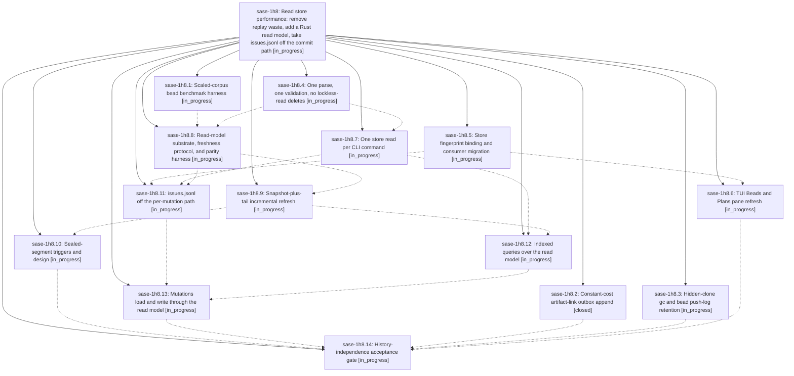

# Bead: sase-1h8 — Bead store performance: remove replay waste, add a Rust read model, take issues.jsonl off the commit path

[Bead Pages](../README.md) / sase-1h8

**Status:** ◐ in_progress · **Type:** ▸ plan · **Tier:** epic
**Owner:** `bryanbugyi34@gmail.com` · **Created by:** [bbugyi200.athena.research.3u.linker.w0](https://github.com/sase-org/sase--agents/blob/main/sessions/bbugyi200.athena.research.3u.linker.w0.md) · **Assignee:** `sase-1h8.land`
**Created:** 2026-10-06 18:59:27 EDT
**Plan:** [202610/bead\_store\_history\_independent\_performance.md](https://github.com/sase-org/sase--plans/blob/main/202610/bead_store_history_independent_performance.md)

## Description

Hot-path bead reads and writes stop scaling with closed history. Every recommendation in the bead-history research report is implemented: the measured waste is removed, a Rust-owned, disposable, fingerprint-validated read model serves current state, issues.jsonl leaves the per-mutation commit path, and the physical sealed-archive design sits behind measured triggers. No bead event is ever edited, compressed in place, or deleted.

## Phases

| Bead | Title | Status | Size | Created | Agents | Commits |
|---|---|---|---|---|---:|---:|
| [sase-1h8.1](sase-1h8.1.md) | Scaled-corpus bead benchmark harness | ◐ in_progress | medium | 2026-10-06 | 1 | 0 |
| [sase-1h8.10](sase-1h8.10.md) | Sealed-segment triggers and design | ◐ in_progress | small | 2026-10-06 | 1 | 0 |
| [sase-1h8.11](sase-1h8.11.md) | issues.jsonl off the per-mutation path | ◐ in_progress | medium | 2026-10-06 | 1 | 0 |
| [sase-1h8.12](sase-1h8.12.md) | Indexed queries over the read model | ◐ in_progress | medium | 2026-10-06 | 1 | 0 |
| [sase-1h8.13](sase-1h8.13.md) | Mutations load and write through the read model | ◐ in_progress | large | 2026-10-06 | 1 | 0 |
| [sase-1h8.14](sase-1h8.14.md) | History-independence acceptance gate | ◐ in_progress | medium | 2026-10-06 | 1 | 0 |
| [sase-1h8.2](sase-1h8.2.md) | Constant-cost artifact-link outbox append | ✓ closed | small | 2026-10-06 | 1 | 1 |
| [sase-1h8.3](sase-1h8.3.md) | Hidden-clone gc and bead push-log retention | ◐ in_progress | small | 2026-10-06 | 1 | 0 |
| [sase-1h8.4](sase-1h8.4.md) | One parse, one validation, no lockless-read deletes | ◐ in_progress | medium | 2026-10-06 | 1 | 0 |
| [sase-1h8.5](sase-1h8.5.md) | Store fingerprint binding and consumer migration | ◐ in_progress | medium | 2026-10-06 | 1 | 0 |
| [sase-1h8.6](sase-1h8.6.md) | TUI Beads and Plans pane refresh | ◐ in_progress | medium | 2026-10-06 | 1 | 0 |
| [sase-1h8.7](sase-1h8.7.md) | One store read per CLI command | ◐ in_progress | medium | 2026-10-06 | 1 | 0 |
| [sase-1h8.8](sase-1h8.8.md) | Read-model substrate, freshness protocol, and parity harness | ◐ in_progress | medium | 2026-10-06 | 1 | 0 |
| [sase-1h8.9](sase-1h8.9.md) | Snapshot-plus-tail incremental refresh | ◐ in_progress | medium | 2026-10-06 | 1 | 0 |

## Lineage

## Agents

| Agent | Bead | Commits |
|---|---|---:|
| [bbugyi200.athena.sase-1h8.1](https://github.com/sase-org/sase--agents/blob/main/agents/bbugyi200.athena.sase-1h8.1/README.md) | [sase-1h8.1](sase-1h8.1.md) | 0 |
| [bbugyi200.athena.sase-1h8.10](https://github.com/sase-org/sase--agents/blob/main/agents/bbugyi200.athena.sase-1h8.10/README.md) | [sase-1h8.10](sase-1h8.10.md) | 0 |
| [bbugyi200.athena.sase-1h8.11](https://github.com/sase-org/sase--agents/blob/main/agents/bbugyi200.athena.sase-1h8.11/README.md) | [sase-1h8.11](sase-1h8.11.md) | 0 |
| [bbugyi200.athena.sase-1h8.12](https://github.com/sase-org/sase--agents/blob/main/agents/bbugyi200.athena.sase-1h8.12/README.md) | [sase-1h8.12](sase-1h8.12.md) | 0 |
| [bbugyi200.athena.sase-1h8.13](https://github.com/sase-org/sase--agents/blob/main/agents/bbugyi200.athena.sase-1h8.13/README.md) | [sase-1h8.13](sase-1h8.13.md) | 0 |
| [bbugyi200.athena.sase-1h8.14](https://github.com/sase-org/sase--agents/blob/main/agents/bbugyi200.athena.sase-1h8.14/README.md) | [sase-1h8.14](sase-1h8.14.md) | 0 |
| [bbugyi200.athena.sase-1h8.2](https://github.com/sase-org/sase--agents/blob/main/sessions/bbugyi200.athena.sase-1h8.2.md) | [sase-1h8.2](sase-1h8.2.md) | 1 |
| [bbugyi200.athena.sase-1h8.3](https://github.com/sase-org/sase--agents/blob/main/sessions/bbugyi200.athena.sase-1h8.3.md) | [sase-1h8.3](sase-1h8.3.md) | 0 |
| [bbugyi200.athena.sase-1h8.4](https://github.com/sase-org/sase--agents/blob/main/agents/bbugyi200.athena.sase-1h8.4/README.md) | [sase-1h8.4](sase-1h8.4.md) | 0 |
| [bbugyi200.athena.sase-1h8.5](https://github.com/sase-org/sase--agents/blob/main/agents/bbugyi200.athena.sase-1h8.5/README.md) | [sase-1h8.5](sase-1h8.5.md) | 0 |
| [bbugyi200.athena.sase-1h8.6](https://github.com/sase-org/sase--agents/blob/main/agents/bbugyi200.athena.sase-1h8.6/README.md) | [sase-1h8.6](sase-1h8.6.md) | 0 |
| [bbugyi200.athena.sase-1h8.7](https://github.com/sase-org/sase--agents/blob/main/agents/bbugyi200.athena.sase-1h8.7/README.md) | [sase-1h8.7](sase-1h8.7.md) | 0 |
| [bbugyi200.athena.sase-1h8.8](https://github.com/sase-org/sase--agents/blob/main/agents/bbugyi200.athena.sase-1h8.8/README.md) | [sase-1h8.8](sase-1h8.8.md) | 0 |
| [bbugyi200.athena.sase-1h8.9](https://github.com/sase-org/sase--agents/blob/main/agents/bbugyi200.athena.sase-1h8.9/README.md) | [sase-1h8.9](sase-1h8.9.md) | 0 |
| [bbugyi200.athena.sase-1h8.land](https://github.com/sase-org/sase--agents/blob/main/agents/bbugyi200.athena.sase-1h8.land/README.md) | [sase-1h8](README.md) | 0 |

## Commits

| Repo | Commit | Subject | Bead | Committed |
|---|---|---|---|---|
| sase | [`545caa7`](https://github.com/sase-org/sase/commit/545caa7abdfb746e83900b2fc1590f40635783d2) | feat(outbox): constant-cost artifact-link outbox append (sase-1h8.2) | [sase-1h8.2](sase-1h8.2.md) | 2026-10-06 19:28:48 EDT |
