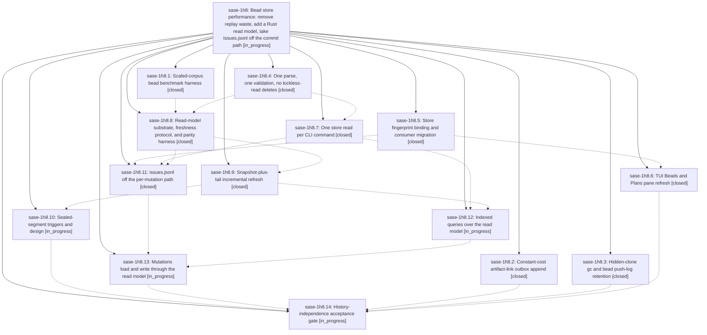

# Bead: sase-1h8 — Bead store performance: remove replay waste, add a Rust read model, take issues.jsonl off the commit path

[Bead Pages](../README.md) / sase-1h8

**Status:** ◐ in_progress · **Type:** ▸ plan · **Tier:** epic
**Owner:** `bryanbugyi34@gmail.com` · **Created by:** [bbugyi200.athena.research.3u.linker.w0](https://github.com/sase-org/sase--agents/blob/main/sessions/bbugyi200.athena.research.3u.linker.w0.md) · **Assignee:** `sase-1h8.land`
**Created:** 2026-10-06 18:59:27 EDT
**Plan:** [202610/bead\_store\_history\_independent\_performance.md](https://github.com/sase-org/sase--plans/blob/main/202610/bead_store_history_independent_performance.md)

## Description

Hot-path bead reads and writes stop scaling with closed history. Every recommendation in the bead-history research report is implemented: the measured waste is removed, a Rust-owned, disposable, fingerprint-validated read model serves current state, issues.jsonl leaves the per-mutation commit path, and the physical sealed-archive design sits behind measured triggers. No bead event is ever edited, compressed in place, or deleted.

## Phases

| Bead | Title | Status | Size | Created | Agents | Commits |
|---|---|---|---|---|---:|---:|
| [sase-1h8.1](sase-1h8.1.md) | Scaled-corpus bead benchmark harness | ✓ closed | medium | 2026-10-06 | 1 | 1 |
| [sase-1h8.10](sase-1h8.10.md) | Sealed-segment triggers and design | ◐ in_progress | small | 2026-10-06 | 1 | 0 |
| [sase-1h8.11](sase-1h8.11.md) | issues.jsonl off the per-mutation path | ✓ closed | medium | 2026-10-06 | 1 | 1 |
| [sase-1h8.12](sase-1h8.12.md) | Indexed queries over the read model | ◐ in_progress | medium | 2026-10-06 | 1 | 0 |
| [sase-1h8.13](sase-1h8.13.md) | Mutations load and write through the read model | ◐ in_progress | large | 2026-10-06 | 1 | 0 |
| [sase-1h8.14](sase-1h8.14.md) | History-independence acceptance gate | ◐ in_progress | medium | 2026-10-06 | 1 | 0 |
| [sase-1h8.2](sase-1h8.2.md) | Constant-cost artifact-link outbox append | ✓ closed | small | 2026-10-06 | 1 | 1 |
| [sase-1h8.3](sase-1h8.3.md) | Hidden-clone gc and bead push-log retention | ✓ closed | small | 2026-10-06 | 1 | 1 |
| [sase-1h8.4](sase-1h8.4.md) | One parse, one validation, no lockless-read deletes | ✓ closed | medium | 2026-10-06 | 1 | 1 |
| [sase-1h8.5](sase-1h8.5.md) | Store fingerprint binding and consumer migration | ✓ closed | medium | 2026-10-06 | 1 | 2 |
| [sase-1h8.6](sase-1h8.6.md) | TUI Beads and Plans pane refresh | ✓ closed | medium | 2026-10-06 | 1 | 2 |
| [sase-1h8.7](sase-1h8.7.md) | One store read per CLI command | ✓ closed | medium | 2026-10-06 | 1 | 3 |
| [sase-1h8.8](sase-1h8.8.md) | Read-model substrate, freshness protocol, and parity harness | ✓ closed | medium | 2026-10-06 | 1 | 2 |
| [sase-1h8.9](sase-1h8.9.md) | Snapshot-plus-tail incremental refresh | ✓ closed | medium | 2026-10-06 | 1 | 1 |

## Lineage

## Agents

| Agent | Bead | Commits |
|---|---|---:|
| [bbugyi200.athena.sase-1h8.1](https://github.com/sase-org/sase--agents/blob/main/agents/bbugyi200.athena.sase-1h8.1/README.md) | [sase-1h8.1](sase-1h8.1.md) | 1 |
| [bbugyi200.athena.sase-1h8.10](https://github.com/sase-org/sase--agents/blob/main/agents/bbugyi200.athena.sase-1h8.10/README.md) | [sase-1h8.10](sase-1h8.10.md) | 0 |
| [bbugyi200.athena.sase-1h8.11](https://github.com/sase-org/sase--agents/blob/main/agents/bbugyi200.athena.sase-1h8.11/README.md) | [sase-1h8.11](sase-1h8.11.md) | 1 |
| [bbugyi200.athena.sase-1h8.12](https://github.com/sase-org/sase--agents/blob/main/agents/bbugyi200.athena.sase-1h8.12/README.md) | [sase-1h8.12](sase-1h8.12.md) | 0 |
| [bbugyi200.athena.sase-1h8.13](https://github.com/sase-org/sase--agents/blob/main/agents/bbugyi200.athena.sase-1h8.13/README.md) | [sase-1h8.13](sase-1h8.13.md) | 0 |
| [bbugyi200.athena.sase-1h8.14](https://github.com/sase-org/sase--agents/blob/main/agents/bbugyi200.athena.sase-1h8.14/README.md) | [sase-1h8.14](sase-1h8.14.md) | 0 |
| [bbugyi200.athena.sase-1h8.2](https://github.com/sase-org/sase--agents/blob/main/sessions/bbugyi200.athena.sase-1h8.2.md) | [sase-1h8.2](sase-1h8.2.md) | 1 |
| [bbugyi200.athena.sase-1h8.3](https://github.com/sase-org/sase--agents/blob/main/sessions/bbugyi200.athena.sase-1h8.3.md) | [sase-1h8.3](sase-1h8.3.md) | 1 |
| [bbugyi200.athena.sase-1h8.4](https://github.com/sase-org/sase--agents/blob/main/agents/bbugyi200.athena.sase-1h8.4/README.md) | [sase-1h8.4](sase-1h8.4.md) | 1 |
| [bbugyi200.athena.sase-1h8.5](https://github.com/sase-org/sase--agents/blob/main/sessions/bbugyi200.athena.sase-1h8.5.md) | [sase-1h8.5](sase-1h8.5.md) | 2 |
| [bbugyi200.athena.sase-1h8.6](https://github.com/sase-org/sase--agents/blob/main/sessions/bbugyi200.athena.sase-1h8.6.md) | [sase-1h8.6](sase-1h8.6.md) | 2 |
| [bbugyi200.athena.sase-1h8.7](https://github.com/sase-org/sase--agents/blob/main/agents/bbugyi200.athena.sase-1h8.7/README.md) | [sase-1h8.7](sase-1h8.7.md) | 3 |
| [bbugyi200.athena.sase-1h8.8](https://github.com/sase-org/sase--agents/blob/main/sessions/bbugyi200.athena.sase-1h8.8.md) | [sase-1h8.8](sase-1h8.8.md) | 2 |
| [bbugyi200.athena.sase-1h8.9](https://github.com/sase-org/sase--agents/blob/main/sessions/bbugyi200.athena.sase-1h8.9.md) | [sase-1h8.9](sase-1h8.9.md) | 1 |
| [bbugyi200.athena.sase-1h8.land](https://github.com/sase-org/sase--agents/blob/main/agents/bbugyi200.athena.sase-1h8.land/README.md) | [sase-1h8](README.md) | 0 |

## Commits

| Repo | Commit | Subject | Bead | Committed |
|---|---|---|---|---|
| sase | [`545caa7`](https://github.com/sase-org/sase/commit/545caa7abdfb746e83900b2fc1590f40635783d2) | feat(outbox): constant-cost artifact-link outbox append (sase-1h8.2) | [sase-1h8.2](sase-1h8.2.md) | 2026-10-06 19:28:48 EDT |
| sase-core | [`sase-core@6573ebb`](https://github.com/sase-org/sase-core/commit/6573ebb0f2853658480086a6c821afdfcb0e7cd0) | feat(beads): one parse, one validation, no lockless-read deletes (sase-1h8.4) | [sase-1h8.4](sase-1h8.4.md) | 2026-10-06 19:40:19 EDT |
| sase | [`69ecdac`](https://github.com/sase-org/sase/commit/69ecdace02734e279daa201590722a5f4209ff5b) | feat(bead): hidden-clone gc and bead push-log retention (sase-1h8.3) | [sase-1h8.3](sase-1h8.3.md) | 2026-10-06 19:41:20 EDT |
| sase-core | [`sase-core@7af3a73`](https://github.com/sase-org/sase-core/commit/7af3a73a427aa248a7e5021fb146160b55a97735) | feat(bead-store): add bead\_store\_fingerprint core binding with stat-only exact key | [sase-1h8.5](sase-1h8.5.md) | 2026-10-06 19:50:32 EDT |
| sase | [`4a7ffac`](https://github.com/sase-org/sase/commit/4a7ffacb6c11c98b6203bb190391fa46b9739558) | feat(bead-store): add bead\_store\_fingerprint binding and migrate five consumers | [sase-1h8.5](sase-1h8.5.md) | 2026-10-06 19:55:09 EDT |
| sase | [`dcda0f0`](https://github.com/sase-org/sase/commit/dcda0f0afd74748b9588d8fb8e2015599d4f5610) | feat(perf): add scaled-corpus bead benchmark harness | [sase-1h8.1](sase-1h8.1.md) | 2026-10-06 21:09:38 EDT |
| sase-core | [`sase-core@0506689`](https://github.com/sase-org/sase-core/commit/0506689b381e7a95eb7507becf1d149b0b829a45) | feat(core): bead board\_snapshot with single-read list/ready/blocked | [sase-1h8.6](sase-1h8.6.md) | 2026-10-06 21:48:15 EDT |
| sase | [`7615e25`](https://github.com/sase-org/sase/commit/7615e253d84c0d14d1863d658d3ed9a66dbffe2f) | feat(tui): board-snapshot bead refresh with one-pass grouping and explicit refresh lanes | [sase-1h8.6](sase-1h8.6.md) | 2026-10-06 22:35:28 EDT |
| sase-core | [`sase-core@bff4860`](https://github.com/sase-org/sase-core/commit/bff4860c273afc0270248c6eeb203dddda466435) | feat(bead): one-replay core support for in-mutation resolution and target probing | [sase-1h8.7](sase-1h8.7.md) | 2026-10-07 00:01:34 EDT |
| sase-core | [`sase-core@91e0e49`](https://github.com/sase-org/sase-core/commit/91e0e49c083119e64118d7e56a6b51b1e0a13e84) | feat(bead): add versioned SQLite read model with freshness token and parity harness | [sase-1h8.8](sase-1h8.8.md) | 2026-10-07 00:57:36 EDT |
| sase | [`7da1570`](https://github.com/sase-org/sase/commit/7da15707ea0331e509f65553b5721f5e465c0d5a) | feat(bead-store): versioned SQLite read model with freshness token and verify-cache (sase-1h8.8) | [sase-1h8.8](sase-1h8.8.md) | 2026-10-07 09:20:33 EDT |
| sase-core | [`sase-core@26ec2d6`](https://github.com/sase-org/sase-core/commit/26ec2d61d9c60eede1596ae7d8c897e74dfb8141) | feat(bead): report update request-order IDs and enforce create parent (sase-1h8.7) | [sase-1h8.7](sase-1h8.7.md) | 2026-10-07 10:19:25 EDT |
| sase | [`b0687d0`](https://github.com/sase-org/sase/commit/b0687d0180e1fe8ff2c1cf8f64bc8db94dab8b47) | feat(bead): one store read per CLI command (sase-1h8.7) | [sase-1h8.7](sase-1h8.7.md) | 2026-10-07 10:48:43 EDT |
| sase-core | [`sase-core@f8d05ef`](https://github.com/sase-org/sase-core/commit/f8d05efc58310eca985f2112afc89379ff7a6636) | feat(bead-read-model): snapshot-plus-tail incremental refresh in sase-core | [sase-1h8.9](sase-1h8.9.md) | 2026-10-07 12:20:26 EDT |
| sase-core | [`sase-core@7df86f4`](https://github.com/sase-org/sase-core/commit/7df86f4a3ae3aa677386d875d3fc5a1f348c376c) | feat(bead): skip projection rewrite on event-store save; add referenced-artifact-ids query (sase-1h8.11) | [sase-1h8.11](sase-1h8.11.md) | 2026-10-07 14:00:07 EDT |

<!-- sase:referenced-by:start -->

## Referenced By

| Relation | Artifact | Why | Uses |
| --- | --- | --- | ---: |
| read-by | [agent:research.3y.final][1] | Check which bead-store perf phases absorb sase-1h5/sase-17r remaining work | 1 |
| read-by | [agent:research.3y.grk][2] | Need epic scope that already landed part of sase-1h5 Beads-pane work | 3 |
| read-by | [agent:sase-1h8.1][3] | parent epic scope | 1 |
| read-by | [agent:sase-1h8.7][4] | Need parent epic scope to verify phase close does not violate ancestor guard | 1 |

[1]: https://github.com/sase-org/sase--agents/blob/main/agents/bbugyi200.athena.research.3y.final/README.md
[2]: https://github.com/sase-org/sase--agents/blob/main/agents/bbugyi200.athena.research.3y.grk/README.md
[3]: https://github.com/sase-org/sase--agents/blob/main/agents/bbugyi200.athena.sase-1h8.1/README.md
[4]: https://github.com/sase-org/sase--agents/blob/main/agents/bbugyi200.athena.sase-1h8.7/README.md

<!-- sase:referenced-by:end -->
