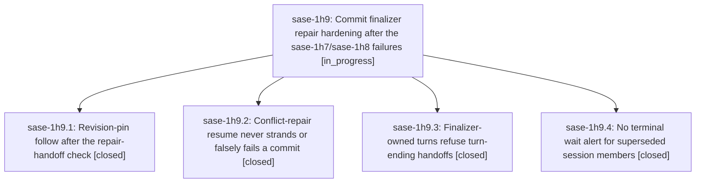

# Bead: sase-1h9 — Commit finalizer repair hardening after the sase-1h7/sase-1h8 failures

[Bead Pages](../README.md) / sase-1h9

**Status:** ◐ in_progress · **Type:** ▸ plan · **Tier:** epic
**Owner:** `bryanbugyi34@gmail.com` · **Created by:** [bbugyi200.athena.0xo](https://github.com/sase-org/sase--agents/blob/main/sessions/bbugyi200.athena.0xo.md) · **Assignee:** `sase-1h9.land`
**Created:** 2026-10-07 07:52:30 EDT
**Plan:** [202610/finalizer\_repair\_hardening.md](https://github.com/sase-org/sase--plans/blob/main/202610/finalizer_repair_hardening.md)

## Description

Host-owned commit completion survives a conflict in a revision-pinned sibling, a conflict-repair turn that already ran `sase stitch create --resume`, and a paused rebase inherited from an earlier run, without stranding or falsely failing work. Finalizer-owned repair turns can no longer hand off and kill their own finalizer, and wait alerts say "can never self-resolve" only when that is true.

## Phases

| Bead | Title | Status | Size | Created | Agents | Commits |
|---|---|---|---|---|---:|---:|
| [sase-1h9.1](sase-1h9.1.md) | Revision-pin follow after the repair-handoff check | ✓ closed | medium | 2026-10-07 | 1 | 1 |
| [sase-1h9.2](sase-1h9.2.md) | Conflict-repair resume never strands or falsely fails a commit | ✓ closed | medium | 2026-10-07 | 1 | 1 |
| [sase-1h9.3](sase-1h9.3.md) | Finalizer-owned turns refuse turn-ending handoffs | ✓ closed | medium | 2026-10-07 | 1 | 1 |
| [sase-1h9.4](sase-1h9.4.md) | No terminal wait alert for superseded session members | ✓ closed | small | 2026-10-07 | 1 | 1 |

## Lineage

## Agents

| Agent | Bead | Commits |
|---|---|---:|
| [bbugyi200.athena.sase-1h9.1](https://github.com/sase-org/sase--agents/blob/main/agents/bbugyi200.athena.sase-1h9.1/README.md) | [sase-1h9.1](sase-1h9.1.md) | 1 |
| [bbugyi200.athena.sase-1h9.2](https://github.com/sase-org/sase--agents/blob/main/sessions/bbugyi200.athena.sase-1h9.2.md) | [sase-1h9.2](sase-1h9.2.md) | 1 |
| [bbugyi200.athena.sase-1h9.3](https://github.com/sase-org/sase--agents/blob/main/agents/bbugyi200.athena.sase-1h9.3/README.md) | [sase-1h9.3](sase-1h9.3.md) | 1 |
| [bbugyi200.athena.sase-1h9.4](https://github.com/sase-org/sase--agents/blob/main/agents/bbugyi200.athena.sase-1h9.4/README.md) | [sase-1h9.4](sase-1h9.4.md) | 1 |
| [bbugyi200.athena.sase-1h9.land](https://github.com/sase-org/sase--agents/blob/main/agents/bbugyi200.athena.sase-1h9.land/README.md) | [sase-1h9](README.md) | 0 |

## Commits

| Repo | Commit | Subject | Bead | Committed |
|---|---|---|---|---|
| sase | [`9e5cc41`](https://github.com/sase-org/sase/commit/9e5cc41598ffc07e6ec725a78ec4ec8e60c25bad) | feat(finalizers): refuse turn-ending handoffs on finalizer-owned turns | [sase-1h9.3](sase-1h9.3.md) | 2026-10-07 08:10:48 EDT |
| sase | [`da0aad1`](https://github.com/sase-org/sase/commit/da0aad15f210b4c9bc54e8d74dfc22042b0d65d7) | fix(finalizer): write revision pin after repair-remaining handoff (sase-1h9.1) | [sase-1h9.1](sase-1h9.1.md) | 2026-10-07 08:43:46 EDT |
| sase | [`91e6c64`](https://github.com/sase-org/sase/commit/91e6c645728acceb8b64feeeddea8996587bc418) | fix(wait): stop terminal blockers alerting on superseded members | [sase-1h9.4](sase-1h9.4.md) | 2026-10-07 08:48:31 EDT |
| sase | [`5230c30`](https://github.com/sase-org/sase/commit/5230c3080e4fa07997f9d9c67ee55135d1914261) | feat(commit): add dispatch conflict repair resume and workflow resume recovery | [sase-1h9.2](sase-1h9.2.md) | 2026-10-07 09:02:23 EDT |
