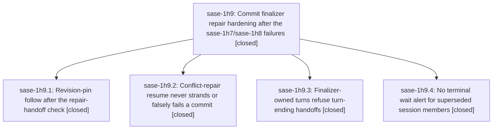

# Bead: sase-1h9 — Commit finalizer repair hardening after the sase-1h7/sase-1h8 failures

[Bead Pages](../README.md) / sase-1h9

**Status:** ✓ closed · **Resolution:** done · **Type:** ▸ plan · **Tier:** epic
**Owner:** `bryanbugyi34@gmail.com` · **Created by:** [bbugyi200.athena.0xo](https://github.com/sase-org/sase--agents/blob/main/sessions/bbugyi200.athena.0xo.md) · **Assignee:** `sase-1h9.land`
**Created:** 2026-10-07 07:52:30 EDT · **Closed:** 2026-10-07 09:27:03 EDT
**Plan:** [202610/finalizer\_repair\_hardening.md](https://github.com/sase-org/sase--plans/blob/main/202610/finalizer_repair_hardening.md)

## Description

Host-owned commit completion survives a conflict in a revision-pinned sibling, a conflict-repair turn that already ran `sase stitch create --resume`, and a paused rebase inherited from an earlier run, without stranding or falsely failing work. Finalizer-owned repair turns can no longer hand off and kill their own finalizer, and wait alerts say "can never self-resolve" only when that is true.

## Notes

[2026-10-07T13:27:03Z · sase-1h9.land] Verified complete on master 5230c3080e (HEAD == origin/master after fetch). All four phase commits match the plan and the closed phase notes.

sase-1h9.1 da0aad15f2: _follow_pinned_sibling_pin runs after _record_executed_repo and, on a repaired conflict, after _apply_repair_remaining_handoff. main_is_commit is taken from the post-handoff pending decisions, and a successful pin refreshes dirty state. tests/test_commit_revision_pin_dispatch.py covers success, the stale-declaration guard, and deferred main.

sase-1h9.2 5230c3080e: resume_commit_workflow checks unpushed commits before _finish_no_commit_resume and adopts a provenance-matching HEAD through finalize_commit; a mismatch fails closed and keeps the checkpoint. resolve_commit_conflict verifies repository state when the repair turn already consumed the run-owned checkpoint. A clean repo that is ahead fails unpushed_after_repair and is not reported resolved_without_commit.

sase-1h9.3 9e5cc41598: finalizer_owned_turn_is_active is the shared guard. Monitor start refuses before any monitor record (start_flow and the CLI handler). write_pending_handoff_marker and handoff_guard refuse pipe, plan propose, and questions. Gate creation uses the same check. is_joinable is false in a finalizer-owned turn. A bypass is named finalizer_turn_handoff, and a shell handoff no longer records completed while finalizer_result.json says failed.

sase-1h9.4 91e6c64572: terminal blockers are the newest failed member only, and not when a newer member may still run or a monitor's launched follow-up materialized. No sase-core query owns this; the Python index is the implementation. Hood and session regression tests are present.

Integration: the only nearby non-epic commit is cf88fd924f, 15s before the epic existed, and it only splits tests/perf/_bead_corpus*.py. Nothing since epic start outside these four commits, and origin/master has nothing this branch lacks. No caller needed a new integration edit.

Epic symbols: none.

Follow-ups:
- sase-1h9.1 #1 and sase-1h9.2 #1 (for_epic= inserted ahead of hood= in wait completion, including test_failure_degradation_retains_static_directive_rows): one defect, reproduced in isolation. DISCOVERED ISSUE noted on in-progress epic sase-1h7. No task.
- sase-1h9.2 #2 (assert 3570 < 3570 in test_tui_app_import_stays_under_startup_budget): reproduced on this tree. Same node and strict-cap saturation as sase-13p. +1 --verified-after-close reopened sase-13p to ready. sase-13r was not corroborated; its close says it is a superseded duplicate of sase-13p.
- sase-1h9.3 #1 and sase-1h9.4 #1 (stale content-layout schema, missing normalize_macro_config_layer): declined. The installed binding is schema 7 and exports normalize_macro_config_layer. tests/test_agent_identity_facade.py and the neighbor-lane hood tests passed (20). Those reports were binding lag during the epic.
- sase-1h9.3 #2 (kill an already-spawned monitor continuation): declined. refuse_finalizer_owned_monitor_start runs before any monitor record, and the shared handoff-marker writer refuses too, so that continuation cannot be spawned from a finalizer-owned turn. A bypass that still leaves a marker is already named finalizer_turn_handoff and gets a failed done outcome.

## Phases

| Bead | Title | Status | Size | Created | Agents | Commits |
|---|---|---|---|---|---:|---:|
| [sase-1h9.1](sase-1h9.1.md) | Revision-pin follow after the repair-handoff check | ✓ closed | medium | 2026-10-07 | 1 | 1 |
| [sase-1h9.2](sase-1h9.2.md) | Conflict-repair resume never strands or falsely fails a commit | ✓ closed | medium | 2026-10-07 | 1 | 1 |
| [sase-1h9.3](sase-1h9.3.md) | Finalizer-owned turns refuse turn-ending handoffs | ✓ closed | medium | 2026-10-07 | 1 | 1 |
| [sase-1h9.4](sase-1h9.4.md) | No terminal wait alert for superseded session members | ✓ closed | small | 2026-10-07 | 1 | 1 |

## Lineage

## Agents

| Agent | Bead | Commits |
|---|---|---:|
| [bbugyi200.athena.sase-1h9.1](https://github.com/sase-org/sase--agents/blob/main/agents/bbugyi200.athena.sase-1h9.1/README.md) | [sase-1h9.1](sase-1h9.1.md) | 1 |
| [bbugyi200.athena.sase-1h9.2](https://github.com/sase-org/sase--agents/blob/main/sessions/bbugyi200.athena.sase-1h9.2.md) | [sase-1h9.2](sase-1h9.2.md) | 1 |
| [bbugyi200.athena.sase-1h9.3](https://github.com/sase-org/sase--agents/blob/main/agents/bbugyi200.athena.sase-1h9.3/README.md) | [sase-1h9.3](sase-1h9.3.md) | 1 |
| [bbugyi200.athena.sase-1h9.4](https://github.com/sase-org/sase--agents/blob/main/agents/bbugyi200.athena.sase-1h9.4/README.md) | [sase-1h9.4](sase-1h9.4.md) | 1 |
| [bbugyi200.athena.sase-1h9.land](https://github.com/sase-org/sase--agents/blob/main/agents/bbugyi200.athena.sase-1h9.land/README.md) | [sase-1h9](README.md) | 1 |

## Commits

| Repo | Commit | Subject | Bead | Committed |
|---|---|---|---|---|
| sase | [`9e5cc41`](https://github.com/sase-org/sase/commit/9e5cc41598ffc07e6ec725a78ec4ec8e60c25bad) | feat(finalizers): refuse turn-ending handoffs on finalizer-owned turns | [sase-1h9.3](sase-1h9.3.md) | 2026-10-07 08:10:48 EDT |
| sase | [`da0aad1`](https://github.com/sase-org/sase/commit/da0aad15f210b4c9bc54e8d74dfc22042b0d65d7) | fix(finalizer): write revision pin after repair-remaining handoff (sase-1h9.1) | [sase-1h9.1](sase-1h9.1.md) | 2026-10-07 08:43:46 EDT |
| sase | [`91e6c64`](https://github.com/sase-org/sase/commit/91e6c645728acceb8b64feeeddea8996587bc418) | fix(wait): stop terminal blockers alerting on superseded members | [sase-1h9.4](sase-1h9.4.md) | 2026-10-07 08:48:31 EDT |
| sase | [`5230c30`](https://github.com/sase-org/sase/commit/5230c3080e4fa07997f9d9c67ee55135d1914261) | feat(commit): add dispatch conflict repair resume and workflow resume recovery | [sase-1h9.2](sase-1h9.2.md) | 2026-10-07 09:02:23 EDT |
| sase--plans | [`sase--plans@844b758`](https://github.com/sase-org/sase--plans/commit/844b7589d6b6e864d24f8726b1c246242b568595) | docs(plan): mark finalizer repair hardening done (sase-1h9) | [sase-1h9](README.md) | 2026-10-07 09:29:25 EDT |
