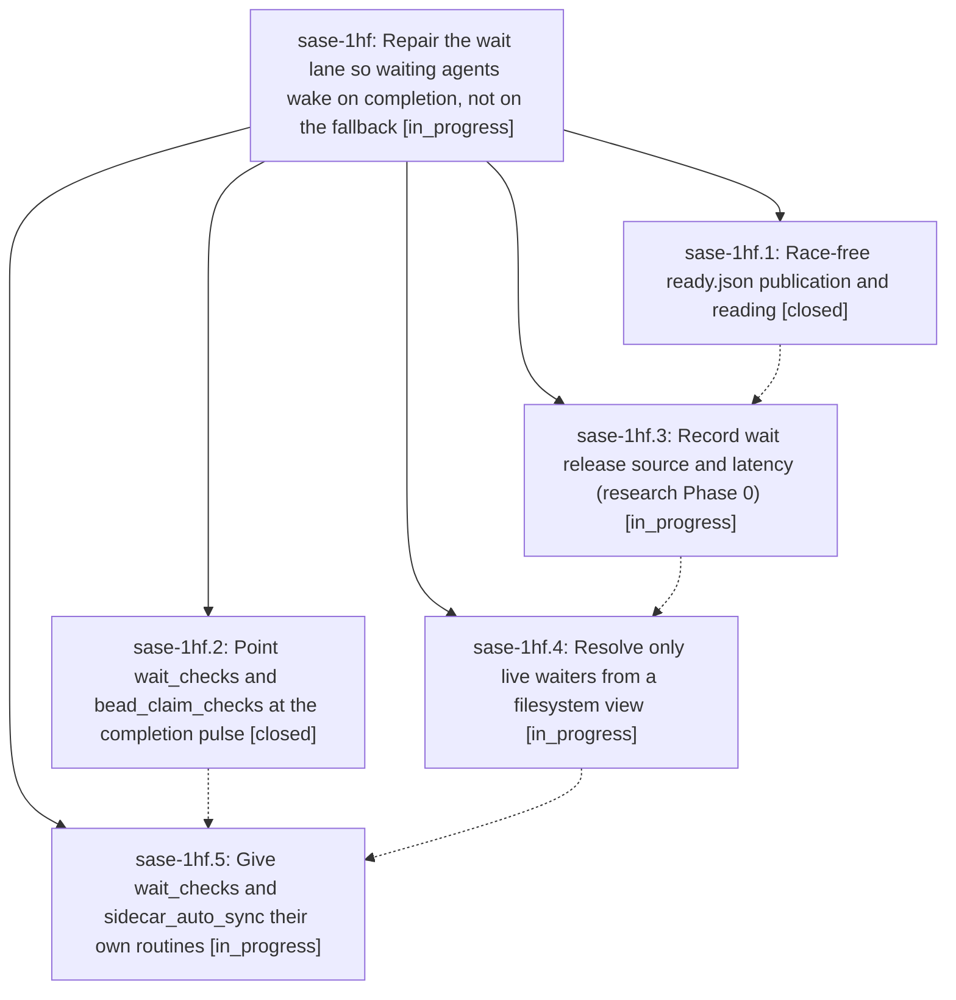

# Bead: sase-1hf — Repair the wait lane so waiting agents wake on completion, not on the fallback

[Bead Pages](../README.md) / sase-1hf

**Status:** ◐ in_progress · **Type:** ▸ plan · **Tier:** epic
**Owner:** `bryanbugyi34@gmail.com` · **Created by:** [bbugyi200.athena.0y0](https://github.com/sase-org/sase--agents/blob/main/sessions/bbugyi200.athena.0y0.md) · **Assignee:** `sase-1hf.land`
**Created:** 2026-10-07 14:45:42 EDT
**Plan:** [202610/wait\_lane\_repair.md](https://github.com/sase-org/sase--plans/blob/main/202610/wait_lane_repair.md)

## Description

Agent dependency waits are released by wait_checks within seconds of the dependency finishing (instead of by the runner's 60 s fallback), ready.json publication is race-free, every release records its source and latency, and wait_checks runs in its own fast lane resolving only live waiters.

## Phases

| Bead | Title | Status | Size | Created | Agents | Commits |
|---|---|---|---|---|---:|---:|
| [sase-1hf.1](sase-1hf.1.md) | Race-free ready.json publication and reading | ✓ closed | small | 2026-10-07 | 1 | 1 |
| [sase-1hf.2](sase-1hf.2.md) | Point wait\_checks and bead\_claim\_checks at the completion pulse | ✓ closed | small | 2026-10-07 | 1 | 1 |
| [sase-1hf.3](sase-1hf.3.md) | Record wait release source and latency (research Phase 0) | ◐ in_progress | medium | 2026-10-07 | 1 | 0 |
| [sase-1hf.4](sase-1hf.4.md) | Resolve only live waiters from a filesystem view | ◐ in_progress | medium | 2026-10-07 | 1 | 0 |
| [sase-1hf.5](sase-1hf.5.md) | Give wait\_checks and sidecar\_auto\_sync their own routines | ◐ in_progress | small | 2026-10-07 | 1 | 0 |

## Lineage

## Agents

| Agent | Bead | Commits |
|---|---|---:|
| [bbugyi200.athena.sase-1hf.1](https://github.com/sase-org/sase--agents/blob/main/agents/bbugyi200.athena.sase-1hf.1/README.md) | [sase-1hf.1](sase-1hf.1.md) | 1 |
| [bbugyi200.athena.sase-1hf.2](https://github.com/sase-org/sase--agents/blob/main/agents/bbugyi200.athena.sase-1hf.2/README.md) | [sase-1hf.2](sase-1hf.2.md) | 1 |
| [bbugyi200.athena.sase-1hf.3](https://github.com/sase-org/sase--agents/blob/main/agents/bbugyi200.athena.sase-1hf.3/README.md) | [sase-1hf.3](sase-1hf.3.md) | 0 |
| [bbugyi200.athena.sase-1hf.4](https://github.com/sase-org/sase--agents/blob/main/agents/bbugyi200.athena.sase-1hf.4/README.md) | [sase-1hf.4](sase-1hf.4.md) | 0 |
| [bbugyi200.athena.sase-1hf.5](https://github.com/sase-org/sase--agents/blob/main/agents/bbugyi200.athena.sase-1hf.5/README.md) | [sase-1hf.5](sase-1hf.5.md) | 0 |
| [bbugyi200.athena.sase-1hf.land](https://github.com/sase-org/sase--agents/blob/main/agents/bbugyi200.athena.sase-1hf.land/README.md) | [sase-1hf](README.md) | 0 |

## Commits

| Repo | Commit | Subject | Bead | Committed |
|---|---|---|---|---|
| sase | [`ea7d138`](https://github.com/sase-org/sase/commit/ea7d1388db061f2f4c0233e5a7dd650b292dcfb3) | fix(axe): fire wait fs triggers on dependency pulse, not artifact glob | [sase-1hf.2](sase-1hf.2.md) | 2026-10-07 15:16:35 EDT |
| sase | [`4cbfe00`](https://github.com/sase-org/sase/commit/4cbfe00d979c956a52e93a5f188da1037316107c) | fix(axe): atomically publish agent wait ready markers | [sase-1hf.1](sase-1hf.1.md) | 2026-10-07 15:38:17 EDT |
