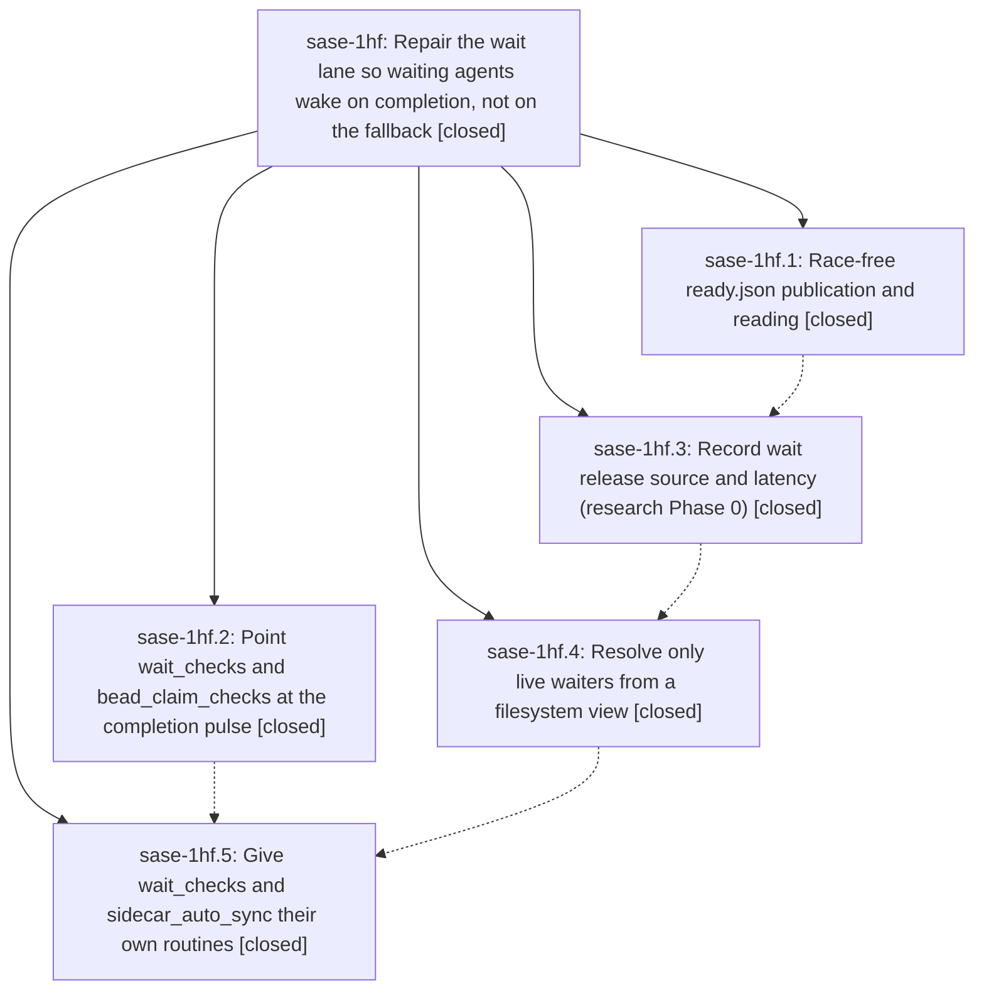

# Bead: sase-1hf — Repair the wait lane so waiting agents wake on completion, not on the fallback

[Bead Pages](../README.md) / sase-1hf

**Status:** ✓ closed · **Resolution:** done · **Type:** ▸ plan · **Tier:** epic
**Owner:** `bryanbugyi34@gmail.com` · **Created by:** [bbugyi200.athena.0y0](https://github.com/sase-org/sase--agents/blob/main/sessions/bbugyi200.athena.0y0.md) · **Assignee:** `sase-1hf.land`
**Created:** 2026-10-07 14:45:42 EDT · **Closed:** 2026-10-07 23:01:30 EDT
**Plan:** [202610/wait\_lane\_repair.md](https://github.com/sase-org/sase--plans/blob/main/202610/wait_lane_repair.md)

<!-- sase:links:start -->

## Links

| Relation | Artifact | Why |
| --- | --- | --- |
| implemented-by | [plan:202610/wait_lane_repair.md][1] | derived from the plan's `bead_id:` frontmatter field |
| related | [bead:sase-1hj][2] | Proposed by the sase-1hf wait-lane repair epic (sase-1hf.5 PROPOSED FOLLOW-UP note #1); see its plan and telemetry keys |
| related | [bead:sase-1hl][3] | Proposed by the sase-1hf wait-lane repair epic (sase-1hf.5 PROPOSED FOLLOW-UP note #1); see its plan and telemetry keys |
| related | [bead:sase-1hm][4] | Proposed by the sase-1hf wait-lane repair epic (sase-1hf.5 PROPOSED FOLLOW-UP note #1); see its plan and telemetry keys |
| related | [bead:sase-1hn][5] | Proposed by the sase-1hf wait-lane repair epic (sase-1hf.5 PROPOSED FOLLOW-UP note #1); see its plan and telemetry keys |
| related | [bead:sase-1ho][6] | Proposed by the sase-1hf wait-lane repair epic (sase-1hf.5 PROPOSED FOLLOW-UP note #1); see its plan and telemetry keys |
| related | [bead:sase-1hp][7] | Exposed by the sase-1hf landing, which deleted the masking dead private helper; active-epic portions were routed as DISCOVERED ISSUE notes |

_Plus 1 automatic references — see [Referenced By](#referenced-by)._

[1]: https://github.com/sase-org/sase--plans/blob/main/202610/wait_lane_repair.md
[2]: https://github.com/sase-org/sase--beads/blob/main/pages/sase-1hj/README.md
[3]: https://github.com/sase-org/sase--beads/blob/main/pages/sase-1hl/README.md
[4]: https://github.com/sase-org/sase--beads/blob/main/pages/sase-1hm/README.md
[5]: https://github.com/sase-org/sase--beads/blob/main/pages/sase-1hn/README.md
[6]: https://github.com/sase-org/sase--beads/blob/main/pages/sase-1ho/README.md
[7]: https://github.com/sase-org/sase--beads/blob/main/pages/sase-1hp/README.md

<!-- sase:links:end -->

## Description

Agent dependency waits are released by wait_checks within seconds of the dependency finishing (instead of by the runner's 60 s fallback), ready.json publication is race-free, every release records its source and latency, and wait_checks runs in its own fast lane resolving only live waiters.

## Notes

[2026-10-08T03:01:30Z · sase-1hf.land] sase-1hf landed and verified on master 3a4178b15a.

VERIFIED (code + commits vs plan):
- .1 atomic-ready (4cbfe00d97): publish_ready_marker uses temp + fsync + no-clobber link, first writer wins, and skips when waiting.json is gone. read_ready_result returns False on torn/empty/non-dict markers. The TUI writer is unchanged.
- .2 pulse-trigger (ea7d1388db): wait_checks and bead_claim_checks fs triggers watch */artifacts/.ace_refresh_pulse (max_quiet 120s). Dependency-carrying write_waiting_marker and TUI wait edits touch the pulse; slot-queue markers do not. The done.json audit is recorded on .2 note #1.
- .3 release-telemetry (62604c10b7): wait_release_source, satisfied-at, and release/admission/slot-wait latency stamped once. ready.json gains released_by and dependencies_satisfied_at.
- .4 live-waiters (68a4e89ac4): sase.axe.wait_marker_scan walk plus tri-state liveness. Dead waiters are skipped, with no view build when none is live. Resolution uses filesystem rows and adds live/dead/unknown counters. sidecar_auto_sync reuses the walk. Refresh-safety answer and timings are in .4 notes #1-2.
- .5 lane-split (3a4178b15a): agent_waits (2 s, wait_checks) and sidecar_sync (30 s) routines, a post-beads-sync pulse, and a 0.5 s runner ready poll with the 60 s fallback unchanged. Docs list nine routines.
Every child note was addressed or triaged below.

INTEGRATION FIXES IN THIS LANDING:
- tests/test_axe_chop_wait_checks_epic_follow_safety.py::test_land_failure_entry_clears_when_waiter_releases was red, caused by .3's released_by payload meeting the concurrent sase-1h7.7 test. Assertion updated.
- Symvision's private rule masked its unused-public rule. Deleted the dead _list_bead_state_changes_silent (orphaned by 39dc48f03c). Resolved this epic's newly visible symbols: privatized _DependencyResolution/_ReadyResult (run_agent_wait_deps) and _WaitMarkerScan; deleted wait_rows_from_index_records plus its dead _agent_meta_mapping, since .4 removed wait_checks' index route.
- docs/notifications.md: dead waiters are never notified.
- Closed READY research tasks the epic implemented, as superseded: sase-1hc (.1), sase-1hb (.2/.5), sase-1hd (.4/.5; its deferred items went to new tasks).
- epic-symbols: none.

VERIFICATION: 291+248 targeted wait/sidecar/trigger/telemetry tests pass. sase tool run check 9bb56b96a638a23b1db69022245976fb ran with the landing diff and the full suite (escalated): fmt, mypy, ruff, SASE validation, and every other lint pass. Red stages: symvision (62 unmasked unused publics from other beads, plus initial_dependencies_resolved, orphaned by sase-1h7.5); committed plans (sase-core plan-decisions callout panic); 15 tests. On a clean tree via stash, 12 of the 15 fail identically. The other three are load flakes: 2 deck pilot tests and the utf8 stream test. The epic-follow test failed only on the clean tree; this landing fixes it.

FOLLOW-UPS:
- .5 consolidated list -> new tasks sase-1hj (lengthen fallback, telemetry-gated), sase-1hk (full-history index query / bead_claim_checks 33 s), sase-1hl (leaked ace-run lock files), sase-1hm (archive dead waiting.json), sase-1hn (scoped resolution / event-wake), sase-1ho (admission latency).
- Base failures from phase notes: timezone guard -> DISCOVERED ISSUE on sase-1h7 (sase-1h7.8 sites); bead fast-path x3 -> +1 sase-1cn; land-failure test -> fixed here.
- Declined: muse usage probe (passes at HEAD); beads README drift (SASE validation passes); _runs private imports (gone; sase-1h6 noted); stale sase-1h7.8 epic-symbol (already removed); stale sase_core_rs binding (workspace env, rebuilt).
- Found while landing:
  - DISCOVERED ISSUE notes on sase-1h7 (unused epic-follow publics, initial_dependencies_resolved), sase-1h8 (unused publics; claimed_status list_issue_page), sase-1hi (unused publics; provenance keys in 3 tests), sase-1hi.1.1 (callout.rs char-boundary panic; plan_validate decisions key), sase-116 (route_bead_targets).
  - New tasks: sase-1hp (closed-owner symvision backlog), sase-1hr (macro terminology allowlist), sase-1hs (finalizer external-race test), sase-1ht (utf8 stream flake).
  - +1s: sase-13p (import budget), sase-1bl (deck pilot).

## Phases

| Bead | Title | Status | Size | Created | Agents | Commits |
|---|---|---|---|---|---:|---:|
| [sase-1hf.1](sase-1hf.1.md) | Race-free ready.json publication and reading | ✓ closed | small | 2026-10-07 | 1 | 1 |
| [sase-1hf.2](sase-1hf.2.md) | Point wait\_checks and bead\_claim\_checks at the completion pulse | ✓ closed | small | 2026-10-07 | 1 | 1 |
| [sase-1hf.3](sase-1hf.3.md) | Record wait release source and latency (research Phase 0) | ✓ closed | medium | 2026-10-07 | 1 | 1 |
| [sase-1hf.4](sase-1hf.4.md) | Resolve only live waiters from a filesystem view | ✓ closed | medium | 2026-10-07 | 1 | 1 |
| [sase-1hf.5](sase-1hf.5.md) | Give wait\_checks and sidecar\_auto\_sync their own routines | ✓ closed | small | 2026-10-07 | 1 | 1 |

## Lineage

## Agents

| Agent | Bead | Commits |
|---|---|---:|
| [bbugyi200.athena.sase-1hf.1](https://github.com/sase-org/sase--agents/blob/main/agents/bbugyi200.athena.sase-1hf.1/README.md) | [sase-1hf.1](sase-1hf.1.md) | 1 |
| [bbugyi200.athena.sase-1hf.2](https://github.com/sase-org/sase--agents/blob/main/agents/bbugyi200.athena.sase-1hf.2/README.md) | [sase-1hf.2](sase-1hf.2.md) | 1 |
| [bbugyi200.athena.sase-1hf.3](https://github.com/sase-org/sase--agents/blob/main/sessions/bbugyi200.athena.sase-1hf.3.md) | [sase-1hf.3](sase-1hf.3.md) | 1 |
| [bbugyi200.athena.sase-1hf.4](https://github.com/sase-org/sase--agents/blob/main/agents/bbugyi200.athena.sase-1hf.4/README.md) | [sase-1hf.4](sase-1hf.4.md) | 1 |
| [bbugyi200.athena.sase-1hf.5](https://github.com/sase-org/sase--agents/blob/main/sessions/bbugyi200.athena.sase-1hf.5.md) | [sase-1hf.5](sase-1hf.5.md) | 1 |
| [bbugyi200.athena.sase-1hf.land](https://github.com/sase-org/sase--agents/blob/main/agents/bbugyi200.athena.sase-1hf.land/README.md) | [sase-1hf](README.md) | 2 |

## Commits

| Repo | Commit | Subject | Bead | Committed |
|---|---|---|---|---|
| sase | [`ea7d138`](https://github.com/sase-org/sase/commit/ea7d1388db061f2f4c0233e5a7dd650b292dcfb3) | fix(axe): fire wait fs triggers on dependency pulse, not artifact glob | [sase-1hf.2](sase-1hf.2.md) | 2026-10-07 15:16:35 EDT |
| sase | [`4cbfe00`](https://github.com/sase-org/sase/commit/4cbfe00d979c956a52e93a5f188da1037316107c) | fix(axe): atomically publish agent wait ready markers | [sase-1hf.1](sase-1hf.1.md) | 2026-10-07 15:38:17 EDT |
| sase | [`62604c1`](https://github.com/sase-org/sase/commit/62604c10b7b01af1dd28cd43404d6728c2c3a375) | feat(wait): add release telemetry for wait dependency resolution | [sase-1hf.3](sase-1hf.3.md) | 2026-10-07 17:28:12 EDT |
| sase | [`68a4e89`](https://github.com/sase-org/sase/commit/68a4e89ac48165b789729bb117fa7261dad678ee) | feat(wait): resolve only live waiters from a filesystem view | [sase-1hf.4](sase-1hf.4.md) | 2026-10-07 18:13:29 EDT |
| sase | [`3a4178b`](https://github.com/sase-org/sase/commit/3a4178b15ae6af2511631c8c74852c0b868156cf) | feat(axe): split wait\_checks and sidecar auto-sync into dedicated routines | [sase-1hf.5](sase-1hf.5.md) | 2026-10-07 19:41:12 EDT |
| sase | [`c3f9d29`](https://github.com/sase-org/sase/commit/c3f9d2915c62f27406141bb8d3dcf910d40a91c1) | fix(wait): land sase-1hf wait-lane repair integration and symvision cleanup | [sase-1hf](README.md) | 2026-10-07 23:32:38 EDT |
| sase--plans | [`sase--plans@7ab68c3`](https://github.com/sase-org/sase--plans/commit/7ab68c30dee3cfa50f662d2c3e9770b356eb3f93) | chore(plans): mark wait\_lane\_repair plan done after sase-1hf landing | [sase-1hf](README.md) | 2026-10-07 23:37:39 EDT |

<!-- sase:referenced-by:start -->

## Referenced By

| Relation | Artifact | Why | Uses |
| --- | --- | --- | ---: |
| read-by | [agent:sase-1hf.land][1] | Need the epic scope, children, and linked plan file | 1 |

[1]: https://github.com/sase-org/sase--agents/blob/main/agents/bbugyi200.athena.sase-1hf.land/README.md

<!-- sase:referenced-by:end -->
