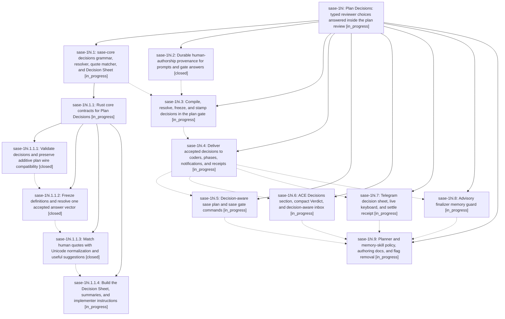

# Bead: sase-1hi — Plan Decisions: typed reviewer choices answered inside the plan review

[Bead Pages](../README.md) / sase-1hi

**Status:** ◐ in_progress · **Type:** ▸ plan · **Tier:** epic
**Owner:** `bryanbugyi34@gmail.com` · **Created by:** [bbugyi200.apollo.5n](https://github.com/sase-org/sase--agents/blob/main/sessions/bbugyi200.apollo.5n.md) · **Assignee:** `sase-1hi.land`
**Created:** 2026-10-07 18:48:22 EDT
**Plan:** [202610/plan\_decisions.md](https://github.com/sase-org/sase--plans/blob/main/202610/plan_decisions.md)

<!-- sase:links:start -->

## Links

| Relation | Artifact | Why |
| --- | --- | --- |
| implemented-by | [plan:202610/plan_decisions.md][1] | derived from the plan's `bead_id:` frontmatter field |

[1]: https://github.com/sase-org/sase--plans/blob/main/202610/plan_decisions.md

<!-- sase:links:end -->

## Description

A tale or epic can declare up to five typed, defaulted Plan Decisions (toggles, 2-5-way choices, and memory consents) in a `decisions:` frontmatter map. The reviewer answers them in the same plan review on ACE, Telegram, or the CLI, and the primary action always approves exactly the values on display. `%auto` takes verified defaults and posts a quiet receipt. Answers are recorded once in the gate response and stamped into the archived plan. Every implementer receives them mechanically, and a plan authorizes a memory edit only through an accepted memory decision.

## Phases

| Bead | Title | Status | Size | Created | Agents | Commits |
|---|---|---|---|---|---:|---:|
| [sase-1hi.1](sase-1hi.1.md) | sase-core decisions grammar, resolver, quote matcher, and Decision Sheet | ◐ in_progress | large | 2026-10-07 | 1 | 0 |
| [sase-1hi.2](sase-1hi.2.md) | Durable human-authorship provenance for prompts and gate answers | ✓ closed | medium | 2026-10-07 | 1 | 1 |
| [sase-1hi.3](sase-1hi.3.md) | Compile, resolve, freeze, and stamp decisions in the plan gate | ◐ in_progress | large | 2026-10-07 | 1 | 0 |
| [sase-1hi.4](sase-1hi.4.md) | Deliver accepted decisions to coders, phases, notifications, and receipts | ◐ in_progress | medium | 2026-10-07 | 1 | 0 |
| [sase-1hi.5](sase-1hi.5.md) | Decision-aware sase plan and sase gate commands | ◐ in_progress | medium | 2026-10-07 | 1 | 0 |
| [sase-1hi.6](sase-1hi.6.md) | ACE Decisions section, compact Verdict, and decision-aware inbox | ◐ in_progress | large | 2026-10-07 | 1 | 0 |
| [sase-1hi.7](sase-1hi.7.md) | Telegram decision sheet, live keyboard, and settle receipt | ◐ in_progress | large | 2026-10-07 | 1 | 0 |
| [sase-1hi.8](sase-1hi.8.md) | Advisory finalizer memory guard | ◐ in_progress | medium | 2026-10-07 | 1 | 0 |
| [sase-1hi.9](sase-1hi.9.md) | Planner and memory-skill policy, authoring docs, and flag removal | ◐ in_progress | medium | 2026-10-07 | 1 | 0 |

## Lineage

## Agents

| Agent | Bead | Commits |
|---|---|---:|
| [bbugyi200.apollo.sase-1hi.1](https://github.com/sase-org/sase--agents/blob/main/sessions/bbugyi200.apollo.sase-1hi.1.md) | [sase-1hi.1](sase-1hi.1.md) | 0 |
| [bbugyi200.apollo.sase-1hi.1.1.1](https://github.com/sase-org/sase--agents/blob/main/agents/bbugyi200.apollo.sase-1hi.1.1.1/README.md) | [sase-1hi.1.1.1](sase-1hi.1.1.1.md) | 1 |
| [bbugyi200.apollo.sase-1hi.1.1.2](https://github.com/sase-org/sase--agents/blob/main/agents/bbugyi200.apollo.sase-1hi.1.1.2/README.md) | [sase-1hi.1.1.2](sase-1hi.1.1.2.md) | 1 |
| [bbugyi200.apollo.sase-1hi.1.1.3](https://github.com/sase-org/sase--agents/blob/main/agents/bbugyi200.apollo.sase-1hi.1.1.3/README.md) | [sase-1hi.1.1.3](sase-1hi.1.1.3.md) | 1 |
| [bbugyi200.apollo.sase-1hi.1.1.4](https://github.com/sase-org/sase--agents/blob/main/agents/bbugyi200.apollo.sase-1hi.1.1.4/README.md) | [sase-1hi.1.1.4](sase-1hi.1.1.4.md) | 0 |
| [bbugyi200.apollo.sase-1hi.1.1.land](https://github.com/sase-org/sase--agents/blob/main/agents/bbugyi200.apollo.sase-1hi.1.1.land/README.md) | [sase-1hi.1.1](sase-1hi.1.1.md) | 0 |
| [bbugyi200.apollo.sase-1hi.2](https://github.com/sase-org/sase--agents/blob/main/agents/bbugyi200.apollo.sase-1hi.2/README.md) | [sase-1hi.2](sase-1hi.2.md) | 1 |
| [bbugyi200.apollo.sase-1hi.3](https://github.com/sase-org/sase--agents/blob/main/agents/bbugyi200.apollo.sase-1hi.3/README.md) | [sase-1hi.3](sase-1hi.3.md) | 0 |
| [bbugyi200.apollo.sase-1hi.4](https://github.com/sase-org/sase--agents/blob/main/agents/bbugyi200.apollo.sase-1hi.4/README.md) | [sase-1hi.4](sase-1hi.4.md) | 0 |
| [bbugyi200.apollo.sase-1hi.5](https://github.com/sase-org/sase--agents/blob/main/agents/bbugyi200.apollo.sase-1hi.5/README.md) | [sase-1hi.5](sase-1hi.5.md) | 0 |
| [bbugyi200.apollo.sase-1hi.6](https://github.com/sase-org/sase--agents/blob/main/agents/bbugyi200.apollo.sase-1hi.6/README.md) | [sase-1hi.6](sase-1hi.6.md) | 0 |
| [bbugyi200.apollo.sase-1hi.7](https://github.com/sase-org/sase--agents/blob/main/agents/bbugyi200.apollo.sase-1hi.7/README.md) | [sase-1hi.7](sase-1hi.7.md) | 0 |
| [bbugyi200.apollo.sase-1hi.8](https://github.com/sase-org/sase--agents/blob/main/agents/bbugyi200.apollo.sase-1hi.8/README.md) | [sase-1hi.8](sase-1hi.8.md) | 0 |
| [bbugyi200.apollo.sase-1hi.9](https://github.com/sase-org/sase--agents/blob/main/agents/bbugyi200.apollo.sase-1hi.9/README.md) | [sase-1hi.9](sase-1hi.9.md) | 0 |
| [bbugyi200.apollo.sase-1hi.land](https://github.com/sase-org/sase--agents/blob/main/agents/bbugyi200.apollo.sase-1hi.land/README.md) | [sase-1hi](README.md) | 0 |

## Commits

| Repo | Commit | Subject | Bead | Committed |
|---|---|---|---|---|
| sase | [`3df340f`](https://github.com/sase-org/sase/commit/3df340f909add7d326e2901b475e206009dbca06) | feat(agent): record launch provenance, gate caller, and human-text gatherer | [sase-1hi.2](sase-1hi.2.md) | 2026-10-07 19:30:04 EDT |
| sase-core | [`sase-core@96d5b67`](https://github.com/sase-org/sase-core/commit/96d5b67beec6079e73f9c8def2bed7cc531932ec) | feat(plan): validate plan decisions grammar with Archived mode and additive wire | [sase-1hi.1.1.1](sase-1hi.1.1.1.md) | 2026-10-07 20:05:34 EDT |
| sase-core | [`sase-core@c089cf1`](https://github.com/sase-org/sase-core/commit/c089cf17e07450ec9dfc478e6d7801198feacfad) | feat(sase-core): add plan decisions resolver payload/digest/resolve with PyO3 bindings | [sase-1hi.1.1.2](sase-1hi.1.1.2.md) | 2026-10-07 20:35:19 EDT |
| sase-core | [`sase-core@df735e4`](https://github.com/sase-org/sase-core/commit/df735e4296b2211e4f39058dd3cd10905dbcdd11) | feat(sase-core): add plan decision human quote matcher with PyO3 binding | [sase-1hi.1.1.3](sase-1hi.1.1.3.md) | 2026-10-07 21:04:37 EDT |
