# Bead: sase-1hi — Plan Decisions: typed reviewer choices answered inside the plan review

[Bead Pages](../README.md) / sase-1hi

**Status:** ◐ in_progress · **Type:** ▸ plan · **Tier:** epic
**Owner:** `bryanbugyi34@gmail.com` · **Created by:** [bbugyi200.apollo.5n](https://github.com/sase-org/sase--agents/blob/main/sessions/bbugyi200.apollo.5n.md) · **Assignee:** `sase-1hi.land`
**Created:** 2026-10-07 18:48:22 EDT
**Plan:** [202610/plan\_decisions.md](https://github.com/sase-org/sase--plans/blob/main/202610/plan_decisions.md)

<!-- sase:links:start -->

## Links

| Relation | Artifact | Why |
| --- | --- | --- |
| implemented-by | [plan:202610/plan_decisions.md][1] | derived from the plan's `bead_id:` frontmatter field |

_Plus 9 automatic references — see [Referenced By](#referenced-by)._

[1]: https://github.com/sase-org/sase--plans/blob/main/202610/plan_decisions.md

<!-- sase:links:end -->

## Description

A tale or epic can declare up to five typed, defaulted Plan Decisions (toggles, 2-5-way choices, and memory consents) in a `decisions:` frontmatter map. The reviewer answers them in the same plan review on ACE, Telegram, or the CLI, and the primary action always approves exactly the values on display. `%auto` takes verified defaults and posts a quiet receipt. Answers are recorded once in the gate response and stamped into the archived plan. Every implementer receives them mechanically, and a plan authorizes a memory edit only through an accepted memory decision.

## Notes

[2026-10-08T01:55:18Z · sase-1hf.land] DISCOVERED ISSUE (sase-1hf landing, master 3a4178b15a, 2026-10-07): Symvision's private-symbol rule returns before the unused-public rule. With the masking private error removed, `just symvision` reports these public symbols from 3df340f909 (sase-1hi.2) with no non-test consumer: gate_response_caller (src/sase/notification_gates/executor.py), HumanText and human_authored_texts (src/sase/sdd/plan_human_text.py), prompt_origin_for_launch and read_launch_provenance (src/sase/agent/launch_provenance.py). If later sase-1hi phases consume them, add --epic-symbol rows keyed to those phases. Otherwise privatize or delete per the symvision memory.

[2026-10-08T02:58:12Z · sase-1hf.land] DISCOVERED ISSUE (sase-1hf landing check, master 3a4178b15a, 2026-10-07; reproduced on a clean tree): 3df340f909 (sase-1hi.2, launch provenance) adds prompt_origin/prompt_source_surface, and three tests now see the extra 'unknown' values. tests/axe/test_agent_meta_atomic.py::test_generic_and_specialized_agent_meta_writers_use_atomic_publication: specialized meta gains {'prompt_origin': 'generated', 'prompt_source_surface': 'unknown'}. tests/test_multi_prompt_launcher_macro_groups.py::test_launch_agents_from_cwd_segment_extra_env_shares_macro_group_counter and ::test_launch_agents_from_cwd_force_reuse_marker_applies_to_first_swarm_slot_only: recorded launch env rows gain a ...: 'unknown' entry. Update the expectations, or exclude the provenance keys/env where those tests pin exact payloads. The committed-plans panic and plan_validate schema failures are noted on sase-1hi.1.1.

[2026-10-08T09:22:58Z · sase-1hi.land] LAND FOLLOW-UP TRIAGE (sase-1hi.land, master ee3a4f6787, 2026-10-08). Each PROPOSED FOLLOW-UP from the children went through /sase_new_task, with these outcomes:

CORROBORATED (+1, no new task):
- .6#1 macro-terminology test → sase-1hr. Reproduced deterministically on master.
- .6#2 test_candidates_fast_path_child_cpu_budget[snippet] parallel flake → sase-1g3. A serial rerun passes.
- .3#1 and .5#1 masked unused-public symvision backlog → sase-1hp. Reproduced on master. The epic-owned entries stay with this epic, not sase-1hp.

CREATED:
- .6#2 test_hinted_raw_prompt_moves_to_identity_and_keeps_its_markers → sase-1hy (ci, large). It is not a flake: it fails serially on master and before the epic (3df340f909~1).
- .9#2 enforcing guard mode → sase-1hz (feature).
- .9#3 Android Decision Sheet → sase-1i0 (feature).
- .9#4 memory task beads under %auto consent → sase-1i1 (feature).
- .9#5 generic gate-input UX → sase-1i2 (feature).
- .9#1 dogfood memory plan → sase-1i3 (memory, medium). It depends on sase-1hi because creating its new glossary strand needs the new-note selector repair planned below.

DECLINED:
- .9#6 CLI review token -V: speculative ("if a script ever needs one"), with no consumer, so a wish-list item the feature type forbids.
- .2#1 symvision _runs private import: a duplicate of sase-1h6, and it no longer reproduces (master symvision reports no private-misuse error), so no +1.
- .4#1 "60+ pre-existing failures": names no node IDs. The concrete ones overlap sase-1hr and existing flake beads; the rest cannot be verified, and the next just check will resurface any real failure.
- .6#3 stale sase-1hi.5 epic-symbol row: already resolved by ec599ca332; epic-symbols is empty.
- .7#1 stale sase_core_rs in the telegram venv: environment only. Fixed by rebuilding with `just install`.

KEPT AS EPIC WORK, going to the landing child epic:
- .2#2 multi-round question bundles in plan_human_text.
- .6#4 visual goldens.
- .7#2 telegram test harness failures.
- .9#7 the 4 unused ACE symbols.
- Epic notes #1 (unused provenance publics) and #2 (3 provenance test regressions, still failing on master).
- The nested sase-1hi.1.1 notes were already triaged by its own land agent.

## Phases

| Bead | Title | Status | Size | Created | Agents | Commits |
|---|---|---|---|---|---:|---:|
| [sase-1hi.1](sase-1hi.1.md) | sase-core decisions grammar, resolver, quote matcher, and Decision Sheet | ✓ closed | large | 2026-10-07 | 1 | 0 |
| [sase-1hi.2](sase-1hi.2.md) | Durable human-authorship provenance for prompts and gate answers | ✓ closed | medium | 2026-10-07 | 1 | 1 |
| [sase-1hi.3](sase-1hi.3.md) | Compile, resolve, freeze, and stamp decisions in the plan gate | ✓ closed | large | 2026-10-07 | 1 | 1 |
| [sase-1hi.4](sase-1hi.4.md) | Deliver accepted decisions to coders, phases, notifications, and receipts | ✓ closed | medium | 2026-10-07 | 1 | 1 |
| [sase-1hi.5](sase-1hi.5.md) | Decision-aware sase plan and sase gate commands | ✓ closed | medium | 2026-10-07 | 1 | 1 |
| [sase-1hi.6](sase-1hi.6.md) | ACE Decisions section, compact Verdict, and decision-aware inbox | ✓ closed | large | 2026-10-07 | 1 | 1 |
| [sase-1hi.7](sase-1hi.7.md) | Telegram decision sheet, live keyboard, and settle receipt | ✓ closed | large | 2026-10-07 | 1 | 0 |
| [sase-1hi.8](sase-1hi.8.md) | Advisory finalizer memory guard | ✓ closed | medium | 2026-10-07 | 1 | 1 |
| [sase-1hi.9](sase-1hi.9.md) | Planner and memory-skill policy, authoring docs, and flag removal | ✓ closed | medium | 2026-10-07 | 1 | 1 |

## Lineage

```mermaid
flowchart TD
    n0["sase-1hi: Plan Decisions: typed reviewer choices answered inside the plan review [in_progress]"]
    n1["sase-1hi.1: sase-core decisions grammar, resolver, quote matcher, and Decision Sheet [closed]"]
    n2["sase-1hi.1.1: Rust core contracts for Plan Decisions [closed]"]
    n3["sase-1hi.1.1.1: Validate decisions and preserve additive plan wire compatibility [closed]"]
    n4["sase-1hi.1.1.2: Freeze definitions and resolve one accepted answer vector [closed]"]
    n5["sase-1hi.1.1.3: Match human quotes with Unicode normalization and useful suggestions [closed]"]
    n6["sase-1hi.1.1.4: Build the Decision Sheet, summaries, and implementer instructions [closed]"]
    n7["sase-1hi.10: Plan Decisions landing repairs: make every surface honor the accepted vector [in_progress]"]
    n8["sase-1hi.10.1: Stamp order and surface, revision binding on every route, kind validation, and new-note grants [closed]"]
    n9["sase-1hi.10.2: Environment-independent accepted sheets, bead read DECISIONS, epic inheritance, guard coverage, and provenance repairs [closed]"]
    n10["sase-1hi.10.3: Decision card labels, pure validate JSON, scoped completions, CLI tests, and beta doc leftovers [closed]"]
    n11["sase-1hi.10.4: ACE compact docked Verdict, branch tinting, edit freeze, carries line, settled and stale states [closed]"]
    n12["sase-1hi.10.5: Plan Decisions visual goldens and the compact-Verdict update group [closed]"]
    n13["sase-1hi.10.6: Telegram submits every option, refreshes stale cards, and settles with true receipts [closed]"]
    n14["sase-1hi.10.7: Plan Decisions landing finish: fix the broken Verdict, tint, receipts, and the missing route coverage [in_progress]"]
    n15["sase-1hi.10.7.1: Bead-work answer reuse, durable stale_review records, one direct resolver, receipt inbox, guard strands, and the owed route tests [closed]"]
    n16["sase-1hi.10.7.2: Completion snapshot, shell-scoped -D completions, consistent memory chips, and handler-level CLI tests [in_progress]"]
    n17["sase-1hi.10.7.3: ACE Verdict that fits the rail, first-frame tint with syntax kept, cheap settle polling, real stale reload, and the epic-caused red tests [closed]"]
    n18["sase-1hi.10.7.4: Regenerate and inspect the Plan Decisions and plan_gate goldens after the Verdict and tint fixes [in_progress]"]
    n19["sase-1hi.10.7.5: Telegram receipts without doubled words, stale recovery that keeps the card and draft, budget order per the parent plan, and flow-level tests [in_progress]"]
    n20["sase-1hi.2: Durable human-authorship provenance for prompts and gate answers [closed]"]
    n21["sase-1hi.3: Compile, resolve, freeze, and stamp decisions in the plan gate [closed]"]
    n22["sase-1hi.4: Deliver accepted decisions to coders, phases, notifications, and receipts [closed]"]
    n23["sase-1hi.5: Decision-aware sase plan and sase gate commands [closed]"]
    n24["sase-1hi.6: ACE Decisions section, compact Verdict, and decision-aware inbox [closed]"]
    n25["sase-1hi.7: Telegram decision sheet, live keyboard, and settle receipt [closed]"]
    n26["sase-1hi.8: Advisory finalizer memory guard [closed]"]
    n27["sase-1hi.9: Planner and memory-skill policy, authoring docs, and flag removal [closed]"]
    n0 --> n1
    n1 --> n2
    n2 --> n3
    n2 --> n4
    n2 --> n5
    n2 --> n6
    n0 --> n7
    n7 --> n8
    n7 --> n9
    n7 --> n10
    n7 --> n11
    n7 --> n12
    n7 --> n13
    n7 --> n14
    n14 --> n15
    n14 --> n16
    n14 --> n17
    n14 --> n18
    n14 --> n19
    n0 --> n20
    n0 --> n21
    n0 --> n22
    n0 --> n23
    n0 --> n24
    n0 --> n25
    n0 --> n26
    n0 --> n27
    n1 -.-> n21
    n3 -.-> n4
    n4 -.-> n5
    n5 -.-> n6
    n8 -.-> n9
    n9 -.-> n10
    n9 -.-> n11
    n9 -.-> n13
    n11 -.-> n12
    n15 -.-> n16
    n15 -.-> n18
    n15 -.-> n19
    n17 -.-> n18
    n20 -.-> n21
    n21 -.-> n22
    n22 -.-> n23
    n22 -.-> n24
    n22 -.-> n25
    n22 -.-> n26
    n23 -.-> n27
    n24 -.-> n27
    n25 -.-> n27
    n26 -.-> n27
```

## Dependencies

- **Blocks:** [sase-1i3](../sase-1i3/README.md) ◇ · ⧖ 2026-10-08

## Agents

| Agent | Bead | Commits |
|---|---|---:|
| [bbugyi200.apollo.sase-1hi.1](https://github.com/sase-org/sase--agents/blob/main/sessions/bbugyi200.apollo.sase-1hi.1.md) | [sase-1hi.1](sase-1hi.1.md) | 0 |
| [bbugyi200.apollo.sase-1hi.1.1.1](https://github.com/sase-org/sase--agents/blob/main/agents/bbugyi200.apollo.sase-1hi.1.1.1/README.md) | [sase-1hi.1.1.1](sase-1hi.1.1.1.md) | 1 |
| [bbugyi200.apollo.sase-1hi.1.1.2](https://github.com/sase-org/sase--agents/blob/main/agents/bbugyi200.apollo.sase-1hi.1.1.2/README.md) | [sase-1hi.1.1.2](sase-1hi.1.1.2.md) | 1 |
| [bbugyi200.apollo.sase-1hi.1.1.3](https://github.com/sase-org/sase--agents/blob/main/agents/bbugyi200.apollo.sase-1hi.1.1.3/README.md) | [sase-1hi.1.1.3](sase-1hi.1.1.3.md) | 1 |
| [bbugyi200.apollo.sase-1hi.1.1.4](https://github.com/sase-org/sase--agents/blob/main/agents/bbugyi200.apollo.sase-1hi.1.1.4/README.md) | [sase-1hi.1.1.4](sase-1hi.1.1.4.md) | 1 |
| [bbugyi200.apollo.sase-1hi.1.1.land](https://github.com/sase-org/sase--agents/blob/main/sessions/bbugyi200.apollo.sase-1hi.1.1.land.md) | [sase-1hi.1.1](sase-1hi.1.1.md) | 2 |
| [bbugyi200.apollo.sase-1hi.10.1](https://github.com/sase-org/sase--agents/blob/main/sessions/bbugyi200.apollo.sase-1hi.10.1.md) | [sase-1hi.10.1](sase-1hi.10.1.md) | 1 |
| [bbugyi200.apollo.sase-1hi.10.2](https://github.com/sase-org/sase--agents/blob/main/sessions/bbugyi200.apollo.sase-1hi.10.2.md) | [sase-1hi.10.2](sase-1hi.10.2.md) | 1 |
| [bbugyi200.apollo.sase-1hi.10.3](https://github.com/sase-org/sase--agents/blob/main/sessions/bbugyi200.apollo.sase-1hi.10.3.md) | [sase-1hi.10.3](sase-1hi.10.3.md) | 1 |
| [bbugyi200.apollo.sase-1hi.10.4](https://github.com/sase-org/sase--agents/blob/main/sessions/bbugyi200.apollo.sase-1hi.10.4.md) | [sase-1hi.10.4](sase-1hi.10.4.md) | 1 |
| [bbugyi200.apollo.sase-1hi.10.5](https://github.com/sase-org/sase--agents/blob/main/sessions/bbugyi200.apollo.sase-1hi.10.5.md) | [sase-1hi.10.5](sase-1hi.10.5.md) | 1 |
| [bbugyi200.apollo.sase-1hi.10.6](https://github.com/sase-org/sase--agents/blob/main/sessions/bbugyi200.apollo.sase-1hi.10.6.md) | [sase-1hi.10.6](sase-1hi.10.6.md) | 0 |
| [bbugyi200.apollo.sase-1hi.10.7.1](https://github.com/sase-org/sase--agents/blob/main/sessions/bbugyi200.apollo.sase-1hi.10.7.1.md) | [sase-1hi.10.7.1](sase-1hi.10.7.1.md) | 0 |
| [bbugyi200.apollo.sase-1hi.10.7.2](https://github.com/sase-org/sase--agents/blob/main/agents/bbugyi200.apollo.sase-1hi.10.7.2/README.md) | [sase-1hi.10.7.2](sase-1hi.10.7.2.md) | 0 |
| [bbugyi200.apollo.sase-1hi.10.7.3](https://github.com/sase-org/sase--agents/blob/main/sessions/bbugyi200.apollo.sase-1hi.10.7.3.md) | [sase-1hi.10.7.3](sase-1hi.10.7.3.md) | 1 |
| [bbugyi200.apollo.sase-1hi.10.7.4](https://github.com/sase-org/sase--agents/blob/main/agents/bbugyi200.apollo.sase-1hi.10.7.4/README.md) | [sase-1hi.10.7.4](sase-1hi.10.7.4.md) | 0 |
| [bbugyi200.apollo.sase-1hi.10.7.5](https://github.com/sase-org/sase--agents/blob/main/agents/bbugyi200.apollo.sase-1hi.10.7.5/README.md) | [sase-1hi.10.7.5](sase-1hi.10.7.5.md) | 0 |
| [bbugyi200.apollo.sase-1hi.10.7.land](https://github.com/sase-org/sase--agents/blob/main/agents/bbugyi200.apollo.sase-1hi.10.7.land/README.md) | [sase-1hi.10.7](sase-1hi.10.7.md) | 0 |
| [bbugyi200.apollo.sase-1hi.10.land](https://github.com/sase-org/sase--agents/blob/main/sessions/bbugyi200.apollo.sase-1hi.10.land.md) | [sase-1hi.10](sase-1hi.10.md) | 0 |
| [bbugyi200.apollo.sase-1hi.2](https://github.com/sase-org/sase--agents/blob/main/agents/bbugyi200.apollo.sase-1hi.2/README.md) | [sase-1hi.2](sase-1hi.2.md) | 1 |
| [bbugyi200.apollo.sase-1hi.3](https://github.com/sase-org/sase--agents/blob/main/sessions/bbugyi200.apollo.sase-1hi.3.md) | [sase-1hi.3](sase-1hi.3.md) | 1 |
| [bbugyi200.apollo.sase-1hi.4](https://github.com/sase-org/sase--agents/blob/main/agents/bbugyi200.apollo.sase-1hi.4/README.md) | [sase-1hi.4](sase-1hi.4.md) | 1 |
| [bbugyi200.apollo.sase-1hi.5](https://github.com/sase-org/sase--agents/blob/main/agents/bbugyi200.apollo.sase-1hi.5/README.md) | [sase-1hi.5](sase-1hi.5.md) | 1 |
| [bbugyi200.apollo.sase-1hi.6](https://github.com/sase-org/sase--agents/blob/main/sessions/bbugyi200.apollo.sase-1hi.6.md) | [sase-1hi.6](sase-1hi.6.md) | 1 |
| [bbugyi200.apollo.sase-1hi.7](https://github.com/sase-org/sase--agents/blob/main/sessions/bbugyi200.apollo.sase-1hi.7.md) | [sase-1hi.7](sase-1hi.7.md) | 0 |
| [bbugyi200.apollo.sase-1hi.8](https://github.com/sase-org/sase--agents/blob/main/sessions/bbugyi200.apollo.sase-1hi.8.md) | [sase-1hi.8](sase-1hi.8.md) | 1 |
| [bbugyi200.apollo.sase-1hi.9](https://github.com/sase-org/sase--agents/blob/main/agents/bbugyi200.apollo.sase-1hi.9/README.md) | [sase-1hi.9](sase-1hi.9.md) | 1 |
| [bbugyi200.apollo.sase-1hi.land](https://github.com/sase-org/sase--agents/blob/main/sessions/bbugyi200.apollo.sase-1hi.land.md) | [sase-1hi](README.md) | 0 |

## Commits

| Repo | Commit | Subject | Bead | Committed |
|---|---|---|---|---|
| sase | [`3df340f`](https://github.com/sase-org/sase/commit/3df340f909add7d326e2901b475e206009dbca06) | feat(agent): record launch provenance, gate caller, and human-text gatherer | [sase-1hi.2](sase-1hi.2.md) | 2026-10-07 19:30:04 EDT |
| sase-core | [`sase-core@96d5b67`](https://github.com/sase-org/sase-core/commit/96d5b67beec6079e73f9c8def2bed7cc531932ec) | feat(plan): validate plan decisions grammar with Archived mode and additive wire | [sase-1hi.1.1.1](sase-1hi.1.1.1.md) | 2026-10-07 20:05:34 EDT |
| sase-core | [`sase-core@c089cf1`](https://github.com/sase-org/sase-core/commit/c089cf17e07450ec9dfc478e6d7801198feacfad) | feat(sase-core): add plan decisions resolver payload/digest/resolve with PyO3 bindings | [sase-1hi.1.1.2](sase-1hi.1.1.2.md) | 2026-10-07 20:35:19 EDT |
| sase-core | [`sase-core@df735e4`](https://github.com/sase-org/sase-core/commit/df735e4296b2211e4f39058dd3cd10905dbcdd11) | feat(sase-core): add plan decision human quote matcher with PyO3 binding | [sase-1hi.1.1.3](sase-1hi.1.1.3.md) | 2026-10-07 21:04:37 EDT |
| sase-core | [`sase-core@88d6385`](https://github.com/sase-org/sase-core/commit/88d63855b9c505e607acdeda412a53d5dc554484) | feat(plan): add decision sheet, summary, and prompt-block backend | [sase-1hi.1.1.4](sase-1hi.1.1.4.md) | 2026-10-07 21:51:42 EDT |
| sase-core | [`sase-core@def5ad5`](https://github.com/sase-org/sase-core/commit/def5ad5b50f2a28ad4f9ed52fd4e6cd272a716f5) | feat(plan): repair decision warning, archive, unicode, fence, and sheet contracts | [sase-1hi.1.1](sase-1hi.1.1.md) | 2026-10-07 22:46:22 EDT |
| sase--plans | [`sase--plans@6596fe2`](https://github.com/sase-org/sase--plans/commit/6596fe29efeb4b73be1eff63aaefcd8dde3cc4bc) | chore(plans): mark core\_plan\_decisions landing done | [sase-1hi.1.1](sase-1hi.1.1.md) | 2026-10-07 22:48:32 EDT |
| sase | [`ab48f19`](https://github.com/sase-org/sase/commit/ab48f1904e2afc67f7ff1a5c471808c176c4e6d8) | feat(plan): compile, resolve, freeze, and stamp decisions in the plan gate | [sase-1hi.3](sase-1hi.3.md) | 2026-10-08 00:18:01 EDT |
| sase | [`124c4cf`](https://github.com/sase-org/sase/commit/124c4cffa82920509c4d25c279b939d3ad8e9f9f) | feat(sdd): render accepted-plan Reviewer decisions handoff to coders | [sase-1hi.4](sase-1hi.4.md) | 2026-10-08 01:42:26 EDT |
| sase | [`ec599ca`](https://github.com/sase-org/sase/commit/ec599ca332924d30ff2683055225b8bf518dbe9b) | feat(plan): add -D/--decide approval with decision cards and sheet rendering | [sase-1hi.5](sase-1hi.5.md) | 2026-10-08 02:38:16 EDT |
| sase | [`5b8e6fe`](https://github.com/sase-org/sase/commit/5b8e6fe4c751a0a3e1a5651d3f3416bace679369) | feat(finalizers): add advisory never-blocking memory guard for plan-launched commits | [sase-1hi.8](sase-1hi.8.md) | 2026-10-08 03:07:30 EDT |
| sase | [`edb0120`](https://github.com/sase-org/sase/commit/edb0120aecf99141c4c3b9a20023aab97d2e0a74) | feat(ace): plan decisions accordion with compact verdict and decision-aware inbox | [sase-1hi.6](sase-1hi.6.md) | 2026-10-08 03:55:03 EDT |
| sase | [`ee3a4f6`](https://github.com/sase-org/sase/commit/ee3a4f6787a6e5fa53790a63b044ed48ca2b24da) | feat(plan): add Plan Decisions step with memory-write routing | [sase-1hi.9](sase-1hi.9.md) | 2026-10-08 04:35:05 EDT |
| sase | [`c929bb1`](https://github.com/sase-org/sase/commit/c929bb176b7ecbc1f8dc8a96aad5863a80d08a65) | feat(plan): repair gate decision acceptance, stamps, validation, and grants | [sase-1hi.10.1](sase-1hi.10.1.md) | 2026-10-08 06:21:40 EDT |
| sase | [`6828ed3`](https://github.com/sase-org/sase/commit/6828ed3836b8e1d0d7dcbab28e696fc208f444e5) | feat(plan): environment-independent accepted decision sheets and handoff repairs | [sase-1hi.10.2](sase-1hi.10.2.md) | 2026-10-08 10:03:29 EDT |
| sase | [`b470a1b`](https://github.com/sase-org/sase/commit/b470a1b4618156606b835ecc281357f300cf2f31) | feat(plan): decision card labels, pure validate JSON, scoped completions and CLI tests | [sase-1hi.10.3](sase-1hi.10.3.md) | 2026-10-08 10:56:04 EDT |
| sase | [`092fd1d`](https://github.com/sase-org/sase/commit/092fd1db05a73773cd6d7f503be9d54f6489d38f) | feat(ace): compact docked Verdict with branch tint, edit freeze, carries line, settled and stale states | [sase-1hi.10.4](sase-1hi.10.4.md) | 2026-10-08 11:00:39 EDT |
| sase | [`3346966`](https://github.com/sase-org/sase/commit/334696620dac94a10ed241f4a89c51ae76c57d30) | feat(ace): add Plan Decisions PNG goldens and refresh compact-Verdict group (sase-1hi.10.5) | [sase-1hi.10.5](sase-1hi.10.5.md) | 2026-10-08 11:44:03 EDT |
| sase | [`b49f9bc`](https://github.com/sase-org/sase/commit/b49f9bcb2818eb89eaa282ac59ef1cf7567ef71c) | feat(ace): verdict rail fit, first-frame tint, cheap settle polling, real stale reload (sase-1hi.10.7.3) | [sase-1hi.10.7.3](sase-1hi.10.7.3.md) | 2026-10-08 15:48:34 EDT |

<!-- sase:referenced-by:start -->

## Referenced By

| Relation | Artifact | Why | Uses |
| --- | --- | --- | ---: |
| read-by | [agent:research.0m.cld][1] | Study the Plan Decisions epic as the closest cross-surface precedent for how to split the %auto autonomy work | 1 |
| read-by | [agent:research.0m.final][2] | Check status of precedent/related epics and beads that collide with %auto epic sequencing | 1 |
| read-by | [agent:research.0m.gem][3] | Understand epic structure and phases | 1 |
| read-by | [agent:research.0m.grk][4] | Need Plan Decisions epic structure as analog for autonomy epic splits | 1 |
| read-by | [agent:sase-1h7.land][5] | Check whether launch-provenance env/meta test breakage is already recorded on the plan-decisions epic | 2 |
| read-by | [agent:sase-1hf.land][6] | Decide whether this bead can own its unmasked symvision unused-public symbols | 1 |
| read-by | [agent:sase-1hi.4][7] | check epic status for handoff context | 2 |
| read-by | [agent:sase-1hi.7--1][8] | need epic scope before closing phase | 1 |
| read-by | [agent:sase-1hi.8--1][9] | verify guard scope | 1 |

[1]: https://github.com/sase-org/sase--agents/blob/main/agents/bbugyi200.apollo.research.0m.cld/README.md
[2]: https://github.com/sase-org/sase--agents/blob/main/agents/bbugyi200.apollo.research.0m.final/README.md
[3]: https://github.com/sase-org/sase--agents/blob/main/agents/bbugyi200.apollo.research.0m.gem/README.md
[4]: https://github.com/sase-org/sase--agents/blob/main/agents/bbugyi200.apollo.research.0m.grk/README.md
[5]: https://github.com/sase-org/sase--agents/blob/main/agents/bbugyi200.apollo.sase-1h7.land/README.md
[6]: https://github.com/sase-org/sase--agents/blob/main/agents/bbugyi200.apollo.sase-1hf.land/README.md
[7]: https://github.com/sase-org/sase--agents/blob/main/agents/bbugyi200.apollo.sase-1hi.4/README.md
[8]: https://github.com/sase-org/sase--agents/blob/main/sessions/bbugyi200.apollo.sase-1hi.7.md
[9]: https://github.com/sase-org/sase--agents/blob/main/sessions/bbugyi200.apollo.sase-1hi.8.md

<!-- sase:referenced-by:end -->
