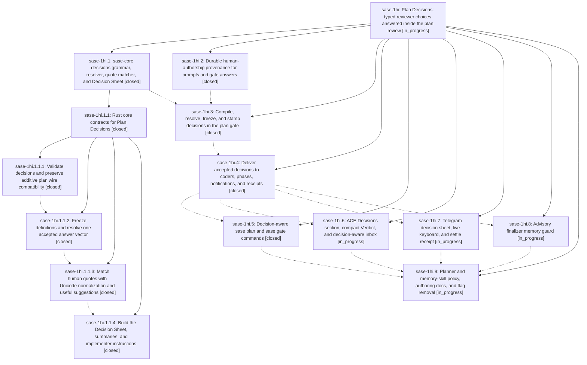

# Bead: sase-1hi — Plan Decisions: typed reviewer choices answered inside the plan review

[Bead Pages](../README.md) / sase-1hi

**Status:** ◐ in_progress · **Type:** ▸ plan · **Tier:** epic
**Owner:** `bryanbugyi34@gmail.com` · **Created by:** [bbugyi200.apollo.5n](https://github.com/sase-org/sase--agents/blob/main/sessions/bbugyi200.apollo.5n.md) · **Assignee:** `sase-1hi.land`
**Created:** 2026-10-07 18:48:22 EDT
**Plan:** [202610/plan\_decisions.md](https://github.com/sase-org/sase--plans/blob/main/202610/plan_decisions.md)

<!-- sase:links:start -->

## Links

| Relation | Artifact | Why |
| --- | --- | --- |
| implemented-by | [plan:202610/plan_decisions.md][1] | derived from the plan's `bead_id:` frontmatter field |

_Plus 3 automatic references — see [Referenced By](#referenced-by)._

[1]: https://github.com/sase-org/sase--plans/blob/main/202610/plan_decisions.md

<!-- sase:links:end -->

## Description

A tale or epic can declare up to five typed, defaulted Plan Decisions (toggles, 2-5-way choices, and memory consents) in a `decisions:` frontmatter map. The reviewer answers them in the same plan review on ACE, Telegram, or the CLI, and the primary action always approves exactly the values on display. `%auto` takes verified defaults and posts a quiet receipt. Answers are recorded once in the gate response and stamped into the archived plan. Every implementer receives them mechanically, and a plan authorizes a memory edit only through an accepted memory decision.

## Notes

[2026-10-08T01:55:18Z · sase-1hf.land] DISCOVERED ISSUE (sase-1hf landing, master 3a4178b15a, 2026-10-07): Symvision's private-symbol rule returns before the unused-public rule. With the masking private error removed, `just symvision` reports these public symbols from 3df340f909 (sase-1hi.2) with no non-test consumer: gate_response_caller (src/sase/notification_gates/executor.py), HumanText and human_authored_texts (src/sase/sdd/plan_human_text.py), prompt_origin_for_launch and read_launch_provenance (src/sase/agent/launch_provenance.py). If later sase-1hi phases consume them, add --epic-symbol rows keyed to those phases. Otherwise privatize or delete per the symvision memory.

[2026-10-08T02:58:12Z · sase-1hf.land] DISCOVERED ISSUE (sase-1hf landing check, master 3a4178b15a, 2026-10-07; reproduced on a clean tree): 3df340f909 (sase-1hi.2, launch provenance) adds prompt_origin/prompt_source_surface, and three tests now see the extra 'unknown' values. tests/axe/test_agent_meta_atomic.py::test_generic_and_specialized_agent_meta_writers_use_atomic_publication: specialized meta gains {'prompt_origin': 'generated', 'prompt_source_surface': 'unknown'}. tests/test_multi_prompt_launcher_macro_groups.py::test_launch_agents_from_cwd_segment_extra_env_shares_macro_group_counter and ::test_launch_agents_from_cwd_force_reuse_marker_applies_to_first_swarm_slot_only: recorded launch env rows gain a ...: 'unknown' entry. Update the expectations, or exclude the provenance keys/env where those tests pin exact payloads. The committed-plans panic and plan_validate schema failures are noted on sase-1hi.1.1.

## Phases

| Bead | Title | Status | Size | Created | Agents | Commits |
|---|---|---|---|---|---:|---:|
| [sase-1hi.1](sase-1hi.1.md) | sase-core decisions grammar, resolver, quote matcher, and Decision Sheet | ✓ closed | large | 2026-10-07 | 1 | 0 |
| [sase-1hi.2](sase-1hi.2.md) | Durable human-authorship provenance for prompts and gate answers | ✓ closed | medium | 2026-10-07 | 1 | 1 |
| [sase-1hi.3](sase-1hi.3.md) | Compile, resolve, freeze, and stamp decisions in the plan gate | ✓ closed | large | 2026-10-07 | 1 | 1 |
| [sase-1hi.4](sase-1hi.4.md) | Deliver accepted decisions to coders, phases, notifications, and receipts | ✓ closed | medium | 2026-10-07 | 1 | 1 |
| [sase-1hi.5](sase-1hi.5.md) | Decision-aware sase plan and sase gate commands | ✓ closed | medium | 2026-10-07 | 1 | 1 |
| [sase-1hi.6](sase-1hi.6.md) | ACE Decisions section, compact Verdict, and decision-aware inbox | ◐ in_progress | large | 2026-10-07 | 1 | 0 |
| [sase-1hi.7](sase-1hi.7.md) | Telegram decision sheet, live keyboard, and settle receipt | ◐ in_progress | large | 2026-10-07 | 1 | 0 |
| [sase-1hi.8](sase-1hi.8.md) | Advisory finalizer memory guard | ◐ in_progress | medium | 2026-10-07 | 1 | 0 |
| [sase-1hi.9](sase-1hi.9.md) | Planner and memory-skill policy, authoring docs, and flag removal | ◐ in_progress | medium | 2026-10-07 | 1 | 0 |

## Lineage

## Agents

| Agent | Bead | Commits |
|---|---|---:|
| [bbugyi200.apollo.sase-1hi.1](https://github.com/sase-org/sase--agents/blob/main/sessions/bbugyi200.apollo.sase-1hi.1.md) | [sase-1hi.1](sase-1hi.1.md) | 0 |
| [bbugyi200.apollo.sase-1hi.1.1.1](https://github.com/sase-org/sase--agents/blob/main/agents/bbugyi200.apollo.sase-1hi.1.1.1/README.md) | [sase-1hi.1.1.1](sase-1hi.1.1.1.md) | 1 |
| [bbugyi200.apollo.sase-1hi.1.1.2](https://github.com/sase-org/sase--agents/blob/main/agents/bbugyi200.apollo.sase-1hi.1.1.2/README.md) | [sase-1hi.1.1.2](sase-1hi.1.1.2.md) | 1 |
| [bbugyi200.apollo.sase-1hi.1.1.3](https://github.com/sase-org/sase--agents/blob/main/agents/bbugyi200.apollo.sase-1hi.1.1.3/README.md) | [sase-1hi.1.1.3](sase-1hi.1.1.3.md) | 1 |
| [bbugyi200.apollo.sase-1hi.1.1.4](https://github.com/sase-org/sase--agents/blob/main/agents/bbugyi200.apollo.sase-1hi.1.1.4/README.md) | [sase-1hi.1.1.4](sase-1hi.1.1.4.md) | 1 |
| [bbugyi200.apollo.sase-1hi.1.1.land](https://github.com/sase-org/sase--agents/blob/main/sessions/bbugyi200.apollo.sase-1hi.1.1.land.md) | [sase-1hi.1.1](sase-1hi.1.1.md) | 2 |
| [bbugyi200.apollo.sase-1hi.2](https://github.com/sase-org/sase--agents/blob/main/agents/bbugyi200.apollo.sase-1hi.2/README.md) | [sase-1hi.2](sase-1hi.2.md) | 1 |
| [bbugyi200.apollo.sase-1hi.3](https://github.com/sase-org/sase--agents/blob/main/sessions/bbugyi200.apollo.sase-1hi.3.md) | [sase-1hi.3](sase-1hi.3.md) | 1 |
| [bbugyi200.apollo.sase-1hi.4](https://github.com/sase-org/sase--agents/blob/main/agents/bbugyi200.apollo.sase-1hi.4/README.md) | [sase-1hi.4](sase-1hi.4.md) | 1 |
| [bbugyi200.apollo.sase-1hi.5](https://github.com/sase-org/sase--agents/blob/main/agents/bbugyi200.apollo.sase-1hi.5/README.md) | [sase-1hi.5](sase-1hi.5.md) | 1 |
| [bbugyi200.apollo.sase-1hi.6](https://github.com/sase-org/sase--agents/blob/main/sessions/bbugyi200.apollo.sase-1hi.6.md) | [sase-1hi.6](sase-1hi.6.md) | 0 |
| [bbugyi200.apollo.sase-1hi.7](https://github.com/sase-org/sase--agents/blob/main/sessions/bbugyi200.apollo.sase-1hi.7.md) | [sase-1hi.7](sase-1hi.7.md) | 0 |
| [bbugyi200.apollo.sase-1hi.8](https://github.com/sase-org/sase--agents/blob/main/sessions/bbugyi200.apollo.sase-1hi.8.md) | [sase-1hi.8](sase-1hi.8.md) | 0 |
| [bbugyi200.apollo.sase-1hi.9](https://github.com/sase-org/sase--agents/blob/main/agents/bbugyi200.apollo.sase-1hi.9/README.md) | [sase-1hi.9](sase-1hi.9.md) | 0 |
| [bbugyi200.apollo.sase-1hi.land](https://github.com/sase-org/sase--agents/blob/main/agents/bbugyi200.apollo.sase-1hi.land/README.md) | [sase-1hi](README.md) | 0 |

## Commits

| Repo | Commit | Subject | Bead | Committed |
|---|---|---|---|---|
| sase | [`3df340f`](https://github.com/sase-org/sase/commit/3df340f909add7d326e2901b475e206009dbca06) | feat(agent): record launch provenance, gate caller, and human-text gatherer | [sase-1hi.2](sase-1hi.2.md) | 2026-10-07 19:30:04 EDT |
| sase-core | [`sase-core@96d5b67`](https://github.com/sase-org/sase-core/commit/96d5b67beec6079e73f9c8def2bed7cc531932ec) | feat(plan): validate plan decisions grammar with Archived mode and additive wire | [sase-1hi.1.1.1](sase-1hi.1.1.1.md) | 2026-10-07 20:05:34 EDT |
| sase-core | [`sase-core@c089cf1`](https://github.com/sase-org/sase-core/commit/c089cf17e07450ec9dfc478e6d7801198feacfad) | feat(sase-core): add plan decisions resolver payload/digest/resolve with PyO3 bindings | [sase-1hi.1.1.2](sase-1hi.1.1.2.md) | 2026-10-07 20:35:19 EDT |
| sase-core | [`sase-core@df735e4`](https://github.com/sase-org/sase-core/commit/df735e4296b2211e4f39058dd3cd10905dbcdd11) | feat(sase-core): add plan decision human quote matcher with PyO3 binding | [sase-1hi.1.1.3](sase-1hi.1.1.3.md) | 2026-10-07 21:04:37 EDT |
| sase-core | [`sase-core@88d6385`](https://github.com/sase-org/sase-core/commit/88d63855b9c505e607acdeda412a53d5dc554484) | feat(plan): add decision sheet, summary, and prompt-block backend | [sase-1hi.1.1.4](sase-1hi.1.1.4.md) | 2026-10-07 21:51:42 EDT |
| sase-core | [`sase-core@def5ad5`](https://github.com/sase-org/sase-core/commit/def5ad5b50f2a28ad4f9ed52fd4e6cd272a716f5) | feat(plan): repair decision warning, archive, unicode, fence, and sheet contracts | [sase-1hi.1.1](sase-1hi.1.1.md) | 2026-10-07 22:46:22 EDT |
| sase--plans | [`sase--plans@6596fe2`](https://github.com/sase-org/sase--plans/commit/6596fe29efeb4b73be1eff63aaefcd8dde3cc4bc) | chore(plans): mark core\_plan\_decisions landing done | [sase-1hi.1.1](sase-1hi.1.1.md) | 2026-10-07 22:48:32 EDT |
| sase | [`ab48f19`](https://github.com/sase-org/sase/commit/ab48f1904e2afc67f7ff1a5c471808c176c4e6d8) | feat(plan): compile, resolve, freeze, and stamp decisions in the plan gate | [sase-1hi.3](sase-1hi.3.md) | 2026-10-08 00:18:01 EDT |
| sase | [`124c4cf`](https://github.com/sase-org/sase/commit/124c4cffa82920509c4d25c279b939d3ad8e9f9f) | feat(sdd): render accepted-plan Reviewer decisions handoff to coders | [sase-1hi.4](sase-1hi.4.md) | 2026-10-08 01:42:26 EDT |
| sase | [`ec599ca`](https://github.com/sase-org/sase/commit/ec599ca332924d30ff2683055225b8bf518dbe9b) | feat(plan): add -D/--decide approval with decision cards and sheet rendering | [sase-1hi.5](sase-1hi.5.md) | 2026-10-08 02:38:16 EDT |

<!-- sase:referenced-by:start -->

## Referenced By

| Relation | Artifact | Why | Uses |
| --- | --- | --- | ---: |
| read-by | [agent:sase-1h7.land][1] | Check whether launch-provenance env/meta test breakage is already recorded on the plan-decisions epic | 2 |
| read-by | [agent:sase-1hf.land][2] | Decide whether this bead can own its unmasked symvision unused-public symbols | 1 |
| read-by | [agent:sase-1hi.4][3] | check epic status for handoff context | 2 |

[1]: https://github.com/sase-org/sase--agents/blob/main/agents/bbugyi200.apollo.sase-1h7.land/README.md
[2]: https://github.com/sase-org/sase--agents/blob/main/agents/bbugyi200.apollo.sase-1hf.land/README.md
[3]: https://github.com/sase-org/sase--agents/blob/main/agents/bbugyi200.apollo.sase-1hi.4/README.md

<!-- sase:referenced-by:end -->
