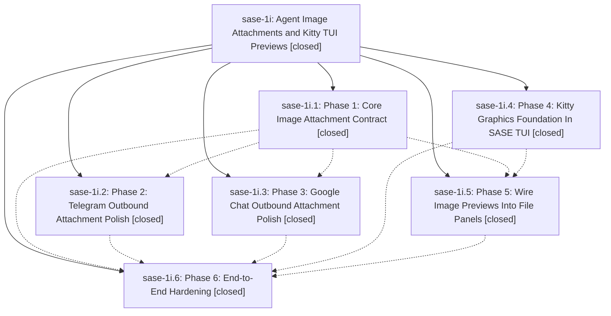

# Bead: sase-1i — Agent Image Attachments and Kitty TUI Previews

[Bead Pages](../README.md) / sase-1i

**Status:** ✓ closed · **Resolution:** (unrecorded) · **Type:** plan · **Tier:** epic
**Owner:** `bryanbugyi34@gmail.com`
**Created:** 2026-04-30 06:36:20 UTC · **Closed:** 2026-04-30 07:19:05 UTC
**Plan:** [202604/agent\_image\_notifications.md](https://github.com/sase-org/sase--plans/blob/main/202604/agent_image_notifications.md)

## Phases

| Bead | Title | Status | Size | Agents | Commits |
|---|---|---|---|---:|---:|
| [sase-1i.1](sase-1i.1.md) | Phase 1: Core Image Attachment Contract | ✓ closed | small | 0 | 1 |
| [sase-1i.2](sase-1i.2.md) | Phase 2: Telegram Outbound Attachment Polish | ✓ closed | small | 0 | 0 |
| [sase-1i.3](sase-1i.3.md) | Phase 3: Google Chat Outbound Attachment Polish | ✓ closed | small | 0 | 1 |
| [sase-1i.4](sase-1i.4.md) | Phase 4: Kitty Graphics Foundation In SASE TUI | ✓ closed | small | 0 | 1 |
| [sase-1i.5](sase-1i.5.md) | Phase 5: Wire Image Previews Into File Panels | ✓ closed | small | 0 | 1 |
| [sase-1i.6](sase-1i.6.md) | Phase 6: End-to-End Hardening | ✓ closed | small | 0 | 1 |

## Lineage

## Commits

| Commit | Subject | Bead | Committed (UTC) |
|---|---|---|---|
| [`5665ff2`](https://github.com/sase-org/sase/commit/5665ff285e2180f09f791f3ee3728ce32de46a5c) | feat: add Kitty graphics preview foundation (sase-1i.4) | [sase-1i.4](sase-1i.4.md) | 2026-04-30 06:47:57 |
| [`4defbd7`](https://github.com/sase-org/sase/commit/4defbd75c68ddd648189102841011c9536ab8f5e) | feat: attach generated images to agent completion notifications (sase-1i.1) | [sase-1i.1](sase-1i.1.md) | 2026-04-30 06:54:08 |
| [`f86b1aa`](https://github.com/sase-org/sase/commit/f86b1aa9d799375ababa10728ca97429d5030f0f) | chore: close gchat attachment polish bead (sase-1i.3) | [sase-1i.3](sase-1i.3.md) | 2026-04-30 06:58:54 |
| [`ad47603`](https://github.com/sase-org/sase/commit/ad47603872f88568e0b331369c15629910803565) | feat: wire image previews into TUI file panels (sase-1i.5) | [sase-1i.5](sase-1i.5.md) | 2026-04-30 07:03:56 |
| [`8d21eb7`](https://github.com/sase-org/sase/commit/8d21eb7d51d0b3e7447ab5cf805ba00b296e930d) | fix(ace): harden image fallback guidance (sase-1i.6) | [sase-1i.6](sase-1i.6.md) | 2026-04-30 07:13:32 |
| [`f2744a2`](https://github.com/sase-org/sase/commit/f2744a279e1f3a4fb0cea426286a7c80f7884ccd) | chore: close image attachment epic (sase-1i) | [sase-1i](README.md) | 2026-04-30 07:21:02 |
