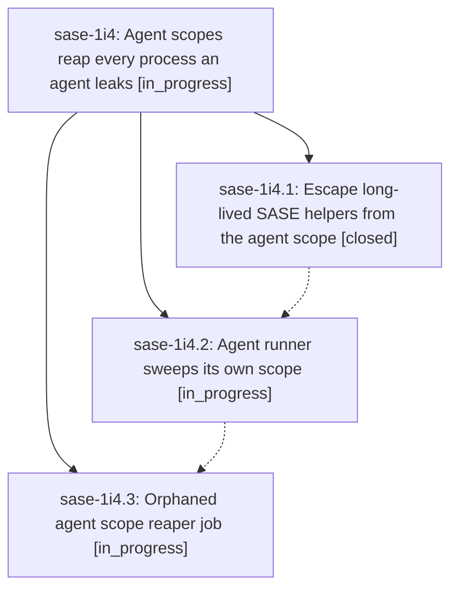

# Bead: sase-1i4 — Agent scopes reap every process an agent leaks

[Bead Pages](../README.md) / sase-1i4

**Status:** ◐ in_progress · **Type:** ▸ plan · **Tier:** epic
**Owner:** `bryanbugyi34@gmail.com` · **Created by:** [bbugyi200.apollo.5s](https://github.com/sase-org/sase--agents/blob/main/sessions/bbugyi200.apollo.5s.md) · **Assignee:** `sase-1i4.land`
**Created:** 2026-10-08 06:37:32 EDT
**Plan:** [202610/agent\_scope\_leak\_reaping.md](https://github.com/sase-org/sase--plans/blob/main/202610/agent_scope_leak_reaping.md)

## Description

No process an agent starts outlives its agent runner unless SASE deliberately escaped it into its own systemd scope. Leftovers die when the runner exits (and between in-process successor turns), and a five-minute backstop reaps sase-agent scopes whose runner died without cleaning up, while shared user daemons (ssh-agent, gpg-agent, ssh ControlMaster, tmux server) are never killed.

## Phases

| Bead | Title | Status | Size | Created | Agents | Commits |
|---|---|---|---|---|---:|---:|
| [sase-1i4.1](sase-1i4.1.md) | Escape long-lived SASE helpers from the agent scope | ✓ closed | small | 2026-10-08 | 1 | 1 |
| [sase-1i4.2](sase-1i4.2.md) | Agent runner sweeps its own scope | ◐ in_progress | medium | 2026-10-08 | 1 | 0 |
| [sase-1i4.3](sase-1i4.3.md) | Orphaned agent scope reaper job | ◐ in_progress | medium | 2026-10-08 | 1 | 0 |

## Lineage

## Agents

| Agent | Bead | Commits |
|---|---|---:|
| [bbugyi200.apollo.sase-1i4.1](https://github.com/sase-org/sase--agents/blob/main/agents/bbugyi200.apollo.sase-1i4.1/README.md) | [sase-1i4.1](sase-1i4.1.md) | 1 |
| [bbugyi200.apollo.sase-1i4.2](https://github.com/sase-org/sase--agents/blob/main/agents/bbugyi200.apollo.sase-1i4.2/README.md) | [sase-1i4.2](sase-1i4.2.md) | 0 |
| [bbugyi200.apollo.sase-1i4.3](https://github.com/sase-org/sase--agents/blob/main/agents/bbugyi200.apollo.sase-1i4.3/README.md) | [sase-1i4.3](sase-1i4.3.md) | 0 |
| [bbugyi200.apollo.sase-1i4.land](https://github.com/sase-org/sase--agents/blob/main/agents/bbugyi200.apollo.sase-1i4.land/README.md) | [sase-1i4](README.md) | 0 |

## Commits

| Repo | Commit | Subject | Bead | Committed |
|---|---|---|---|---|
| sase | [`dbf6357`](https://github.com/sase-org/sase/commit/dbf6357464fc9a27b947c26cd8fb50fb06c02486) | feat(detach): route background workers through detach\_scope | [sase-1i4.1](sase-1i4.1.md) | 2026-10-08 06:54:11 EDT |
