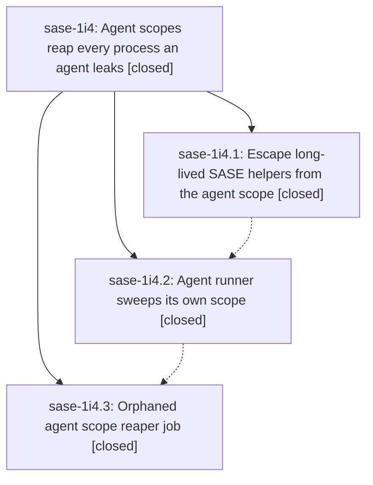

# Bead: sase-1i4 — Agent scopes reap every process an agent leaks

[Bead Pages](../README.md) / sase-1i4

**Status:** ✓ closed · **Resolution:** done · **Type:** ▸ plan · **Tier:** epic
**Owner:** `bryanbugyi34@gmail.com` · **Created by:** [bbugyi200.apollo.5s](https://github.com/sase-org/sase--agents/blob/main/sessions/bbugyi200.apollo.5s.md) · **Assignee:** `sase-1i4.land`
**Created:** 2026-10-08 06:37:32 EDT · **Closed:** 2026-10-08 11:32:14 EDT
**Plan:** [202610/agent\_scope\_leak\_reaping.md](https://github.com/sase-org/sase--plans/blob/main/202610/agent_scope_leak_reaping.md)

<!-- sase:links:start -->

## Links

| Relation | Artifact | Why |
| --- | --- | --- |
| implemented-by | [plan:202610/agent_scope_leak_reaping.md][1] | derived from the plan's `bead_id:` frontmatter field |
| related | [bead:sase-1i6][2] | Proposed by phase sase-1i4.1; reproduced at landing on a clean base |
| related | [bead:sase-1i7][3] | Out of scope for the agent-scope reaper; owner signatures differ |
| related | [bead:sase-1i9][4] | Found during sase-1i4 landing; the scope diff does not import this test |
| related | [bead:sase-1ia][5] | Found during sase-1i4 landing; clan precedence is outside the scope epic |
| related | [bead:sase-1ib][6] | Parallel-lane flake seen during sase-1i4 landing; serial rerun passed |

_Plus 4 automatic references — see [Referenced By](#referenced-by)._

[1]: https://github.com/sase-org/sase--plans/blob/main/202610/agent_scope_leak_reaping.md
[2]: https://github.com/sase-org/sase--beads/blob/main/pages/sase-1i6/README.md
[3]: https://github.com/sase-org/sase--beads/blob/main/pages/sase-1i7/README.md
[4]: https://github.com/sase-org/sase--beads/blob/main/pages/sase-1i9/README.md
[5]: https://github.com/sase-org/sase--beads/blob/main/pages/sase-1ia/README.md
[6]: https://github.com/sase-org/sase--beads/blob/main/pages/sase-1ib/README.md

<!-- sase:links:end -->

## Description

No process an agent starts outlives its agent runner unless SASE deliberately escaped it into its own systemd scope. Leftovers die when the runner exits (and between in-process successor turns), and a five-minute backstop reaps sase-agent scopes whose runner died without cleaning up, while shared user daemons (ssh-agent, gpg-agent, ssh ControlMaster, tmux server) are never killed.

## Notes

[2026-10-08T15:32:14Z · sase-1i4.land] Verified the epic against the plan, phases sase-1i4.1, sase-1i4.2, and sase-1i4.3 (all closed), and commits dbf6357464, e4b0faf443, and a10a6c6035.

Decisions honored: scope_decision_record is false, so no decisions-web strand exists. turn_sweep is true: run_agent_exec sweeps context=turn only after the first in-process iteration, and the runner sweeps context=exit before finalize_runner_shutdown.

Phase 1 detaches trash delete (sase-trash-delete), goal fetch (sase-goal-fetch via spawn_fetch_worker), federation (sase-federation), and tmux bootstrap (sase-tmux) on non-Windows. Phase 2 shares sweep selection, spares ssh-agent, gpg-agent, tmux server, and ssh ControlMaster, and pins identity. Phase 3 adds checks job orphan_agent_scope_reap (300s). Live apply on this host: scanned=9 live=6 skipped_young=0 spared_only=1 reaped_scopes=2 terminated=4 errors=0. ssh-agent pid 2413401 stayed up. A follow-up dry-run was reapable=0.

Integration: fast-forwarded onto origin/master 092fd1db05 (eight commits after a10a6c6035). None add a fire-and-forget spawn. Runner edits are launch provenance and a question-gate metadata key. No sweep duplicate.

Landing diff privatizes eight unused public scope_sweep names (ScopeMember, ScopeSweepPlan, plan_scope_sweep, is_agent_runner, AgentScope, ReapedScope, ReapResult, discover_agent_scopes). No --epic-symbol rows. Scope unit tests: 56 passed after the fast-forward.

sase tool run check 3acd4d900f214c6830bc663849aed9dd on a10a6c6035: symvision 55 KNOWN continued, none of them scope_sweep. Scoped tests were 34 KNOWN and 5 NEW. Those NEW failures are not this diff: they reproduce with the diff stashed, except the plan-archive assertion, which 092fd1db05 fixes, and the tail-ghost test, which passed on serial rerun.

Follow-ups: sase-1i6 ready (AF_UNIX path, from sase-1i4.1). sase-1i7 ready (extend reaper to sase-monitor and sase-proc; plan out of scope). sase-1i9 ready (hint render CI failure). sase-1ia ready (clan prompt-precedence CI failure). sase-1ib ready (tail-ghost flake). +1 sase-1hp for the pre-existing unused-public backlog; the eight privatized scope_sweep symbols are excluded; proposers sase-1i4.1, sase-1i4.2, sase-1i4.3. +1 sase-1hs for the finalizer unpushed-HEAD failure. BeadStoreFingerprint stays on sase-1h8 (supplementary note), not on sase-1hp. context_block_texts and the other clean-base unused publics stay with sase-1hp. Noted sase-1i8: the sase-1i4.3 epic-symbol rows are already absent on 092fd1db05.

Declined: a task for non-systemd hosts including macOS (documented no-op). A task for muse's shell tool killing only the leader (external provider; the sweep makes the leak harmless). Beads for the athena findings (stale Pushgateway series, two waiting runners, TUI unreaped zombies); they are operational notes, not the same issues as sase-zn or sase-1hl. Filing the plan-archive assertion, because 092fd1db05 already pops the gate-stamp fields in that test.

## Phases

| Bead | Title | Status | Size | Created | Agents | Commits |
|---|---|---|---|---|---:|---:|
| [sase-1i4.1](sase-1i4.1.md) | Escape long-lived SASE helpers from the agent scope | ✓ closed | small | 2026-10-08 | 1 | 1 |
| [sase-1i4.2](sase-1i4.2.md) | Agent runner sweeps its own scope | ✓ closed | medium | 2026-10-08 | 1 | 1 |
| [sase-1i4.3](sase-1i4.3.md) | Orphaned agent scope reaper job | ✓ closed | medium | 2026-10-08 | 1 | 1 |

## Lineage

## Agents

| Agent | Bead | Commits |
|---|---|---:|
| [bbugyi200.apollo.sase-1i4.1](https://github.com/sase-org/sase--agents/blob/main/agents/bbugyi200.apollo.sase-1i4.1/README.md) | [sase-1i4.1](sase-1i4.1.md) | 1 |
| [bbugyi200.apollo.sase-1i4.2](https://github.com/sase-org/sase--agents/blob/main/sessions/bbugyi200.apollo.sase-1i4.2.md) | [sase-1i4.2](sase-1i4.2.md) | 1 |
| [bbugyi200.apollo.sase-1i4.3](https://github.com/sase-org/sase--agents/blob/main/sessions/bbugyi200.apollo.sase-1i4.3.md) | [sase-1i4.3](sase-1i4.3.md) | 1 |
| [bbugyi200.apollo.sase-1i4.land](https://github.com/sase-org/sase--agents/blob/main/agents/bbugyi200.apollo.sase-1i4.land/README.md) | [sase-1i4](README.md) | 2 |

## Commits

| Repo | Commit | Subject | Bead | Committed |
|---|---|---|---|---|
| sase | [`dbf6357`](https://github.com/sase-org/sase/commit/dbf6357464fc9a27b947c26cd8fb50fb06c02486) | feat(detach): route background workers through detach\_scope | [sase-1i4.1](sase-1i4.1.md) | 2026-10-08 06:54:11 EDT |
| sase | [`e4b0faf`](https://github.com/sase-org/sase/commit/e4b0faf443accef65ebc2a78612f4f92dc9c3151) | feat(scope): runner sweeps its own agent scope on exit and turn boundaries | [sase-1i4.2](sase-1i4.2.md) | 2026-10-08 08:01:18 EDT |
| sase | [`a10a6c6`](https://github.com/sase-org/sase/commit/a10a6c60352667d856f4c697134ba4df5fa243a1) | feat(scope): reap orphaned agent scopes with checks-routine backstop job | [sase-1i4.3](sase-1i4.3.md) | 2026-10-08 09:50:02 EDT |
| sase | [`6f930e1`](https://github.com/sase-org/sase/commit/6f930e16b4a7135167c2ee1d95b12ecc801127a1) | refactor(scope): privatize unused sweep and reaper seams | [sase-1i4](README.md) | 2026-10-08 11:36:22 EDT |
| sase--plans | [`sase--plans@3987e15`](https://github.com/sase-org/sase--plans/commit/3987e15d1779943dd997993416dc811f6c96920b) | docs(plan): mark agent scope leak reaping done | [sase-1i4](README.md) | 2026-10-08 11:39:28 EDT |

<!-- sase:referenced-by:start -->

## Referenced By

| Relation | Artifact | Why | Uses |
| --- | --- | --- | ---: |
| read-by | [agent:sase-1i4.1][1] | Need epic decisions and design | 1 |
| read-by | [agent:sase-1i4.2--2][2] | epic decisions scope | 1 |
| read-by | [agent:sase-1i4.3--4][3] | epic decisions and scope | 1 |
| read-by | [agent:sase-1i4.land][4] | Need each child resolution before close | 6 |

[1]: https://github.com/sase-org/sase--agents/blob/main/agents/bbugyi200.apollo.sase-1i4.1/README.md
[2]: https://github.com/sase-org/sase--agents/blob/main/sessions/bbugyi200.apollo.sase-1i4.2.md
[3]: https://github.com/sase-org/sase--agents/blob/main/sessions/bbugyi200.apollo.sase-1i4.3.md
[4]: https://github.com/sase-org/sase--agents/blob/main/agents/bbugyi200.apollo.sase-1i4.land/README.md

<!-- sase:referenced-by:end -->
