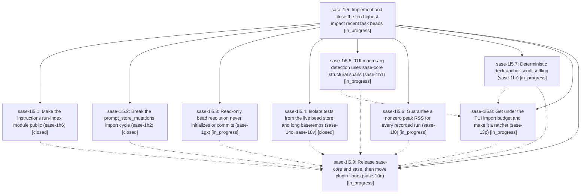

# Bead: sase-1i5 — Implement and close the ten highest-impact recent task beads

[Bead Pages](../README.md) / sase-1i5

**Status:** ◐ in_progress · **Type:** ▸ plan · **Tier:** epic
**Owner:** `bryanbugyi34@gmail.com` · **Created by:** [bbugyi200.athena.0y8](https://github.com/sase-org/sase--agents/blob/main/sessions/bbugyi200.athena.0y8.md) · **Assignee:** `sase-1i5.land`
**Created:** 2026-10-08 09:47:17 EDT
**Plan:** [202610/close\_top\_ten\_impact\_task\_beads.md](https://github.com/sase-org/sase--plans/blob/main/202610/close_top_ten_impact_task_beads.md)

## Description

All ten beads ranked in the 48-hour task-bead impact report are fixed on master and closed with resolution done and recorded evidence: sase-1h6, sase-1h2, sase-10d, sase-13p, sase-1gx, sase-14o, sase-1h1, sase-1f0, sase-1br and sase-18v. The epic does not land while any of them is open or unverified.

## Phases

| Bead | Title | Status | Size | Created | Agents | Commits |
|---|---|---|---|---|---:|---:|
| [sase-1i5.1](sase-1i5.1.md) | Make the instructions run-index module public (sase-1h6) | ✓ closed | small | 2026-10-08 | 1 | 1 |
| [sase-1i5.2](sase-1i5.2.md) | Break the prompt\_store\_mutations import cycle (sase-1h2) | ✓ closed | small | 2026-10-08 | 1 | 1 |
| [sase-1i5.3](sase-1i5.3.md) | Read-only bead resolution never initializes or commits (sase-1gx) | ◐ in_progress | medium | 2026-10-08 | 1 | 0 |
| [sase-1i5.4](sase-1i5.4.md) | Isolate tests from the live bead store and long basetemps (sase-14o, sase-18v) | ✓ closed | small | 2026-10-08 | 1 | 1 |
| [sase-1i5.5](sase-1i5.5.md) | TUI macro-arg detection uses sase-core structural spans (sase-1h1) | ◐ in_progress | medium | 2026-10-08 | 1 | 0 |
| [sase-1i5.6](sase-1i5.6.md) | Guarantee a nonzero peak RSS for every recorded run (sase-1f0) | ◐ in_progress | medium | 2026-10-08 | 1 | 0 |
| [sase-1i5.7](sase-1i5.7.md) | Deterministic deck anchor-scroll settling (sase-1br) | ◐ in_progress | medium | 2026-10-08 | 1 | 0 |
| [sase-1i5.8](sase-1i5.8.md) | Get under the TUI import budget and make it a ratchet (sase-13p) | ◐ in_progress | medium | 2026-10-08 | 1 | 0 |
| [sase-1i5.9](sase-1i5.9.md) | Release sase-core and sase, then move plugin floors (sase-10d) | ◐ in_progress | large | 2026-10-08 | 1 | 0 |

## Lineage

## Agents

| Agent | Bead | Commits |
|---|---|---:|
| [bbugyi200.athena.sase-1i5.1](https://github.com/sase-org/sase--agents/blob/main/sessions/bbugyi200.athena.sase-1i5.1.md) | [sase-1i5.1](sase-1i5.1.md) | 1 |
| [bbugyi200.athena.sase-1i5.2](https://github.com/sase-org/sase--agents/blob/main/agents/bbugyi200.athena.sase-1i5.2/README.md) | [sase-1i5.2](sase-1i5.2.md) | 1 |
| [bbugyi200.athena.sase-1i5.3](https://github.com/sase-org/sase--agents/blob/main/agents/bbugyi200.athena.sase-1i5.3/README.md) | [sase-1i5.3](sase-1i5.3.md) | 0 |
| [bbugyi200.athena.sase-1i5.4](https://github.com/sase-org/sase--agents/blob/main/agents/bbugyi200.athena.sase-1i5.4/README.md) | [sase-1i5.4](sase-1i5.4.md) | 1 |
| [bbugyi200.athena.sase-1i5.5](https://github.com/sase-org/sase--agents/blob/main/agents/bbugyi200.athena.sase-1i5.5/README.md) | [sase-1i5.5](sase-1i5.5.md) | 0 |
| [bbugyi200.athena.sase-1i5.6](https://github.com/sase-org/sase--agents/blob/main/agents/bbugyi200.athena.sase-1i5.6/README.md) | [sase-1i5.6](sase-1i5.6.md) | 0 |
| [bbugyi200.athena.sase-1i5.7](https://github.com/sase-org/sase--agents/blob/main/agents/bbugyi200.athena.sase-1i5.7/README.md) | [sase-1i5.7](sase-1i5.7.md) | 0 |
| [bbugyi200.athena.sase-1i5.8](https://github.com/sase-org/sase--agents/blob/main/agents/bbugyi200.athena.sase-1i5.8/README.md) | [sase-1i5.8](sase-1i5.8.md) | 0 |
| [bbugyi200.athena.sase-1i5.9](https://github.com/sase-org/sase--agents/blob/main/agents/bbugyi200.athena.sase-1i5.9/README.md) | [sase-1i5.9](sase-1i5.9.md) | 0 |
| [bbugyi200.athena.sase-1i5.land](https://github.com/sase-org/sase--agents/blob/main/agents/bbugyi200.athena.sase-1i5.land/README.md) | [sase-1i5](README.md) | 0 |

## Commits

| Repo | Commit | Subject | Bead | Committed |
|---|---|---|---|---|
| sase | [`bb8673e`](https://github.com/sase-org/sase/commit/bb8673ea7c29686a747861a2c2f6c19f5939459a) | test(fix): isolate store resolution and basetemp-independent rich assertions | [sase-1i5.4](sase-1i5.4.md) | 2026-10-08 10:20:29 EDT |
| sase | [`e592f46`](https://github.com/sase-org/sase/commit/e592f46412d042d27a3f30b9489d946ad83eb6c1) | fix(history): break prompt\_store\_mutations import cycle (sase-1h2) | [sase-1i5.2](sase-1i5.2.md) | 2026-10-08 10:24:24 EDT |
| sase | [`4ba5cd9`](https://github.com/sase-org/sase/commit/4ba5cd9f91f38c6728b122f8cc513f6eed197aab) | refactor(instructions): make run-index module public as run\_index | [sase-1i5.1](sase-1i5.1.md) | 2026-10-08 10:28:44 EDT |

<!-- sase:referenced-by:start -->

## Referenced By

| Relation | Artifact | Why | Uses |
| --- | --- | --- | ---: |
| read-by | [agent:sase-1i5.4][1] | epic decisions | 1 |

[1]: https://github.com/sase-org/sase--agents/blob/main/agents/bbugyi200.athena.sase-1i5.4/README.md

<!-- sase:referenced-by:end -->
