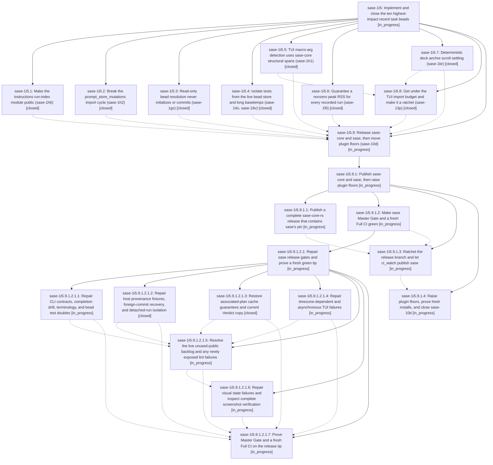

# Bead: sase-1i5 — Implement and close the ten highest-impact recent task beads

[Bead Pages](../README.md) / sase-1i5

**Status:** ◐ in_progress · **Type:** ▸ plan · **Tier:** epic
**Owner:** `bryanbugyi34@gmail.com` · **Created by:** [bbugyi200.athena.0y8](https://github.com/sase-org/sase--agents/blob/main/sessions/bbugyi200.athena.0y8.md) · **Assignee:** `sase-1i5.land`
**Created:** 2026-10-08 09:47:17 EDT
**Plan:** [202610/close\_top\_ten\_impact\_task\_beads.md](https://github.com/sase-org/sase--plans/blob/main/202610/close_top_ten_impact_task_beads.md)

<!-- sase:links:start -->

## Links

| Relation | Artifact | Why |
| --- | --- | --- |
| implemented-by | [plan:202610/close_top_ten_impact_task_beads.md][1] | derived from the plan's `bead_id:` frontmatter field |

_Plus 5 automatic references — see [Referenced By](#referenced-by)._

[1]: https://github.com/sase-org/sase--plans/blob/main/202610/close_top_ten_impact_task_beads.md

<!-- sase:links:end -->

## Description

All ten beads ranked in the 48-hour task-bead impact report are fixed on master and closed with resolution done and recorded evidence: sase-1h6, sase-1h2, sase-10d, sase-13p, sase-1gx, sase-14o, sase-1h1, sase-1f0, sase-1br and sase-18v. The epic does not land while any of them is open or unverified.

## Phases

| Bead | Title | Status | Size | Created | Agents | Commits |
|---|---|---|---|---|---:|---:|
| [sase-1i5.1](sase-1i5.1.md) | Make the instructions run-index module public (sase-1h6) | ✓ closed | small | 2026-10-08 | 1 | 1 |
| [sase-1i5.2](sase-1i5.2.md) | Break the prompt\_store\_mutations import cycle (sase-1h2) | ✓ closed | small | 2026-10-08 | 1 | 1 |
| [sase-1i5.3](sase-1i5.3.md) | Read-only bead resolution never initializes or commits (sase-1gx) | ✓ closed | medium | 2026-10-08 | 1 | 1 |
| [sase-1i5.4](sase-1i5.4.md) | Isolate tests from the live bead store and long basetemps (sase-14o, sase-18v) | ✓ closed | small | 2026-10-08 | 1 | 1 |
| [sase-1i5.5](sase-1i5.5.md) | TUI macro-arg detection uses sase-core structural spans (sase-1h1) | ✓ closed | medium | 2026-10-08 | 1 | 2 |
| [sase-1i5.6](sase-1i5.6.md) | Guarantee a nonzero peak RSS for every recorded run (sase-1f0) | ✓ closed | medium | 2026-10-08 | 1 | 1 |
| [sase-1i5.7](sase-1i5.7.md) | Deterministic deck anchor-scroll settling (sase-1br) | ✓ closed | medium | 2026-10-08 | 1 | 1 |
| [sase-1i5.8](sase-1i5.8.md) | Get under the TUI import budget and make it a ratchet (sase-13p) | ✓ closed | medium | 2026-10-08 | 1 | 1 |
| [sase-1i5.9](sase-1i5.9.md) | Release sase-core and sase, then move plugin floors (sase-10d) | ◐ in_progress | large | 2026-10-08 | 1 | 0 |

## Lineage

## Agents

| Agent | Bead | Commits |
|---|---|---:|
| [bbugyi200.athena.sase-1i5.1](https://github.com/sase-org/sase--agents/blob/main/sessions/bbugyi200.athena.sase-1i5.1.md) | [sase-1i5.1](sase-1i5.1.md) | 1 |
| [bbugyi200.athena.sase-1i5.2](https://github.com/sase-org/sase--agents/blob/main/agents/bbugyi200.athena.sase-1i5.2/README.md) | [sase-1i5.2](sase-1i5.2.md) | 1 |
| [bbugyi200.athena.sase-1i5.3](https://github.com/sase-org/sase--agents/blob/main/agents/bbugyi200.athena.sase-1i5.3/README.md) | [sase-1i5.3](sase-1i5.3.md) | 1 |
| [bbugyi200.athena.sase-1i5.4](https://github.com/sase-org/sase--agents/blob/main/agents/bbugyi200.athena.sase-1i5.4/README.md) | [sase-1i5.4](sase-1i5.4.md) | 1 |
| [bbugyi200.athena.sase-1i5.5](https://github.com/sase-org/sase--agents/blob/main/sessions/bbugyi200.athena.sase-1i5.5.md) | [sase-1i5.5](sase-1i5.5.md) | 2 |
| [bbugyi200.athena.sase-1i5.6](https://github.com/sase-org/sase--agents/blob/main/agents/bbugyi200.athena.sase-1i5.6/README.md) | [sase-1i5.6](sase-1i5.6.md) | 1 |
| [bbugyi200.athena.sase-1i5.7](https://github.com/sase-org/sase--agents/blob/main/agents/bbugyi200.athena.sase-1i5.7/README.md) | [sase-1i5.7](sase-1i5.7.md) | 1 |
| [bbugyi200.athena.sase-1i5.8](https://github.com/sase-org/sase--agents/blob/main/sessions/bbugyi200.athena.sase-1i5.8.md) | [sase-1i5.8](sase-1i5.8.md) | 1 |
| [bbugyi200.athena.sase-1i5.9](https://github.com/sase-org/sase--agents/blob/main/sessions/bbugyi200.athena.sase-1i5.9.md) | [sase-1i5.9](sase-1i5.9.md) | 0 |
| [bbugyi200.athena.sase-1i5.9.1.1](https://github.com/sase-org/sase--agents/blob/main/sessions/bbugyi200.athena.sase-1i5.9.1.1.md) | [sase-1i5.9.1.1](sase-1i5.9.1.1.md) | 1 |
| [bbugyi200.athena.sase-1i5.9.1.2](https://github.com/sase-org/sase--agents/blob/main/sessions/bbugyi200.athena.sase-1i5.9.1.2.md) | [sase-1i5.9.1.2](sase-1i5.9.1.2.md) | 0 |
| [bbugyi200.athena.sase-1i5.9.1.2.1.1](https://github.com/sase-org/sase--agents/blob/main/sessions/bbugyi200.athena.sase-1i5.9.1.2.1.1.md) | [sase-1i5.9.1.2.1.1](sase-1i5.9.1.2.1.1.md) | 0 |
| [bbugyi200.athena.sase-1i5.9.1.2.1.2](https://github.com/sase-org/sase--agents/blob/main/sessions/bbugyi200.athena.sase-1i5.9.1.2.1.2.md) | [sase-1i5.9.1.2.1.2](sase-1i5.9.1.2.1.2.md) | 1 |
| [bbugyi200.athena.sase-1i5.9.1.2.1.3](https://github.com/sase-org/sase--agents/blob/main/sessions/bbugyi200.athena.sase-1i5.9.1.2.1.3.md) | [sase-1i5.9.1.2.1.3](sase-1i5.9.1.2.1.3.md) | 1 |
| [bbugyi200.athena.sase-1i5.9.1.2.1.4](https://github.com/sase-org/sase--agents/blob/main/sessions/bbugyi200.athena.sase-1i5.9.1.2.1.4.md) | [sase-1i5.9.1.2.1.4](sase-1i5.9.1.2.1.4.md) | 0 |
| [bbugyi200.athena.sase-1i5.9.1.2.1.5](https://github.com/sase-org/sase--agents/blob/main/agents/bbugyi200.athena.sase-1i5.9.1.2.1.5/README.md) | [sase-1i5.9.1.2.1.5](sase-1i5.9.1.2.1.5.md) | 0 |
| [bbugyi200.athena.sase-1i5.9.1.2.1.6](https://github.com/sase-org/sase--agents/blob/main/agents/bbugyi200.athena.sase-1i5.9.1.2.1.6/README.md) | [sase-1i5.9.1.2.1.6](sase-1i5.9.1.2.1.6.md) | 0 |
| [bbugyi200.athena.sase-1i5.9.1.2.1.7](https://github.com/sase-org/sase--agents/blob/main/agents/bbugyi200.athena.sase-1i5.9.1.2.1.7/README.md) | [sase-1i5.9.1.2.1.7](sase-1i5.9.1.2.1.7.md) | 0 |
| [bbugyi200.athena.sase-1i5.9.1.2.1.land](https://github.com/sase-org/sase--agents/blob/main/agents/bbugyi200.athena.sase-1i5.9.1.2.1.land/README.md) | [sase-1i5.9.1.2.1](sase-1i5.9.1.2.1.md) | 0 |
| [bbugyi200.athena.sase-1i5.9.1.3](https://github.com/sase-org/sase--agents/blob/main/agents/bbugyi200.athena.sase-1i5.9.1.3/README.md) | [sase-1i5.9.1.3](sase-1i5.9.1.3.md) | 0 |
| [bbugyi200.athena.sase-1i5.9.1.4](https://github.com/sase-org/sase--agents/blob/main/agents/bbugyi200.athena.sase-1i5.9.1.4/README.md) | [sase-1i5.9.1.4](sase-1i5.9.1.4.md) | 0 |
| [bbugyi200.athena.sase-1i5.9.1.land](https://github.com/sase-org/sase--agents/blob/main/agents/bbugyi200.athena.sase-1i5.9.1.land/README.md) | [sase-1i5.9.1](sase-1i5.9.1.md) | 0 |
| [bbugyi200.athena.sase-1i5.land](https://github.com/sase-org/sase--agents/blob/main/agents/bbugyi200.athena.sase-1i5.land/README.md) | [sase-1i5](README.md) | 0 |

## Commits

| Repo | Commit | Subject | Bead | Committed |
|---|---|---|---|---|
| sase | [`bb8673e`](https://github.com/sase-org/sase/commit/bb8673ea7c29686a747861a2c2f6c19f5939459a) | test(fix): isolate store resolution and basetemp-independent rich assertions | [sase-1i5.4](sase-1i5.4.md) | 2026-10-08 10:20:29 EDT |
| sase | [`e592f46`](https://github.com/sase-org/sase/commit/e592f46412d042d27a3f30b9489d946ad83eb6c1) | fix(history): break prompt\_store\_mutations import cycle (sase-1h2) | [sase-1i5.2](sase-1i5.2.md) | 2026-10-08 10:24:24 EDT |
| sase | [`4ba5cd9`](https://github.com/sase-org/sase/commit/4ba5cd9f91f38c6728b122f8cc513f6eed197aab) | refactor(instructions): make run-index module public as run\_index | [sase-1i5.1](sase-1i5.1.md) | 2026-10-08 10:28:44 EDT |
| sase | [`f01f87d`](https://github.com/sase-org/sase/commit/f01f87dddf2881583b243948b3358a9ff0950c2b) | fix(tool): floor demand tree RSS at reaped child ru\_maxrss | [sase-1i5.6](sase-1i5.6.md) | 2026-10-08 10:50:03 EDT |
| sase | [`8bfa6fc`](https://github.com/sase-org/sase/commit/8bfa6fc3a071318bca9dfe540ebb8d1aa440ba32) | test(decks): stabilize anchor-scroll landing waits in spread pilots | [sase-1i5.7](sase-1i5.7.md) | 2026-10-08 11:14:45 EDT |
| sase | [`6e5b74a`](https://github.com/sase-org/sase/commit/6e5b74a3963d39b41182318988927f162fc1d897) | fix(beads): read-only bead resolution never initializes or commits (sase-1gx) | [sase-1i5.3](sase-1i5.3.md) | 2026-10-08 11:30:21 EDT |
| sase-core | [`sase-core@cd73d96`](https://github.com/sase-org/sase-core/commit/cd73d9687c3813915fc6db610236be9a6fd5eab6) | feat(macro): quote-aware paren close in completion trigger context | [sase-1i5.5](sase-1i5.5.md) | 2026-10-08 11:57:02 EDT |
| sase | [`7e75bbc`](https://github.com/sase-org/sase/commit/7e75bbcd8d182b048575b982bd3ccbfb3867dc63) | feat(macro): derive TUI macro-arg detection from sase-core structural spans | [sase-1i5.5](sase-1i5.5.md) | 2026-10-08 12:01:10 EDT |
| sase | [`af117b5`](https://github.com/sase-org/sase/commit/af117b598e141370da52565a0af89bf6223af843) | feat(tui): enforce app import budget with closure tool and ratcheted cap | [sase-1i5.8](sase-1i5.8.md) | 2026-10-08 14:17:58 EDT |
| sase-core | [`sase-core@e411a39`](https://github.com/sase-org/sase-core/commit/e411a392bb2ddec27534aea4da1ad69bf2bd86ea) | fix(tests): expect no issues.jsonl-missing warning for event-store bead reads | [sase-1i5.9.1.1](sase-1i5.9.1.1.md) | 2026-10-08 15:13:56 EDT |
| sase | [`87a3b20`](https://github.com/sase-org/sase/commit/87a3b20977e7f5afdbb37d04c516a969a58a1f64) | feat(plan-tui): restore associated-plan signature cache and current Verdict copy | [sase-1i5.9.1.2.1.3](sase-1i5.9.1.2.1.3.md) | 2026-10-08 16:14:14 EDT |
| sase | [`1914591`](https://github.com/sase-org/sase/commit/1914591ab497811326ce621d3015ecb15709b9b5) | fix(host-contracts): exact gate provenance, foreign-commit recovery, detached-run isolation | [sase-1i5.9.1.2.1.2](sase-1i5.9.1.2.1.2.md) | 2026-10-08 16:18:53 EDT |

<!-- sase:referenced-by:start -->

## Referenced By

| Relation | Artifact | Why | Uses |
| --- | --- | --- | ---: |
| read-by | [agent:sase-1i5.1--1][1] | epic decisions check | 1 |
| read-by | [agent:sase-1i5.2][2] | Need epic DECISIONS and scope for phase sase-1i5.2 | 1 |
| read-by | [agent:sase-1i5.4][3] | epic decisions | 1 |
| read-by | [agent:sase-1i5.6][4] | Need epic DECISIONS | 1 |
| read-by | [agent:sase-1i5.7][5] | Need epic DECISIONS for phase sase-1i5.7 worker | 1 |

[1]: https://github.com/sase-org/sase--agents/blob/main/sessions/bbugyi200.athena.sase-1i5.1.md
[2]: https://github.com/sase-org/sase--agents/blob/main/agents/bbugyi200.athena.sase-1i5.2/README.md
[3]: https://github.com/sase-org/sase--agents/blob/main/agents/bbugyi200.athena.sase-1i5.4/README.md
[4]: https://github.com/sase-org/sase--agents/blob/main/agents/bbugyi200.athena.sase-1i5.6/README.md
[5]: https://github.com/sase-org/sase--agents/blob/main/agents/bbugyi200.athena.sase-1i5.7/README.md

<!-- sase:referenced-by:end -->
