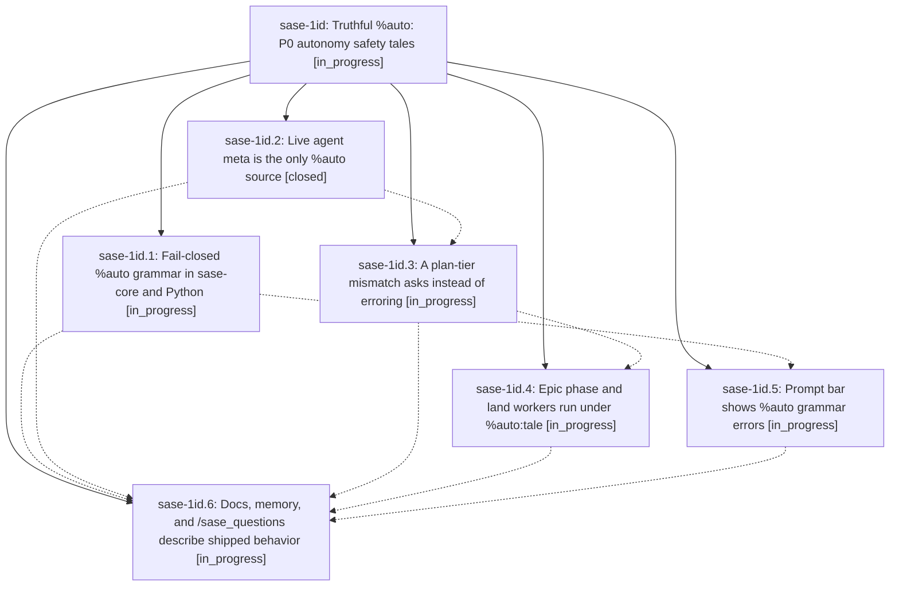

# Bead: sase-1id — Truthful %auto: P0 autonomy safety tales

[Bead Pages](../README.md) / sase-1id

**Status:** ◐ in_progress · **Type:** ▸ plan · **Tier:** epic
**Owner:** `bryanbugyi34@gmail.com` · **Created by:** [bbugyi200.athena.0yg](https://github.com/sase-org/sase--agents/blob/main/sessions/bbugyi200.athena.0yg.md) · **Assignee:** `sase-1id.land`
**Created:** 2026-10-08 13:39:28 EDT
**Plan:** [202610/auto\_p0\_safety\_tales.md](https://github.com/sase-org/sase--plans/blob/main/202610/auto_p0_safety_tales.md)

<!-- sase:links:start -->

## Links

| Relation | Artifact | Why |
| --- | --- | --- |
| implemented-by | [plan:202610/auto_p0_safety_tales.md][1] | derived from the plan's `bead_id:` frontmatter field |

[1]: https://github.com/sase-org/sase--plans/blob/main/202610/auto_p0_safety_tales.md

<!-- sase:links:end -->

## Description

No %auto spelling silently grants more than it says, pressing A to turn auto off really turns it off, epic phase and land workers park nested epic plans for a human instead of launching them, and the docs, the macros.md memory row, and /sase_questions describe the behavior that actually ships. The three P0 task beads (sase-1hg, sase-15s, sase-1hh) are closed when the epic lands.

## Phases

| Bead | Title | Status | Size | Created | Agents | Commits |
|---|---|---|---|---|---:|---:|
| [sase-1id.1](sase-1id.1.md) | Fail-closed %auto grammar in sase-core and Python | ◐ in_progress | medium | 2026-10-08 | 1 | 0 |
| [sase-1id.2](sase-1id.2.md) | Live agent meta is the only %auto source | ✓ closed | medium | 2026-10-08 | 1 | 1 |
| [sase-1id.3](sase-1id.3.md) | A plan-tier mismatch asks instead of erroring | ◐ in_progress | medium | 2026-10-08 | 1 | 0 |
| [sase-1id.4](sase-1id.4.md) | Epic phase and land workers run under %auto:tale | ◐ in_progress | medium | 2026-10-08 | 1 | 0 |
| [sase-1id.5](sase-1id.5.md) | Prompt bar shows %auto grammar errors | ◐ in_progress | small | 2026-10-08 | 1 | 0 |
| [sase-1id.6](sase-1id.6.md) | Docs, memory, and /sase\_questions describe shipped behavior | ◐ in_progress | medium | 2026-10-08 | 1 | 0 |

## Lineage

## Agents

| Agent | Bead | Commits |
|---|---|---:|
| [bbugyi200.athena.sase-1id.1](https://github.com/sase-org/sase--agents/blob/main/sessions/bbugyi200.athena.sase-1id.1.md) | [sase-1id.1](sase-1id.1.md) | 0 |
| [bbugyi200.athena.sase-1id.2](https://github.com/sase-org/sase--agents/blob/main/sessions/bbugyi200.athena.sase-1id.2.md) | [sase-1id.2](sase-1id.2.md) | 1 |
| [bbugyi200.athena.sase-1id.3](https://github.com/sase-org/sase--agents/blob/main/agents/bbugyi200.athena.sase-1id.3/README.md) | [sase-1id.3](sase-1id.3.md) | 0 |
| [bbugyi200.athena.sase-1id.4](https://github.com/sase-org/sase--agents/blob/main/agents/bbugyi200.athena.sase-1id.4/README.md) | [sase-1id.4](sase-1id.4.md) | 0 |
| [bbugyi200.athena.sase-1id.5](https://github.com/sase-org/sase--agents/blob/main/agents/bbugyi200.athena.sase-1id.5/README.md) | [sase-1id.5](sase-1id.5.md) | 0 |
| [bbugyi200.athena.sase-1id.6](https://github.com/sase-org/sase--agents/blob/main/agents/bbugyi200.athena.sase-1id.6/README.md) | [sase-1id.6](sase-1id.6.md) | 0 |
| [bbugyi200.athena.sase-1id.land](https://github.com/sase-org/sase--agents/blob/main/agents/bbugyi200.athena.sase-1id.land/README.md) | [sase-1id](README.md) | 0 |

## Commits

| Repo | Commit | Subject | Bead | Committed |
|---|---|---|---|---|
| sase | [`c70ee9a`](https://github.com/sase-org/sase/commit/c70ee9af3d4812a23777c11ef77b2ac75dea4fa9) | feat(auto): live agent meta is the only %auto source | [sase-1id.2](sase-1id.2.md) | 2026-10-08 14:38:50 EDT |
