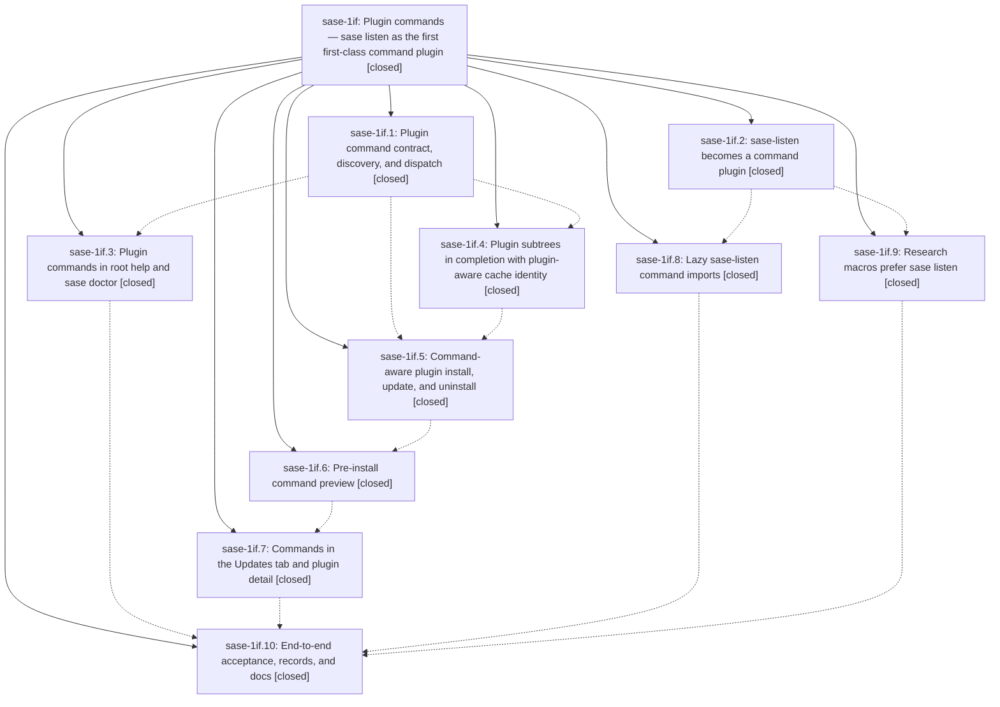

# Bead: sase-1if — Plugin commands — sase listen as the first first-class command plugin

[Bead Pages](../README.md) / sase-1if

**Status:** ✓ closed · **Resolution:** done · **Type:** ▸ plan · **Tier:** epic
**Owner:** `bryanbugyi34@gmail.com` · **Created by:** [bbugyi200.apollo.research.0n.linker.w0](https://github.com/sase-org/sase--agents/blob/main/sessions/bbugyi200.apollo.research.0n.linker.w0.md) · **Assignee:** `sase-1if.land`
**Created:** 2026-10-08 15:26:22 EDT · **Closed:** 2026-10-09 14:09:30 EDT
**Plan:** [202610/plugin\_commands.md](https://github.com/sase-org/sase--plans/blob/main/202610/plugin_commands.md)

<!-- sase:links:start -->

## Links

| Relation | Artifact | Why |
| --- | --- | --- |
| implemented-by | [plan:202610/plugin_commands.md][1] | derived from the plan's `bead_id:` frontmatter field |
| related | file:explicit:d37b84c1bf55599a39286990 | attached via sase artifact create --bead |

_Plus 5 automatic references — see [Referenced By](#referenced-by)._

[1]: https://github.com/sase-org/sase--plans/blob/main/202610/plugin_commands.md

<!-- sase:links:end -->

## Description

Plugins can mount top-level `sase <name>` commands through a metadata-declared `sase_commands` entry point. sase-listen uses it to ship `sase listen`, which behaves exactly like `sase-listen`, completes in bash/zsh/fish and the TUI `:` line, refreshes completion automatically on every plugin change, and is installed and managed from the Admin Center's Updates tab. Every moment a plugin adds or removes a command is announced clearly and consistently.

## Notes

[2026-10-09T10:00:36Z · sase-1ir.land] DISCOVERED ISSUE: sase-1ir post-close verification at master 563f046a85 ran sase tool run -- just symvision (ToolRun 3f45cf96e01c1e9b21ac37abca68028a), exit 1. After environment setup completed, Symvision reported exactly five unused public definitions in src/sase/plugins/declared_commands.py: fetch_upstream_pyproject, get_declared_commands, parse_declared_commands, read_declared_cache, write_declared_cache. All were introduced by bd68ee4942, phase sase-1if.6; src-wide search shows only in-file production callers. Under the Symvision policy, privatize these helpers and update their in-file callers, tests, and __all__, unless a later phase adds actual external consumers. No stale epic-symbol errors occurred. Retained log: file:explicit:d37b84c1bf55599a39286990. Triage searched all task statuses for these symbols and swept recent CI tasks; sase-1hp was reviewed and covers a distinct older closed-owner symbol set, with a note reporting that set was already green. No duplicate or standalone task created: this is caused by this active plugin epic and belongs in its landing work. This failure is unrelated to the verified fixture no-op scope of sase-1ir.

[2026-10-09T10:12:15Z · sase-1h8.land] DISCOVERED ISSUE (sase-1h8 land agent, master 563f046a85, 2026-10-09): just symvision is red on 5 unused public functions in src/sase/plugins/declared_commands.py (fetch_upstream_pyproject, get_declared_commands, parse_declared_commands, read_declared_cache, write_declared_cache). The module was added by bd68ee4942 (sase-1if.6, pre-install command preview), and this epic has no --epic-symbol entries for them (sase bead epic-symbols sase-1if is empty). Wire them up (sase-1if.7 may be the consumer), privatize them, or add --epic-symbol rows keyed to the open consuming phase.

[2026-10-09T10:43:55Z · sase-1io.land] DISCOVERED ISSUE (sase-1io.land, release v0.18.0, 2026-10-09): the declared_commands.py unused-public residual (fetch_upstream_pyproject, get_declared_commands, parse_declared_commands, read_declared_cache, write_declared_cache; see notes #1-#2) is now the only lint red on Master Gate at master 7e87589fb5 (run 37915170978) and blocks the sase 0.18.0 release, which needs a green Master Gate on the tip. Coordination: the sase-1io child plan that finishes the release has a sase gate-fix phase. If this residual is still red when that phase starts and no sase-1if commit has resolved it, that phase applies the Symvision hierarchy per symbol. It privatizes symbols used only in-file, and adds --epic-symbol rows keyed to open sase-1if.7 only for symbols the updates-tab plan says the detail-view preview worker will consume. Landing your own resolution first avoids conflicting edits.

[2026-10-09T11:25:38Z · sase-1io.7.2] sase-1io.7.2 resolved the declared_commands Symvision residual by privatizing fetch_upstream_pyproject, get_declared_commands, parse_declared_commands, read_declared_cache, write_declared_cache (all in-file-only in production; tests updated to underscore names; __all__ trimmed; telemetry op string kept stable). No --epic-symbol rows: the updates-tab detail worker consumes get_declared_commands_for_entry/attach_declared_previews, which already have real consumers and were never flagged.

[2026-10-09T18:09:30Z · sase-1if.land] LANDED (sase-1if.land, master dd5f0e5780, 2026-10-09). VERIFIED all 10 phases against plan:202610/plugin_commands.md and source: mount (b9693bc695: plugin_commands scan/registry/adapter/dispatch/chip/hints, dispatch wired after the run fast path in main/entry.py, hermetic SASE_DISABLE_PLUGIN_COMMANDS guard, fake-dist harness); completion (7922974062 + 27e939327b: build_runtime_spec feeds completion spec/emitters/install_scripts/ensure manifests and the TUI spec subprocess, plugin_commands record in runtime_identity, editable-source fingerprint, CACHE_FORMAT_REVISION 2, omissions in manifest + doctor, TUI panel-open key recheck off the event loop); help-doctor (991c8b4dd7: -h group per compact_help=yes, -H footer, plugins.commands + deep parsers checks); lifecycle (3b3d876911: inventory groups incl sase_commands/sase_macros/sase_pager_history, InstalledInfo.commands, before/after snapshot diff and child completion refresh computed inside execute_install/_many/update/uninstall so CLI, required-plugins gate and TUI batch/combined workers all carry effects); command-preview (bd68ee4942); updates-tab (f0c732e70d: row chip, detail Commands row, confirm lines, receipt FORMAT_VERSION 4 with v1-3 decode, toast lines, 3 PNG goldens); sase-listen 8c57128 (sase_commands entry point, stdlib adapter, prog threading, buildinfo, feed-host fallback, dead cli.py removed) and bbaf58f (lazy imports + test_fast_start); sase-research-artifacts 91e353c (sase listen -> sase-listen -> uvx selection); acceptance dd5f0e5780 (docs, decisions:plugin-commands strand, cli_rules exemption; decisions honored: compact_help=yes, memory edits limited to decisions + cli_rules.md). Re-ran at HEAD via sase tool run: 6 epic suites 141 passed (7eb21cb9/re-run after core 0.37.2 sync), 16 neighbor suites 222 passed (ensure contract, builtin snapshot, doctor plugins, receipts, toast, plugin CLI/ops); just symvision clean (30d0ee50); test-waits lint green (c5b53ccb). Epic notes #1-#4 (declared_commands unused publics) resolved by f542104b5c (sase-1io.7.2), confirmed by clean symvision. INTEGRATION: reviewed all 55 non-epic commits since b9693bc695; overlap only in e2efd56242/1fedb63427/bd6c7173dd/f542104b5c (symbol privatization of epic code, consistent), 974d44aa9b (Updates single view, landed before .7 which built on it), 3412a9f1bd (-S emitter change; acceptance confirmed listen subtree in all three emitters afterward), docs-only touches of docs/plugins.md/cli.md. sase-1ig install_remedy (fa0de348ee) covers reinstall-in-place hints; the adapter's plan-mandated 'requires a newer sase — run sase update' is an upgrade hint, left as specified. No duplicate or conflicting code found; no changes needed. FOLLOW-UPS: .1#1 and .3#1 (49 pre-existing unused-public symbols) DECLINED as resolved: just symvision is clean at HEAD (fixed by 1fedb63427/bd6c7173dd; trackers sase-1i5.9.1.2.1.5/sase-1hp). .5#1 (xprompt literal in test_plugin_commands_mount.py, epic-caused) DECLINED as resolved by e2efd56242 (RETIRED_ROOT_COMMAND); test_macro_string_literals_avoid_xprompt_terms passes at HEAD. .6#1 (test-waits lint on test_plan_decision_ace_stale.py) DECLINED as resolved: lint (test waits) green at HEAD. .9#1 (sase listen ls recovery hint unproven) routed via /sase_new_task as DISCOVERED ISSUE on in-progress epic sase-1e3, which owns the unlanded ls stub (sase-1e3.7); no duplicate task, none created. .10 gap (disposable uv-tool uninstall/reinstall not exercised) accepted: lifecycle diff/refresh covered by unit tests. Rollout (sase-listen release with the entry point, per-machine install, sase-1gc Mac) is manual post-release work outside this epic. epic-symbols: none.

## Phases

| Bead | Title | Status | Size | Created | Agents | Commits |
|---|---|---|---|---|---:|---:|
| [sase-1if.1](sase-1if.1.md) | Plugin command contract, discovery, and dispatch | ✓ closed | medium | 2026-10-08 | 1 | 1 |
| [sase-1if.10](sase-1if.10.md) | End-to-end acceptance, records, and docs | ✓ closed | medium | 2026-10-08 | 1 | 1 |
| [sase-1if.2](sase-1if.2.md) | sase-listen becomes a command plugin | ✓ closed | medium | 2026-10-08 | 1 | 1 |
| [sase-1if.3](sase-1if.3.md) | Plugin commands in root help and sase doctor | ✓ closed | small | 2026-10-08 | 1 | 1 |
| [sase-1if.4](sase-1if.4.md) | Plugin subtrees in completion with plugin-aware cache identity | ✓ closed | medium | 2026-10-08 | 1 | 1 |
| [sase-1if.5](sase-1if.5.md) | Command-aware plugin install, update, and uninstall | ✓ closed | medium | 2026-10-08 | 1 | 1 |
| [sase-1if.6](sase-1if.6.md) | Pre-install command preview | ✓ closed | small | 2026-10-08 | 1 | 1 |
| [sase-1if.7](sase-1if.7.md) | Commands in the Updates tab and plugin detail | ✓ closed | medium | 2026-10-08 | 1 | 1 |
| [sase-1if.8](sase-1if.8.md) | Lazy sase-listen command imports | ✓ closed | small | 2026-10-08 | 1 | 1 |
| [sase-1if.9](sase-1if.9.md) | Research macros prefer sase listen | ✓ closed | small | 2026-10-08 | 1 | 1 |

## Lineage

## Agents

| Agent | Bead | Commits |
|---|---|---:|
| [bbugyi200.apollo.sase-1if.1](https://github.com/sase-org/sase--agents/blob/main/agents/bbugyi200.apollo.sase-1if.1/README.md) | [sase-1if.1](sase-1if.1.md) | 1 |
| [bbugyi200.apollo.sase-1if.10](https://github.com/sase-org/sase--agents/blob/main/sessions/bbugyi200.apollo.sase-1if.10.md) | [sase-1if.10](sase-1if.10.md) | 1 |
| [bbugyi200.apollo.sase-1if.2](https://github.com/sase-org/sase--agents/blob/main/agents/bbugyi200.apollo.sase-1if.2/README.md) | [sase-1if.2](sase-1if.2.md) | 1 |
| [bbugyi200.apollo.sase-1if.3](https://github.com/sase-org/sase--agents/blob/main/agents/bbugyi200.apollo.sase-1if.3/README.md) | [sase-1if.3](sase-1if.3.md) | 1 |
| [bbugyi200.apollo.sase-1if.4](https://github.com/sase-org/sase--agents/blob/main/sessions/bbugyi200.apollo.sase-1if.4.md) | [sase-1if.4](sase-1if.4.md) | 1 |
| [bbugyi200.apollo.sase-1if.5](https://github.com/sase-org/sase--agents/blob/main/sessions/bbugyi200.apollo.sase-1if.5.md) | [sase-1if.5](sase-1if.5.md) | 1 |
| [bbugyi200.apollo.sase-1if.6](https://github.com/sase-org/sase--agents/blob/main/agents/bbugyi200.apollo.sase-1if.6/README.md) | [sase-1if.6](sase-1if.6.md) | 1 |
| [bbugyi200.apollo.sase-1if.7](https://github.com/sase-org/sase--agents/blob/main/sessions/bbugyi200.apollo.sase-1if.7.md) | [sase-1if.7](sase-1if.7.md) | 1 |
| [bbugyi200.apollo.sase-1if.8](https://github.com/sase-org/sase--agents/blob/main/agents/bbugyi200.apollo.sase-1if.8/README.md) | [sase-1if.8](sase-1if.8.md) | 1 |
| [bbugyi200.apollo.sase-1if.9](https://github.com/sase-org/sase--agents/blob/main/agents/bbugyi200.apollo.sase-1if.9/README.md) | [sase-1if.9](sase-1if.9.md) | 1 |
| [bbugyi200.apollo.sase-1if.land](https://github.com/sase-org/sase--agents/blob/main/agents/bbugyi200.apollo.sase-1if.land/README.md) | [sase-1if](README.md) | 1 |

## Commits

| Repo | Commit | Subject | Bead | Committed |
|---|---|---|---|---|
| sase-listen | [`sase-listen@8c57128`](https://github.com/sase-org/sase-listen/commit/8c5712886833b527bdb39197513c4701af225e74) | feat(listen): ship sase listen as a first-class command plugin | [sase-1if.2](sase-1if.2.md) | 2026-10-08 15:52:38 EDT |
| sase-listen | [`sase-listen@bbaf58f`](https://github.com/sase-org/sase-listen/commit/bbaf58f7cdedecc54af5549cca1672afd71ba6e3) | perf(cli): defer heavy imports into command handlers for fast startup | [sase-1if.8](sase-1if.8.md) | 2026-10-08 16:07:42 EDT |
| sase-research-artifacts | [`sase-research-artifacts@91e353c`](https://github.com/sase-org/sase-research-artifacts/commit/91e353c8d898b235f665382e5262f5d6cdba50df) | feat(research-artifacts): prefer sase listen CLI in audio and swarm prompts | [sase-1if.9](sase-1if.9.md) | 2026-10-08 16:32:18 EDT |
| sase | [`b9693bc`](https://github.com/sase-org/sase/commit/b9693bc695751cbc6ea6d0228d21e792cea7733e) | feat(plugin-commands): add sase\_commands contract, discovery, and dispatch | [sase-1if.1](sase-1if.1.md) | 2026-10-08 16:43:55 EDT |
| sase | [`7922974`](https://github.com/sase-org/sase/commit/79229740620312e2be8412024ece417ca03f1998) | feat(completion): merge plugin parsers into runtime spec with plugin-aware cache identity | [sase-1if.4](sase-1if.4.md) | 2026-10-08 17:55:41 EDT |
| sase | [`991c8b4`](https://github.com/sase-org/sase/commit/991c8b4dd7c74b7b4c044c53aaffc6d23a169642) | feat(plugin-commands): list plugin commands in root help and sase doctor | [sase-1if.3](sase-1if.3.md) | 2026-10-08 18:02:32 EDT |
| sase | [`3b3d876`](https://github.com/sase-org/sase/commit/3b3d8769114298c58d8f136c55baaab93a367514) | feat(plugins): command-aware plugin install, update, and uninstall lifecycle | [sase-1if.5](sase-1if.5.md) | 2026-10-09 03:17:38 EDT |
| sase | [`bd68ee4`](https://github.com/sase-org/sase/commit/bd68ee494200e697f60ed5abd009981726055941) | feat(plugins): pre-install plugin command preview (sase-1if.6) | [sase-1if.6](sase-1if.6.md) | 2026-10-09 05:27:58 EDT |
| sase | [`f0c732e`](https://github.com/sase-org/sase/commit/f0c732e70d07e2849556c487f0ff339b7bc9b984) | feat(sase-1if.7): render plugin commands across Updates tab, detail panel, confirms, and toast | [sase-1if.7](sase-1if.7.md) | 2026-10-09 13:14:31 EDT |
| sase | [`dd5f0e5`](https://github.com/sase-org/sase/commit/dd5f0e5780fcbb6996c12851727a3f3cac6da364) | docs(sase-1if.10): land acceptance records and plugin command docs | [sase-1if.10](sase-1if.10.md) | 2026-10-09 13:53:50 EDT |
| sase--plans | [`sase--plans@4dfeb55`](https://github.com/sase-org/sase--plans/commit/4dfeb554ce3c980636345dc142a397ebaf032ff1) | chore(plans): mark plugin\_commands epic plan done after sase-1if landing | [sase-1if](README.md) | 2026-10-09 14:12:04 EDT |

<!-- sase:referenced-by:start -->

## Referenced By

| Relation | Artifact | Why | Uses |
| --- | --- | --- | ---: |
| read-by | [agent:sase-1if.1][1] | epic context | 1 |
| read-by | [agent:sase-1if.3][2] | epic context for phase | 1 |
| read-by | [agent:sase-1if.6][3] | epic scope decisions | 1 |
| read-by | [agent:sase-1if.7--1][4] | need epic decisions and plan scope for phase 7 close | 1 |
| read-by | [agent:sase-1if.9][5] | need epic scope decisions | 1 |

[1]: https://github.com/sase-org/sase--agents/blob/main/agents/bbugyi200.apollo.sase-1if.1/README.md
[2]: https://github.com/sase-org/sase--agents/blob/main/agents/bbugyi200.apollo.sase-1if.3/README.md
[3]: https://github.com/sase-org/sase--agents/blob/main/agents/bbugyi200.apollo.sase-1if.6/README.md
[4]: https://github.com/sase-org/sase--agents/blob/main/sessions/bbugyi200.apollo.sase-1if.7.md
[5]: https://github.com/sase-org/sase--agents/blob/main/agents/bbugyi200.apollo.sase-1if.9/README.md

<!-- sase:referenced-by:end -->
