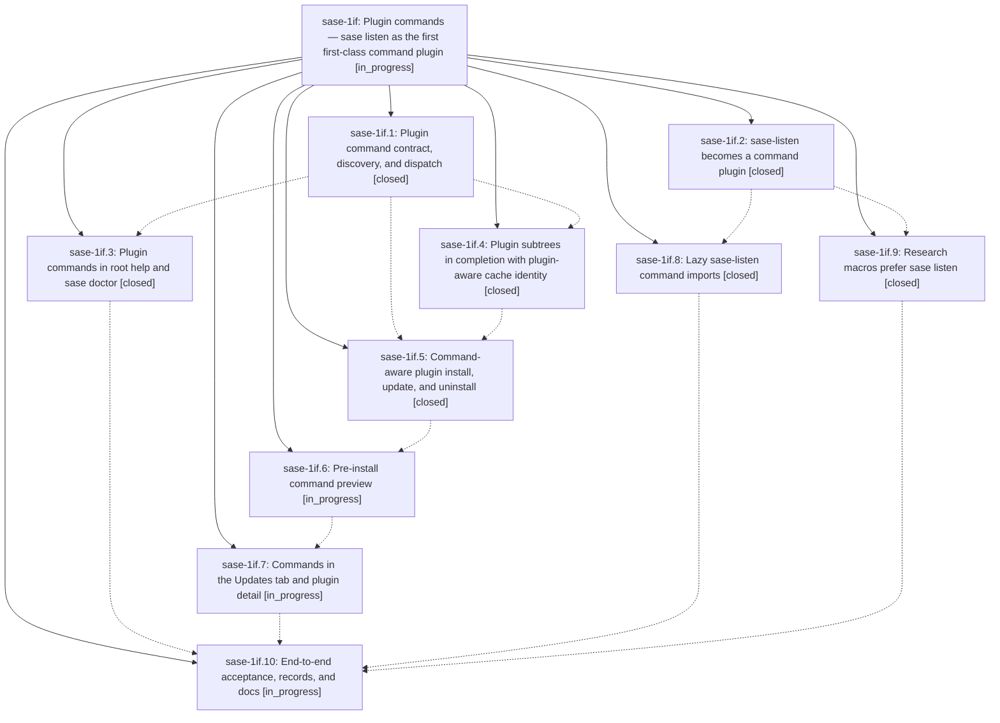

# Bead: sase-1if — Plugin commands — sase listen as the first first-class command plugin

[Bead Pages](../README.md) / sase-1if

**Status:** ◐ in_progress · **Type:** ▸ plan · **Tier:** epic
**Owner:** `bryanbugyi34@gmail.com` · **Created by:** [bbugyi200.apollo.research.0n.linker.w0](https://github.com/sase-org/sase--agents/blob/main/sessions/bbugyi200.apollo.research.0n.linker.w0.md) · **Assignee:** `sase-1if.land`
**Created:** 2026-10-08 15:26:22 EDT
**Plan:** [202610/plugin\_commands.md](https://github.com/sase-org/sase--plans/blob/main/202610/plugin_commands.md)

<!-- sase:links:start -->

## Links

| Relation | Artifact | Why |
| --- | --- | --- |
| implemented-by | [plan:202610/plugin_commands.md][1] | derived from the plan's `bead_id:` frontmatter field |

_Plus 3 automatic references — see [Referenced By](#referenced-by)._

[1]: https://github.com/sase-org/sase--plans/blob/main/202610/plugin_commands.md

<!-- sase:links:end -->

## Description

Plugins can mount top-level `sase <name>` commands through a metadata-declared `sase_commands` entry point. sase-listen uses it to ship `sase listen`, which behaves exactly like `sase-listen`, completes in bash/zsh/fish and the TUI `:` line, refreshes completion automatically on every plugin change, and is installed and managed from the Admin Center's Updates tab. Every moment a plugin adds or removes a command is announced clearly and consistently.

## Phases

| Bead | Title | Status | Size | Created | Agents | Commits |
|---|---|---|---|---|---:|---:|
| [sase-1if.1](sase-1if.1.md) | Plugin command contract, discovery, and dispatch | ✓ closed | medium | 2026-10-08 | 1 | 1 |
| [sase-1if.10](sase-1if.10.md) | End-to-end acceptance, records, and docs | ◐ in_progress | medium | 2026-10-08 | 1 | 0 |
| [sase-1if.2](sase-1if.2.md) | sase-listen becomes a command plugin | ✓ closed | medium | 2026-10-08 | 1 | 0 |
| [sase-1if.3](sase-1if.3.md) | Plugin commands in root help and sase doctor | ✓ closed | small | 2026-10-08 | 1 | 1 |
| [sase-1if.4](sase-1if.4.md) | Plugin subtrees in completion with plugin-aware cache identity | ✓ closed | medium | 2026-10-08 | 1 | 1 |
| [sase-1if.5](sase-1if.5.md) | Command-aware plugin install, update, and uninstall | ✓ closed | medium | 2026-10-08 | 1 | 1 |
| [sase-1if.6](sase-1if.6.md) | Pre-install command preview | ◐ in_progress | small | 2026-10-08 | 1 | 0 |
| [sase-1if.7](sase-1if.7.md) | Commands in the Updates tab and plugin detail | ◐ in_progress | medium | 2026-10-08 | 1 | 0 |
| [sase-1if.8](sase-1if.8.md) | Lazy sase-listen command imports | ✓ closed | small | 2026-10-08 | 1 | 0 |
| [sase-1if.9](sase-1if.9.md) | Research macros prefer sase listen | ✓ closed | small | 2026-10-08 | 1 | 0 |

## Lineage

## Agents

| Agent | Bead | Commits |
|---|---|---:|
| [bbugyi200.apollo.sase-1if.1](https://github.com/sase-org/sase--agents/blob/main/agents/bbugyi200.apollo.sase-1if.1/README.md) | [sase-1if.1](sase-1if.1.md) | 1 |
| [bbugyi200.apollo.sase-1if.10](https://github.com/sase-org/sase--agents/blob/main/agents/bbugyi200.apollo.sase-1if.10/README.md) | [sase-1if.10](sase-1if.10.md) | 0 |
| [bbugyi200.apollo.sase-1if.2](https://github.com/sase-org/sase--agents/blob/main/agents/bbugyi200.apollo.sase-1if.2/README.md) | [sase-1if.2](sase-1if.2.md) | 0 |
| [bbugyi200.apollo.sase-1if.3](https://github.com/sase-org/sase--agents/blob/main/agents/bbugyi200.apollo.sase-1if.3/README.md) | [sase-1if.3](sase-1if.3.md) | 1 |
| [bbugyi200.apollo.sase-1if.4](https://github.com/sase-org/sase--agents/blob/main/sessions/bbugyi200.apollo.sase-1if.4.md) | [sase-1if.4](sase-1if.4.md) | 1 |
| [bbugyi200.apollo.sase-1if.5](https://github.com/sase-org/sase--agents/blob/main/sessions/bbugyi200.apollo.sase-1if.5.md) | [sase-1if.5](sase-1if.5.md) | 1 |
| [bbugyi200.apollo.sase-1if.6](https://github.com/sase-org/sase--agents/blob/main/agents/bbugyi200.apollo.sase-1if.6/README.md) | [sase-1if.6](sase-1if.6.md) | 0 |
| [bbugyi200.apollo.sase-1if.7](https://github.com/sase-org/sase--agents/blob/main/agents/bbugyi200.apollo.sase-1if.7/README.md) | [sase-1if.7](sase-1if.7.md) | 0 |
| [bbugyi200.apollo.sase-1if.8](https://github.com/sase-org/sase--agents/blob/main/agents/bbugyi200.apollo.sase-1if.8/README.md) | [sase-1if.8](sase-1if.8.md) | 0 |
| [bbugyi200.apollo.sase-1if.9](https://github.com/sase-org/sase--agents/blob/main/agents/bbugyi200.apollo.sase-1if.9/README.md) | [sase-1if.9](sase-1if.9.md) | 0 |
| [bbugyi200.apollo.sase-1if.land](https://github.com/sase-org/sase--agents/blob/main/agents/bbugyi200.apollo.sase-1if.land/README.md) | [sase-1if](README.md) | 0 |

## Commits

| Repo | Commit | Subject | Bead | Committed |
|---|---|---|---|---|
| sase | [`b9693bc`](https://github.com/sase-org/sase/commit/b9693bc695751cbc6ea6d0228d21e792cea7733e) | feat(plugin-commands): add sase\_commands contract, discovery, and dispatch | [sase-1if.1](sase-1if.1.md) | 2026-10-08 16:43:55 EDT |
| sase | [`7922974`](https://github.com/sase-org/sase/commit/79229740620312e2be8412024ece417ca03f1998) | feat(completion): merge plugin parsers into runtime spec with plugin-aware cache identity | [sase-1if.4](sase-1if.4.md) | 2026-10-08 17:55:41 EDT |
| sase | [`991c8b4`](https://github.com/sase-org/sase/commit/991c8b4dd7c74b7b4c044c53aaffc6d23a169642) | feat(plugin-commands): list plugin commands in root help and sase doctor | [sase-1if.3](sase-1if.3.md) | 2026-10-08 18:02:32 EDT |
| sase | [`3b3d876`](https://github.com/sase-org/sase/commit/3b3d8769114298c58d8f136c55baaab93a367514) | feat(plugins): command-aware plugin install, update, and uninstall lifecycle | [sase-1if.5](sase-1if.5.md) | 2026-10-09 03:17:38 EDT |

<!-- sase:referenced-by:start -->

## Referenced By

| Relation | Artifact | Why | Uses |
| --- | --- | --- | ---: |
| read-by | [agent:sase-1if.1][1] | epic context | 1 |
| read-by | [agent:sase-1if.3][2] | epic context for phase | 1 |
| read-by | [agent:sase-1if.9][3] | need epic scope decisions | 1 |

[1]: https://github.com/sase-org/sase--agents/blob/main/agents/bbugyi200.apollo.sase-1if.1/README.md
[2]: https://github.com/sase-org/sase--agents/blob/main/agents/bbugyi200.apollo.sase-1if.3/README.md
[3]: https://github.com/sase-org/sase--agents/blob/main/agents/bbugyi200.apollo.sase-1if.9/README.md

<!-- sase:referenced-by:end -->
