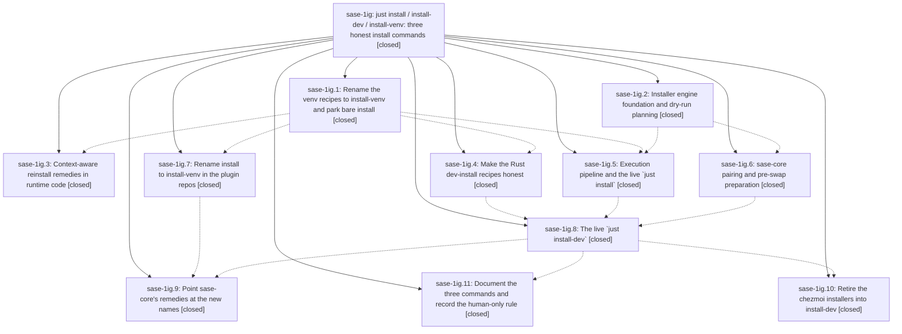

# Bead: sase-1ig — just install / install-dev / install-venv: three honest install commands

[Bead Pages](../README.md) / sase-1ig

**Status:** ✓ closed · **Resolution:** done · **Type:** ▸ plan · **Tier:** epic
**Owner:** `bryanbugyi34@gmail.com` · **Created by:** [bbugyi200.athena.0ym](https://github.com/sase-org/sase--agents/blob/main/sessions/bbugyi200.athena.0ym.md) · **Assignee:** `sase-1ig.land`
**Created:** 2026-10-08 18:23:28 EDT · **Closed:** 2026-10-09 02:54:36 EDT
**Plan:** [202610/just\_install\_pypi\_dev\_venv.md](https://github.com/sase-org/sase--plans/blob/main/202610/just_install_pypi_dev_venv.md)

<!-- sase:links:start -->

## Links

| Relation | Artifact | Why |
| --- | --- | --- |
| implemented-by | [plan:202610/just_install_pypi_dev_venv.md][1] | derived from the plan's `bead_id:` frontmatter field |

_Plus 2 automatic references — see [Referenced By](#referenced-by)._

[1]: https://github.com/sase-org/sase--plans/blob/main/202610/just_install_pypi_dev_venv.md

<!-- sase:links:end -->

## Description

`just install` installs the latest sase release from PyPI as the user's `sase` command, `just install-dev` installs this checkout plus its pin-paired sase-core (editable) in exactly the shape `sase update` maintains, and today's venv recipes live on as `just install-venv*`. Every consumer is migrated: CI, the tool catalog, runtime remedies, docs, memory, sase-core strings, the plugin repos, and the chezmoi `acei`/`aceii` installers.

## Notes

[2026-10-09T06:37:56Z · sase-1ig.land] LAND TRIAGE (sase-1ig.land, master 974d44aa9b, 2026-10-09). Outcome of every PROPOSED FOLLOW-UP:
(1) sase-1ig.1 and sase-1ig.3, symvision unused-public backlog: DECLINED, already resolved. just symvision passes on master (sase-1i5.9.1.2.1.5 closed, bd6c7173dd).
(2) sase-1ig.2, bugyi-chops is now published on PyPI: DECLINED, not a defect. The unpublished-plugin policy is still pinned hermetically by test_pypi_unpublished_plugin_stays_editable and test_pypi_unpublished_without_source_removes.
(3) sase-1ig.3, just check took over 1h waiting on the shared sase-core wheel build lock: DECLINED. It is one observation under loadavg ~20 with no reproduction, and the lock serializes identical core builds by design.
(4) sase-1ig.4 and sase-1ig.8, KNOWN master failures (test_macro_string_literals_avoid_xprompt_terms, test_directive_completion_includes_representative_descriptions, test_tab_through_every_subcommand_reaches_the_last_with_a_highlight): no new task. They are already owned by sase-1hr (+1 from sase-1ig.4) and by the repairs pending in in-progress sase-1i5.9.1.2.1.7. All three still fail on 974d44aa9b and none touch install code.
(5) sase-1ig.7 #1, remove the private install alias from the four plugin repos after one release: CREATED sase-1ij (feature, small), linked to sase-1ig.7.
(6) sase-1ig.7 #2, full check lanes are CI-only: DECLINED. All four plugin repos' rename commits are green on GitHub CI and Publish, and sase-github 0.2.21 and sase-telegram 0.4.28 shipped the rename.
(7) sase-1ig.11, lint (test waits) failure in test_plan_decision_ace_stale.py:183,310: caused by 1820636212 (sase-1hi.10.7.6.1), so recorded as a DISCOVERED ISSUE on active epic sase-1hi.
(8) sase-1ig.6 #1, build-check cold/warm timings were never recorded: MEASURED by the land agent. Cold maturin build check: 238s. A repeat check: 44.6s. The post-swap maturin develop: 42s, rebuilding pyo3* and sase_core_py. Cause: uv run replaces VIRTUAL_ENV with a random ephemeral env, so the check never uses the tool interpreter the plan required. With the tool interpreter pinned, a repeat check takes 2s and develop 1s. This is EPIC WORK and goes to a remediation tale.
(9) sase-1ig.8 #2, sase update -n -j reports mixed for a dev install with PyPI plugins: EPIC-CAUSED. The engine's own source policy (rule 3, PyPI fallback) creates that state, and classify_update_agreement then fails verify with exit 1 after a successful swap. Goes to the remediation tale.
Additional epic-caused regression: Deploy Docs has failed on every commit since 29724dc042, because docs/development.md links ../INSTALL.md#installing-from-a-checkout and mkdocs --strict aborts. Goes to the remediation tale.
Integration: no post-start commit duplicates or conflicts with the epic. 974d44aa9b only mentions sase update in the Updates tab docs. Added an install-venv rename note to memory task sase-1hv. The sase-core pin stays at 5c4033f6: sase-1ig.9's core-only commit 4ea91b95 needs no sase change, and the core-pin-ratchet workflow moves it. The sase_monitor skill redeploy (sase skill init --force) is left to the human, because it writes the global chezmoi source.

[2026-10-09T06:54:36Z · sase-1ig.land] Land-remediation tale done. The land agent verified all 11 phases against source and commits (6f240b3c96, e5c09c19f5, fa0de348ee, d0b6e2e99d, 62f256008b, 10f5e2169f, 33bc9ca36c, 29724dc042, sase-core 4ea91b95, the four plugin-repo rename commits, chezmoi 0ed26344). 328 targeted epic tests passed and the agent guard refused through both recipes. Plugin-repo CI was green and just symvision was clean. Follow-up triage is recorded in the LAND TRIAGE note: sase-1ij was created, a DISCOVERED ISSUE went to sase-1hi, and the rest were declined with reasons. The sase-core pin is left for the core-pin-ratchet workflow, because no sase change needs 4ea91b95. This tale fixed the Deploy Docs link (absolute GitHub URL for INSTALL.md; just docs-check exits 0), mixed-mode agreement (classify_update_agreement allow_mixed plus PyPI mixed-ok for kept editable plugins; 250 tests green in tests/sase_install plus justfile sase-core-dir/lint suites), and the build-check interpreter pin (--interpreter plus VIRTUAL_ENV wrapper when the tool env exists, unpinned otherwise). sase tool run check passes every gate through lint (pyscripts) and stops only at the known pre-existing lint (test waits) failure in tests/ace/tui/test_plan_decision_ace_stale.py:183,310 recorded on sase-1hi; just symvision is clean and epic-symbols reports no entries.

## Phases

| Bead | Title | Status | Size | Created | Agents | Commits |
|---|---|---|---|---|---:|---:|
| [sase-1ig.1](sase-1ig.1.md) | Rename the venv recipes to install-venv and park bare install | ✓ closed | medium | 2026-10-08 | 1 | 1 |
| [sase-1ig.10](sase-1ig.10.md) | Retire the chezmoi installers into install-dev | ✓ closed | small | 2026-10-08 | 1 | 1 |
| [sase-1ig.11](sase-1ig.11.md) | Document the three commands and record the human-only rule | ✓ closed | small | 2026-10-08 | 1 | 1 |
| [sase-1ig.2](sase-1ig.2.md) | Installer engine foundation and dry-run planning | ✓ closed | medium | 2026-10-08 | 1 | 1 |
| [sase-1ig.3](sase-1ig.3.md) | Context-aware reinstall remedies in runtime code | ✓ closed | small | 2026-10-08 | 1 | 1 |
| [sase-1ig.4](sase-1ig.4.md) | Make the Rust dev-install recipes honest | ✓ closed | small | 2026-10-08 | 1 | 1 |
| [sase-1ig.5](sase-1ig.5.md) | Execution pipeline and the live \`just install\` | ✓ closed | medium | 2026-10-08 | 1 | 1 |
| [sase-1ig.6](sase-1ig.6.md) | sase-core pairing and pre-swap preparation | ✓ closed | medium | 2026-10-08 | 1 | 1 |
| [sase-1ig.7](sase-1ig.7.md) | Rename install to install-venv in the plugin repos | ✓ closed | medium | 2026-10-08 | 1 | 4 |
| [sase-1ig.8](sase-1ig.8.md) | The live \`just install-dev\` | ✓ closed | medium | 2026-10-08 | 1 | 1 |
| [sase-1ig.9](sase-1ig.9.md) | Point sase-core's remedies at the new names | ✓ closed | small | 2026-10-08 | 1 | 1 |

## Lineage

## Agents

| Agent | Bead | Commits |
|---|---|---:|
| [bbugyi200.athena.sase-1ig.1](https://github.com/sase-org/sase--agents/blob/main/agents/bbugyi200.athena.sase-1ig.1/README.md) | [sase-1ig.1](sase-1ig.1.md) | 1 |
| [bbugyi200.athena.sase-1ig.10](https://github.com/sase-org/sase--agents/blob/main/agents/bbugyi200.athena.sase-1ig.10/README.md) | [sase-1ig.10](sase-1ig.10.md) | 1 |
| [bbugyi200.athena.sase-1ig.11](https://github.com/sase-org/sase--agents/blob/main/agents/bbugyi200.athena.sase-1ig.11/README.md) | [sase-1ig.11](sase-1ig.11.md) | 1 |
| [bbugyi200.athena.sase-1ig.2](https://github.com/sase-org/sase--agents/blob/main/sessions/bbugyi200.athena.sase-1ig.2.md) | [sase-1ig.2](sase-1ig.2.md) | 1 |
| [bbugyi200.athena.sase-1ig.3](https://github.com/sase-org/sase--agents/blob/main/sessions/bbugyi200.athena.sase-1ig.3.md) | [sase-1ig.3](sase-1ig.3.md) | 1 |
| [bbugyi200.athena.sase-1ig.4](https://github.com/sase-org/sase--agents/blob/main/sessions/bbugyi200.athena.sase-1ig.4.md) | [sase-1ig.4](sase-1ig.4.md) | 1 |
| [bbugyi200.athena.sase-1ig.5](https://github.com/sase-org/sase--agents/blob/main/agents/bbugyi200.athena.sase-1ig.5/README.md) | [sase-1ig.5](sase-1ig.5.md) | 1 |
| [bbugyi200.athena.sase-1ig.6](https://github.com/sase-org/sase--agents/blob/main/agents/bbugyi200.athena.sase-1ig.6/README.md) | [sase-1ig.6](sase-1ig.6.md) | 1 |
| [bbugyi200.athena.sase-1ig.7](https://github.com/sase-org/sase--agents/blob/main/agents/bbugyi200.athena.sase-1ig.7/README.md) | [sase-1ig.7](sase-1ig.7.md) | 4 |
| [bbugyi200.athena.sase-1ig.8](https://github.com/sase-org/sase--agents/blob/main/sessions/bbugyi200.athena.sase-1ig.8.md) | [sase-1ig.8](sase-1ig.8.md) | 1 |
| [bbugyi200.athena.sase-1ig.9](https://github.com/sase-org/sase--agents/blob/main/agents/bbugyi200.athena.sase-1ig.9/README.md) | [sase-1ig.9](sase-1ig.9.md) | 1 |
| [bbugyi200.athena.sase-1ig.land](https://github.com/sase-org/sase--agents/blob/main/sessions/bbugyi200.athena.sase-1ig.land.md) | [sase-1ig](README.md) | 2 |

## Commits

| Repo | Commit | Subject | Bead | Committed |
|---|---|---|---|---|
| sase | [`6f240b3`](https://github.com/sase-org/sase/commit/6f240b3c96480ffa52b07630f24957d3b7c8347d) | feat(install): rename venv recipes to install-venv and park bare install | [sase-1ig.1](sase-1ig.1.md) | 2026-10-08 18:54:25 EDT |
| sase-github | [`sase-github@69e1b0a`](https://github.com/sase-org/sase-github/commit/69e1b0a9e83f4a7d27fdcbe0ddac74a2e2570e32) | feat(install): rename venv recipe to install-venv with private install alias | [sase-1ig.7](sase-1ig.7.md) | 2026-10-08 19:38:26 EDT |
| sase-listen | [`sase-listen@1b82d27`](https://github.com/sase-org/sase-listen/commit/1b82d27f3eba92b3c77b87d6a60b90884bd69577) | feat(install): rename venv recipe to install-venv with private install alias | [sase-1ig.7](sase-1ig.7.md) | 2026-10-08 19:42:44 EDT |
| sase-research-artifacts | [`sase-research-artifacts@555a0ad`](https://github.com/sase-org/sase-research-artifacts/commit/555a0add8d10c1919ff468c2b70c2e6136321b7e) | feat(install): rename venv recipe to install-venv with private install alias | [sase-1ig.7](sase-1ig.7.md) | 2026-10-08 19:47:32 EDT |
| sase-telegram | [`sase-telegram@7f5a4b1`](https://github.com/sase-org/sase-telegram/commit/7f5a4b17f379eb86b75110b123870d488a16d077) | feat(install): rename venv recipe to install-venv with private install alias | [sase-1ig.7](sase-1ig.7.md) | 2026-10-08 20:10:13 EDT |
| sase | [`e5c09c1`](https://github.com/sase-org/sase/commit/e5c09c19f58d159fdbcb8c0c00b3196a28a7675f) | feat(rust-recipes): make Rust dev-install recipes honest | [sase-1ig.4](sase-1ig.4.md) | 2026-10-08 20:33:02 EDT |
| sase | [`fa0de34`](https://github.com/sase-org/sase/commit/fa0de348ee9930ce9b90c50cb967ee1c044210e8) | feat(remedies): context-aware reinstall remedies in runtime code (sase-1ig.3) | [sase-1ig.3](sase-1ig.3.md) | 2026-10-08 20:43:28 EDT |
| sase | [`d0b6e2e`](https://github.com/sase-org/sase/commit/d0b6e2e99d180dc132ab735967565cdd1c62e81b) | feat(install): add stdlib-only sase\_install engine with dry-run planning | [sase-1ig.2](sase-1ig.2.md) | 2026-10-08 20:44:30 EDT |
| sase | [`62f2560`](https://github.com/sase-org/sase/commit/62f256008be1f469d5315f9b418cd5ab6088a11b) | feat(install): implement dev-core-prep phase (core pairing, sync gate, pre-swap build check) | [sase-1ig.6](sase-1ig.6.md) | 2026-10-08 21:06:54 EDT |
| sase | [`10f5e21`](https://github.com/sase-org/sase/commit/10f5e2169fc60e9c1c7b9ea04ca1bb2bf05525d1) | feat(install): add shared PyPI execution pipeline with logging, locking, and verification | [sase-1ig.5](sase-1ig.5.md) | 2026-10-08 23:28:19 EDT |
| sase | [`33bc9ca`](https://github.com/sase-org/sase/commit/33bc9ca36c911988c621fcb8a1721ef5aeab07f0) | feat(install): wire dev mode through pipeline and add install-dev recipe (sase-1ig.8) | [sase-1ig.8](sase-1ig.8.md) | 2026-10-09 01:01:22 EDT |
| chezmoi | [`chezmoi@0ed2634`](https://github.com/bbugyi200/dotfiles/commit/0ed26344da6e843663bc6e32cc33c8ae37dcd643) | feat(chezmoi): retire install\_sase installers into just install-dev | [sase-1ig.10](sase-1ig.10.md) | 2026-10-09 01:13:52 EDT |
| sase-core | [`sase-core@4ea91b9`](https://github.com/sase-org/sase-core/commit/4ea91b95b51ee988320adcfea4e3cd54140a110b) | fix(triage): point environment and bead remedies at install-venv/install-dev | [sase-1ig.9](sase-1ig.9.md) | 2026-10-09 01:28:41 EDT |
| sase | [`29724dc`](https://github.com/sase-org/sase/commit/29724dc042f4f8ad8ea0775448ab3e22f1d29c9f) | docs(install): document the three install commands and record the human-only rule | [sase-1ig.11](sase-1ig.11.md) | 2026-10-09 01:57:51 EDT |
| sase | [`bd83006`](https://github.com/sase-org/sase/commit/bd830064cadc9b9b2b18c9a3b5d486352bfecc23) | fix(sase-1ig): finish landing with docs link, mixed-mode agreement, interpreter pin | [sase-1ig](README.md) | 2026-10-09 02:56:01 EDT |
| sase--plans | [`sase--plans@8b8baac`](https://github.com/sase-org/sase--plans/commit/8b8baac0f87e9d1381ae7c7cffa3c2bb19738c19) | docs(sase-1ig): mark epic plan done after land-remediation tale | [sase-1ig](README.md) | 2026-10-09 02:59:15 EDT |

<!-- sase:referenced-by:start -->

## Referenced By

| Relation | Artifact | Why | Uses |
| --- | --- | --- | ---: |
| read-by | [agent:sase-1ig.1][1] | phase worker checking epic decisions | 1 |
| read-by | [agent:sase-1ig.6][2] | epic context for phase sase-1ig.6 | 1 |

[1]: https://github.com/sase-org/sase--agents/blob/main/agents/bbugyi200.athena.sase-1ig.1/README.md
[2]: https://github.com/sase-org/sase--agents/blob/main/agents/bbugyi200.athena.sase-1ig.6/README.md

<!-- sase:referenced-by:end -->
