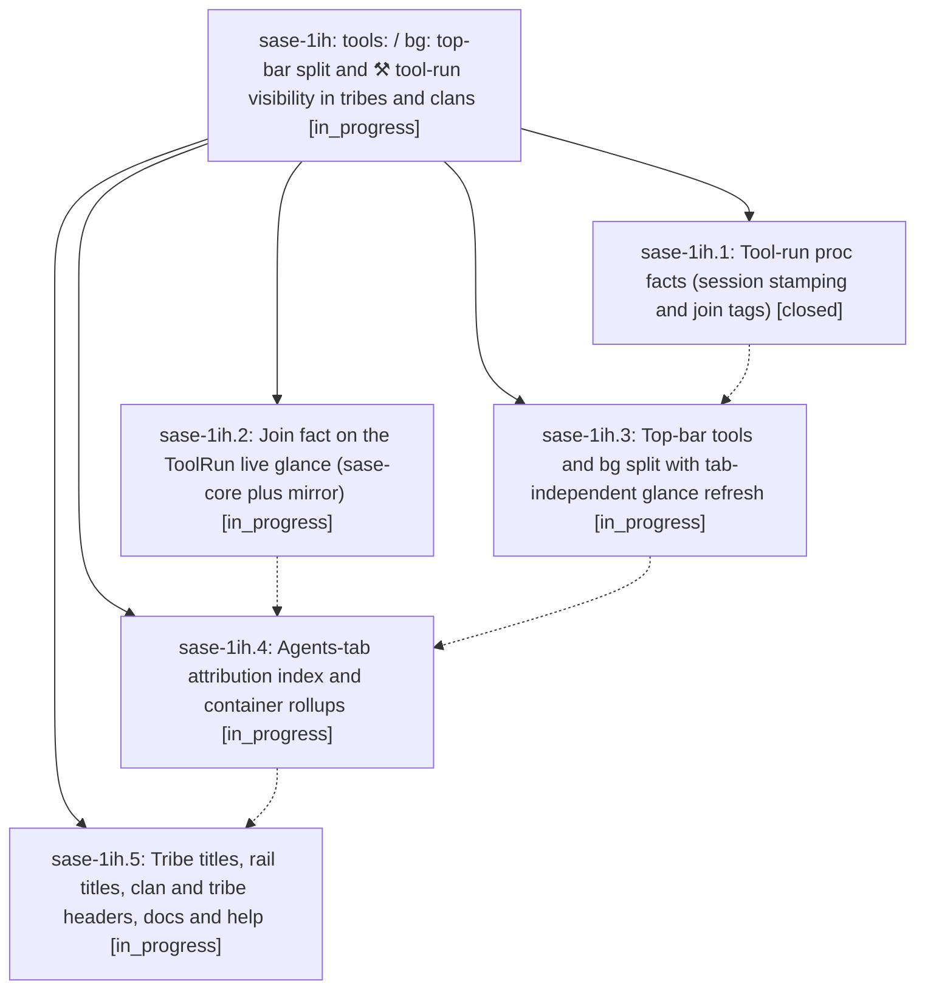

# Bead: sase-1ih — tools: / bg: top-bar split and ⚒ tool-run visibility in tribes and clans

[Bead Pages](../README.md) / sase-1ih

**Status:** ◐ in_progress · **Type:** ▸ plan · **Tier:** epic
**Owner:** `bryanbugyi34@gmail.com` · **Created by:** [bbugyi200.athena.research.43.linker.w0](https://github.com/sase-org/sase--agents/blob/main/sessions/bbugyi200.athena.research.43.linker.w0.md) · **Assignee:** `sase-1ih.land`
**Created:** 2026-10-08 18:31:54 EDT
**Plan:** [202610/tools\_bg\_split\_tool\_run\_visibility.md](https://github.com/sase-org/sase--plans/blob/main/202610/tools_bg_split_tool_run_visibility.md)

<!-- sase:links:start -->

## Links

| Relation | Artifact | Why |
| --- | --- | --- |
| implemented-by | [plan:202610/tools_bg_split_tool_run_visibility.md][1] | derived from the plan's `bead_id:` frontmatter field |

[1]: https://github.com/sase-org/sase--plans/blob/main/202610/tools_bg_split_tool_run_visibility.md

<!-- sase:links:end -->

## Description

The top bar tells the truth: a `tools:` group shows every live `sase tool` run on the machine with the ⚒ identity (ledger-sourced, fresh on every tab, never a false zero), and `bg:` shows only the TUI's own background procs. Each run is drawn exactly once. Every Agents-tab surface (concrete rows, session containers, local clan rows, tribe titles including rail and collapsed titles, and selection headers) shows ⚒ where the work is happening.

## Phases

| Bead | Title | Status | Size | Created | Agents | Commits |
|---|---|---|---|---|---:|---:|
| [sase-1ih.1](sase-1ih.1.md) | Tool-run proc facts (session stamping and join tags) | ✓ closed | small | 2026-10-08 | 1 | 1 |
| [sase-1ih.2](sase-1ih.2.md) | Join fact on the ToolRun live glance (sase-core plus mirror) | ◐ in_progress | medium | 2026-10-08 | 1 | 0 |
| [sase-1ih.3](sase-1ih.3.md) | Top-bar tools and bg split with tab-independent glance refresh | ◐ in_progress | medium | 2026-10-08 | 1 | 0 |
| [sase-1ih.4](sase-1ih.4.md) | Agents-tab attribution index and container rollups | ◐ in_progress | medium | 2026-10-08 | 1 | 0 |
| [sase-1ih.5](sase-1ih.5.md) | Tribe titles, rail titles, clan and tribe headers, docs and help | ◐ in_progress | medium | 2026-10-08 | 1 | 0 |

## Lineage

## Agents

| Agent | Bead | Commits |
|---|---|---:|
| [bbugyi200.athena.sase-1ih.1](https://github.com/sase-org/sase--agents/blob/main/agents/bbugyi200.athena.sase-1ih.1/README.md) | [sase-1ih.1](sase-1ih.1.md) | 1 |
| [bbugyi200.athena.sase-1ih.2](https://github.com/sase-org/sase--agents/blob/main/sessions/bbugyi200.athena.sase-1ih.2.md) | [sase-1ih.2](sase-1ih.2.md) | 0 |
| [bbugyi200.athena.sase-1ih.3](https://github.com/sase-org/sase--agents/blob/main/agents/bbugyi200.athena.sase-1ih.3/README.md) | [sase-1ih.3](sase-1ih.3.md) | 0 |
| [bbugyi200.athena.sase-1ih.4](https://github.com/sase-org/sase--agents/blob/main/agents/bbugyi200.athena.sase-1ih.4/README.md) | [sase-1ih.4](sase-1ih.4.md) | 0 |
| [bbugyi200.athena.sase-1ih.5](https://github.com/sase-org/sase--agents/blob/main/agents/bbugyi200.athena.sase-1ih.5/README.md) | [sase-1ih.5](sase-1ih.5.md) | 0 |
| [bbugyi200.athena.sase-1ih.land](https://github.com/sase-org/sase--agents/blob/main/agents/bbugyi200.athena.sase-1ih.land/README.md) | [sase-1ih](README.md) | 0 |

## Commits

| Repo | Commit | Subject | Bead | Committed |
|---|---|---|---|---|
| sase | [`285da82`](https://github.com/sase-org/sase/commit/285da8234afd53ec70f46e55c9c18cbb252e486c) | feat(tool-proc): stamp sessions, tag monitor joins, follow runs in procs pane | [sase-1ih.1](sase-1ih.1.md) | 2026-10-08 19:39:18 EDT |
