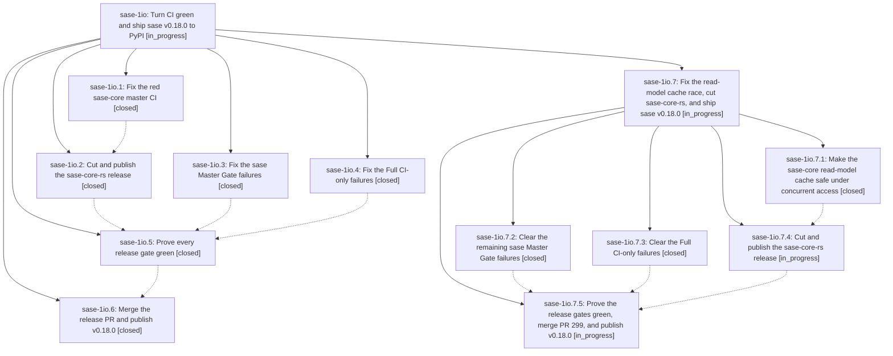

# Bead: sase-1io — Turn CI green and ship sase v0.18.0 to PyPI

[Bead Pages](../README.md) / sase-1io

**Status:** ◐ in_progress · **Type:** ▸ plan · **Tier:** epic
**Owner:** `bryanbugyi34@gmail.com` · **Created by:** [bbugyi200.athena.0ys](https://github.com/sase-org/sase--agents/blob/main/sessions/bbugyi200.athena.0ys.md) · **Assignee:** `sase-1io.land`
**Created:** 2026-10-09 03:55:08 EDT
**Plan:** [202610/release\_v0\_18\_0.md](https://github.com/sase-org/sase--plans/blob/main/202610/release_v0_18_0.md)

<!-- sase:links:start -->

## Links

| Relation | Artifact | Why |
| --- | --- | --- |
| implemented-by | [plan:202610/release_v0_18_0.md][1] | derived from the plan's `bead_id:` frontmatter field |

_Plus 4 automatic references — see [Referenced By](#referenced-by)._

[1]: https://github.com/sase-org/sase--plans/blob/main/202610/release_v0_18_0.md

<!-- sase:links:end -->

## Description

Every sase and sase-core CI lane is green, a sase-core-rs release carrying every binding sase needs is on PyPI, the release-please PR merges, and `pip install sase==0.18.0` works from PyPI by morning.

## Notes

[2026-10-09T10:46:44Z · sase-1io.land] LAND VERIFICATION + TRIAGE (sase-1io.land, 2026-10-09 ~10:50 UTC; sase master 7e87589fb5, sase-core master 6faaa653). Release NOT shipped: PyPI has sase 0.17.1 and sase-core-rs 0.37.0. Phase review against commits: .1 ce85b670 (lock_wait_ms golden fix) is real. .3 e2efd56242 and .5 6c783599c1 cleared their Master Gate items: at 6c783599c1 Master Gate was red only on sase-1if.6's declared_commands Symvision residual. .4 988adae067 fixed the two coverage-leg tests but never touched the PNG goldens its scope named; Full CI 37909515949 now shows 26 drifted goldens. .2 and .6 correctly recorded RELEASE NOT CUT and RELEASE NOT SHIPPED. Remaining blockers: (a) the sase-core read-model race. The root cause is drop_cache_file unlinking a live WAL cache, plus implicit schema-less creation, plus the cached MutationView failing on that. I reproduced it on Linux (1/240), so it is not macOS-only; it arrived after v0.37.0. (b) Master Gate: declared_commands Symvision, plus CI-only test_prompt_key_perf_harness_records_space_and_cycle (also red on Full CI 3.13 and 3.14). (c) Full CI visual-test goldens. (d) The PR 299 floor ratchet, merge, and publish. INTEGRATION: d2a954b0 (sase-1h8.13.1.9 land) zeroes lock_wait_ms in outcome_string, which makes sase-1io.1's normalize_lock_wait_ms redundant; its removal is planned. epic-symbols: none. FOLLOW-UP TRIAGE: sase-1io.2 #3, sase-1io.5 #1, sase-1io.6 #1 (parity race): kept as epic work under core-ci's any-other-red-job scope. Its causal epic sase-1h8 is closed and no task matches, so no task was filed. sase-1io.3 #1 (test_handoff_end_to_end_publishes_one_notification): DUPLICATE, +1 on sase-18t. The same 'tool run store is busy' signature is in ToolRun aa77d5af. sase-1io.4 #1 (memory README drift): DECLINED, fixed by e2efd56242. sase-1io.4 #2 (3 KNOWN Symvision symbols): DECLINED, privatized by e2efd56242. sase-1io.5 #2 (declared_commands Symvision): caused by active epic sase-1if, which already carries 2 DISCOVERED ISSUE notes; I added a coordination note. It blocks the release, so the child plan's sase-gate-fixes phase resolves it if sase-1if has not. Also found: Full CI 3.13 tail-ghost failure, +1 on sase-1ib. NEXT: a child epic plan carries the remaining release work; its land agent resumes this landing.

## Phases

| Bead | Title | Status | Size | Created | Agents | Commits |
|---|---|---|---|---|---:|---:|
| [sase-1io.1](sase-1io.1.md) | Fix the red sase-core master CI | ✓ closed | medium | 2026-10-09 | 1 | 1 |
| [sase-1io.2](sase-1io.2.md) | Cut and publish the sase-core-rs release | ✓ closed | medium | 2026-10-09 | 1 | 0 |
| [sase-1io.3](sase-1io.3.md) | Fix the sase Master Gate failures | ✓ closed | medium | 2026-10-09 | 1 | 1 |
| [sase-1io.4](sase-1io.4.md) | Fix the Full CI-only failures | ✓ closed | medium | 2026-10-09 | 1 | 1 |
| [sase-1io.5](sase-1io.5.md) | Prove every release gate green | ✓ closed | medium | 2026-10-09 | 1 | 1 |
| [sase-1io.6](sase-1io.6.md) | Merge the release PR and publish v0.18.0 | ✓ closed | medium | 2026-10-09 | 1 | 0 |

## Lineage

## Agents

| Agent | Bead | Commits |
|---|---|---:|
| [bbugyi200.athena.sase-1io.1](https://github.com/sase-org/sase--agents/blob/main/agents/bbugyi200.athena.sase-1io.1/README.md) | [sase-1io.1](sase-1io.1.md) | 1 |
| [bbugyi200.athena.sase-1io.2](https://github.com/sase-org/sase--agents/blob/main/sessions/bbugyi200.athena.sase-1io.2.md) | [sase-1io.2](sase-1io.2.md) | 0 |
| [bbugyi200.athena.sase-1io.3](https://github.com/sase-org/sase--agents/blob/main/agents/bbugyi200.athena.sase-1io.3/README.md) | [sase-1io.3](sase-1io.3.md) | 1 |
| [bbugyi200.athena.sase-1io.4](https://github.com/sase-org/sase--agents/blob/main/sessions/bbugyi200.athena.sase-1io.4.md) | [sase-1io.4](sase-1io.4.md) | 1 |
| [bbugyi200.athena.sase-1io.5](https://github.com/sase-org/sase--agents/blob/main/agents/bbugyi200.athena.sase-1io.5/README.md) | [sase-1io.5](sase-1io.5.md) | 1 |
| [bbugyi200.athena.sase-1io.6](https://github.com/sase-org/sase--agents/blob/main/agents/bbugyi200.athena.sase-1io.6/README.md) | [sase-1io.6](sase-1io.6.md) | 0 |
| [bbugyi200.athena.sase-1io.7.1](https://github.com/sase-org/sase--agents/blob/main/agents/bbugyi200.athena.sase-1io.7.1/README.md) | [sase-1io.7.1](sase-1io.7.1.md) | 1 |
| [bbugyi200.athena.sase-1io.7.2](https://github.com/sase-org/sase--agents/blob/main/sessions/bbugyi200.athena.sase-1io.7.2.md) | [sase-1io.7.2](sase-1io.7.2.md) | 1 |
| [bbugyi200.athena.sase-1io.7.3](https://github.com/sase-org/sase--agents/blob/main/sessions/bbugyi200.athena.sase-1io.7.3.md) | [sase-1io.7.3](sase-1io.7.3.md) | 1 |
| [bbugyi200.athena.sase-1io.7.4](https://github.com/sase-org/sase--agents/blob/main/sessions/bbugyi200.athena.sase-1io.7.4.md) | [sase-1io.7.4](sase-1io.7.4.md) | 0 |
| [bbugyi200.athena.sase-1io.7.5](https://github.com/sase-org/sase--agents/blob/main/agents/bbugyi200.athena.sase-1io.7.5/README.md) | [sase-1io.7.5](sase-1io.7.5.md) | 0 |
| [bbugyi200.athena.sase-1io.7.land](https://github.com/sase-org/sase--agents/blob/main/agents/bbugyi200.athena.sase-1io.7.land/README.md) | [sase-1io.7](sase-1io.7.md) | 0 |
| [bbugyi200.athena.sase-1io.land](https://github.com/sase-org/sase--agents/blob/main/sessions/bbugyi200.athena.sase-1io.land.md) | [sase-1io](README.md) | 0 |

## Commits

| Repo | Commit | Subject | Bead | Committed |
|---|---|---|---|---|
| sase-core | [`sase-core@ce85b67`](https://github.com/sase-org/sase-core/commit/ce85b670e96c7b6dfd92dd1e897cf45c254a36ec) | fix(bead-tests): pin lock\_wait\_ms to zero in replay goldens | [sase-1io.1](sase-1io.1.md) | 2026-10-09 04:19:27 EDT |
| sase | [`988adae`](https://github.com/sase-org/sase/commit/988adae0673011b46fde4c96e0ec3ca741b34cbf) | fix(tui-tests): seed agents roster and materialize archived plan fixture in Full CI-only tests | [sase-1io.4](sase-1io.4.md) | 2026-10-09 04:50:16 EDT |
| sase | [`e2efd56`](https://github.com/sase-org/sase/commit/e2efd5624252ded543fc6af03c0fb0c9fe760090) | fix(sase-1io.3): clear every Master Gate failure | [sase-1io.3](sase-1io.3.md) | 2026-10-09 05:02:37 EDT |
| sase | [`6c78359`](https://github.com/sase-org/sase/commit/6c783599c1b51cac61f72930935b54dc409c2ada) | fix(tests): repair Master Gate failures for bead sase-1io.5 | [sase-1io.5](sase-1io.5.md) | 2026-10-09 05:59:13 EDT |
| sase | [`f542104`](https://github.com/sase-org/sase/commit/f542104b5c400c6faee10842d865e3440ec06a5a) | fix(gate): privatize declared\_commands helpers and stabilize prompt-key perf smoke | [sase-1io.7.2](sase-1io.7.2.md) | 2026-10-09 07:33:30 EDT |
| sase-core | [`sase-core@5c5bcdc`](https://github.com/sase-org/sase-core/commit/5c5bcdc43fca7787dbc0a46711b3307e25150148) | fix(bead-read-model): stop unlinking the live read-model cache under concurrent access | [sase-1io.7.1](sase-1io.7.1.md) | 2026-10-09 07:53:34 EDT |
| sase | [`aced694`](https://github.com/sase-org/sase/commit/aced694adcf7c9b97e64938e7ec34cb0d27bb254) | test(visual): regenerate golden snapshots for timeband and ACE panels | [sase-1io.7.3](sase-1io.7.3.md) | 2026-10-09 09:01:10 EDT |

<!-- sase:referenced-by:start -->

## Referenced By

| Relation | Artifact | Why | Uses |
| --- | --- | --- | ---: |
| read-by | [agent:sase-1io.1][1] | Need parent epic DECISIONS and plan | 1 |
| read-by | [agent:sase-1io.3][2] | Need epic DECISIONS and plan context | 2 |
| read-by | [agent:sase-1io.4--1][3] | need epic DECISIONS and escalation rule before closing phase sase-1io.4 | 3 |
| read-by | [agent:sase-1io.5][4] | Need epic DECISIONS for phase close | 2 |

[1]: https://github.com/sase-org/sase--agents/blob/main/agents/bbugyi200.athena.sase-1io.1/README.md
[2]: https://github.com/sase-org/sase--agents/blob/main/agents/bbugyi200.athena.sase-1io.3/README.md
[3]: https://github.com/sase-org/sase--agents/blob/main/sessions/bbugyi200.athena.sase-1io.4.md
[4]: https://github.com/sase-org/sase--agents/blob/main/agents/bbugyi200.athena.sase-1io.5/README.md

<!-- sase:referenced-by:end -->
