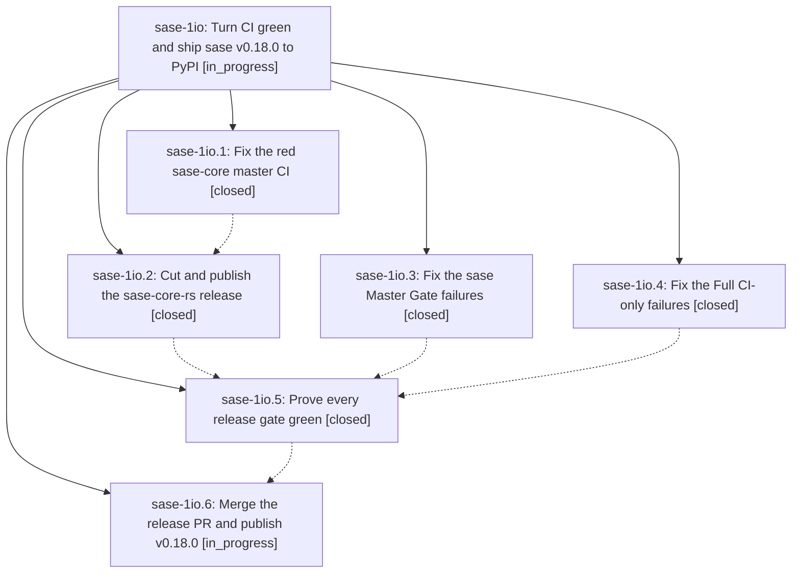

# Bead: sase-1io — Turn CI green and ship sase v0.18.0 to PyPI

[Bead Pages](../README.md) / sase-1io

**Status:** ◐ in_progress · **Type:** ▸ plan · **Tier:** epic
**Owner:** `bryanbugyi34@gmail.com` · **Created by:** [bbugyi200.athena.0ys](https://github.com/sase-org/sase--agents/blob/main/sessions/bbugyi200.athena.0ys.md) · **Assignee:** `sase-1io.land`
**Created:** 2026-10-09 03:55:08 EDT
**Plan:** [202610/release\_v0\_18\_0.md](https://github.com/sase-org/sase--plans/blob/main/202610/release_v0_18_0.md)

<!-- sase:links:start -->

## Links

| Relation | Artifact | Why |
| --- | --- | --- |
| implemented-by | [plan:202610/release_v0_18_0.md][1] | derived from the plan's `bead_id:` frontmatter field |

_Plus 3 automatic references — see [Referenced By](#referenced-by)._

[1]: https://github.com/sase-org/sase--plans/blob/main/202610/release_v0_18_0.md

<!-- sase:links:end -->

## Description

Every sase and sase-core CI lane is green, a sase-core-rs release carrying every binding sase needs is on PyPI, the release-please PR merges, and `pip install sase==0.18.0` works from PyPI by morning.

## Phases

| Bead | Title | Status | Size | Created | Agents | Commits |
|---|---|---|---|---|---:|---:|
| [sase-1io.1](sase-1io.1.md) | Fix the red sase-core master CI | ✓ closed | medium | 2026-10-09 | 1 | 1 |
| [sase-1io.2](sase-1io.2.md) | Cut and publish the sase-core-rs release | ✓ closed | medium | 2026-10-09 | 1 | 0 |
| [sase-1io.3](sase-1io.3.md) | Fix the sase Master Gate failures | ✓ closed | medium | 2026-10-09 | 1 | 1 |
| [sase-1io.4](sase-1io.4.md) | Fix the Full CI-only failures | ✓ closed | medium | 2026-10-09 | 1 | 1 |
| [sase-1io.5](sase-1io.5.md) | Prove every release gate green | ✓ closed | medium | 2026-10-09 | 1 | 1 |
| [sase-1io.6](sase-1io.6.md) | Merge the release PR and publish v0.18.0 | ◐ in_progress | medium | 2026-10-09 | 1 | 0 |

## Lineage

## Agents

| Agent | Bead | Commits |
|---|---|---:|
| [bbugyi200.athena.sase-1io.1](https://github.com/sase-org/sase--agents/blob/main/agents/bbugyi200.athena.sase-1io.1/README.md) | [sase-1io.1](sase-1io.1.md) | 1 |
| [bbugyi200.athena.sase-1io.2](https://github.com/sase-org/sase--agents/blob/main/sessions/bbugyi200.athena.sase-1io.2.md) | [sase-1io.2](sase-1io.2.md) | 0 |
| [bbugyi200.athena.sase-1io.3](https://github.com/sase-org/sase--agents/blob/main/agents/bbugyi200.athena.sase-1io.3/README.md) | [sase-1io.3](sase-1io.3.md) | 1 |
| [bbugyi200.athena.sase-1io.4](https://github.com/sase-org/sase--agents/blob/main/sessions/bbugyi200.athena.sase-1io.4.md) | [sase-1io.4](sase-1io.4.md) | 1 |
| [bbugyi200.athena.sase-1io.5](https://github.com/sase-org/sase--agents/blob/main/agents/bbugyi200.athena.sase-1io.5/README.md) | [sase-1io.5](sase-1io.5.md) | 1 |
| [bbugyi200.athena.sase-1io.6](https://github.com/sase-org/sase--agents/blob/main/agents/bbugyi200.athena.sase-1io.6/README.md) | [sase-1io.6](sase-1io.6.md) | 0 |
| [bbugyi200.athena.sase-1io.land](https://github.com/sase-org/sase--agents/blob/main/agents/bbugyi200.athena.sase-1io.land/README.md) | [sase-1io](README.md) | 0 |

## Commits

| Repo | Commit | Subject | Bead | Committed |
|---|---|---|---|---|
| sase-core | [`sase-core@ce85b67`](https://github.com/sase-org/sase-core/commit/ce85b670e96c7b6dfd92dd1e897cf45c254a36ec) | fix(bead-tests): pin lock\_wait\_ms to zero in replay goldens | [sase-1io.1](sase-1io.1.md) | 2026-10-09 04:19:27 EDT |
| sase | [`988adae`](https://github.com/sase-org/sase/commit/988adae0673011b46fde4c96e0ec3ca741b34cbf) | fix(tui-tests): seed agents roster and materialize archived plan fixture in Full CI-only tests | [sase-1io.4](sase-1io.4.md) | 2026-10-09 04:50:16 EDT |
| sase | [`e2efd56`](https://github.com/sase-org/sase/commit/e2efd5624252ded543fc6af03c0fb0c9fe760090) | fix(sase-1io.3): clear every Master Gate failure | [sase-1io.3](sase-1io.3.md) | 2026-10-09 05:02:37 EDT |
| sase | [`6c78359`](https://github.com/sase-org/sase/commit/6c783599c1b51cac61f72930935b54dc409c2ada) | fix(tests): repair Master Gate failures for bead sase-1io.5 | [sase-1io.5](sase-1io.5.md) | 2026-10-09 05:59:13 EDT |

<!-- sase:referenced-by:start -->

## Referenced By

| Relation | Artifact | Why | Uses |
| --- | --- | --- | ---: |
| read-by | [agent:sase-1io.1][1] | Need parent epic DECISIONS and plan | 1 |
| read-by | [agent:sase-1io.3][2] | Need epic DECISIONS and plan context | 2 |
| read-by | [agent:sase-1io.4--1][3] | need epic DECISIONS and escalation rule before closing phase sase-1io.4 | 3 |

[1]: https://github.com/sase-org/sase--agents/blob/main/agents/bbugyi200.athena.sase-1io.1/README.md
[2]: https://github.com/sase-org/sase--agents/blob/main/agents/bbugyi200.athena.sase-1io.3/README.md
[3]: https://github.com/sase-org/sase--agents/blob/main/sessions/bbugyi200.athena.sase-1io.4.md

<!-- sase:referenced-by:end -->
