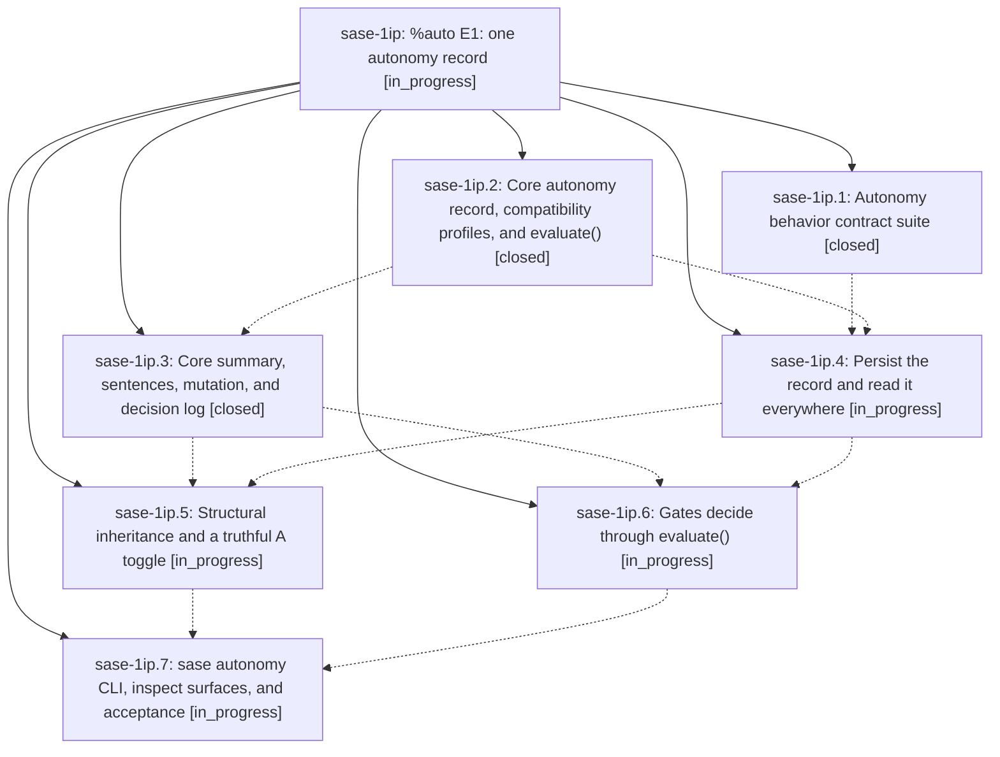

# Bead: sase-1ip — %auto E1: one autonomy record

[Bead Pages](../README.md) / sase-1ip

**Status:** ◐ in_progress · **Type:** ▸ plan · **Tier:** epic
**Owner:** `bryanbugyi34@gmail.com` · **Created by:** [bbugyi200.athena.0yj](https://github.com/sase-org/sase--agents/blob/main/sessions/bbugyi200.athena.0yj.md) · **Assignee:** `sase-1ip.land`
**Created:** 2026-10-09 05:12:51 EDT
**Plan:** [202610/auto\_e1\_autonomy\_record.md](https://github.com/sase-org/sase--plans/blob/main/202610/auto_e1_autonomy_record.md)

<!-- sase:links:start -->

## Links

| Relation | Artifact | Why |
| --- | --- | --- |
| implemented-by | [plan:202610/auto_e1_autonomy_record.md][1] | derived from the plan's `bead_id:` frontmatter field |

_Plus 1 automatic references — see [Referenced By](#referenced-by)._

[1]: https://github.com/sase-org/sase--plans/blob/main/202610/auto_e1_autonomy_record.md

<!-- sase:links:end -->

## Description

Every automatic gate outcome comes from one Rust evaluate() applied to one persisted, revisioned agent_meta.autonomy record that every agent-session member inherits. `sase autonomy explain` predicts each decision exactly, every decision is logged, the agent is told its policy, and `%auto` otherwise behaves exactly as it does today.

## Notes

[2026-10-09T09:44:43Z · sase-1ir.land] DISCOVERED ISSUE: Landing audit of sase-1ir found a live fixture epic, not requested feature work. plan:202610/epic.md exactly matches tests/plan_validation_helpers.py VALID_EPIC_PLAN (Approved implementation; implementation phase; body Implement the requested change), created 2026-10-09T09:20:28Z while sase-1ip.1 ran. Its canonical archived prompt prompts/202610/epic.md identifies bbugyi200.athena.sase-1ip.1--plan and the sase-1ip.1 work-phase prompt; it launched a real phase and this land agent. Current commit 563f046a85 now adds tests/autonomy_contract/harness.py create_plan_gate_isolated, which patches the archive and prepare_epic_launch side effects; source inspection confirms the production adapter imports the patched prepare_epic_launch alias. Historical escape is independently evidenced; a continuing leak on current HEAD is not claimed. No semantic duplicate in bug-task search/week sweep. Routed to this causally responsible active epic rather than creating a separate task: verify the contract suite side-effect fences cover durable plan/prompt publication and agent/bead launches before sase-1ip lands. sase-1ir has no actual implementation scope, commits, decisions, parent, or follow-up proposals and will be closed as the verified fixture no-op.

## Phases

| Bead | Title | Status | Size | Created | Agents | Commits |
|---|---|---|---|---|---:|---:|
| [sase-1ip.1](sase-1ip.1.md) | Autonomy behavior contract suite | ✓ closed | medium | 2026-10-09 | 1 | 1 |
| [sase-1ip.2](sase-1ip.2.md) | Core autonomy record, compatibility profiles, and evaluate() | ✓ closed | medium | 2026-10-09 | 1 | 2 |
| [sase-1ip.3](sase-1ip.3.md) | Core summary, sentences, mutation, and decision log | ✓ closed | medium | 2026-10-09 | 1 | 1 |
| [sase-1ip.4](sase-1ip.4.md) | Persist the record and read it everywhere | ◐ in_progress | medium | 2026-10-09 | 1 | 0 |
| [sase-1ip.5](sase-1ip.5.md) | Structural inheritance and a truthful A toggle | ◐ in_progress | medium | 2026-10-09 | 1 | 0 |
| [sase-1ip.6](sase-1ip.6.md) | Gates decide through evaluate() | ◐ in_progress | medium | 2026-10-09 | 1 | 0 |
| [sase-1ip.7](sase-1ip.7.md) | sase autonomy CLI, inspect surfaces, and acceptance | ◐ in_progress | medium | 2026-10-09 | 1 | 0 |

## Lineage

## Agents

| Agent | Bead | Commits |
|---|---|---:|
| [bbugyi200.athena.sase-1ip.1](https://github.com/sase-org/sase--agents/blob/main/sessions/bbugyi200.athena.sase-1ip.1.md) | [sase-1ip.1](sase-1ip.1.md) | 1 |
| [bbugyi200.athena.sase-1ip.2](https://github.com/sase-org/sase--agents/blob/main/agents/bbugyi200.athena.sase-1ip.2/README.md) | [sase-1ip.2](sase-1ip.2.md) | 2 |
| [bbugyi200.athena.sase-1ip.3](https://github.com/sase-org/sase--agents/blob/main/agents/bbugyi200.athena.sase-1ip.3/README.md) | [sase-1ip.3](sase-1ip.3.md) | 1 |
| [bbugyi200.athena.sase-1ip.4](https://github.com/sase-org/sase--agents/blob/main/agents/bbugyi200.athena.sase-1ip.4/README.md) | [sase-1ip.4](sase-1ip.4.md) | 0 |
| [bbugyi200.athena.sase-1ip.5](https://github.com/sase-org/sase--agents/blob/main/agents/bbugyi200.athena.sase-1ip.5/README.md) | [sase-1ip.5](sase-1ip.5.md) | 0 |
| [bbugyi200.athena.sase-1ip.6](https://github.com/sase-org/sase--agents/blob/main/agents/bbugyi200.athena.sase-1ip.6/README.md) | [sase-1ip.6](sase-1ip.6.md) | 0 |
| [bbugyi200.athena.sase-1ip.7](https://github.com/sase-org/sase--agents/blob/main/agents/bbugyi200.athena.sase-1ip.7/README.md) | [sase-1ip.7](sase-1ip.7.md) | 0 |
| [bbugyi200.athena.sase-1ip.land](https://github.com/sase-org/sase--agents/blob/main/agents/bbugyi200.athena.sase-1ip.land/README.md) | [sase-1ip](README.md) | 0 |

## Commits

| Repo | Commit | Subject | Bead | Committed |
|---|---|---|---|---|
| sase | [`563f046`](https://github.com/sase-org/sase/commit/563f046a850b0a6c64eebb6215d8fdb4a8a6dcb3) | feat(sase-1ip.1): add table-driven %auto behavior contract suite | [sase-1ip.1](sase-1ip.1.md) | 2026-10-09 05:37:48 EDT |
| sase-core | [`sase-core@01b0ad7`](https://github.com/sase-org/sase-core/commit/01b0ad734e7acee14bf5fd88ab12e449540b88f3) | feat(autonomy): add core record, compatibility profiles, and evaluate() | [sase-1ip.2](sase-1ip.2.md) | 2026-10-09 06:37:51 EDT |
| sase | [`9c5000f`](https://github.com/sase-org/sase/commit/9c5000f2dbb126962ea0a84856d0a49115450dc7) | feat(autonomy): carry core-owned autonomy record on AgentMetaWire | [sase-1ip.2](sase-1ip.2.md) | 2026-10-09 07:44:31 EDT |
| sase-core | [`sase-core@51b66fd`](https://github.com/sase-org/sase-core/commit/51b66fdb53fc3a80ec2e7bcc4a670858b9a8cb72) | feat(autonomy): core summary, sentences, mutation, and decision log | [sase-1ip.3](sase-1ip.3.md) | 2026-10-09 08:21:45 EDT |

<!-- sase:referenced-by:start -->

## Referenced By

| Relation | Artifact | Why | Uses |
| --- | --- | --- | ---: |
| read-by | [agent:sase-1ip.2][1] | epic scope decisions | 1 |

[1]: https://github.com/sase-org/sase--agents/blob/main/agents/bbugyi200.athena.sase-1ip.2/README.md

<!-- sase:referenced-by:end -->
