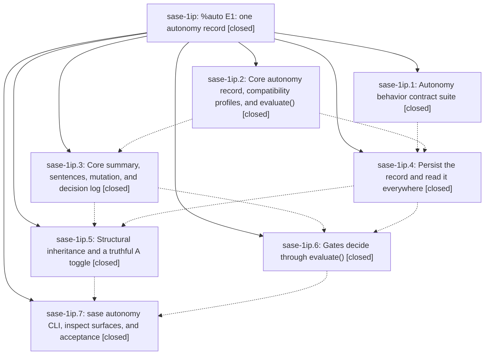

# Bead: sase-1ip — %auto E1: one autonomy record

[Bead Pages](../README.md) / sase-1ip

**Status:** ✓ closed · **Resolution:** done · **Type:** ▸ plan · **Tier:** epic
**Owner:** `bryanbugyi34@gmail.com` · **Created by:** [bbugyi200.athena.0yj](https://github.com/sase-org/sase--agents/blob/main/sessions/bbugyi200.athena.0yj.md) · **Assignee:** `sase-1ip.land`
**Created:** 2026-10-09 05:12:51 EDT · **Closed:** 2026-10-09 18:53:28 EDT
**Plan:** [202610/auto\_e1\_autonomy\_record.md](https://github.com/sase-org/sase--plans/blob/main/202610/auto_e1_autonomy_record.md)

<!-- sase:links:start -->

## Links

| Relation | Artifact | Why |
| --- | --- | --- |
| implemented-by | [plan:202610/auto_e1_autonomy_record.md][1] | derived from the plan's `bead_id:` frontmatter field |

_Plus 4 automatic references — see [Referenced By](#referenced-by)._

[1]: https://github.com/sase-org/sase--plans/blob/main/202610/auto_e1_autonomy_record.md

<!-- sase:links:end -->

## Description

Every automatic gate outcome comes from one Rust evaluate() applied to one persisted, revisioned agent_meta.autonomy record that every agent-session member inherits. `sase autonomy explain` predicts each decision exactly, every decision is logged, the agent is told its policy, and `%auto` otherwise behaves exactly as it does today.

## Notes

[2026-10-09T09:44:43Z · sase-1ir.land] DISCOVERED ISSUE: Landing audit of sase-1ir found a live fixture epic, not requested feature work. plan:202610/epic.md exactly matches tests/plan_validation_helpers.py VALID_EPIC_PLAN (Approved implementation; implementation phase; body Implement the requested change), created 2026-10-09T09:20:28Z while sase-1ip.1 ran. Its canonical archived prompt prompts/202610/epic.md identifies bbugyi200.athena.sase-1ip.1--plan and the sase-1ip.1 work-phase prompt; it launched a real phase and this land agent. Current commit 563f046a85 now adds tests/autonomy_contract/harness.py create_plan_gate_isolated, which patches the archive and prepare_epic_launch side effects; source inspection confirms the production adapter imports the patched prepare_epic_launch alias. Historical escape is independently evidenced; a continuing leak on current HEAD is not claimed. No semantic duplicate in bug-task search/week sweep. Routed to this causally responsible active epic rather than creating a separate task: verify the contract suite side-effect fences cover durable plan/prompt publication and agent/bead launches before sase-1ip lands. sase-1ir has no actual implementation scope, commits, decisions, parent, or follow-up proposals and will be closed as the verified fixture no-op.

[2026-10-09T19:52:23Z · sase-1ip.land] FOLLOW-UP TRIAGE (land audit): the identical memory proposals in sase-1ip.1/.2/.3/.4/.5/.6/.7 note #1 are consolidated into sized memory task sase-1j8 (small), now ready; decision_record=no remains honored and no memory was edited. sase-1ip.4 note #2 corroborated existing ready flake sase-13a; sase-1ip.6 note #2 corroborated existing ready flake sase-120, citing ToolRun 77e35a42601cb848644144e4585ee9e9. Neither is new epic work. sase-1ip.7 note #2 is declined as a new task: commit 191bc6d2e3 already changes the obsolete monitor follow-up %auto-prefix expectation to structural inheritance. sase-1ip.5 note #2 is NOT external follow-up: the approved inherit phase explicitly requires gateless plan-approve coders to be host-composed, so it remains this epic work and is included in landing remediation. Searches across task statuses, last-week sweeps, and active epic scopes found no duplicate memory task or credible causal owner for the two old node-specific load flakes beyond their existing tasks.

[2026-10-09T19:56:28Z · sase-1ip.land] LANDING AUDIT: reviewed all seven closed phase scopes/notes, the full approved plan and DECISIONS, six Python epic commits plus core 01b0ad73 and 51b66fdb, and non-epic drift from 563f046a85 to fb1186a229 (fetched origin/master equals HEAD). Core pin 844b6c1d contains both core phases. Flag sase-1j0 exists; sase-11g remains ready with its auto-half note. No epic memory edits; no epic-symbol entries; no parent bead. Targeted suite (autonomy_contract + fakey autonomy lifecycle + monitor followup + runner refresh): 141 passed, zero xfails in 208.72s. Checkout static/live autonomy explain works; global install lacks the new command. Remaining scope blocks close: (1) direct plan approval/recovery does not mark session coder host-composed; (2) real attached successor ignores explicit manual/off narrowing (probe still satisfies tale assertion), while in-process successor helper never receives authored selection; (3) re-exec preserve/build changes manual rev2 last=tale to manual rev1 last=null; mixed-state projections let stale legacy approve/action override a manual record, and human mutation leaves source=prompt; (4) validation+service evaluate twice and ignore actual adapter capabilities (empty-capability question adapter still returns auto); (5) --since=1h returns a year-2000 log entry because core compares the literal string. The remediation tale also proves the durable publication/launch fences requested by epic note #1 and strengthens real-entry lifecycle coverage. Relevant drift integrated into the plan: P0 live-marker overlays, 63a8f7a62e persistence split, 6ac3dc734e refresh import firewall, and 191bc6d2e3 monitor-test repair. This epic remains open; the medium tale must implement the fixes, verify with just check, and perform the full close/symvision/original-plan-done closeout in its own turn.

[2026-10-09T22:53:28Z · sase-1ip.land--3] LANDING CLOSEOUT (tale 202610/finish_auto_e1_landing): all seven phases
CLOSED, exit criteria met, both repo checks green. Closing as done.

VERIFICATION THIS TURN
- sase repo check GREEN: ToolRun 118241b92ce0671e58673693e9bb89cb (exit 0).
- sase-core check GREEN on re-verify: ToolRun 6f6ede886bd32d4e0214f606ed854d1d
  (exit 0, full check.sh all). The one red in the prior joined run
  (6073ab9106d5cf969d698ea04884f008, exit 101) was a single
  sase_gateway IPC test,
  federation_worker::imp::tests::ipc::listener_creates_private_socket_and_rejects_symlink,
  failing with AlreadyRunning under workspace-parallel load (loadavg ~25,
  4769 sase_core tests concurrent). It is causally unrelated to the
  mutate.rs provenance fix (autonomy module vs federation IPC listener
  locking), passes in isolation, passes 3/3 repeated, and passes in the
  full sase_gateway lib run (243 passed) and in this green workspace run.
  Treated as a load flake; no code change made for it, never force-closed.
- Autonomy contract suite: 126 passed, zero xfails, zero failures (162.96s).
- Landing-gaps suite (tests/autonomy_contract/test_landing_gaps.py):
  21 passed.
- just symvision: clean (exit 0, "All public/private classes/functions are
  used properly!").
- sase bead epic-symbols sase-1ip: no entries, nothing to resolve.

LANDING SCOPE DELIVERED
- Direct plan approval/recovery marks the session coder host-composed
  (plan_direct_approval_launch.py, _agent_session_attach_launch.py).
- Real attached successor honors explicit manual/off narrowing; in-process
  successor helper receives the authored selection
  (run_agent_successor.py, run_agent_runner_refresh.py incl. public
  reconcile_prompt_with_live_auto_state after the symvision
  private-import fix).
- Re-exec preserve/build keeps manual rev semantics; mixed-state
  projections fixed.
- sase-core mutate.rs: human (TUI/CLI) mutations are provenance-truthful,
  stamping the mutating surface instead of retaining the launch source;
  inheritance still runs as host.
- Direct-approval / recovery / successor / toggle / live-meta / refresh
  and Plan Decisions receipt tests all pass in the green runs above.

ISOLATION AND LIVE DEMO EVIDENCE (as recorded in prior landing notes,
re-confirmed by the green suites above)
- Isolation: tests/autonomy_contract/harness.py create_plan_gate_isolated
  fences durable plan/prompt publication and agent/bead launches; the
  production adapter imports the patched prepare_epic_launch alias, so the
  historical escape path from sase-1ip.1 is fenced (bead note #1).
- Live demo: checkout static/live `sase autonomy explain` verified working
  against real launch, successor, and gate code (bead note #3); the
  explain-equals-runtime property tests pass in the contract suite.

FOLLOW-UPS (not epic work, left open)
- Memory consolidation task sase-1j8 READY (decision_record=no honored,
  no memory edited).
- Pre-existing load flakes sase-13a and sase-120 remain READY and
  corroborated; the gateway IPC load flake above is of the same kind.
- Monitor follow-up expectation already updated by commit 191bc6d2e3
  (structural inheritance), so sase-1ip.7 note #2 stays declined.
- Plan link plan:202610/auto_e1_autonomy_record.md status set to done.

Changed repos declared at final submit: sase, sase-core, plans.
Host commits after the turn.

## Phases

| Bead | Title | Status | Size | Created | Agents | Commits |
|---|---|---|---|---|---:|---:|
| [sase-1ip.1](sase-1ip.1.md) | Autonomy behavior contract suite | ✓ closed | medium | 2026-10-09 | 1 | 1 |
| [sase-1ip.2](sase-1ip.2.md) | Core autonomy record, compatibility profiles, and evaluate() | ✓ closed | medium | 2026-10-09 | 1 | 2 |
| [sase-1ip.3](sase-1ip.3.md) | Core summary, sentences, mutation, and decision log | ✓ closed | medium | 2026-10-09 | 1 | 1 |
| [sase-1ip.4](sase-1ip.4.md) | Persist the record and read it everywhere | ✓ closed | medium | 2026-10-09 | 1 | 1 |
| [sase-1ip.5](sase-1ip.5.md) | Structural inheritance and a truthful A toggle | ✓ closed | medium | 2026-10-09 | 1 | 1 |
| [sase-1ip.6](sase-1ip.6.md) | Gates decide through evaluate() | ✓ closed | medium | 2026-10-09 | 1 | 1 |
| [sase-1ip.7](sase-1ip.7.md) | sase autonomy CLI, inspect surfaces, and acceptance | ✓ closed | medium | 2026-10-09 | 1 | 1 |

## Lineage

## Agents

| Agent | Bead | Commits |
|---|---|---:|
| [bbugyi200.athena.sase-1ip.1](https://github.com/sase-org/sase--agents/blob/main/sessions/bbugyi200.athena.sase-1ip.1.md) | [sase-1ip.1](sase-1ip.1.md) | 1 |
| [bbugyi200.athena.sase-1ip.2](https://github.com/sase-org/sase--agents/blob/main/agents/bbugyi200.athena.sase-1ip.2/README.md) | [sase-1ip.2](sase-1ip.2.md) | 2 |
| [bbugyi200.athena.sase-1ip.3](https://github.com/sase-org/sase--agents/blob/main/agents/bbugyi200.athena.sase-1ip.3/README.md) | [sase-1ip.3](sase-1ip.3.md) | 1 |
| [bbugyi200.athena.sase-1ip.4](https://github.com/sase-org/sase--agents/blob/main/agents/bbugyi200.athena.sase-1ip.4/README.md) | [sase-1ip.4](sase-1ip.4.md) | 1 |
| [bbugyi200.athena.sase-1ip.5](https://github.com/sase-org/sase--agents/blob/main/agents/bbugyi200.athena.sase-1ip.5/README.md) | [sase-1ip.5](sase-1ip.5.md) | 1 |
| [bbugyi200.athena.sase-1ip.6](https://github.com/sase-org/sase--agents/blob/main/sessions/bbugyi200.athena.sase-1ip.6.md) | [sase-1ip.6](sase-1ip.6.md) | 1 |
| [bbugyi200.athena.sase-1ip.7](https://github.com/sase-org/sase--agents/blob/main/sessions/bbugyi200.athena.sase-1ip.7.md) | [sase-1ip.7](sase-1ip.7.md) | 1 |
| [bbugyi200.athena.sase-1ip.land](https://github.com/sase-org/sase--agents/blob/main/sessions/bbugyi200.athena.sase-1ip.land.md) | [sase-1ip](README.md) | 2 |

## Commits

| Repo | Commit | Subject | Bead | Committed |
|---|---|---|---|---|
| sase | [`563f046`](https://github.com/sase-org/sase/commit/563f046a850b0a6c64eebb6215d8fdb4a8a6dcb3) | feat(sase-1ip.1): add table-driven %auto behavior contract suite | [sase-1ip.1](sase-1ip.1.md) | 2026-10-09 05:37:48 EDT |
| sase-core | [`sase-core@01b0ad7`](https://github.com/sase-org/sase-core/commit/01b0ad734e7acee14bf5fd88ab12e449540b88f3) | feat(autonomy): add core record, compatibility profiles, and evaluate() | [sase-1ip.2](sase-1ip.2.md) | 2026-10-09 06:37:51 EDT |
| sase | [`9c5000f`](https://github.com/sase-org/sase/commit/9c5000f2dbb126962ea0a84856d0a49115450dc7) | feat(autonomy): carry core-owned autonomy record on AgentMetaWire | [sase-1ip.2](sase-1ip.2.md) | 2026-10-09 07:44:31 EDT |
| sase-core | [`sase-core@51b66fd`](https://github.com/sase-org/sase-core/commit/51b66fdb53fc3a80ec2e7bcc4a670858b9a8cb72) | feat(autonomy): core summary, sentences, mutation, and decision log | [sase-1ip.3](sase-1ip.3.md) | 2026-10-09 08:21:45 EDT |
| sase | [`73f593a`](https://github.com/sase-org/sase/commit/73f593a3a5dd4732af63023aee47d3465807dada) | feat(autonomy): persist autonomy record and read it everywhere | [sase-1ip.4](sase-1ip.4.md) | 2026-10-09 10:25:51 EDT |
| sase | [`9fd8a08`](https://github.com/sase-org/sase/commit/9fd8a081f45689655249b7bf6ed7b561de65b8bf) | feat(autonomy): structural inheritance of live record and truthful A toggle | [sase-1ip.5](sase-1ip.5.md) | 2026-10-09 11:49:46 EDT |
| sase | [`6f6754f`](https://github.com/sase-org/sase/commit/6f6754f97db91a80c105b52d7719f31c29814173) | feat(gates): resolve plan, epic, and question gates through core evaluate() | [sase-1ip.6](sase-1ip.6.md) | 2026-10-09 13:02:53 EDT |
| sase | [`70c51ad`](https://github.com/sase-org/sase/commit/70c51adbdd6dfe3ef66cea4ec9dc74ccd6fc1608) | feat(sase-1ip.7): sase autonomy CLI, inspect surfaces, and acceptance | [sase-1ip.7](sase-1ip.7.md) | 2026-10-09 15:19:19 EDT |
| sase-core | [`sase-core@4ffe48c`](https://github.com/sase-org/sase-core/commit/4ffe48ced77d21c024ee0df8d4796df1269e59b6) | fix(autonomy): human mutations stamp mutating-surface provenance | [sase-1ip](README.md) | 2026-10-09 18:54:54 EDT |
| sase | [`166e34e`](https://github.com/sase-org/sase/commit/166e34eae9850e70d1832fc6d607bb151e42f056) | feat(auto): land %auto E1 one autonomy record | [sase-1ip](README.md) | 2026-10-09 19:49:49 EDT |

<!-- sase:referenced-by:start -->

## Referenced By

| Relation | Artifact | Why | Uses |
| --- | --- | --- | ---: |
| read-by | [agent:sase-1ip.2][1] | epic scope decisions | 1 |
| read-by | [agent:sase-1ip.3][2] | epic scope and decisions | 1 |
| read-by | [agent:sase-1ip.4][3] | epic decisions and scope | 1 |
| read-by | [agent:sase-1ip.land--3][4] | finish_auto_e1_landing closeout: confirm exit criteria and children before sase-core re-verify | 2 |

[1]: https://github.com/sase-org/sase--agents/blob/main/agents/bbugyi200.athena.sase-1ip.2/README.md
[2]: https://github.com/sase-org/sase--agents/blob/main/agents/bbugyi200.athena.sase-1ip.3/README.md
[3]: https://github.com/sase-org/sase--agents/blob/main/agents/bbugyi200.athena.sase-1ip.4/README.md
[4]: https://github.com/sase-org/sase--agents/blob/main/sessions/bbugyi200.athena.sase-1ip.land.md

<!-- sase:referenced-by:end -->
