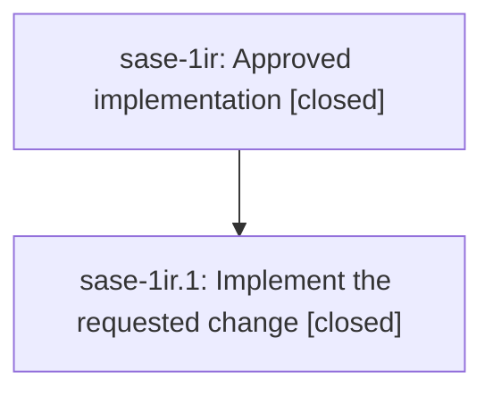

# Bead: sase-1ir — Approved implementation

[Bead Pages](../README.md) / sase-1ir

**Status:** ✓ closed · **Resolution:** done · **Type:** ▸ plan · **Tier:** epic
**Owner:** `bryanbugyi34@gmail.com` · **Created by:** `bryanbugyi34@gmail.com` · **Assignee:** `sase-1ir.land`
**Created:** 2026-10-09 05:21:57 EDT · **Closed:** 2026-10-09 05:45:03 EDT
**Plan:** [202610/epic.md](https://github.com/sase-org/sase--plans/blob/main/202610/epic.md)

## Description

Deliver the approved implementation in ordered phases

## Notes

[2026-10-09T09:45:03Z · sase-1ir.land] Verified the epic and its only descendant sase-1ir.1, including the complete child note log and approved plan:202610/epic.md. The approved document exactly matches VALID_EPIC_PLAN in tests/plan_validation_helpers.py: no concrete requested change, acceptance criteria, or DECISIONS exist. The linked archived prompt identifies sase-1ip.1--plan; this is a test fixture epic, closed as a verified no-op rather than claiming feature delivery. Confirmed the child note: primary tree has no epic edits and git log --all has no sase-1ir commits; ToolRun a4a38e74ca2193f30ec8ae0e93a679a8 ran just check at e2efd56242 and succeeded with exit 0, every gate green including scoped tests. Reviewed all three later master/base commits since creation: bd68ee4942 plugin previews, 10385fe3c3 bead-scale gate, and 563f046a85 autonomy contract suite, including actual source and diffs; none conflict with or require integration into this empty scope. The contract harness now stubs plan archive and epic-launch effects. No PROPOSED FOLLOW-UP entries exist on this epic or its child. Independently discovered historical fixture publication/launch was triaged with sase_new_task and recorded as a DISCOVERED ISSUE on the causally responsible active epic sase-1ip; no duplicate task created and no continuing current-tree leak claimed. sase bead epic-symbols sase-1ir reports no entries; linked plan validates and only phase is closed done. No force used. After close: run just symvision, mark the linked plan status done, and recheck parent link (currently none).

[2026-10-09T10:01:37Z · sase-1ir.land] CLOSEOUT COMPLETE: Post-close just symvision actually ran via ToolRun 3f45cf96e01c1e9b21ac37abca68028a and exited 1 solely for five unused public helpers introduced by later commit bd68ee4942 in plugins/declared_commands.py; there were no epic-symbol errors and sase bead epic-symbols sase-1ir again reports no entries. Triaged this separate finding with sase_new_task, retained evidence file:explicit:d37b84c1bf55599a39286990, and recorded it on the causally responsible active epic sase-1if (phase sase-1if.6), rather than creating a task or adding unrelated repairs to this fixture scope. The older unused-public task sase-1hp covers a different symbol set and was not corroborated. Historical fixture-launch evidence remains on active epic sase-1ip. plan:202610/epic.md now has status: done and passes sase plan validate with zero warnings. The primary repository is unchanged; the plans checkout has only the one status-field edit. Post-close audited parent-link read confirms no parent bead. No PROPOSED FOLLOW-UP entries were declined or left untriaged because this epic and its only child had none.

## Phases

| Bead | Title | Status | Size | Created | Agents | Commits |
|---|---|---|---|---|---:|---:|
| [sase-1ir.1](sase-1ir.1.md) | Implement the requested change | ✓ closed | small | 2026-10-09 | 1 | 0 |

## Lineage

## Agents

| Agent | Bead | Commits |
|---|---|---:|
| [bbugyi200.athena.sase-1ir.1](https://github.com/sase-org/sase--agents/blob/main/agents/bbugyi200.athena.sase-1ir.1/README.md) | [sase-1ir.1](sase-1ir.1.md) | 0 |
| [bbugyi200.athena.sase-1ir.land](https://github.com/sase-org/sase--agents/blob/main/agents/bbugyi200.athena.sase-1ir.land/README.md) | [sase-1ir](README.md) | 1 |

## Commits

| Repo | Commit | Subject | Bead | Committed |
|---|---|---|---|---|
| sase--plans | [`sase--plans@7fa232b`](https://github.com/sase-org/sase--plans/commit/7fa232bd2eaff10135c8d8985aa63ec05033e96d) | chore(sase-1ir): mark verified fixture epic plan done | [sase-1ir](README.md) | 2026-10-09 06:02:50 EDT |
