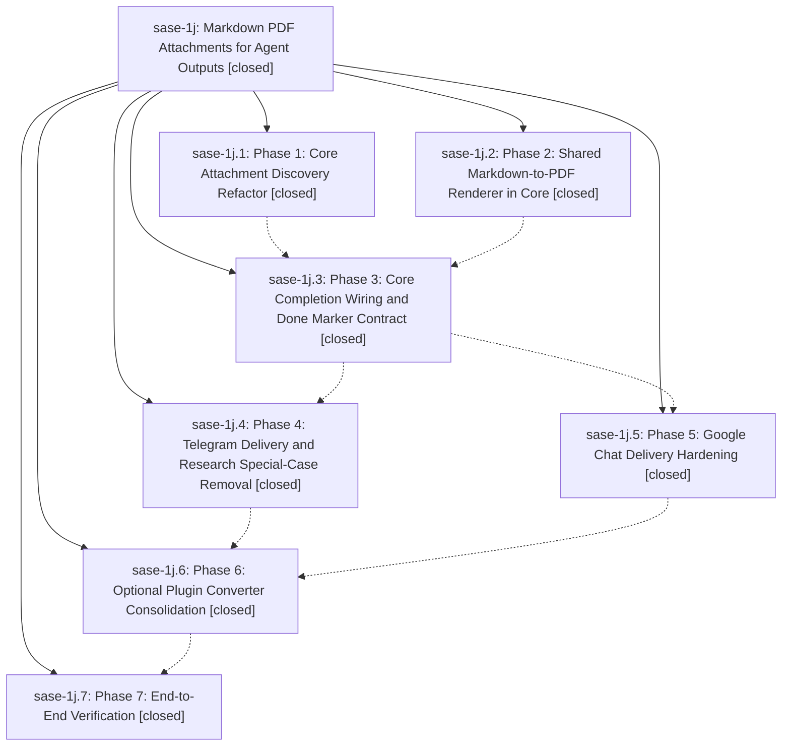

# Bead: sase-1j — Markdown PDF Attachments for Agent Outputs

[Bead Pages](../README.md) / sase-1j

**Status:** ✓ closed · **Resolution:** (unrecorded) · **Type:** plan · **Tier:** epic
**Owner:** `bryanbugyi34@gmail.com`
**Created:** 2026-04-30 08:24:17 UTC · **Closed:** 2026-04-30 09:19:08 UTC
**Plan:** [202604/markdown\_pdf\_attachments.md](https://github.com/sase-org/sase--plans/blob/main/202604/markdown_pdf_attachments.md)

## Phases

| Bead | Title | Status | Size | Agents | Commits |
|---|---|---|---|---:|---:|
| [sase-1j.1](sase-1j.1.md) | Phase 1: Core Attachment Discovery Refactor | ✓ closed | small | 0 | 1 |
| [sase-1j.2](sase-1j.2.md) | Phase 2: Shared Markdown-to-PDF Renderer in Core | ✓ closed | small | 0 | 1 |
| [sase-1j.3](sase-1j.3.md) | Phase 3: Core Completion Wiring and Done Marker Contract | ✓ closed | small | 0 | 1 |
| [sase-1j.4](sase-1j.4.md) | Phase 4: Telegram Delivery and Research Special-Case Removal | ✓ closed | small | 0 | 0 |
| [sase-1j.5](sase-1j.5.md) | Phase 5: Google Chat Delivery Hardening | ✓ closed | small | 0 | 0 |
| [sase-1j.6](sase-1j.6.md) | Phase 6: Optional Plugin Converter Consolidation | ✓ closed | small | 0 | 0 |
| [sase-1j.7](sase-1j.7.md) | Phase 7: End-to-End Verification | ✓ closed | small | 0 | 1 |

## Lineage

## Commits

| Commit | Subject | Bead | Committed (UTC) |
|---|---|---|---|
| [`84d0450`](https://github.com/sase-org/sase/commit/84d0450e0b7920e520230d6f72236a846cbea90b) | feat: add markdown attachment discovery (sase-1j.1) | [sase-1j.1](sase-1j.1.md) | 2026-04-30 08:33:27 |
| [`910bef3`](https://github.com/sase-org/sase/commit/910bef3a155025d65facdf65b210d5df44d2643b) | feat: add core Markdown PDF renderer (sase-1j.2) | [sase-1j.2](sase-1j.2.md) | 2026-04-30 08:36:06 |
| [`9bc300f`](https://github.com/sase-org/sase/commit/9bc300fa6939515c9da1ef89c136b69dd447bf86) | feat: generate markdown PDF completion attachments (sase-1j.3) | [sase-1j.3](sase-1j.3.md) | 2026-04-30 08:47:52 |
| [`37b7a2f`](https://github.com/sase-org/sase/commit/37b7a2f2b5cc92b6ffef2bce85c0ea39f08a2d99) | chore: verify markdown PDF completion attachments (sase-1j.7) | [sase-1j.7](sase-1j.7.md) | 2026-04-30 09:14:49 |
